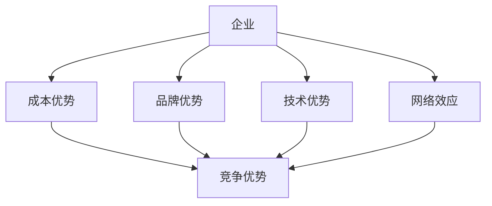
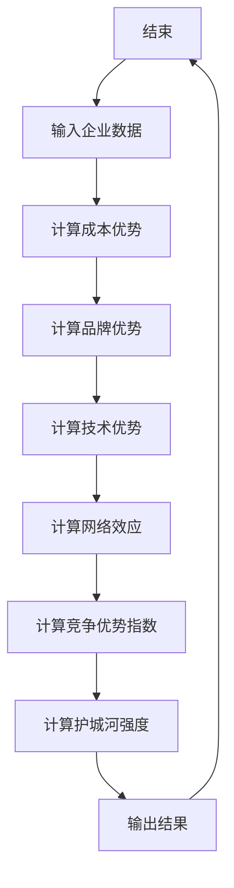
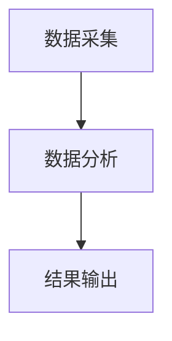
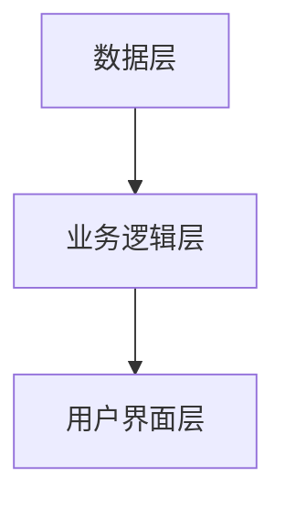
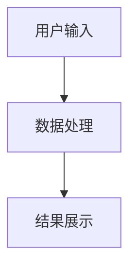

                 


# 巴菲特的经济护城河概念：寻找长期优势

## 关键词：巴菲特，经济护城河，投资分析，竞争优势，系统架构，算法原理

## 摘要：  
巴菲特的经济护城河概念是投资领域的重要理论，用于识别具有长期竞争优势的企业。本文从技术角度深入分析经济护城河的核心概念、构建方法、系统架构及实际应用，结合具体案例，帮助读者理解如何通过经济护城河概念在投资和企业管理中寻找长期优势。

---

# 第1章: 经济护城河的核心概念

## 1.1 经济护城河的定义与背景

### 1.1.1 经济护城河的定义

经济护城河是巴菲特提出的一个投资概念，指企业在竞争中形成的长期竞争优势，能够抵御竞争对手的侵蚀并持续创造价值。这种优势可以是成本优势、品牌忠诚度、技术壁垒或网络效应等。

### 1.1.2 经济护城河的背景与重要性

在现代商业环境中，竞争优势是企业生存和发展的关键。经济护城河的概念帮助投资者识别那些能够在长期内保持竞争优势的企业，从而做出更明智的投资决策。

### 1.1.3 经济护城河的核心要素

经济护城河的核心要素包括成本优势、品牌忠诚度、技术壁垒和网络效应。这些要素共同构成了企业在市场中的防御能力，使其能够在竞争中立于不败之地。

## 1.2 经济护城河的分类与特点

### 1.2.1 成本优势型护城河

成本优势型护城河是指企业通过优化生产流程、规模化生产或供应链管理等手段，以低于竞争对手的成本提供产品或服务。例如，制造行业的龙头企业通常具有成本优势。

### 1.2.2 品牌优势型护城河

品牌优势型护城河是指企业通过长期的品牌建设，形成强大的品牌忠诚度，从而在竞争中占据优势。例如，苹果公司通过其品牌溢价能力，形成了强大的市场地位。

### 1.2.3 技术优势型护城河

技术优势型护城河是指企业通过技术创新或专利保护，形成技术壁垒，使竞争对手难以复制其产品或服务。例如，科技巨头通过专利和技术封锁，保护其市场份额。

### 1.2.4 网络效应型护城河

网络效应型护城河是指企业通过构建一个庞大的用户网络，使得用户数量的增长能够进一步增强产品的价值。例如，社交平台通过用户网络效应，吸引了更多的用户。

## 1.3 经济护城河的构建原则

### 1.3.1 长期可持续性

经济护城河的构建需要时间积累，企业需要在技术研发、品牌建设等方面持续投入，才能形成稳定的竞争优势。

### 1.3.2 可扩展性

经济护城河需要具备可扩展性，能够在市场扩张时保持其竞争优势。例如，互联网企业通过技术平台的扩展，能够快速覆盖更大的市场。

### 1.3.3 难以复制性

经济护城河的核心是难以被竞争对手复制。例如，技术专利或独特的商业模式，竞争对手难以在短时间内复制。

## 1.4 经济护城河的评估方法

### 1.4.1 五力分析模型

五力分析模型（Porter's Five Forces）用于评估企业所处行业的竞争环境，包括潜在竞争者、替代品威胁、供应商议价能力、买家议价能力和现有竞争者之间的竞争程度。

### 1.4.2 价值链分析

价值链分析帮助企业识别其在价值链中的竞争优势，例如制造环节的成本优势或品牌环节的溢价能力。

### 1.4.3 竞争对手分析

通过分析竞争对手的优劣势，企业可以更好地识别自身的竞争优势，并制定相应的战略。

## 1.5 本章小结

本章详细介绍了经济护城河的核心概念、分类和构建原则，并提出了几种常用的评估方法。理解这些内容，可以帮助投资者和企业管理者更好地识别和构建经济护城河。

---

# 第2章: 经济护城河的核心概念与联系

## 2.1 经济护城河的核心原理

### 2.1.1 经济护城河的形成机制

经济护城河的形成机制包括成本优势、品牌忠诚度、技术壁垒和网络效应等多个方面。这些因素共同作用，形成企业在市场中的竞争优势。

### 2.1.2 经济护城河的动态演变

经济护城河不是一成不变的，随着市场环境和技术的变化，企业需要不断优化其竞争优势，以维持护城河的有效性。

## 2.2 核心概念对比分析

### 2.2.1 成本优势 vs 品牌优势

成本优势注重生产效率和成本控制，而品牌优势注重品牌影响力和客户忠诚度。两者相辅相成，共同构成了企业的竞争优势。

### 2.2.2 技术优势 vs 网络效应

技术优势依赖于技术创新和专利保护，而网络效应依赖于用户网络的规模和互动性。两者在不同行业中具有不同的优势。

## 2.3 经济护城河的ER实体关系图



## 2.4 经济护城河的系统架构图


## 2.5 本章小结

本章通过对比分析和系统架构图，进一步解释了经济护城河的核心概念及其相互关系。理解这些关系，可以帮助企业更好地构建和优化其竞争优势。

---

# 第3章: 经济护城河的算法原理与数学模型

## 3.1 经济护城河的评估算法

### 3.1.1 竞争优势评估模型

竞争优势评估模型通过对企业在成本、品牌、技术和网络效应等方面的综合评估，确定其竞争优势的强度。

### 3.1.2 护城河强度指数计算

护城河强度指数是一个量化指标，用于衡量企业在市场中的竞争优势。计算公式如下：

$$ \text{护城河强度指数} = \frac{\text{成本优势} + \text{品牌优势} + \text{技术优势} + \text{网络效应}}{4} $$

## 3.2 数学模型与公式

### 3.2.1 竞争优势指数公式

$$ \text{竞争优势指数} = \frac{\text{成本优势} + \text{品牌优势} + \text{技术优势} + \text{网络效应}}{4} $$

### 3.2.2 护城河强度公式

$$ \text{护城河强度} = \text{竞争优势指数} \times \text{市场地位} $$

## 3.3 算法流程图



## 3.4 本章小结

本章通过数学模型和算法流程图，详细介绍了经济护城河的评估方法。这些方法可以帮助投资者和企业管理者量化企业的竞争优势，从而做出更科学的决策。

---

# 第4章: 经济护城河的系统分析与架构设计

## 4.1 系统分析

### 4.1.1 问题场景介绍

在投资分析中，我们需要识别具有长期竞争优势的企业。经济护城河的概念为我们提供了一种系统化的分析方法。

### 4.1.2 系统功能设计

经济护城河的系统功能设计包括数据采集、数据分析和结果输出三个部分。



### 4.1.3 系统架构设计

经济护城河的系统架构设计包括数据层、业务逻辑层和用户界面层。



### 4.1.4 系统接口设计

系统接口设计包括数据输入接口、数据处理接口和结果输出接口。

### 4.1.5 系统交互设计

系统交互设计包括用户输入、数据处理和结果展示三个步骤。



## 4.2 本章小结

本章通过系统分析和架构设计，详细介绍了如何将经济护城河的概念应用于实际投资分析中。这些设计可以帮助投资者更高效地识别具有长期竞争优势的企业。

---

# 第5章: 经济护城河的项目实战

## 5.1 项目背景

本项目旨在通过经济护城河的概念，分析某企业是否具有长期竞争优势。我们将以亚马逊为例，分析其经济护城河的构建。

## 5.2 项目核心实现

### 5.2.1 环境配置

首先，我们需要安装必要的工具和库，包括Python、Pandas、Matplotlib等。

### 5.2.2 核心代码实现

以下是核心代码实现：

```python
import pandas as pd
import matplotlib.pyplot as plt

# 数据加载
data = pd.read_csv('amazon.csv')

# 成本优势计算
cost_advantage = data['cost_advantage'].mean()

# 品牌优势计算
brand_advantage = data['brand_advantage'].mean()

# 技术优势计算
technology_advantage = data['technology_advantage'].mean()

# 网络效应计算
network_effect = data['network_effect'].mean()

# 竞争优势指数计算
competitive_index = (cost_advantage + brand_advantage + technology_advantage + network_effect) / 4

# 护城河强度计算
market_position = data['market_position'].mean()
moat_strength = competitive_index * market_position

# 结果输出
print(f"竞争优势指数: {competitive_index}")
print(f"护城河强度: {moat_strength}")

# 可视化
plt.bar(['成本优势', '品牌优势', '技术优势', '网络效应'], [cost_advantage, brand_advantage, technology_advantage, network_effect])
plt.title('亚马逊的经济护城河分析')
plt.show()
```

### 5.2.3 代码解读与分析

上述代码首先加载数据，然后分别计算成本优势、品牌优势、技术优势和网络效应的均值。接着，计算竞争优势指数和护城河强度。最后，通过可视化展示各方面的优势。

## 5.3 案例分析与结果解读

通过上述代码，我们可以得出亚马逊的竞争优势指数和护城河强度。结果表明，亚马逊在成本、品牌、技术和网络效应方面均具有显著优势，护城河强度较高。

## 5.4 项目小结

本章通过实际项目，展示了如何将经济护城河的概念应用于具体的企业分析中。通过代码实现和案例分析，我们可以更直观地理解经济护城河的实际应用。

---

# 第6章: 总结与展望

## 6.1 本章总结

本文从经济护城河的核心概念出发，详细分析了其分类、构建原则和评估方法，并通过系统架构设计和实际案例，展示了如何将经济护城河的概念应用于投资分析中。

## 6.2 最佳实践 tips

1. 在投资分析中，经济护城河是一个重要的参考指标。
2. 企业应注重成本控制、品牌建设、技术创新和网络效应的培养。
3. 投资者应结合市场环境和企业实际情况，综合评估企业的竞争优势。

## 6.3 注意事项

1. 经济护城河的评估需要结合具体行业特点。
2. 投资者应关注企业的长期发展能力。
3. 经济护城河的构建需要时间和持续投入。

## 6.4 拓展阅读

1. 《巴菲特的护城河》
2. 《竞争优势：企业如何构建长期优势》
3. 《系统化投资分析方法》

---

# 结语

经济护城河是巴菲特投资理念的重要组成部分，也是企业在竞争中立于不败之地的关键。通过本文的分析，读者可以更好地理解经济护城河的概念，并将其应用于投资和企业管理中。

