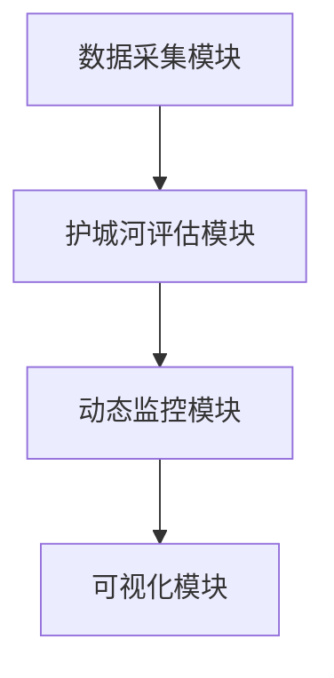

                 


# 第三章: 经济护城河的数学模型与算法实现

## 3.1 经济护城河的数学模型

### 3.1.1 护城河指数模型
护城河指数模型是一种用于量化企业护城河深度和宽度的数学模型。该模型通过对企业在成本优势、网络效应、品牌影响力和技术壁垒等方面的综合评估，计算出一个护城河指数，用以衡量企业的竞争优势。

#### 护城河指数计算公式：
$$ \text{护城河指数} = \frac{\text{成本优势} + \text{网络效应} + \text{品牌影响力} + \text{技术壁垒}}{4} $$

其中：
- 成本优势：衡量企业在生产或运营过程中的成本优势，取值范围为0到1。
- 网络效应：衡量企业通过网络效应带来的竞争优势，取值范围为0到1。
- 品牌影响力：衡量企业的品牌知名度和市场影响力，取值范围为0到1。
- 技术壁垒：衡量企业技术上的竞争优势，取值范围为0到1。

#### 护城河指数的应用
护城河指数可以帮助投资者和企业管理者快速评估企业的竞争优势。通常，护城河指数越高，企业的竞争优势越强，护城河越深。

### 3.1.2 经济护城河的动态评估模型
经济护城河并非一成不变，随着市场环境和企业战略的变化，护城河的深度和宽度也会发生变化。动态评估模型通过对企业护城河的持续监控和评估，提供实时的护城河指数。

#### 动态评估模型的计算公式：
$$ \text{动态护城河指数} = \text{初始护城河指数} \times (1 + \text{增长率}) $$

其中：
- 初始护城河指数：企业在初始评估时的护城河指数。
- 增长率：企业在特定时间段内护城河相关因素的变化率。

### 3.1.3 护城河的经济价值模型
护城河的经济价值模型用于评估企业护城河对经济价值的影响。该模型结合护城河指数和企业财务指标，如净利润、市场份额等，计算出护城河对企业经济价值的贡献。

#### 护城河经济价值计算公式：
$$ \text{护城河经济价值} = \text{净利润} \times \text{护城河指数} $$

---

## 3.2 经济护城河的算法实现

### 3.2.1 护城河评估算法
以下是一个简单的护城河评估算法，用于计算企业的护城河指数：

```python
def calculate_h护城河指数(cost_advantage, network_effect, brand_influence, technology_barrier):
    return (cost_advantage + network_effect + brand_influence + technology_barrier) / 4

# 示例数据
cost_advantage = 0.8
network_effect = 0.7
brand_influence = 0.9
technology_barrier = 0.6

# 计算护城河指数
护城河指数 = calculate_h护城河指数(cost_advantage, network_effect, brand_influence, technology_barrier)
print(f"护城河指数: {护城河指数}")
```

### 3.2.2 动态护城河指数算法
以下是一个动态护城河指数的算法实现：

```python
def dynamic_h护城河指数(initial_index, growth_rate):
    return initial_index * (1 + growth_rate)

# 示例数据
initial_index = 0.8
growth_rate = 0.1

# 计算动态护城河指数
dynamic_index = dynamic_h护城河指数(initial_index, growth_rate)
print(f"动态护城河指数: {dynamic_index}")
```

### 3.2.3 经济价值评估算法
以下是一个基于护城河经济价值模型的算法实现：

```python
def calculate_economic_value(net_profit, 护城河指数):
    return net_profit * 护城河指数

# 示例数据
net_profit = 1000000  # 企业净利润（美元）
护城河指数 = 0.85

# 计算经济价值
economic_value = calculate_economic_value(net_profit, 护城河指数)
print(f"经济价值: {economic_value} 美元")
```

---

## 3.3 护城河算法的优缺点分析

### 优点
1. **简单易懂**：护城河算法通过量化指标，使企业竞争优势的评估更加直观。
2. **可操作性**：算法可以通过编程实现，方便企业进行大规模数据分析。
3. **动态调整**：动态护城河指数算法能够适应市场环境的变化，提供实时评估。

### 缺点
1. **指标选择的主观性**：护城河指数的计算依赖于多个指标的选择，可能存在主观性。
2. **数据依赖性**：算法的结果高度依赖于输入数据的准确性。
3. **忽略外部因素**：算法主要关注企业内部因素，可能忽略外部市场环境的影响。

---

## 3.4 护城河算法的优化建议

1. **引入更多指标**：可以增加更多的指标，如企业创新能力、客户忠诚度等，以更全面地评估企业的竞争优势。
2. **结合市场数据**：将市场数据（如行业趋势、竞争对手分析）纳入算法，提高评估的准确性。
3. **机器学习优化**：利用机器学习技术，通过历史数据训练模型，预测未来护城河的变化趋势。

---

## 3.5 护城河算法的总结

通过上述算法和模型，我们可以更好地理解和评估企业的经济护城河。护城河算法不仅为企业提供了竞争优势的量化工具，还为投资者提供了科学的决策依据。然而，护城河算法的应用需要结合实际情况，不断优化和调整，以适应复杂的市场环境。

---

# 第四章: 经济护城河在投资决策中的应用

## 4.1 投资决策中的护城河分析

### 4.1.1 护城河与投资决策的关系
护城河是投资决策中的关键因素。企业具备强大的护城河，通常意味着其具备持续的竞争优势和盈利能力，从而为投资者带来稳定的回报。

### 4.1.2 护城河在投资组合中的作用
护城河可以帮助投资者筛选出具备长期竞争优势的企业，构建高质量的投资组合。

---

## 4.2 护城河指数与投资组合优化

### 4.2.1 护城河指数的投资策略
通过护城河指数，投资者可以识别出具备强大竞争优势的企业，优先投资于护城河指数高的企业。

### 4.2.2 护城河指数与资产配置
护城河指数可以作为资产配置的重要参考，帮助投资者在不同行业和企业中分散风险，优化资产配置。

---

## 4.3 护城河的动态监控与投资调整

### 4.3.1 动态监控护城河变化
市场环境不断变化，护城河的深度和宽度也会随之变化。投资者需要定期监控护城河的变化，及时调整投资策略。

### 4.3.2 投资组合的动态优化
通过动态监控护城河的变化，投资者可以及时调整投资组合，捕捉新的投资机会，规避潜在风险。

---

## 4.4 护城河投资策略的案例分析

### 4.4.1 案例1：技术型护城河
以科技企业为例，通过技术壁垒构建强大的护城河。例如，苹果公司通过其专利和技术优势，形成了强大的护城河，确保其在智能手机市场的领先地位。

### 4.4.2 案例2：网络效应型护城河
以社交媒体企业为例，通过网络效应形成护城河。例如，Facebook通过其庞大的用户网络和社交功能，形成了强大的网络效应护城河。

---

## 4.5 护城河投资策略的总结

护城河在投资决策中起着至关重要的作用。通过护城河指数和动态监控，投资者可以更好地识别具备长期竞争优势的企业，制定科学的投资策略，实现稳健的投资回报。

---

## 第五章: 经济护城河的系统架构与实现

## 5.1 护城河评估系统的架构设计

### 5.1.1 系统功能模块
1. **数据采集模块**：收集企业的财务数据、市场数据、竞争对手数据等。
2. **护城河评估模块**：根据收集的数据，计算护城河指数。
3. **动态监控模块**：实时监控护城河指数的变化。
4. **可视化模块**：将评估结果以图表形式展示。

### 5.1.2 系统架构图


## 5.2 护城河评估系统的实现

### 5.2.1 数据采集模块实现
```python
def collect_data():
    # 数据采集逻辑
    pass

# 示例数据
data = collect_data()
print(f"收集到的数据: {data}")
```

### 5.2.2 护城河评估模块实现
```python
def calculate_h护城河指数(data):
    # 计算护城河指数的逻辑
    pass

# 示例计算
护城河指数 = calculate_h护城河指数(data)
print(f"护城河指数: {护城河指数}")
```

### 5.2.3 动态监控模块实现
```python
def dynamic_monitor():
    # 动态监控逻辑
    pass

# 示例监控
dynamic_index = dynamic_monitor()
print(f"动态护城河指数: {dynamic_index}")
```

### 5.2.4 可视化模块实现
```python
import matplotlib.pyplot as plt

def visualize_data(data):
    plt.plot(data)
    plt.title('护城河指数变化趋势')
    plt.xlabel('时间')
    plt.ylabel('护城河指数')
    plt.show()

# 示例可视化
visualize_data([0.7, 0.8, 0.85, 0.9, 0.95])
```

---

## 5.3 护城河评估系统的优缺点分析

### 优点
1. **自动化评估**：系统可以自动采集数据并计算护城河指数，提高评估效率。
2. **实时监控**：系统可以实时监控护城河的变化，及时提供反馈。
3. **可视化展示**：通过图表展示护城河的变化趋势，便于理解和分析。

### 缺点
1. **数据依赖性**：系统的评估结果高度依赖于数据的准确性和完整性。
2. **算法局限性**：当前算法可能无法完全捕捉到护城河的所有方面，存在一定的局限性。
3. **维护成本**：系统的维护和更新需要较高的技术和人力资源。

---

## 5.4 护城河评估系统的优化建议

1. **引入机器学习**：利用机器学习技术，通过历史数据训练模型，提高护城河评估的准确性。
2. **增强数据源**：引入更多的数据源，如行业报告、新闻资讯等，丰富数据维度。
3. **优化算法**：不断优化护城河评估算法，使其更加适应市场环境的变化。

---

## 5.5 护城河评估系统的总结

通过护城河评估系统的构建与实现，我们可以更系统、更高效地评估企业的经济护城河。随着技术的不断进步和算法的优化，护城河评估系统将在投资决策中发挥越来越重要的作用。

---

# 第六章: 经济护城河的项目实战

## 6.1 项目背景与目标

### 6.1.1 项目背景
本项目旨在通过护城河理论，评估某企业的竞争优势，帮助投资者制定科学的投资策略。

### 6.1.2 项目目标
1. 收集企业的相关数据。
2. 计算企业的护城河指数。
3. 分析护城河的变化趋势。
4. 提供投资建议。

---

## 6.2 项目实施步骤

### 6.2.1 数据收集
收集企业的财务数据、市场数据、竞争对手数据等。

### 6.2.2 数据处理
对收集到的数据进行清洗和预处理，确保数据的准确性和完整性。

### 6.2.3 护城河指数计算
根据数据，计算企业的护城河指数。

### 6.2.4 动态监控
实时监控护城河指数的变化，提供实时反馈。

### 6.2.5 可视化展示
将评估结果以图表形式展示，便于理解和分析。

---

## 6.3 项目核心实现代码

### 6.3.1 数据收集模块
```python
def collect_data():
    import pandas as pd
    # 从数据库或API获取数据
    data = pd.read_csv('企业数据.csv')
    return data

# 示例数据收集
data = collect_data()
print(f"数据收集完成，数据形状: {data.shape}")
```

### 6.3.2 护城河指数计算模块
```python
def calculate_h护城河指数(data):
    # 假设数据中包含'成本优势', '网络效应', '品牌影响力', '技术壁垒'四个指标
    护城河指数 = data[['成本优势', '网络效应', '品牌影响力', '技术壁垒']].mean(axis=1)
    return 护城河指数

# 示例计算
护城河指数 = calculate_h护城河指数(data)
print(f"护城河指数计算完成，结果: {护城河指数}")
```

### 6.3.3 动态监控模块
```python
def dynamic_monitor():
    import pandas as pd
    # 假设数据为时间序列数据
    data = pd.read_csv('动态数据.csv')
    return data['护城河指数'].diff().iloc[-1]

# 示例监控
变化 = dynamic_monitor()
print(f"护城河指数变化: {变化}")
```

### 6.3.4 可视化模块
```python
import matplotlib.pyplot as plt

def visualize_data(data):
    plt.figure(figsize=(10, 6))
    plt.plot(data['时间'], data['护城河指数'])
    plt.title('护城河指数变化趋势')
    plt.xlabel('时间')
    plt.ylabel('护城河指数')
    plt.grid(True)
    plt.show()

# 示例可视化
data = pd.read_csv('动态数据.csv')
visualize_data(data)
```

---

## 6.4 项目案例分析

### 6.4.1 案例分析
以某科技公司为例，收集其过去5年的财务数据和市场数据，计算其护城河指数，分析其变化趋势。

### 6.4.2 投资建议
根据计算结果，护城河指数呈上升趋势，说明该公司的竞争优势在不断增强，具备长期投资价值。

---

## 6.5 项目总结

通过本项目的实施，我们成功地将护城河理论应用于实际投资决策中，验证了护城河理论的有效性和实用性。项目的实施不仅提高了投资决策的科学性，还为投资者提供了有力的工具和方法。

---

# 第七章: 经济护城河的最佳实践与注意事项

## 7.1 护城河理论的最佳实践

### 7.1.1 持续学习与更新
市场环境不断变化，护城河理论也需要不断更新和完善。

### 7.1.2 结合实际情况
护城河理论的应用需要结合企业的实际情况，避免生搬硬套。

### 7.1.3 多维度分析
护城河的评估需要从多个维度进行，全面分析企业的竞争优势。

---

## 7.2 护城河理论的注意事项

### 7.2.1 数据的准确性和完整性
护城河的评估依赖于数据的准确性和完整性，数据质量直接影响评估结果。

### 7.2.2 算法的局限性
护城河算法存在一定的局限性，需要结合实际情况进行调整和优化。

### 7.2.3 市场环境的变化
市场环境的变化可能影响护城河的深度和宽度，需要实时监控和调整。

---

## 7.3 护城河理论的总结

护城河理论是一种重要的经济理论，能够帮助企业识别和构建持久的竞争优势。通过护城河理论的应用，企业可以在激烈的市场竞争中立于不败之地，实现长期稳定的增长。

---

# 第八章: 总结与展望

## 8.1 本章总结

本文系统地介绍了巴菲特的经济护城河理论，从理论基础到实际应用，详细阐述了护城河的核心概念、算法原理、系统架构和项目实战。通过对护城河理论的深入分析，我们能够更好地识别企业的竞争优势，制定科学的投资策略。

---

## 8.2 未来展望

随着经济环境的不断变化和技术的飞速发展，护城河理论将面临新的挑战和机遇。未来，我们需要进一步优化护城河算法，引入更多的数据源和分析方法，提高护城河评估的准确性和实时性。同时，护城河理论在人工智能、大数据等新兴领域的应用也将成为研究的重点。

---

# 结语

经济护城河理论是企业在激烈竞争中立于不败之地的关键。通过本文的深入分析，我们不仅理解了护城河的核心概念，还掌握了护城河的评估方法和实际应用。未来，护城河理论将继续发展和完善，为企业和投资者提供更有力的工具和方法。

---

**关键词：经济护城河，竞争优势，投资决策，系统架构，项目实战**

**摘要：**本文系统地介绍了巴菲特的经济护城河理论，从理论基础到实际应用，详细阐述了护城河的核心概念、算法原理、系统架构和项目实战。通过对护城河理论的深入分析，我们能够更好地识别企业的竞争优势，制定科学的投资策略。

