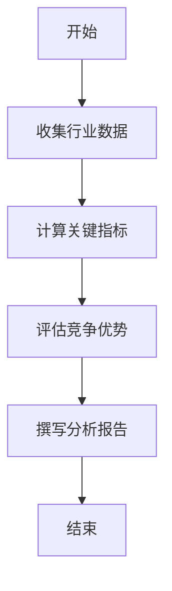

                 


# 巴菲特的行业分析方法：了解商业模式

## 关键词：巴菲特，行业分析，商业模式，投资决策，企业分析，安全边际

## 摘要：  
本文深入探讨了巴菲特的行业分析方法及其在商业模式理解中的应用。通过结合技术分析和投资策略，文章详细介绍了如何从行业分析中识别潜在投资机会，并通过实际案例分析展示了这些方法在现实中的应用。文章还探讨了数学模型和系统架构在行业分析中的作用，为读者提供了从理论到实践的全面指导。

---

# 第一部分：背景介绍

## 第1章：巴菲特投资理念概述

### 1.1 巴菲特投资理念的形成与发展

#### 1.1.1 巴菲特的投资哲学
巴菲特的投资哲学建立在价值投资的基础上，强调长期持有优质资产。他主张寻找具有持续竞争优势的企业，这些企业能够为股东创造长期价值。他的投资理念不仅仅是买股票，而是买入优秀的公司，关注企业的内在价值。

#### 1.1.2 巴菲特的投资策略
- **价值投资**：寻找市场低估的股票，长期持有。
- **安全边际**：买入价格远低于内在价值的股票，以降低风险。
- **集中投资**：将资金集中在少数具有竞争优势的公司上。

#### 1.1.3 巴菲特投资理念的演变与影响
巴菲特的投资理念从早期的烟堆理论到后来的护城河理论，不断发展和完善。他的理念影响了全球无数投资者，并成为价值投资的典范。

### 1.2 巴菲特的“企业分析”方法

#### 1.2.1 企业分析的基本概念
企业分析是通过研究企业的财务状况、行业地位、竞争优势等方面，评估企业的投资价值。巴菲特特别关注企业的盈利能力、财务健康状况和管理团队。

#### 1.2.2 巴菲特的企业分析框架
- **护城河分析**：评估企业是否具有竞争优势，能够长期保持高利润率。
- **管理层分析**：考察管理层的诚信、能力和决策能力。
- **财务状况分析**：评估企业的财务健康状况，包括盈利能力、资产负债情况等。

#### 1.2.3 企业分析与投资决策的关系
企业分析是投资决策的核心，通过对企业的深入了解，投资者可以识别出具有长期增长潜力的优秀企业。

### 1.3 安全边际的概念

#### 1.3.1 安全边际的定义
安全边际是指股票的市场价格低于其内在价值的部分。通过购买价格低于内在价值的股票，投资者可以降低投资风险。

#### 1.3.2 安全边际在企业分析中的应用
安全边际要求投资者在购买股票时，留有一定的安全空间，以应对市场波动和企业经营中的不确定性。

#### 1.3.3 安全边际与投资风险控制
通过建立安全边际，投资者可以有效控制风险，避免因市场波动导致的本金损失。

---

## 第2章：行业分析的基本原理

### 2.1 行业分析的核心概念

#### 2.1.1 行业的定义与分类
行业是从事相同性质经营活动的企业的集合，根据产品或服务的性质进行分类。

#### 2.1.2 行业分析的目的与意义
行业分析的目的是为了了解行业的整体情况，识别行业中的优势企业，评估行业的增长潜力和风险因素。

#### 2.1.3 行业分析的基本步骤
- **确定分析目标**：明确分析的目的和范围。
- **收集行业数据**：包括市场规模、增长趋势、竞争结构等。
- **分析行业关键指标**：如市场规模、利润率、竞争强度等。
- **评估行业风险**：包括行业周期性、政策风险等。

### 2.2 行业分析的关键指标

#### 2.2.1 行业规模与增长潜力
行业规模反映了市场的容量，增长潜力则决定了行业的未来发展趋势。

#### 2.2.2 行业竞争结构分析
使用波特的五力模型分析行业的竞争结构，包括新进入者的威胁、替代品的威胁、供应商的议价能力、买家的议价能力和现有企业的竞争程度。

#### 2.2.3 行业周期性与风险因素
行业周期性分析帮助企业了解行业的波动性，风险因素分析则帮助投资者识别可能的负面事件。

### 2.3 巴菲特视角下的行业分析

#### 2.3.1 巴菲特对行业的长期视角
巴菲特关注行业的长期发展趋势，寻找那些具有稳定增长潜力的行业。

#### 2.3.2 巴菲特对行业龙头企业的关注
他倾向于投资行业龙头，这些企业通常具有强大的竞争优势和市场地位。

#### 2.3.3 巴菲特对行业政策环境的考量
政策环境对行业的发展有着重要影响，巴菲特会关注相关政策的变化，评估其对行业和企业的影响。

---

## 第3章：巴菲特行业分析的核心框架

### 3.1 企业竞争优势分析

#### 3.1.1 企业竞争优势的定义
竞争优势是指企业在市场上相对于竞争对手的独特优势，能够使其在竞争中占据优势地位。

#### 3.1.2 巴菲特的“护城河”概念
护城河是指企业能够长期保持竞争优势的障碍，包括成本优势、品牌优势、技术优势等。

#### 3.1.3 企业竞争优势的评估方法
- **成本优势**：评估企业的生产成本是否低于竞争对手。
- **品牌优势**：评估品牌在市场上的影响力和客户忠诚度。
- **技术优势**：评估企业是否拥有独特的技术或专利。

### 3.2 企业财务状况分析

#### 3.2.1 财务报表分析的基本方法
分析企业的财务报表，包括资产负债表、利润表和现金流量表，评估企业的财务健康状况。

#### 3.2.2 巴菲特的财务指标筛选标准
- **ROE（净资产收益率）**：衡量企业盈利能力的重要指标。
- **ROA（资产净利率）**：衡量资产使用效率的指标。
- **债务比率**：评估企业的负债情况，判断财务风险。

#### 3.2.3 企业财务健康度的综合评估
综合考虑企业的盈利能力、财务杠杆和现金流情况，评估企业的财务健康状况。

### 3.3 企业治理结构分析

#### 3.3.1 企业治理的基本概念
企业治理是指企业内部如何管理和控制资源，确保企业目标的实现。

#### 3.3.2 巴菲特对企业治理的要求
巴菲特重视企业管理层的诚信和能力，认为良好的治理结构是企业长期成功的关键。

#### 3.3.3 企业治理结构对投资决策的影响
良好的治理结构能够提升企业的透明度和管理效率，降低投资风险。

---

## 第4章：巴菲特行业分析的实践步骤

### 4.1 确定行业分析的目标

#### 4.1.1 明确分析的目的
确定分析的目标，例如评估行业的增长潜力或识别行业中的优势企业。

#### 4.1.2 确定分析的范围
明确分析的行业范围，选择具有代表性的企业进行深入分析。

#### 4.1.3 设定分析的时间框架
确定分析的时间范围，例如分析过去五年的行业趋势。

### 4.2 数据收集与整理

#### 4.2.1 数据来源的选择
选择可靠的行业报告、财务报表和市场数据作为分析的基础。

#### 4.2.2 数据的收集方法
通过行业报告、公司财报、新闻报道等多种渠道收集数据。

#### 4.2.3 数据的整理与清洗
对收集到的数据进行清洗，去除无效数据，确保数据的准确性和完整性。

### 4.3 行业分析报告的撰写

#### 4.3.1 报告的结构与内容
报告应包括行业概述、竞争分析、财务分析、风险评估和投资建议等内容。

#### 4.3.2 数据的可视化与图表制作
使用图表和图形展示行业数据，帮助读者更好地理解和分析。

#### 4.3.3 分析结果的验证与调整
对分析结果进行验证，确保数据的准确性和逻辑的合理性。

---

## 第5章：商业模式的定义与分类

### 5.1 商业模式的基本概念

#### 5.1.1 商业模式的定义
商业模式是企业如何创造价值、传递价值和获取价值的系统描述。

#### 5.1.2 商业模式的核心要素
- **价值主张**：企业为客户提供的价值。
- **客户关系**：企业与客户之间的互动方式。
- **资源与能力**：企业实现商业模式所需的关键资源和能力。
- **盈利模式**：企业通过何种方式获取收入和利润。

### 5.2 巴菲特视角下的商业模式分析

#### 5.2.1 价值主张
巴菲特关注企业是否能够持续为股东创造价值，包括盈利能力、成长潜力和分红能力。

#### 5.2.2 客户关系
他认为良好的客户关系有助于企业长期稳定发展，例如客户忠诚度和品牌影响力。

#### 5.2.3 资源与能力
巴菲特注重企业的资源和能力，例如品牌优势、成本优势和技术优势。

#### 5.2.4 盈利模式
他关注企业的盈利模式，确保企业能够持续获得利润。

---

## 第6章：行业分析的数学模型与算法

### 6.1 行业分析的关键指标

#### 6.1.1 市场规模与增长率
市场规模反映了行业的容量，增长率则表明行业的增长潜力。

#### 6.1.2 利润率分析
利润率包括净利率、毛利率等，反映了企业的盈利能力。

#### 6.1.3 竞争强度
通过市场份额集中度和新进入者的威胁等指标，评估行业的竞争强度。

### 6.2 行业分析的数学模型

#### 6.2.1 ROE（净资产收益率）计算
$$ROE = \frac{\text{净利润}}{\text{股东权益}}$$

#### 6.2.2 ROA（资产净利率）计算
$$ROA = \frac{\text{净利润}}{\text{总资产}}$$

#### 6.2.3 市盈率（P/E）计算
$$P/E = \frac{\text{股价}}{\text{每股收益}}$$

### 6.3 算法流程图



---

## 第7章：系统架构与项目实战

### 7.1 系统架构设计

#### 7.1.1 数据收集模块
负责收集行业数据，包括市场规模、企业财务数据等。

#### 7.1.2 数据分析模块
对收集到的数据进行处理和分析，生成行业分析报告。

#### 7.1.3 决策支持模块
基于分析结果，提供投资建议和决策支持。

### 7.2 项目实战

#### 7.2.1 案例分析：零售行业
分析零售行业的市场规模、竞争结构和企业财务状况。

#### 7.2.2 数据分析代码
```python
import pandas as pd

# 假设df是行业数据
def calculate_roe(df):
    df['ROE'] = df['净利润'] / df['股东权益']
    return df

def calculate_growth_rate(df):
    df['增长率'] = df['收入'].pct_change()
    return df

# 示例数据
data = {'收入': [100, 120, 130], '净利润': [10, 12, 15], '股东权益': [50, 60, 70]}
df = pd.DataFrame(data)

df = calculate_roe(df)
df = calculate_growth_rate(df)
print(df)
```

#### 7.2.3 分析结果与投资建议
基于分析结果，提出投资建议，例如投资具有高ROE和稳定增长的行业龙头股。

---

## 第8章：最佳实践与小结

### 8.1 关键点总结
- 了解巴菲特的行业分析方法，包括企业竞争优势、财务状况和治理结构。
- 掌握行业分析的关键指标和数学模型。

### 8.2 投资决策中的注意事项
- 考虑市场波动和政策风险，保持投资的分散性。
- 定期评估投资组合，及时调整投资策略。

### 8.3 拓展阅读
推荐阅读巴菲特的著作和相关投资书籍，深入理解价值投资的理念和方法。

---

# 结语

通过本文的探讨，读者可以深入了解巴菲特的行业分析方法，并将其应用于商业模式的理解和投资决策中。结合技术分析和投资策略，投资者能够更好地识别优质企业，实现长期稳定的收益。

