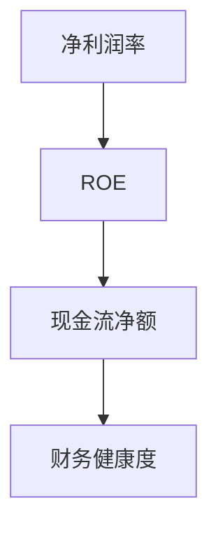
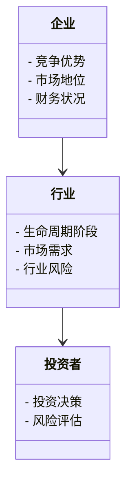
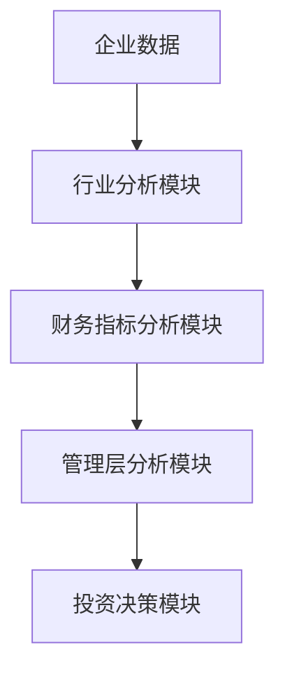
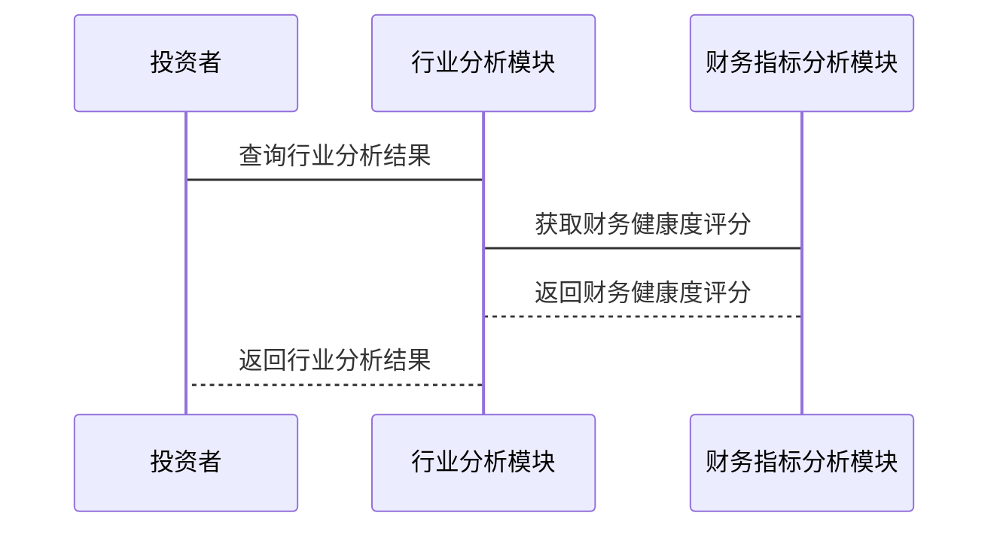

                 


---

# 巴菲特的行业分析方法：应对产业边界模糊化的挑战

---

## 关键词：
- 巴菲特
- 行业分析
- 投资策略
- 产业边界
- 护城河

---

## 摘要：
本文深入探讨了巴菲特的行业分析方法，重点分析了在当前产业边界模糊化背景下，如何利用巴菲特的核心投资理念进行有效的行业评估和投资决策。通过护城河分析、行业生命周期预测、财务指标评估等方法，结合数学模型和系统架构设计，为读者提供了一套完整的行业分析框架。同时，本文还通过实际案例分析和项目实战，帮助读者掌握巴菲特分析方法的实践应用。

---

# 第一部分: 巴菲特的行业分析方法

---

# 第1章: 行业分析的背景与挑战

## 1.1 产业边界模糊化的现状

### 1.1.1 传统行业分类的局限性
传统的行业分类方法基于企业的产品、服务或业务模式，但在数字化和跨界融合的今天，这种分类方式已经难以准确反映企业的实际经营状况。例如，科技公司通过数据和算法跨界进入金融领域，传统制造业通过智能化转型进入科技领域。

### 1.1.2 数字化与跨界融合的挑战
数字化技术的广泛应用，使得企业之间的界限变得模糊。例如，互联网公司通过收购传统零售企业，将线上与线下业务深度融合，形成新的商业模式。这种跨界融合对行业分析提出了更高的要求。

### 1.1.3 产业边界模糊对投资的影响
产业边界模糊化使得投资者难以准确判断企业的核心竞争力和未来增长潜力。投资者需要一种更加灵活和动态的行业分析方法，以应对这种不确定性。

---

## 1.2 巴菲特投资理念的核心思想

### 1.2.1 巴菲特的价值投资哲学
巴菲特的价值投资理念强调长期持有优质资产，注重企业的内在价值。他认为，投资的本质是购买企业的一部分，而不是仅仅关注市场的短期波动。

### 1.2.2 巴菲特对行业分析的重视
巴菲特认为，行业分析是投资决策中的关键环节。他通过分析行业的竞争结构、市场地位和增长潜力，来评估企业的长期价值。

### 1.2.3 巴菲特分析方法的适用性
尽管巴菲特的投资方法最初针对的是传统行业，但在数字化和跨界融合的背景下，他的方法仍然具有重要的参考价值。通过调整和优化，巴菲特的分析框架可以适应新的产业环境。

---

## 1.3 本书的核心目标与框架

### 1.3.1 本书的研究目标
本书旨在探讨如何将巴菲特的行业分析方法应用于当前产业边界模糊化的背景下，为企业和投资者提供一套实用的行业分析框架。

### 1.3.2 本书的分析框架
本书将从护城河分析、行业生命周期预测、财务指标评估等多个维度展开，结合数学模型和系统架构设计，提供一套完整的行业分析方法。

### 1.3.3 本书的结构安排
本书分为四大部分：行业分析的背景与挑战、巴菲特行业分析的核心框架、行业分析的数学模型与算法，以及行业分析的系统架构设计。每一部分都将详细展开，确保读者能够全面理解和掌握相关知识。

---

# 第2章: 巴菲特行业分析的核心框架

## 2.1 护城河分析

### 2.1.1 护城河的定义与分类
护城河是指企业在行业中形成的独特竞争优势，能够防止竞争对手的侵蚀。护城河可以分为经济护城河、品牌护城河和规模经济护城河三种类型。

### 2.1.2 不同类型护城河的优劣势对比

| 护城河类型 | 优势 | 劣势 |
|------------|-------|-------|
| 经济护城河 | 高门槛，难以被复制 | 易受政策和市场需求变化影响 |
| 品牌护城河 | 强大的品牌影响力 | 建立成本高，周期长 |
| 规模经济护城河 | 成本优势显著 | 易受行业竞争和价格战影响 |

### 2.1.3 护城河在行业分析中的应用
通过护城河分析，投资者可以评估企业在行业中的竞争优势，判断其是否具备长期盈利能力。

---

## 2.2 行业生命周期分析

### 2.2.1 行业生命周期的四个阶段
行业生命周期通常分为导入期、成长期、成熟期和衰退期。

### 2.2.2 不同阶段的行业特征
- **导入期**：市场需求低，企业数量少，竞争激烈。
- **成长期**：市场需求快速增长，企业数量增加，行业集中度提高。
- **成熟期**：市场需求稳定，行业集中度高，竞争格局稳定。
- **衰退期**：市场需求下降，企业数量减少，行业集中度降低。

### 2.2.3 生命周期分析对投资决策的影响
通过分析行业的生命周期阶段，投资者可以判断行业的增长潜力和风险，从而做出更明智的投资决策。

---

## 2.3 财务指标分析

### 2.3.1 核心财务指标的定义
- 净利润率：衡量企业的盈利能力。
- 资产负债率：衡量企业的财务健康状况。
- 现金流：衡量企业的运营能力和抗风险能力。

### 2.3.2 财务指标在行业分析中的应用
通过分析企业的财务指标，投资者可以评估企业的财务健康状况，判断其是否具备长期投资价值。

### 2.3.3 财务健康度的综合评估
综合评估企业的财务健康度，需要结合多个财务指标，进行加权计算。

---

## 2.4 管理层分析

### 2.4.1 管理层能力的评估标准
- 管理层的经验和能力。
- 管理层的诚信和稳定性。
- 管理层的战略规划能力。

### 2.4.2 管理层决策对行业的影响
优秀的管理层能够带领企业应对行业挑战，抓住市场机遇，从而推动企业持续增长。

### 2.4.3 管理层诚信与稳定性的重要性
管理层的诚信和稳定性是企业长期发展的关键因素，也是投资者评估企业的重要依据。

---

# 第3章: 行业分析的数学模型与算法

## 3.1 护城河评估模型

### 3.1.1 护城河强度评分公式
$$ \text{护城河强度} = \frac{\text{竞争优势得分} \times \text{市场地位得分}}{\text{行业风险得分}} $$

### 3.1.2 护城河类型对比表格
| 护城河类型 | 竞争优势 | 市场地位 | 行业风险 |
|------------|----------|----------|----------|
| 经济护城河 | 高       | 高       | 低       |
| 品牌护城河 | 中       | 高       | 中       |
| 规模经济护城河 | 中 | 中 | 高 |

---

## 3.2 行业生命周期预测模型

### 3.2.1 生命周期阶段划分
- 导入期：市场需求低，企业数量少。
- 成长期：市场需求快速增长，企业数量增加。
- 成熟期：市场需求稳定，行业集中度高。
- 衰退期：市场需求下降，企业数量减少。

### 3.2.2 生命周期预测的数学模型
$$ \text{生命周期阶段} = f(\text{增长率}, \text{利润率}, \text{市场份额}) $$

---

## 3.3 财务指标分析算法

### 3.3.1 财务健康度评分公式
$$ \text{财务健康度} = \frac{\text{净利润率} + \text{ROE} + \text{现金流净额}}{3} $$

### 3.3.2 财务指标对比流程图


---

# 第4章: 行业分析的系统架构设计

## 4.1 系统功能设计

### 4.1.1 领域模型设计


### 4.1.2 系统架构设计


---

## 4.2 系统接口设计

### 4.2.1 行业分析模块接口
- 输入：行业数据、企业数据
- 输出：行业生命周期阶段、护城河强度

### 4.2.2 财务指标分析模块接口
- 输入：财务数据
- 输出：财务健康度评分

---

## 4.3 系统交互设计

### 4.3.1 投资者查询行业分析结果


---

# 第5章: 项目实战

## 5.1 环境安装

### 5.1.1 安装Python
```bash
# 安装Python
# 代码省略
```

### 5.1.2 安装数据分析库
```bash
pip install pandas numpy matplotlib
```

---

## 5.2 系统核心实现源代码

### 5.2.1 护城河强度计算
```python
import pandas as pd

def calculate_h Competitive Advantage Score(enterprise_data):
    return enterprise_data['竞争优势'].mean()

def calculate_market_position_score(enterprise_data):
    return enterprise_data['市场地位'].mean()

def calculate_industry_risk_score(industry_data):
    return industry_data['行业风险'].mean()

def calculate_heritage_water(enterprise_data, industry_data):
    her Competitive Advantage Score = calculate_h Competitive Advantage Score(enterprise_data)
    market_position_score = calculate_market_position_score(enterprise_data)
    industry_risk_score = calculate_industry_risk_score(industry_data)
    return (her Competitive Advantage Score * market_position_score) / industry_risk_score
```

---

## 5.3 代码应用解读与分析

### 5.3.1 护城河强度计算
通过上述代码，我们可以计算出企业在行业中的护城河强度，从而判断其竞争优势。

---

## 5.4 实际案例分析

### 5.4.1 案例背景
以某科技公司为例，分析其在数字化转型中的护城河强度。

### 5.4.2 数据分析
通过收集和分析企业的财务数据、行业数据，计算其护城河强度。

---

## 5.5 项目小结

通过项目实战，我们掌握了巴菲特行业分析方法的实际应用，能够结合数学模型和系统架构设计，进行行业评估和投资决策。

---

# 第6章: 总结与展望

## 6.1 本章总结
本文深入探讨了巴菲特的行业分析方法，结合数学模型和系统架构设计，提供了一套应对产业边界模糊化的行业分析框架。

## 6.2 未来展望
未来，随着技术的不断进步，行业分析的方法和工具将更加多样化。投资者需要不断学习和更新，以应对更加复杂和动态的市场环境。

---

# 附录

## 附录A: 巴菲特经典语录

- “我成功的秘诀就是专注于我擅长的领域。”
- “投资最重要的 thing 是企业本身，而不是市场。”
- “只有当潮水退去时，才能看到谁在裸泳。”

---

## 附录B: 推荐阅读

- 巴菲特的《投资的艺术》
- 彼得·林奇的《投资最重要的事》
- 约翰·坦普尔顿的《投资心理学》

--- 

希望这个详细的目录和内容安排能够满足您的需求！如果需要进一步调整或补充，请随时告诉我。

