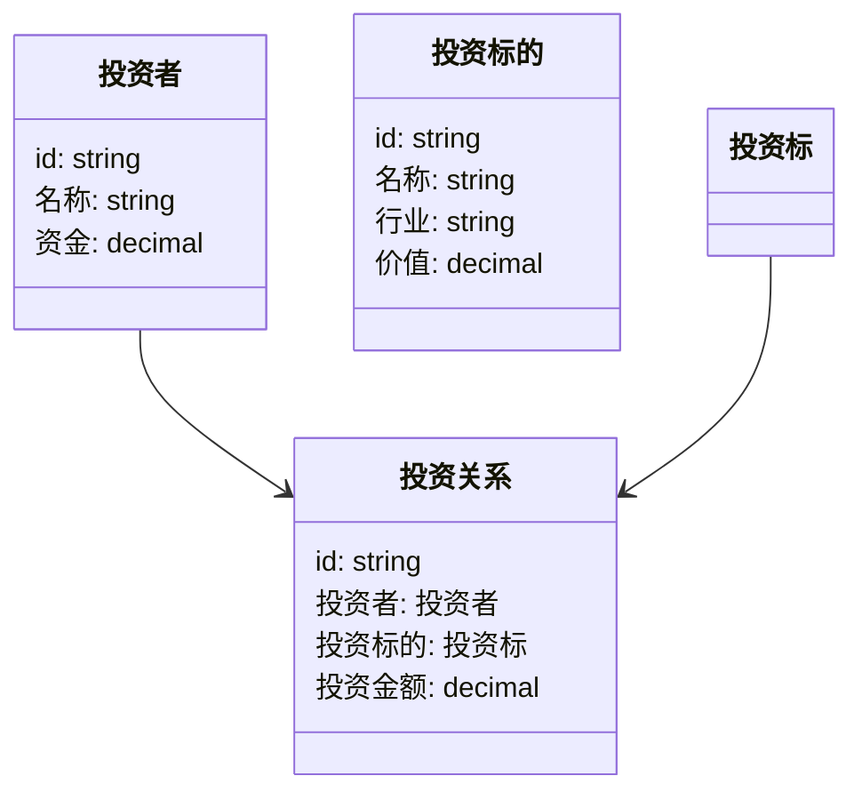
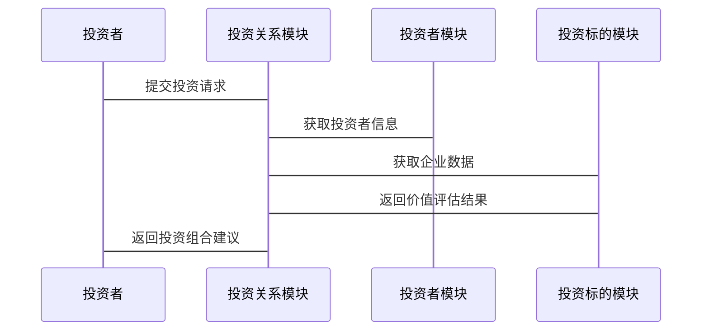

                 


# 巴菲特的跨界投资哲学：在产业融合背景下的新机遇

## 关键词：
- 巴菲特投资哲学
- 跨界投资
- 产业融合
- 价值投资
- 风险管理
- 系统架构
- 数学模型

## 摘要：
本书深入探讨了巴菲特的投资哲学及其在现代产业融合背景下的应用。通过分析跨界投资的核心概念、数学模型、系统架构和实际案例，结合风险管理策略，为投资者提供在产业融合趋势中把握新机遇的深度见解。

---

# 第一部分: 巴菲特投资哲学的核心理念

# 第1章: 巴菲特投资哲学概述

## 1.1 巴菲特投资哲学的核心理念
### 1.1.1 价值投资的定义与核心要素
- **定义**: 价值投资是一种以低于内在价值的价格买入优质股票的投资策略。
- **核心要素**: 
  - **内在价值**: 股票的真正价值，基于企业的未来现金流折现。
  - **安全边际**: 购买价格低于内在价值，以降低风险。
  - **长期视角**: 关注企业的长期盈利能力，而非短期市场波动。

### 1.1.2 巴菲特的价值投资体系
- **安全边际**: 巴菲特强调以低于内在价值的价格买入股票，确保在市场波动中仍能获得收益。
- **企业分析**: 关注企业的财务状况、竞争优势和管理层质量。
- **长期视角**: 价值投资注重长期回报，而非短期收益。

### 1.1.3 投资哲学的现代发展与跨界投资
- **跨界投资的定义**: 跨界投资是指跨越传统行业界限，投资于多个领域的优质企业。
- **与传统投资的对比**: 跨界投资更注重企业间的协同效应和行业融合带来的新机会。

## 1.2 跨界投资的定义与特征
### 1.2.1 跨界投资的定义
- 跨界投资是指投资者在不同行业之间进行投资，以利用产业融合带来的新机会。
- 例如，投资于科技与金融结合的金融科技企业。

### 1.2.2 跨界投资的核心特征
- **跨行业性**: 投资跨越多个行业。
- **协同效应**: 企业间的协同效应带来更高的收益。
- **风险分散**: 跨界投资可以分散单一行业的风险。

### 1.2.3 跨界投资与传统投资的对比
| 对比维度 | 跨界投资 | 传统投资 |
|----------|----------|----------|
| 风险 | 较低（多元化） | 较高（集中） |
| 收益 | 较高（协同效应） | 较低（单一行业） |
| 分析复杂度 | 较高 | 较低 |

## 1.3 产业融合的背景与趋势
### 1.3.1 产业融合的定义
- 产业融合是指不同行业之间的界限逐渐模糊，形成新的商业模式和竞争优势。

### 1.3.2 产业融合的主要趋势
- **科技与金融的融合**: 数字支付、区块链技术的应用。
- **制造业与信息技术的融合**: 智能制造、工业4.0。
- **医疗与科技的融合**: 远程医疗、智能健康设备。

### 1.3.3 跨界投资在产业融合中的新机遇
- **新兴行业的崛起**: 例如，人工智能、大数据等领域的投资机会。
- **企业协同效应**: 通过投资于多个相关行业，实现资源整合和优势互补。

## 1.4 巴菲特投资哲学与产业融合的结合
### 1.4.1 巴菲特哲学的核心要素
- **价值投资**: 以合理价格买入优质企业。
- **长期视角**: 关注企业的长期竞争优势。

### 1.4.2 产业融合背景下跨界投资的机会
- **跨行业协同**: 通过投资于多个行业，实现企业间的协同效应。
- **新兴行业的价值创造**: 在产业融合中发现高增长的企业。

### 1.4.3 巴菲特哲学对现代投资的启示
- **长期投资**: 重视企业的长期价值。
- **风险控制**: 通过分散投资降低风险。

## 1.5 本章小结
- 本章介绍了巴菲特的投资哲学及其在产业融合背景下的应用，强调了跨界投资的重要性和优势。

---

# 第二部分: 跨界投资的核心概念与数学模型

# 第2章: 跨界投资的核心概念与联系

## 2.1 跨界投资的核心概念
### 2.1.1 跨界投资的定义与属性
- **定义**: 跨界投资是指在多个行业之间进行投资，利用产业融合带来的机会。
- **属性**: 跨界投资具有跨行业性、协同效应和风险分散的特点。

### 2.1.2 跨界投资的实体关系图（ER图）
```mermaid
er
    entity 投资者 {
        id: string
        名称: string
        资金: decimal
    }
    entity 投资标的 {
        id: string
        名称: string
        行业: string
    }
    entity 投资关系 {
        id: string
        投资者: 投资者
        投资标的: 投资标
        投资金额: decimal
    }
```

## 2.2 跨界投资的数学模型与公式
### 2.2.1 跨界投资的价值评估公式
$$ V = \frac{CF}{r - g} $$
其中：
- \( V \) 表示内在价值，
- \( CF \) 表示未来现金流，
- \( r \) 表示折现率，
- \( g \) 表示现金流增长率。

### 2.2.2 贝塔系数与投资组合风险
$$ \beta = \frac{\text{协方差}(r_i, r_m)}{\text{方差}(r_m)} $$
其中：
- \( \beta \) 表示投资的贝塔系数，
- \( r_i \) 表示投资的收益，
- \( r_m \) 表示市场收益。

### 2.2.3 投资组合优化的数学模型
$$ \text{最小化} \quad \sigma^2 $$
$$ \text{在约束条件下} \quad E[r] \geq \text{目标收益} $$

---

# 第三部分: 系统分析与架构设计

# 第3章: 跨界投资的系统分析与架构设计

## 3.1 问题场景介绍
- **问题描述**: 跨界投资需要分析多个行业的企业，利用产业融合带来的机会。
- **目标**: 构建一个系统化的投资分析框架。

## 3.2 系统功能设计
### 3.2.1 领域模型


### 3.2.2 系统架构


## 3.3 系统接口设计
- **投资者模块接口**: 提供投资者信息和投资行为数据。
- **投资标的模块接口**: 提供企业数据和价值评估结果。
- **投资关系模块接口**: 提供投资组合和风险分析结果。

## 3.4 系统交互设计


## 3.5 本章小结
- 本章构建了跨界投资的系统分析框架，包括领域模型、系统架构和接口设计。

---

# 第四部分: 项目实战与风险管理

# 第4章: 跨界投资的项目实战

## 4.1 项目环境安装
- **工具**: Python、Jupyter Notebook、Matplotlib。
- **数据源**: 财务数据、行业报告、市场分析。

## 4.2 核心代码实现
### 4.2.1 财务数据分析
```python
import pandas as pd
import numpy as np

# 读取财务数据
df = pd.read_csv('financial_data.csv')

# 计算内在价值
def calculate_intrinsic_value(enterprise_value, revenue_growth):
    cash_flow = df['cash_flow'].mean()
    discount_rate = 0.1
    growth_rate = 0.05
    return cash_flow / (discount_rate - growth_rate)

# 示例计算
enterprise_value = df['enterprise_value'][0]
intrinsic_value = calculate_intrinsic_value(enterprise_value, 0.05)
print(f"内在价值: {intrinsic_value}")
```

### 4.2.2 贝塔系数计算
```python
import pandas as pd
import numpy as np

# 读取市场数据
market_data = pd.read_csv('market_data.csv')

# 计算贝塔系数
def calculate_beta(stock_return, market_return):
    covariance = np.cov(stock_return, market_return)[0, 1]
    variance = np.var(market_return)
    return covariance / variance

# 示例计算
beta = calculate_beta(stock_returns, market_returns)
print(f"贝塔系数: {beta}")
```

## 4.3 风险管理策略
### 4.3.1 投资组合分散化
- **目标**: 通过投资多个行业分散风险。
- **方法**: 使用现代投资组合理论（MPT）优化投资组合。

### 4.3.2 风险控制策略
- **止损策略**: 设置止损点，避免重大损失。
- **定期再平衡**: 定期调整投资组合，保持目标比例。

## 4.4 本章小结
- 本章通过实际案例展示了如何应用数学模型进行跨界投资分析，并提出了风险管理策略。

---

# 第五部分: 未来趋势与总结

# 第5章: 产业融合背景下的未来趋势

## 5.1 未来产业融合的趋势
- **科技与金融的深度融合**: 区块链、人工智能在金融领域的应用。
- **绿色经济**: 可再生能源、环保技术的投资机会。

## 5.2 巴菲特哲学在新经济中的应用
- **长期投资**: 重视企业的可持续发展。
- **价值发现**: 在新兴行业中寻找低估的企业。

## 5.3 未来投资机会
- **人工智能与大数据**: 投资于技术领先的企业。
- **健康与医疗**: 随着人口老龄化，健康科技的需求增加。

## 5.4 本章小结
- 本章展望了产业融合的未来趋势，并强调了巴菲特哲学在新经济中的应用。

---

# 第六部分: 总结与启示

# 第6章: 总结与启示

## 6.1 巴菲特投资哲学的现代价值
- **长期视角**: 重视企业的长期价值。
- **价值投资**: 在产业融合中发现低估的企业。

## 6.2 对投资者的启示
- **跨行业投资**: 通过跨界投资分散风险，抓住新机遇。
- **系统化分析**: 使用数学模型和系统架构进行投资分析。

## 6.3 未来研究方向
- **人工智能在投资分析中的应用**。
- **区块链技术在金融领域的应用**。

## 6.4 本章小结
- 本章总结了巴菲特投资哲学的现代价值，并为投资者提供了未来的投资方向。

---

# 附录: 巴菲特投资哲学的Python实现代码

```python
import pandas as pd
import numpy as np

# 示例代码：计算内在价值
def calculate_intrinsic_value(cash_flow, discount_rate, growth_rate):
    return cash_flow / (discount_rate - growth_rate)

# 示例代码：计算贝塔系数
def calculate_beta(stock_return, market_return):
    covariance = np.cov(stock_return, market_return)[0, 1]
    variance = np.var(market_return)
    return covariance / variance

# 示例代码：投资组合优化
def optimize_portfolio(returns, weights):
    portfolio_return = np.sum(returns * weights)
    portfolio_risk = np.sqrt(np.dot(weights.T, np.dot(returns.cov(), weights)))
    return portfolio_return, portfolio_risk
```

---

# 结束语

通过系统的分析和实际案例的展示，本书为投资者提供了在产业融合背景下进行跨界投资的深度见解。希望读者能够结合巴菲特的投资哲学，抓住未来的新机遇，实现稳健的投资回报。

