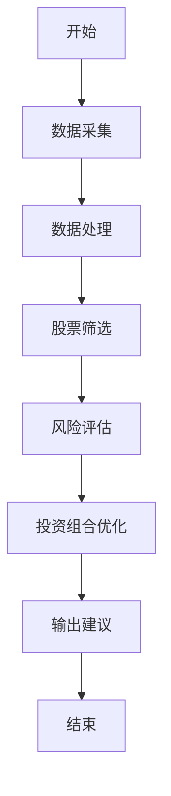
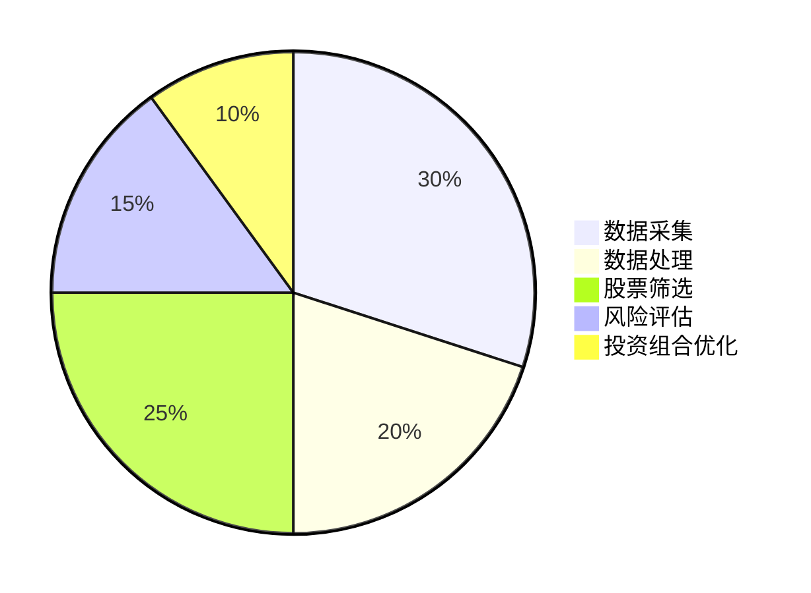
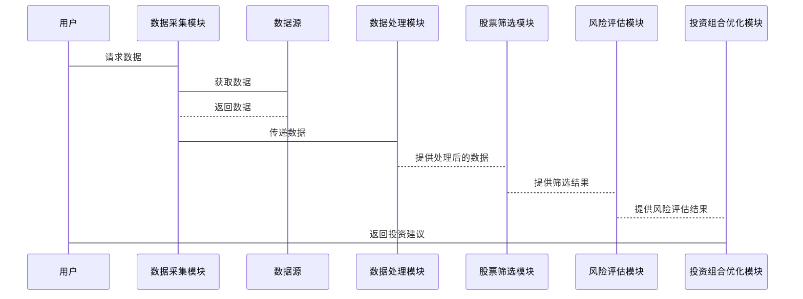

                 


# 巴菲特的跨界投资策略：从纺织到科技

## 关键词
- 巴菲特
- 跨界投资
- 科技投资
- 价值投资
- 投资策略
- 系统架构

## 摘要
本文探讨了巴菲特的跨界投资策略，从他的价值投资哲学到具体的投资案例，再到系统的数学模型和架构设计。通过分析巴菲特如何从纺织业转向科技投资，揭示其成功的逻辑和方法，为读者提供深度的技术分析和实践指导。

---

## 第一章：巴菲特的投资理念与价值投资哲学

### 1.1 巴菲特的投资理念概述

#### 1.1.1 价值投资的核心思想
价值投资是巴菲特投资理念的核心，强调以低于内在价值的价格买入优质股票。其核心思想是寻找具有持续竞争优势的企业，长期持有，而非频繁交易。

#### 1.1.2 巴菲特的投资哲学与方法
巴菲特的投资哲学强调安全边际、长期价值和企业管理。他通过分析企业的财务报表、管理层素质和行业前景，寻找具备长期竞争优势的企业。

#### 1.1.3 巴菲特的成功案例与启示
通过投资可口可乐和苹果等公司，巴菲特展示了其价值投资的成功案例。这些案例表明，长期持有优质企业股票能够带来丰厚的回报。

### 1.2 巴菲特的跨界投资背景

#### 1.2.1 巴菲特的个人背景与投资历程
巴菲特早期投资于纺织业，后逐渐转向科技、金融等其他领域。他的跨界投资基于对企业价值的深入理解和对市场趋势的敏锐洞察。

#### 1.2.2 巴菲特从纺织业到科技的投资转型
随着科技行业的崛起，巴菲特意识到科技企业在未来经济中的重要地位，逐步增加对科技股的投资。

#### 1.2.3 跨界投资的必要性与挑战
跨界投资能够分散风险，抓住不同行业的增长机会，但也面临行业认知不足和市场波动的挑战。

### 1.3 巴菲特的投资策略与风险管理

#### 1.3.1 价值投资中的风险管理
巴菲特强调安全边际，通过合理估值和分散投资来降低风险。他避免高杠杆和过度集中投资。

#### 1.3.2 巴菲特的分散投资策略
通过投资多个行业和企业，巴菲特实现了投资组合的多元化，降低了单一行业波动的风险。

#### 1.3.3 跨界投资中的风险控制
巴菲特通过严格筛选管理层和企业治理，以及长期跟踪企业的经营状况，有效控制跨界投资风险。

---

## 第二章：巴菲特的跨界投资策略分析

### 2.1 跨界投资的核心概念与框架

#### 2.1.1 跨界投资的定义与特征
跨界投资指跨越不同行业进行投资，其特征包括多样性、广泛性和灵活性。

#### 2.1.2 跨界投资的逻辑与原则
跨界投资需要基于对企业价值和行业趋势的深入分析，遵循价值投资的原则。

#### 2.1.3 跨界投资的适用场景与限制
适用于投资者具备跨行业分析能力，但需避免盲目跟风和过度分散。

### 2.2 巴菲特的跨界投资逻辑

#### 2.2.1 从纺织到科技的投資逻辑
巴菲特基于对企业长期价值和行业趋势的判断，逐步增加对科技股的配置。

#### 2.2.2 巴菲特对科技行业的认知与判断
科技行业具有高增长潜力，但波动性大，需要选择具备持续创新能力和竞争优势的企业。

#### 2.2.3 跨界投资中的行业选择与评估
巴菲特通过行业分析、财务指标和管理层能力评估，选择具备长期增长潜力的企业。

### 2.3 跨界投资的关键要素

#### 2.3.1 行业分析与趋势判断
通过分析行业发展趋势和市场容量，判断投资机会。

#### 2.3.2 公司基本面分析
评估企业的财务状况、盈利能力和发展潜力。

#### 2.3.3 管理层能力与企业治理
优秀的管理层和良好的公司治理是企业长期成功的关键。

---

## 第三章：科技领域的投资机会与挑战

### 3.1 科技行业的投资逻辑

#### 3.1.1 科技行业的核心驱动力
技术创新和市场需求是科技行业增长的核心驱动力。

#### 3.1.2 科技行业的周期性与波动性
科技行业具有周期性，波动性较大，需要选择具有抗周期性的企业。

#### 3.1.3 科技行业的长期投资价值
科技行业具备长期增长潜力，特别是人工智能、云计算等领域。

### 3.2 巴菲特对科技行业的投资策略

#### 3.2.1 科技行业的长期投资机会
巴菲特看好科技行业的长期增长，选择具备持续创新能力的企业。

#### 3.2.2 科技行业的短期波动与风险
科技股波动较大，需要耐心持有，避免短期波动影响判断。

#### 3.2.3 誸股与科技股的投資区别
科技股具有高增长潜力，但风险较高，需要谨慎选择。

### 3.3 科技行业的具体案例分析

#### 3.3.1 巴菲特对苹果的投资分析
巴菲特投资苹果基于其强大的品牌、创新能力和稳定的盈利能力。

#### 3.3.2 其他科技巨头的投资价值
如微软和亚马逊，具备强大的市场地位和长期增长潜力。

#### 3.3.3 科技行业的未来趋势与机会
人工智能、5G、云计算等领域具备较大的投资潜力。

---

## 第四章：巴菲特投资策略的数学模型与算法

### 4.1 价值投资的数学模型

#### 4.1.1 股票内在价值的计算公式
股票的内在价值可以通过未来现金流的现值计算：
$$ V = \sum_{t=1}^{n} \frac{CF_t}{(1 + r)^t} $$
其中，CF_t是第t年的现金流，r是折现率。

#### 4.1.2 股东权益与ROE分析
ROE（股东权益回报率）公式：
$$ ROE = \frac{\text{净利润}}{\text{股东权益}} $$

#### 4.1.3 市盈率与市净率的比较
市盈率（P/E）=股价/每股收益  
市净率（P/B）=股价/每股净资产

### 4.2 风险管理的数学模型

#### 4.2.1 马科维茨的现代投资组合理论
通过优化投资组合的收益和风险，构建最优资产配置。

#### 4.2.2 风险调整后的收益评估
夏普比率（Sharpe Ratio）用于衡量风险调整后的收益：
$$ \text{夏普比率} = \frac{E(R_i - R_f)}{\sigma_i} $$
其中，E(R_i - R_f)是资产的超额收益期望值，σ_i是资产收益的标准差。

#### 4.2.3 巴菲特的风险控制指标
通过安全边际和分散投资降低整体风险。

### 4.3 股票筛选的算法实现

#### 4.3.1 基于基本面的股票筛选算法
```python
def screen_stocks(stocks):
    selected = []
    for stock in stocks:
        if stock.roe > 15 and stock.debt_ratio < 0.5 and stock.growth_rate > 5:
            selected.append(stock)
    return selected
```

#### 4.3.2 基于技术分析的辅助决策算法
```python
def technical_analysis(stock_data):
    # 计算短期移动平均线
    short_ma = stock_data['close'].rolling(5).mean()
    # 计算长期移动平均线
    long_ma = stock_data['close'].rolling(20).mean()
    # 判断交叉信号
    signal = 'buy' if short_ma[-1] > long_ma[-1] else 'sell'
    return signal
```

---

## 第五章：系统分析与架构设计方案

### 5.1 投资决策系统的功能设计

#### 5.1.1 系统功能模块划分
- 数据采集与处理模块
- 股票筛选模块
- 风险评估模块
- 投资组合优化模块

#### 5.1.2 系统输入与输出设计
输入：股票数据、市场数据、投资目标  
输出：投资建议、风险评估、投资组合

#### 5.1.3 系统功能流程图


### 5.2 系统架构设计

#### 5.2.1 系统架构图


#### 5.2.2 系统接口设计
- 数据接口：与数据源对接，获取实时数据
- 用户接口：提供输入参数和输出结果

#### 5.2.3 系统交互序列图


---

## 第六章：项目实战

### 6.1 环境安装与配置
- 安装Python和必要的库（如Pandas、Matplotlib）
- 数据源获取（如Yahoo Finance API）

### 6.2 系统核心实现源代码

#### 6.2.1 数据采集与处理
```python
import pandas as pd
import yfinance as yf

# 下载苹果股票数据
apple_data = yf.download('AAPL', start='2020-01-01', end='2023-12-31')
# 计算移动平均线
apple_data['MA5'] = apple_data['Close'].rolling(5).mean()
apple_data['MA20'] = apple_data['Close'].rolling(20).mean()
```

#### 6.2.2 股票筛选与分析
```python
def screen_stocks(tickers):
    screened = []
    for ticker in tickers:
        stock = yf.Ticker(ticker)
        if stock.info['sector'] == 'Technology' and stock.info['profitMargins'] > 10:
            screened.append(ticker)
    return screened

screened_tickers = screen_stocks(['AAPL', 'MSFT', 'GOOGL'])
```

#### 6.2.3 投资组合优化
```python
import numpy as np
from sklearn import svm

# 示例投资组合优化
def optimize_portfolio(stocks, returns):
    cov_matrix = np.cov(returns)
    eigenvalues, eigenvectors = np.linalg.eigh(cov_matrix)
    # 计算最大收益
    max_return = np.max(np.mean(returns, axis=1))
    return max_return, eigenvectors[:, 0]

returns = np.array([[0.1, 0.15, 0.2], [0.15, 0.2, 0.25], [0.2, 0.25, 0.3]])
max_return, portfolio = optimize_portfolio(['AAPL', 'MSFT', 'GOOGL'], returns)
print(f"最大收益: {max_return}")
```

### 6.3 实际案例分析与详细解读

#### 6.3.1 投资苹果公司的案例
通过基本面分析和估值模型，巴菲特判断苹果具备长期投资价值。

#### 6.3.2 投资组合调整策略
根据市场变化和企业表现，动态调整投资组合。

#### 6.3.3 案例总结
巴菲特的成功在于对企业价值的深刻理解，以及长期投资的耐心和决心。

---

## 第七章：总结与展望

### 7.1 总结
本文详细分析了巴菲特的跨界投资策略，从价值投资哲学到具体操作，结合数学模型和系统架构，为投资者提供了全面的指导。

### 7.2 未来展望
随着科技的发展，跨界投资将更加重要。未来，投资者需要具备跨行业分析能力和风险管理能力，抓住新兴行业的投资机会。

---

## 附录

### 附录A：巴菲特的名言摘录
- “价格是会变化的，价值是永恒的。”
- “只有当潮水退去时，才知道谁在裸泳。”

### 附录B：进一步阅读的书籍
- 《巴菲特的护城河》
- 《投资最重要的少数原则》

---

通过以上内容，我们全面解析了巴菲特的跨界投资策略，结合技术分析和实际案例，为投资者提供了有价值的参考。

