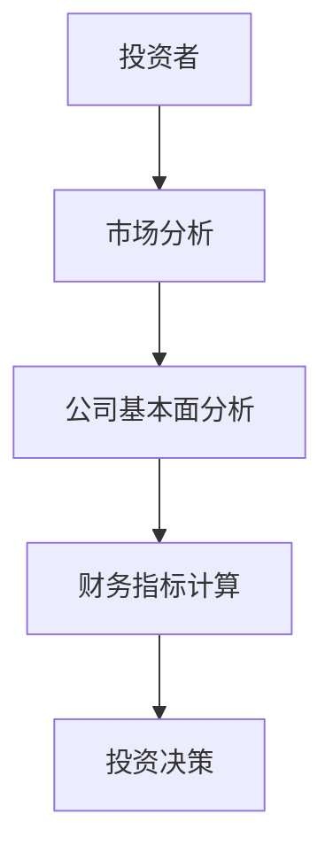
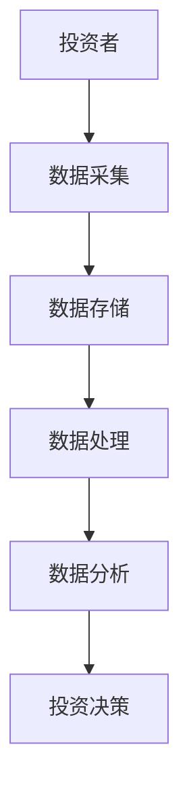

                 


# 巴菲特的逆向投资思维

> 关键词：逆向思维, 价值投资, 巴菲特, 安全边际, 股票分析, 投资策略

> 摘要：本文深入分析了巴菲特的逆向投资思维，探讨了其核心概念、选股标准、数学模型和投资决策系统，结合实际案例，为读者提供了系统化的投资方法论。

---

# 第1章: 投资的基本概念与巴菲特的生平

## 1.1 投资的基本概念
### 1.1.1 投资的定义与分类
- 投资的定义：将资金投入到特定资产中，以期获得未来收益的行为。
- 分类：股票、债券、房地产、黄金等。

### 1.1.2 股票市场的基本运作原理
- 股票市场的功能：资金筹集、资产配置、价格发现。
- 股票价格的影响因素：宏观经济、公司基本面、市场情绪。

### 1.1.3 投资者与投机者的区别
- 投资者：注重长期价值，追求稳定的收益。
- 投机者：关注短期价格波动，追求快速盈利。

## 1.2 巴菲特的生平简介
### 1.2.1 巴菲特的早年经历
- 1934年出生于 Omaha, Nebraska。
- 10岁时开始研究股票投资，15岁赚取第一桶金。
- 希尔顿·胡佛大学，主修经济学，20岁毕业。

### 1.2.2 巴菲特的合伙人制度
- 1956年创立合伙公司，吸引志同道合的投资者。
- 采用合伙制，合伙人共同决策，利益共享。

### 1.2.3 巴菲特的慈善事业
- 慈善信托：将财富用于教育、医疗等社会公益事业。
- 拥护渐进式税制，支持财富公平分配。

## 1.3 巴菲特的投资哲学
### 1.3.1 巴菲特的价值投资理念
- 买入低于内在价值的股票，长期持有。
- 注重公司的基本面，尤其是盈利能力。

### 1.3.2 巴菲特的长期投资策略
- 长期持有优质股票，避免频繁交易。
- 避免短期波动，关注长期价值。

### 1.3.3 巴菲特的安全边际概念
- 安全边际的定义：买入价格低于内在价值的部分。
- 安全边际的作用：降低投资风险，确保长期收益。

## 1.4 本章小结
- 巴菲特的投资哲学以价值投资为核心，强调长期持有和安全边际。

---

# 第2章: 逆向投资思维的核心概念

## 2.1 逆向思维的定义与特点
### 2.1.1 逆向思维的定义
- 逆向思维：在市场普遍悲观时买入，市场普遍乐观时卖出。

### 2.1.2 逆向思维的特点
- 逆向思维的核心：寻找市场非理性行为。
- 逆向思维的优势：在市场恐慌时获得廉价资产。

## 2.2 巴菲特的逆向投资策略
### 2.2.1 逆向投资的核心原则
- 买入被市场低估的股票。
- 卖出被市场高估的股票。

### 2.2.2 逆向投资的实施步骤
1. 分析市场情绪，判断市场估值。
2. 寻找被低估的股票。
3. 长期持有，等待市场回归理性。

### 2.2.3 逆向投资的案例分析
- 1998年买入航空公司股票：当时市场对航空业前景悲观，巴菲特认为短期油价下跌会导致行业整合，长期来看，航空公司股票被低估。

## 2.3 逆向思维与市场情绪的关系
### 2.3.1 市场情绪的波动性
- 市场情绪的周期性：从乐观到悲观，再从悲观到乐观。
- 市场情绪的影响因素：宏观经济、行业动态、公司新闻等。

### 2.3.2 逆向思维与市场情绪的反向关系
- 当市场情绪高涨时，投资者容易高估资产价值。
- 当市场情绪低落时，投资者容易低估资产价值。

### 2.3.3 如何利用市场情绪进行逆向投资
- 分析市场情绪，判断资产价格的偏离程度。
- 在市场恐慌时买入，在市场疯狂时卖出。

## 2.4 本章小结
- 逆向思维是巴菲特投资成功的关键，通过分析市场情绪，寻找被低估的资产。

---

# 第3章: 巴菲特的选股标准与分析方法

## 3.1 巴菲特的选股标准
### 3.1.1 公司基本面分析
- 行业地位：公司是否在行业中具有竞争优势。
- 财务状况：公司是否有稳定的盈利能力。

### 3.1.2 财务状况评估
- 利润能力：ROE（净资产收益率）是否稳定且高。
- 偿债能力：是否有足够的现金流支持公司运营。

### 3.1.3 管理团队分析
- 管理层是否诚信可靠。
- 管理层是否具有长期投资理念。

## 3.2 财务指标分析方法
### 3.2.1 市盈率（P/E）的计算与分析
- 市盈率的定义：股价与每股收益的比值。
- 市盈率的计算公式：$$ P/E = \frac{Price}{Earnings} $$
- 市盈率的分析：低于行业平均市盈率可能意味着股票被低估。

### 3.2.2 市净率（P/B）的计算与分析
- 市净率的定义：股价与每股净资产的比值。
- 市净率的计算公式：$$ P/B = \frac{Price}{Book\ Value} $$
- 市净率的分析：低于1可能意味着股票被低估。

### 3.2.3 内在价值的计算方法
- 内在价值的定义：股票的真正价值，不考虑市场波动。
- 内在价值的计算公式：$$ Intrinsic\ Value = \frac{Earnings\ Growth\ Rate}{Discount\ Rate} $$
- 内在价值的分析：买入价格低于内在价值时，股票具有安全边际。

## 3.3 巴菲特的长期投资策略
### 3.3.1 长期投资的优势
- 长期投资可以避免短期波动的影响。
- 长期投资可以享受复利效应。

### 3.3.2 长期投资的风险控制
- 选择具有稳定盈利能力和良好管理团队的公司。
- 保持足够的安全边际。

### 3.3.3 长期投资的案例分析
- 可口可乐案例：巴菲局长期持有可口可乐股票，因为其稳定的现金流和强大的品牌优势。

## 3.4 本章小结
- 巴菲特的选股标准注重公司基本面和财务指标，长期投资策略注重安全边际和内在价值。

---

# 第4章: 逆向投资的数学模型与公式

## 4.1 市盈率（P/E）的计算公式
### 4.1.1 市盈率的定义
- 市盈率（P/E）= 股价 / 每股收益

### 4.1.2 市盈率的计算公式
$$ P/E = \frac{Price}{Earnings} $$

## 4.2 市净率（P/B）的计算公式
### 4.2.1 市净率的定义
- 市净率（P/B）= 股价 / 每股净资产

### 4.2.2 市净率的计算公式
$$ P/B = \frac{Price}{Book\ Value} $$

## 4.3 内在价值的计算公式
### 4.3.1 内在价值的定义
- 内在价值是股票的真正价值，不考虑市场波动。

### 4.3.2 内在价值的计算公式
$$ Intrinsic\ Value = \frac{Earnings\ Growth\ Rate}{Discount\ Rate} $$

## 4.4 本章小结
- 通过市盈率、市净率和内在价值的计算，投资者可以更好地判断股票是否被低估。

---

# 第5章: 投资决策的系统架构与流程

## 5.1 投资决策的系统架构
### 5.1.1 系统架构图


### 5.1.2 系统功能设计
- 市场分析：分析市场整体走势和行业动态。
- 公司基本面分析：分析公司的盈利能力、财务状况和管理团队。
- 财务指标计算：计算市盈率、市净率和内在价值。
- 投资决策：根据分析结果做出买入、卖出或持有决策。

## 5.2 系统架构设计
### 5.2.1 系统架构图


### 5.2.2 系统接口设计
- 数据采集接口：获取市场数据和公司财务报表。
- 数据存储接口：存储市场数据和公司财务报表。
- 数据处理接口：计算市盈率、市净率和内在价值。
- 数据分析接口：分析市场情绪和公司基本面。
- 投资决策接口：输出投资决策结果。

## 5.3 系统交互流程
### 5.3.1 系统交互图


## 5.4 本章小结
- 投资决策系统通过市场分析、公司基本面分析和财务指标计算，帮助投资者做出科学的投资决策。

---

# 第6章: 项目实战与案例分析

## 6.1 项目实战
### 6.1.1 环境安装
- 安装Python和相关数据分析库（Pandas、NumPy、Matplotlib）。

### 6.1.2 系统核心实现源代码
```python
import pandas as pd
import numpy as np

# 计算市盈率
def calculate_pe(stock_price, earnings_per_share):
    return stock_price / earnings_per_share

# 计算市净率
def calculate_pb(stock_price, book_value_per_share):
    return stock_price / book_value_per_share

# 计算内在价值
def calculate_intrinsic_value(earnings_growth_rate, discount_rate):
    return earnings_growth_rate / discount_rate
```

### 6.1.3 代码应用解读与分析
- 使用Python代码计算市盈率、市净率和内在价值。
- 通过这些指标判断股票是否被低估。

## 6.2 实际案例分析
### 6.2.1 案例选择
- 选择一只股票，分析其市盈率、市净率和内在价值。

### 6.2.2 案例分析
- 以可口可乐为例，计算其市盈率和市净率，判断其是否被低估。

## 6.3 本章小结
- 通过项目实战和案例分析，投资者可以更好地理解和应用巴菲特的逆向投资思维。

---

# 第7章: 最佳实践与小结

## 7.1 最佳实践
### 7.1.1 长期投资的注意事项
- 避免频繁交易，保持长期持有。
- 选择具有稳定盈利能力和良好管理团队的公司。

### 7.1.2 安全边际的注意事项
- 在市场恐慌时买入，市场疯狂时卖出。
- 保持足够的安全边际，降低投资风险。

## 7.2 小结
- 巴菲特的逆向投资思维是一种科学的投资方法，通过分析市场情绪、公司基本面和财务指标，寻找被低估的股票，长期持有，获得稳定的收益。

## 7.3 注意事项
- 避免短期波动，关注长期价值。
- 保持理性，避免被市场情绪左右。

## 7.4 拓展阅读
- 《巴菲特传》：了解巴菲特的生平和投资哲学。
- 《价值投资入门》：学习价值投资的基本概念和方法。

---

# 附录: 参考文献

1. 巴菲特的股东大会演讲。
2. 巴菲特的合作伙伴格雷厄姆的投资理论。
3. 《巴菲特的投资思想》。
4. 《价值投资入门》。

---

# 结语

通过本文的分析，读者可以深入了解巴菲特的逆向投资思维，掌握其核心概念、选股标准和投资策略，并通过实际案例和项目实战，更好地理解和应用这些方法。

