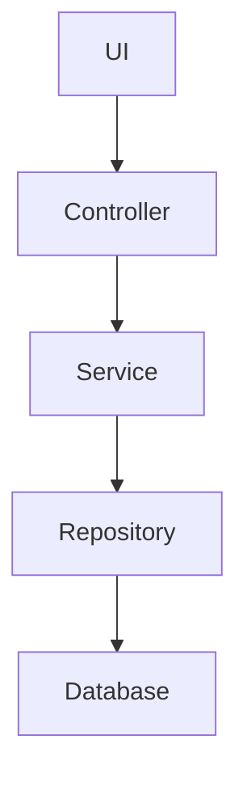

                 


# 巴菲特的逆向投资思维

## 关键词：逆向投资，巴菲特，价值投资，安全边际，市场先生，投资策略

## 摘要：  
巴菲特的逆向投资思维是一种在市场低迷时期寻找被低估资产的投资策略，强调安全边际和长期价值。本文将从逆向投资的背景、核心概念、算法原理、系统设计、实战应用等方面进行深入分析，结合实际案例和数学模型，揭示其在投资中的独特优势和应用方法。

---

## 第1章：逆向投资的背景与核心理念

### 1.1 逆向投资的定义与背景

逆向投资是一种在市场恐慌或低迷时期，买入被市场低估资产的投资策略。与传统投资的顺势而为不同，逆向投资强调在市场底部寻找机会。

#### 1.1.1 逆向投资的定义与内涵  
逆向投资的核心在于“买别人恐惧时买”。它基于市场情绪的波动性，寻找价格与价值严重偏离的投资机会。逆向投资并非完全反市场，而是通过理性分析找到市场的非理性点。

#### 1.1.2 逆向投资的历史发展  
逆向投资理念可追溯到格雷厄姆的价值投资理论。巴菲特继承并发展了这一理念，将其应用于股票、企业等长期投资领域。

#### 1.1.3 逆向投资在现代投资中的地位  
逆向投资是价值投资的重要组成部分，强调在市场低估时布局，注重安全边际。它在投资组合中的地位日益重要，尤其是在市场波动加剧的环境下。

---

### 1.2 巴菲特的投资理念

巴菲特的投资理念以价值投资为核心，强调企业内在价值和长期增长潜力。

#### 1.2.1 巴菲特的投资哲学  
巴菲特认为，投资的本质是寻找具有持续竞争优势的企业，而非追涨杀跌。他强调企业盈利能力、财务健康和管理团队。

#### 1.2.2 巴菲特的成功案例分析  
例如，巴菲特投资可口可乐和苹果公司，基于对企业长期价值的判断，而非短期市场波动。

#### 1.2.3 巴菲特投资策略的核心要素  
- **安全边际**：买入价格低于内在价值。
- **长期价值**：关注企业的盈利能力和竞争优势。
- **集中投资**：重点投资少数优质企业。

---

### 1.3 逆向思维的哲学基础

逆向思维是一种反向思考的方法，强调从对立面寻找问题的解决方案。

#### 1.3.1 逆向思维的定义  
逆向思维是通过反向思考问题，找到独特见解。它常用于投资中，帮助投资者在市场非理性时做出合理决策。

#### 1.3.2 逆向思维在投资中的应用  
市场恐慌时，投资者往往做出非理性决策。逆向思维帮助投资者识别市场情绪与实际价值的差异。

#### 1.3.3 逆向思维与市场情绪的关系  
市场情绪波动是逆向思维的核心应用领域。当市场恐慌时，理性投资者可以通过逆向思维找到机会。

---

### 1.4 逆向投资与传统投资的区别

#### 1.4.1 传统投资的基本特点  
传统投资注重趋势跟踪和市场预测，依赖技术分析和市场情绪。

#### 1.4.2 逆向投资的独特优势  
逆向投资的优势在于价格发现和风险控制，能够在市场低谷时布局。

#### 1.4.3 逆向投资的适用场景与局限性  
适用场景：市场恐慌、资产价格被低估。局限性：需要深度分析，对市场理解要求高。

---

## 第2章：价值投资的核心概念

### 2.1 价值投资的定义与特征

价值投资是通过分析企业内在价值，寻找价格低于价值的资产进行投资。

#### 2.1.1 价值投资的定义  
价值投资强调企业基本面分析，寻找市场价格低于内在价值的投资机会。

#### 2.1.2 价值投资的主要特征  
- 长期投资：关注企业的长期价值。
- 低市盈率：寻找市盈率、市净率低于行业平均水平的股票。
- 高质量企业：选择具有强大竞争优势的企业。

---

### 2.2 安全边际的概念与计算

安全边际是逆向投资中的关键概念，用于降低投资风险。

#### 2.2.1 安全边际的定义  
安全边际是买入价格与内在价值之间的差距，确保即使估值有误，也能获得正收益。

#### 2.2.2 安全边际的计算方法  
$$ \text{安全边际} = \text{内在价值} - \text{市场价格} $$

#### 2.2.3 安全边际在投资决策中的应用  
在市场恐慌时，安全边际越大，投资风险越低。例如，购买价格为内在价值的50%，则安全边际为50%。

---

### 2.3 市场先生的理论模型

市场先生是格雷厄姆提出的理论模型，用于解释市场情绪的波动。

#### 2.3.1 市场先生的定义  
市场先生代表市场情绪，每天以不同价格出售资产。投资者可以选择接受或拒绝市场先生的价格。

#### 2.3.2 市场先生的行为特征  
市场先生通常非理性，价格波动大，但长期趋于企业内在价值。

#### 2.3.3 市场先生与投资者决策的关系  
投资者应理性应对市场先生的情绪波动，避免被市场情绪左右。

---

## 第3章：逆向投资的核心概念与联系

### 3.1 逆向投资的核心概念

逆向投资的核心概念包括安全边际、内在价值和市场情绪。

#### 3.1.1 逆向投资的核心概念  
- **内在价值**：资产的真实价值，独立于市场价格。
- **安全边际**：价格与价值的差距，降低投资风险。
- **市场情绪**：投资者情绪波动影响市场价格。

#### 3.1.2 逆向投资的关键要素  
- 价格低于价值。
- 足够的安全边际。
- 长期投资 horizon。

---

### 3.2 核心概念的联系

逆向投资的核心概念相互关联，形成一个完整的投资体系。

#### 3.2.1 价值投资与逆向投资的联系  
价值投资是逆向投资的基础，逆向投资是价值投资的高级应用。

#### 3.2.2 安全边际与逆向投资的关系  
安全边际是逆向投资的核心，确保投资风险可控。

#### 3.2.3 市场情绪与逆向投资的互动  
市场情绪波动是逆向投资的机会，理性投资者利用市场恐慌寻找机会。

---

### 3.3 核心概念的对比分析

逆向投资与其他投资策略有显著区别。

#### 3.3.1 逆向投资与价值投资的对比  
逆向投资是价值投资的分支，强调安全边际和市场情绪。

#### 3.3.2 逆向投资与成长投资的对比  
逆向投资注重价值低估，成长投资注重高增长潜力。

#### 3.3.3 逆向投资与趋势投资的对比  
逆向投资反向市场趋势，趋势投资顺势而为。

---

## 第4章：逆向投资的算法原理

### 4.1 逆向投资的数学模型与公式

逆向投资可以通过数学模型量化分析。

#### 4.1.1 逆向投资的数学模型  
$$ \text{投资价值} = \text{内在价值} \times (1 + \text{安全边际}) $$

#### 4.1.2 内在价值的计算公式  
$$ \text{内在价值} = \frac{\text{净利润} \times (1 + \text{增长率})}{\text{资本成本} - \text{增长率}} $$

---

### 4.2 逆向投资的算法原理

逆向投资的算法涉及内在价值评估和价格比较。

#### 4.2.1 逆向投资的评估流程  
1. 评估企业内在价值。
2. 比较市场价格与内在价值。
3. 计算安全边际。
4. 决策是否投资。

#### 4.2.2 逆向投资的决策逻辑  
- 如果市场价格 < 内在价值，且安全边际足够，买入。
- 如果市场价格 > 内在价值，卖出或不买。

---

### 4.3 逆向投资的案例分析

通过具体案例说明逆向投资的应用。

#### 4.3.1 案例一：巴菲特的经典投资案例  
- 投资对象：可口可乐。
- 内在价值计算：基于现金流折现法。
- 安全边际：购买价格低于内在价值。

#### 4.3.2 案例二：逆向投资在市场危机中的应用  
- 2008年金融危机期间，巴菲特买入银行股，基于安全边际和长期价值。

---

## 第5章：系统分析与架构设计方案

### 5.1 问题场景介绍

逆向投资需要一个系统来支持决策。

#### 5.1.1 系统功能需求  
- 评估企业内在价值。
- 比较市场价格与内在价值。
- 计算安全边际。
- 提供投资建议。

---

### 5.2 系统架构设计

系统架构采用分层设计。

#### 5.2.1 系统架构图  


---

### 5.3 系统功能设计

系统功能包括数据采集、分析、决策支持。

#### 5.3.1 系统功能模块  
- 数据采集模块：获取企业财务数据。
- 分析模块：计算内在价值和安全边际。
- 决策支持模块：提供投资建议。

---

## 第6章：项目实战

### 6.1 环境安装

安装Python和相关库。

#### 6.1.1 环境要求  
- Python 3.8+
- Pandas, NumPy, Scikit-learn

---

### 6.2 系统核心实现源代码

提供核心算法的Python代码。

#### 6.2.1 核心代码实现  
```python
def calculate_intrinsic_value(enterprise_value, growth_rate, discount_rate):
    return enterprise_value * (1 + growth_rate) / (discount_rate - growth_rate)
```

---

### 6.3 代码应用解读与分析

解释代码的功能和应用场景。

#### 6.3.1 代码功能解读  
计算企业内在价值，基于现金流折现法。

#### 6.3.2 应用场景分析  
在市场低迷时，评估企业内在价值，寻找被低估的投资机会。

---

### 6.4 实际案例分析

分析具体案例，展示代码的应用。

#### 6.4.1 案例分析  
- 企业：某制造业公司。
- 数据：净利润、增长率、资本成本。
- 计算：内在价值、安全边际。
- 决策：建议买入或卖出。

---

## 第7章：总结与展望

### 7.1 总结

逆向投资是价值投资的重要组成部分，强调安全边际和长期价值。

### 7.2 最佳实践 tips  
- 长期投资，避免频繁交易。
- 保持安全边际，降低投资风险。
- 深入研究企业基本面，避免非理性决策。

### 7.3 小结  
逆向投资需要理性分析和长期坚持，是投资者在市场低迷时的重要策略。

### 7.4 注意事项  
- 避免追涨杀跌，保持独立思考。
- 定期评估投资组合，调整安全边际。

### 7.5 拓展阅读  
推荐书籍：《巴菲特传》、《逆向思考的艺术》。

---

通过以上步骤，我们系统地分析了巴菲特的逆向投资思维，从理论到实践，从算法到系统，为投资者提供了全面的指导。

