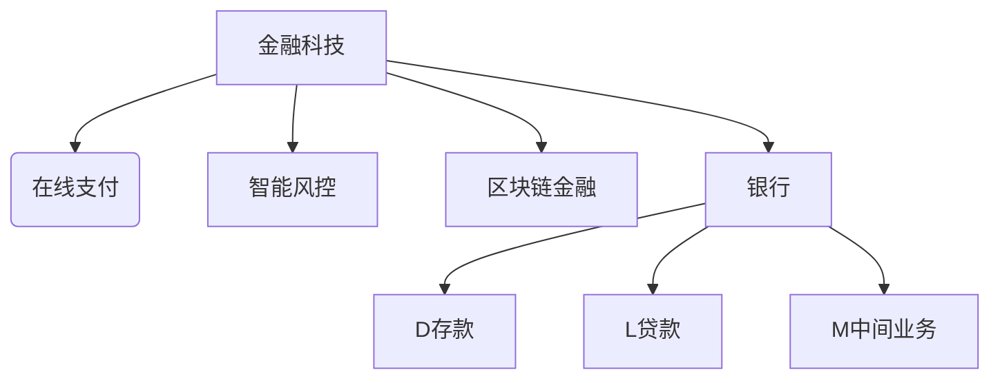
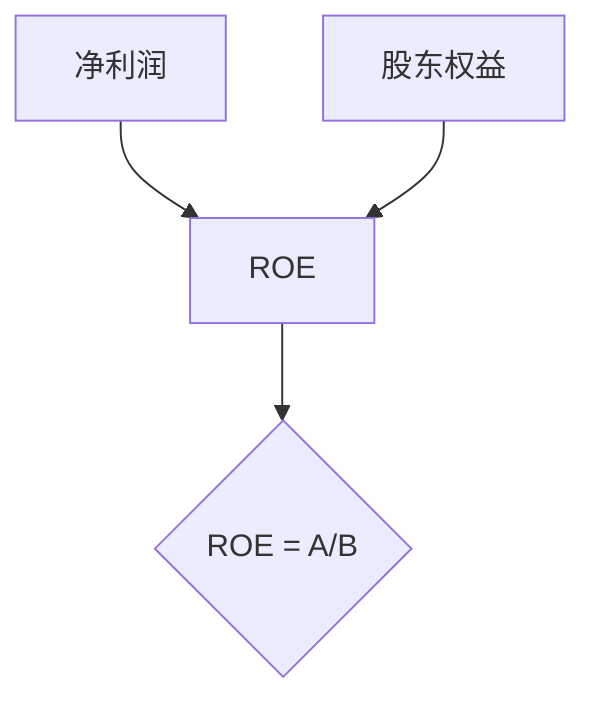

                 


```markdown
# 巴菲特的银行业投资逻辑：金融科技挑战下的重新评估

## 关键词：
- 巴菲特
- 银行业投资
- 金融科技
- 金融科技创新
- 银行数字化转型
- 价值投资逻辑
- 银行投资分析

## 摘要：
本文深入分析了巴菲特在银行业投资的核心逻辑，探讨了金融科技对银行业传统模式的挑战，并结合实际案例，重新评估了这些投资在数字化转型背景下的价值。文章从背景介绍、核心概念、算法原理、系统架构设计、项目实战等多个维度展开，结合技术与金融的双重视角，为投资者提供了深度的分析和见解。

---

## 第1章：背景介绍

### 1.1 巴菲特的价值投资理念
- 1.1.1 价值投资的核心思想：寻找被市场低估的企业，长期持有，追求安全边际。
- 1.1.2 巴菲特的投资策略：注重企业的基本面，关注ROE、ROA等财务指标。
- 1.1.3 银行业在巴菲特投资组合中的地位：作为稳健投资的重要组成部分。

### 1.2 金融科技对银行业的冲击
- 1.2.1 金融科技的定义：利用技术手段（如大数据、人工智能、区块链等）改进金融服务的模式和效率。
- 1.2.2 金融科技对银行的传统业务的影响：支付、借贷、投资咨询等领域的数字化转型。
- 1.2.3 数字化转型的压力：银行如何适应科技带来的变化，保持竞争力。

---

## 第2章：核心概念与联系

### 2.1 金融科技与银行的传统业务模式
- 2.1.1 传统银行的核心业务模式：存款、贷款、中间业务。
- 2.1.2 金融科技带来的创新：在线支付、智能风控、区块链金融等。
- 2.1.3 金融科技与银行的关系：互补与竞争并存。

#### 图2-1：金融科技与银行传统业务模式的关系图


### 2.2 银行的核心竞争力分析
- 2.2.1 资金成本：银行的融资能力直接影响其盈利能力。
- 2.2.2 风险管理：银行的风控能力是其稳健运营的关键。
- 2.2.3 客户粘性：通过金融科技提升客户体验，增强客户粘性。

---

## 第3章：算法原理

### 3.1 巴菲特银行业投资的数学模型
- 3.1.1 净息差（NIM）计算公式：
  $$ NIM = (贷款平均利率 - 存款平均利率) \times 贷款平均余额 $$
- 3.1.2 股东权益回报率（ROE）计算公式：
  $$ ROE = \frac{净利润}{股东权益} $$

#### 图3-1：ROE计算流程图


### 3.2 银行风险评估的算法实现
- 3.2.1 信用评分模型（如FICO评分）：
  ```python
  def credit_score(loan_amount, term, interest_rate, credit_history):
      # 简化版信用评分模型
      score = 0
      if credit_history['逾期记录'] > 30天:
          score += 20
      if loan_amount > 100万:
          score += 15
      return score
  ```
- 3.2.2 风险调整后的资本回报率（RAROC）：
  $$ RAROC = \frac{净利润 - 风险调整成本}{资本使用} $$

---

## 第4章：系统架构设计

### 4.1 银行数字化转型的系统架构
- 4.1.1 业务功能模块：
  ```mermaid
  graph TD
      User --> API Gateway
      API Gateway --> Auth Server
      Auth Server --> DB
      DB --> Loan Service
      Loan Service --> Risk Engine
      Risk Engine --> Decision
  ```

### 4.2 金融科技驱动的银行系统架构
- 4.2.1 核心系统模块：支付系统、风控系统、客户管理系统。
- 4.2.2 技术架构选型：分布式系统、云计算、大数据平台。
- 4.2.3 系统交互流程：
  ```mermaid
  graph TD
      User --> Web App
      Web App --> API Gateway
      API Gateway --> Loan Service
      Loan Service --> Risk Engine
      Risk Engine --> User
  ```

---

## 第5章：项目实战

### 5.1 美国银行的投资分析
- 5.1.1 投资背景：美国银行的规模和稳定性。
- 5.1.2 投资决策：基于ROE和净息差的计算。
- 5.1.3 投资结果：长期收益与短期波动的平衡。

### 5.2 高盛集团的数字化转型
- 5.2.1 高盛的技术投入：人工智能在金融分析中的应用。
- 5.2.2 投资价值评估：技术驱动的金融服务模式。
- 5.2.3 案例分析：高盛的投资回报与金融科技的贡献。

---

## 第6章：总结与展望

### 6.1 投资关键点
- 6.1.1 关注ROE和净息差的变化。
- 6.1.2 评估银行的数字化转型能力。
- 6.1.3 考虑金融科技企业的潜在机会。

### 6.2 未来展望
- 6.2.1 银行与金融科技企业的协同发展。
- 6.2.2 新兴技术（如AI、区块链）对银行业的进一步影响。
- 6.2.3 投资者如何在数字化转型中抓住机会。

---

## 附录：最佳实践 tips

- 投资银行需关注其ROE和净息差的变化。
- 数字化转型是银行应对金融科技挑战的关键。
- 金融科技企业同样具有投资价值，但需谨慎评估其技术壁垒和市场前景。

---

## 参考文献
- 巴菲特股东大会记录
- 《巴菲特投资思想》
- 《金融科技与银行业》
- 相关学术论文和行业报告
```

