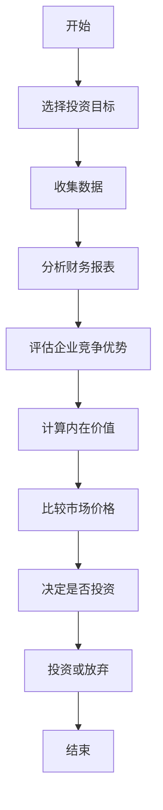

                 


# 巴菲特的集中投资理念：下重注于最佳机会

## 关键词：
- 巴菲特投资理念
- 集中投资
- 投资策略
- 股票分析
- 投资决策

## 摘要：
本文深入探讨了巴菲特的集中投资理念，分析了其核心概念、决策框架和成功案例。通过系统化的方法，本文详细讲解了如何识别优质投资机会、构建投资组合以及管理风险。文章还提供了实际的数学模型和算法流程图，帮助读者更好地理解和应用这一投资策略。

---

# 目录大纲：

1. [背景介绍](#背景介绍)
2. [集中投资的核心概念与联系](#集中投资的核心概念与联系)
3. [集中投资的决策框架](#集中投资的决策框架)
4. [成功案例分析](#成功案例分析)
5. [系统化投资方法](#系统化投资方法)
6. [集中投资的数学模型与算法](#集中投资的数学模型与算法)
7. [项目实战：构建集中投资组合](#项目实战：构建集中投资组合)
8. [最佳实践与注意事项](#最佳实践与注意事项)

---

## 1. 背景介绍

### 1.1 巴菲特投资理念的背景
- 巴菲特的投资哲学：价值投资的核心理念
- 集中投资的起源：从分散到集中的转变
- 当前投资环境的变化：信息透明化与市场波动加剧

### 1.2 集中投资的定义与边界
- 集中投资的定义：将大部分资金投入少数优质企业
- 投资的边界：如何避免过度集中带来的风险
- 集中与分散的对比：在不同市场环境下的适用性

---

## 2. 集中投资的核心概念与联系

### 2.1 核心概念解析
- 企业竞争优势：企业的护城河分析
- 财务健康状况：盈利能力、负债结构与现金流
- 长期持有策略：复利效应与时间的价值

### 2.2 核心概念的联系
- 企业竞争优势与财务健康的关联
- 长期持有与投资时机的平衡
- 集中投资与分散投资的权衡

---

## 3. 集中投资的决策框架

### 3.1 投资机会的识别
- 行业分析：选择朝阳行业的步骤
- 企业基本面分析：如何识别财务健康的企业
- 管理层评估：企业家品格与能力的重要性

### 3.2 投资组合的构建策略
- 资产配置原则：集中与分散的平衡
- 风险管理：如何设置止损点与止盈点
- 动态调整：市场变化中的投资组合优化

---

## 4. 成功案例分析

### 4.1 巴菲特的经典投资案例
- 可口可乐：品牌价值与持续盈利能力的分析
- 苹果公司：创新能力和市场领导地位的评估
- 巴菲特的教训：投资失误的反思与总结

---

## 5. 系统化投资方法

### 5.1 投资系统的构建
- 数据驱动决策：如何利用大数据进行投资分析
- 技术分析工具：K线图、均线与成交量分析
- 系统化交易策略：自动化投资决策的可行性

---

## 6. 集中投资的数学模型与算法

### 6.1 数学模型的建立
- 价值评估公式：$$\text{内在价值} = \sum_{t=1}^{\infty} \frac{\text{现金流}}{(1+r)^t}$$
- 风险评估模型：夏普比率与波动率分析
- 投资组合优化：均值-方差优化模型

### 6.2 算法流程图


### 6.3 Python代码实现
```python
import pandas as pd
import numpy as np

def calculate_intrinsic_value(FCF, discount_rate):
    # 永续年金公式
    return FCF / (discount_rate - (1 - 1/(1+discount_rate)))

# 示例数据
FCF = 100
discount_rate = 0.1
intrinsic_value = calculate_intrinsic_value(FCF, discount_rate)
print(f"内在价值：{intrinsic_value}")
```

---

## 7. 项目实战：构建集中投资组合

### 7.1 环境安装
- 数据来源：Yahoo Finance API 或 Excel 数据
- 工具安装：Python、Pandas、Matplotlib

### 7.2 核心代码实现
```python
import yfinance as yf
import pandas as pd

# 下载数据
msft = yf.download('MSFT', start='2020-01-01', end='2023-12-31')
print(msft.head())
```

### 7.3 实战分析
- 数据清洗与预处理
- 价值评估与排序
- 投资组合构建与优化

---

## 8. 最佳实践与注意事项

### 8.1 投资策略的注意事项
- 风险管理：如何避免过度集中
- 市场波动：应对市场下跌的策略
- 企业动态：持续跟踪企业的变化

### 8.2 小结与拓展
- 集中投资的优势与局限
- 终身学习：保持对投资知识的更新
- 持续改进：优化投资策略的建议

---

通过以上分析，我们可以看到，巴菲特的集中投资理念不仅是一种投资策略，更是一种需要深入理解和实践的方法。通过系统化的分析和实际案例的剖析，投资者可以更好地掌握这一策略，并在实际操作中取得成功。

