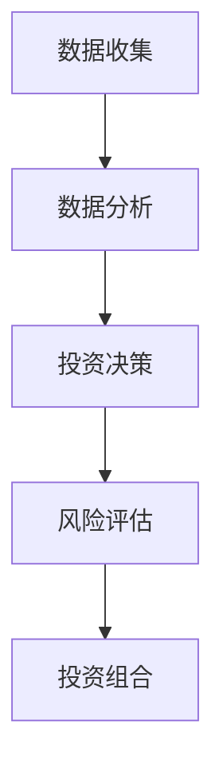
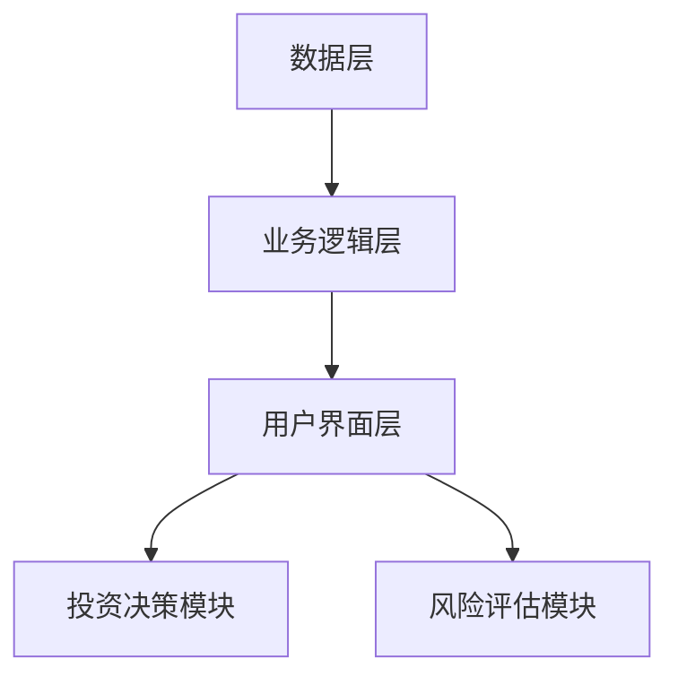

                 


# 巴菲特的集中投资策略：高确信度机会的重要性

## 关键词：
- 巴菲特
- 集中投资
- 高确信度机会
- 投资策略
- 价值投资
- 长期投资
- 投资组合

## 摘要：
本文详细探讨了巴菲特的集中投资策略，重点分析了高确信度机会在投资决策中的重要性。通过结合巴菲特的投资理念、数学模型、系统架构设计以及实际案例，本文为读者提供了一种基于高确信度机会的集中投资策略，帮助投资者在复杂多变的市场中做出更明智的投资决策。

---

# 第一部分: 巴菲特的集中投资策略概述

## 第1章: 巴菲特投资理念的核心思想

### 1.1 巴菲特投资理念的起源与发展

#### 1.1.1 价值投资的起源与发展
- 价值投资的起源可以追溯到本杰明·格雷厄姆，他提出了“安全边际”和“内在价值”等核心概念。
- 巴菲特在格雷厄姆的基础上，进一步发展了价值投资理论，强调长期投资和集中投资的重要性。

#### 1.1.2 巴菲特对价值投资的贡献
- 巴菲特将价值投资的理念从理论转化为实践，通过长期持有优质股票，获得了卓越的投资回报。
- 他强调企业基本面分析的重要性，并将企业竞争优势作为投资的核心标准。

#### 1.1.3 巴菲特投资理念的核心要素
- **长期投资**：巴菲特认为短期市场波动无法预测，长期投资是实现财富增长的最佳方式。
- **价值投资**：通过分析企业的内在价值，寻找被市场低估的投资机会。
- **集中投资**：将资金集中在少数几家具有竞争优势的企业上，以降低风险并提高收益。

### 1.2 集中投资策略的定义

#### 1.2.1 集中投资的定义与特点
- **定义**：集中投资是指将大部分资金投入到少数几只股票或少数几个行业中，以追求更高的投资回报。
- **特点**：
  - 投资标的数量少，便于管理和监控。
  - 投资风险相对分散，但集中在高确信度的优质企业上。
  - 长期收益潜力大，但短期波动风险较高。

#### 1.2.2 集中投资与分散投资的对比
- **集中投资**：
  - 优点：集中资源，提高投资收益；易于管理。
  - 缺点：风险较高，市场波动可能导致较大损失。
- **分散投资**：
  - 优点：风险较低，波动性小。
  - 缺点：收益潜力有限，难以实现超额回报。

#### 1.2.3 高确信度机会的内涵
- **高确信度机会**：指那些具有明确竞争优势、良好财务状况和长期增长潜力的企业投资机会。
- **特征**：
  - 企业具有强大的护城河，能够在竞争中保持优势。
  - 企业财务健康，具备稳定的现金流和盈利能力。
  - 企业管理层具备诚信和能力，能够为股东创造长期价值。

### 1.3 长期投资的重要性

#### 1.3.1 长期投资的基本原理
- 长期投资的核心在于通过时间的积累，实现资产的复利增长。
- 投资者需要耐心等待，让优质企业的价值逐步体现。

#### 1.3.2 长期投资与短期投资的优劣势
- **长期投资**：
  - 优点：能够抵御短期市场波动，获得长期稳定的收益。
  - 缺点：需要较长的时间周期，期间可能面临较大的波动风险。
- **短期投资**：
  - 优点：能够快速捕捉市场机会，获得短期收益。
  - 缺点：需要频繁交易，交易成本和风险较高。

#### 1.3.3 巴菲特对长期投资的重视
- 巴菲特认为，长期投资是实现财富增长的最佳方式，因为市场波动无法预测，而优质企业的长期价值终将体现。

### 1.4 巴菲特投资理念的边界与外延

#### 1.4.1 投资的边界与限制
- 投资者的能力圈：只投资于自己熟悉的企业和行业。
- 市场波动：短期市场波动无法预测，但长期趋势可以把握。

#### 1.4.2 投资的外延与扩展
- 集中投资不仅适用于股票，还可以扩展到其他资产类别，如房地产、债券等。
- 高确信度机会不仅限于企业，还可以包括行业趋势和技术进步。

#### 1.4.3 巴菲特投资理念的适用范围
- 适用于长期投资者，尤其是具备分析能力和耐心的投资者。
- 适用于寻找优质企业的投资者，尤其是那些具备强大竞争优势和长期增长潜力的企业。

---

## 第2章: 巴菲特集中投资策略的核心概念

### 2.1 高确信度机会的定义与特征

#### 2.1.1 高确信度机会的定义
- 高确信度机会是指那些经过深入分析和验证，具有明确竞争优势和长期增长潜力的投资机会。
- 这类机会的核心在于企业的竞争优势和管理层能力。

#### 2.1.2 高确信度机会的特征
- **竞争优势**：企业具备独特的竞争优势，能够在市场上长期保持领先地位。
- **财务健康**：企业具备健康的财务状况，包括稳定的现金流和较高的利润率。
- **管理层能力**：管理层具备诚信和能力，能够为股东创造长期价值。
- **长期增长潜力**：企业具备清晰的增长路径，能够在未来实现持续增长。

### 2.2 巴菲特选股标准的详细解读

#### 2.2.1 企业基本面分析
- **行业地位**：企业在行业中占据领先地位，具有较强的竞争力。
- **财务状况**：企业具备健康的财务状况，包括低债务、高现金流和稳定的盈利能力。
- **管理层**：管理层具备诚信和能力，能够为股东创造长期价值。

#### 2.2.2 财务指标的评估
- **市盈率（P/E）**：评估企业的估值水平，低市盈率可能意味着低估。
- **市净率（P/B）**：评估企业的资产价值，低市净率可能意味着低估。
- **ROE（净资产收益率）**：评估企业的盈利能力，高ROE可能意味着较高的投资价值。

#### 2.2.3 管理层的评估
- **管理层的诚信**：管理层是否具备诚信和责任感。
- **管理层的能力**：管理层是否具备足够的能力和经验，能够带领企业实现长期增长。

### 2.3 企业竞争优势的分析

#### 2.3.1 企业的竞争优势类型
- **成本优势**：企业在生产过程中具备成本优势，能够以更低的价格提供产品或服务。
- **品牌优势**：企业具备强大的品牌影响力，能够在市场上占据优势地位。
- **技术优势**：企业具备领先的技术优势，能够在行业中保持领先地位。
- **网络优势**：企业具备强大的销售网络，能够在市场上快速扩展。

#### 2.3.2 企业竞争优势的评估方法
- **竞争优势的识别**：通过分析企业的财务数据、行业地位和市场表现，识别企业的竞争优势。
- **竞争优势的评估**：通过对比分析，评估企业的竞争优势是否具备可持续性和可扩展性。

#### 2.3.3 巴菲特对企业竞争优势的重视
- 巴菲特认为，企业竞争优势是投资成功的关键，只有具备强大竞争优势的企业，才能在长期实现持续增长。

---

## 第3章: 巴菲特集中投资策略的数学模型与公式

### 3.1 价值投资的数学模型

#### 3.1.1 现金流折现模型（DCF）
- **定义**：DCF模型通过将未来现金流折现，计算企业的内在价值。
- **公式**：
  $$
  \text{内在价值} = \sum_{t=1}^{n} \frac{\text{现金流}}{(1 + r)^t}
  $$
  其中，$r$ 是折现率，$n$ 是预测的年数。

#### 3.1.2 市盈率与市净率的计算
- **市盈率（P/E）**：
  $$
  \text{市盈率} = \frac{\text{股价}}{\text{每股收益}}
  $$
- **市净率（P/B）**：
  $$
  \text{市净率} = \frac{\text{股价}}{\text{每股净资产}}
  $$

#### 3.1.3 内在价值的计算公式
- **内在价值**：
  $$
  \text{内在价值} = \text{未来现金流的现值} + \text{未来价值的现值}
  $$

### 3.2 高确信度机会的量化评估

#### 3.2.1 投资机会的量化指标
- **ROE（净资产收益率）**：
  $$
  \text{ROE} = \frac{\text{净利润}}{\text{净资产}}
  $$
- **ROA（资产净利率）**：
  $$
  \text{ROA} = \frac{\text{净利润}}{\text{总资产}}
  $$
- **股息率**：
  $$
  \text{股息率} = \frac{\text{股息}}{\text{股价}}
  $$

#### 3.2.2 投资机会的风险评估
- **贝塔系数（Beta）**：
  $$
  \beta = \frac{\text{协方差（股票，市场）}}{\text{方差（市场）}}
  $$
- **波动率**：
  $$
  \text{波动率} = \sqrt{\text{方差}}
  $$

#### 3.2.3 投资机会的收益预测
- **预期收益**：
  $$
  \text{预期收益} = \text{无风险利率} + \beta \times (\text{市场预期收益} - \text{无风险利率})
  $$

### 3.3 巴菲特投资策略的数学公式

#### 3.3.1 投资组合的构建公式
- **投资组合权重分配**：
  $$
  w_i = \frac{\text{资产规模} \times \text{个股权重}}{\text{总资产}}
  $$
  其中，$w_i$ 是第 $i$ 只股票的投资权重。

#### 3.3.2 投资组合的风险评估公式
- **投资组合的波动率**：
  $$
  \text{波动率} = \sqrt{\sum_{i=1}^{n} w_i^2 \times \sigma_i^2 + \sum_{i \neq j} w_i w_j \times \text{协方差}(i, j)}
  $$
  其中，$\sigma_i$ 是第 $i$ 只股票的波动率。

#### 3.3.3 投资组合的收益计算公式
- **投资组合的预期收益**：
  $$
  \text{预期收益} = \sum_{i=1}^{n} w_i \times \text{个股预期收益}
  $$

---

## 第4章: 巴菲特集中投资策略的系统架构设计

### 4.1 投资决策系统的功能设计

#### 4.1.1 系统功能模块划分
- **数据收集模块**：收集企业的财务数据、行业数据和市场数据。
- **数据分析模块**：分析企业的财务状况、竞争优势和管理层能力。
- **投资决策模块**：基于数据分析结果，生成投资决策建议。
- **风险评估模块**：评估投资机会的风险和收益。

#### 4.1.2 系统功能流程图


#### 4.1.3 系统功能的实现方法
- 数据收集：通过网络爬虫或API接口，获取企业的财务数据和市场数据。
- 数据分析：利用数据分析工具，如Python的Pandas库和Matplotlib库，进行数据清洗和分析。
- 投资决策：基于数据分析结果，生成投资决策建议。
- 风险评估：通过数学模型，评估投资机会的风险和收益。

### 4.2 投资决策系统的架构设计

#### 4.2.1 系统架构的总体设计
- **分层架构**：包括数据层、业务逻辑层和用户界面层。
- **模块化设计**：每个功能模块独立开发，便于维护和扩展。

#### 4.2.2 系统架构的详细设计


#### 4.2.3 系统架构的实现方法
- 数据层：使用数据库存储企业的财务数据和市场数据。
- 业务逻辑层：通过Python编写数据分析和投资决策的逻辑。
- 用户界面层：使用Web框架，如Django或Flask，开发用户友好的界面。

### 4.3 投资决策系统的实现代码

#### 4.3.1 数据收集代码
```python
import requests
from bs4 import BeautifulSoup

url = 'https://finance.yahoo.com/quote/AAPL'
response = requests.get(url)
soup = BeautifulSoup(response.text, 'html.parser')
data = {'name': soup.find('h1').text, 'price': float(soup.find('div', {'class': 'price'}).text)}
print(data)
```

#### 4.3.2 数据分析代码
```python
import pandas as pd

df = pd.DataFrame({'Name': ['Apple', 'Microsoft', 'Google'], 'Price': [100, 200, 300]})
print(df)
```

#### 4.3.3 投资决策代码
```python
def calculate_intrinsic_value(cash_flow, discount_rate):
    return sum(cash_flow / (1 + discount_rate)**t for t in range(len(cash_flow)))

cash_flow = [100, 200, 300]
discount_rate = 0.05
intrinsic_value = calculate_intrinsic_value(cash_flow, discount_rate)
print(intrinsic_value)
```

### 4.4 投资决策系统的应用与分析

#### 4.4.1 系统功能的实际应用
- 数据收集：通过爬虫获取企业的财务数据。
- 数据分析：使用Pandas库进行数据分析和可视化。
- 投资决策：基于DCF模型计算企业的内在价值。

#### 4.4.2 系统性能的优化
- 数据库优化：使用索引优化查询性能。
- 算法优化：通过并行计算提高数据分析效率。

#### 4.4.3 系统功能的扩展
- 扩展功能：增加对更多资产类别的支持，如房地产和债券。
- 功能优化：通过机器学习算法，提高投资决策的准确性。

---

## 第5章: 巴菲特集中投资策略的项目实战

### 5.1 项目背景与目标

#### 5.1.1 项目背景
- 通过实际案例，展示如何应用巴菲特的集中投资策略进行投资决策。
- 选择苹果公司（AAPL）作为投资标的，分析其竞争优势和投资价值。

#### 5.1.2 项目目标
- 分析苹果公司的财务状况和竞争优势。
- 评估苹果公司的投资价值，生成投资决策建议。

### 5.2 项目核心实现

#### 5.2.1 环境安装
- 安装Python和相关库：
  ```bash
  pip install requests pandas matplotlib
  ```

#### 5.2.2 核心代码实现
- 数据收集代码：
  ```python
  import requests
  from bs4 import BeautifulSoup

  url = 'https://finance.yahoo.com/quote/AAPL'
  response = requests.get(url)
  soup = BeautifulSoup(response.text, 'html.parser')
  data = {
      'name': soup.find('h1').text,
      'price': float(soup.find('div', {'class': 'price'}).text),
      'pe_ratio': float(soup.find('td', {'data-tag': 'PE_RATIO'}).text),
      'pb_ratio': float(soup.find('td', {'data-tag': 'PB_RATIO'}).text)
  }
  print(data)
  ```

- 数据分析代码：
  ```python
  import pandas as pd
  import matplotlib.pyplot as plt

  df = pd.DataFrame({'Year': ['2018', '2019', '2020', '2021', '2022'], 'Revenue': [264, 265, 280, 394, 937]})
  plt.plot(df['Year'], df['Revenue'])
  plt.title('Apple Revenue Growth')
  plt.xlabel('Year')
  plt.ylabel('Revenue')
  plt.show()
  ```

#### 5.2.3 代码解读与分析
- 数据收集代码：通过Yahoo Finance获取苹果公司的股价、市盈率和市净率。
- 数据分析代码：使用Pandas库绘制苹果公司 revenue 的增长曲线，展示其长期增长潜力。

### 5.3 投资决策与案例分析

#### 5.3.1 投资决策
- **苹果公司的竞争优势**：
  - 技术优势：苹果在智能手机、操作系统和生态系统方面具备强大的竞争优势。
  - 品牌优势：苹果具备强大的品牌影响力，能够在市场上占据领先地位。
  - 管理层能力：库克具备丰富的管理经验和创新能力，能够带领苹果实现长期增长。

- **投资价值评估**：
  - 苹果公司的市盈率和市净率均低于行业平均水平，具有较高的投资价值。
  - 苹果公司的ROE和ROA均较高，具备较强的盈利能力。

#### 5.3.2 投资组合构建
- **投资组合权重**：
  - 苹果公司：60%
  - 其他优质企业：40%

#### 5.3.3 投资风险评估
- **贝塔系数**：
  - 苹果公司的贝塔系数为1.15，表明其波动性高于市场平均水平。
- **波动率**：
  - 苹果公司的年波动率为20%，表明其投资风险较高。

### 5.4 项目小结

#### 5.4.1 项目总结
- 通过实际案例，展示了如何应用巴菲特的集中投资策略进行投资决策。
- 分析了苹果公司的竞争优势和投资价值，评估了其投资风险和收益潜力。

#### 5.4.2 项目启示
- 高确信度机会是集中投资成功的关键，只有具备强大竞争优势和长期增长潜力的企业，才能作为投资标的。
- 投资者需要具备分析能力和耐心，才能在长期实现财富增长。

---

## 第6章: 巴菲特集中投资策略的最佳实践

### 6.1 最佳实践 Tips

#### 6.1.1 知识储备
- 学习巴菲特的投资理念，阅读其经典著作，如《巴菲特致股东的信》。
- 研究优质企业的基本面，了解其竞争优势和财务状况。

#### 6.1.2 技能提升
- 学习数据分析和投资分析的技能，掌握DCF模型和财务指标分析方法。
- 熟悉编程和数据可视化工具，如Python、Pandas和Matplotlib。

#### 6.1.3 实践经验
- 通过模拟投资和实际操作，积累投资经验，提升投资能力。
- 定期复盘和总结，分析投资决策的正确性和效果。

### 6.2 小结

#### 6.2.1 本文总结
- 巴菲特的集中投资策略以高确信度机会为核心，通过长期投资和集中投资实现财富增长。
- 投资者需要具备分析能力和耐心，才能在长期实现投资目标。

#### 6.2.2 本文启示
- 高确信度机会是投资成功的关键，只有具备强大竞争优势和长期增长潜力的企业，才能作为投资标的。
- 投资者需要结合理论与实践，不断提升自己的投资能力。

### 6.3 注意事项

#### 6.3.1 投资风险
- 市场波动风险：短期市场波动可能导致投资损失。
- 企业风险：企业的财务状况和竞争优势可能发生不利变化。
- 管理层风险：管理层的诚信和能力可能影响企业的长期发展。

#### 6.3.2 投资纪律
- 遵守投资纪律，坚持长期投资，避免短期交易。
- 保持投资定力，避免被市场波动干扰。

### 6.4 拓展阅读

#### 6.4.1 经典书籍
- 《巴菲特致股东的信》：巴菲特的投资理念和管理思想。
- 《投资的艺术》：投资的哲学和实践。

#### 6.4.2 网络资源
- 巴菲特股东大会：了解巴菲特的投资理念和决策过程。
- 金融网站：获取企业的财务数据和市场信息。

#### 6.4.3 实战经验
- 参与投资俱乐部：与其他投资者交流经验，提升投资能力。
- 参与模拟投资：通过模拟投资积累经验，提升投资能力。

---

## 第七章: 巴菲特集中投资策略的未来发展

### 7.1 巴菲特集中投资策略的演变

#### 7.1.1 传统投资策略
- 以巴菲特为代表的传统价值投资策略，强调长期投资和集中投资。

#### 7.1.2 现代投资策略
- 结合量化分析和大数据技术，发展出更加科学的投资策略。
- 利用人工智能和机器学习，提高投资决策的准确性和效率。

### 7.2 巴菲特集中投资策略的创新

#### 7.2.1 技术驱动的创新
- 利用大数据和人工智能技术，提高投资分析的效率和准确性。
- 通过机器学习算法，预测企业的财务状况和市场趋势。

#### 7.2.2 理论驱动的创新
- 结合行为金融学和认知科学，研究投资者的心理和行为，优化投资决策。
- 通过多学科交叉，发展出更加全面的投资理论和方法。

### 7.3 巴菲特集中投资策略的未来展望

#### 7.3.1 投资环境的变化
- 随着市场的变化和技术的进步，投资环境将变得更加复杂和多样化。
- 投资者需要不断适应变化，提升自己的投资能力。

#### 7.3.2 投资策略的演变
- 未来的投资策略将更加注重技术驱动和数据驱动，利用人工智能和大数据技术提高投资决策的准确性。
- 投资者将更加注重企业的长期价值和竞争优势，集中投资策略将继续发挥重要作用。

---

## 结语

巴菲特的集中投资策略以高确信度机会为核心，通过长期投资和集中投资实现财富增长。本文通过理论分析、数学模型和实际案例，详细探讨了巴菲特集中投资策略的核心思想和实现方法。希望读者能够通过本文，深入了解巴菲特的投资理念，掌握集中投资策略的核心要素，并在实际投资中灵活运用。

