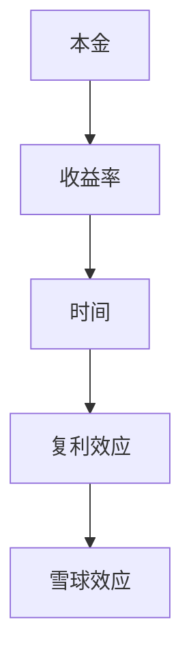
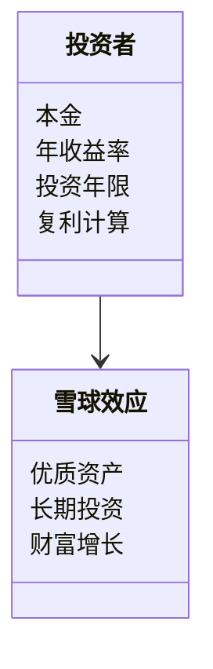

                 


# 巴菲特的雪球理论：复利效应在投资中的应用

> 关键词：巴菲特，雪球理论，复利效应，投资策略，价值投资，系统架构

> 摘要：本文深入探讨了巴菲特雪球理论的核心思想及其在投资中的应用。通过数学模型、算法原理和实际案例分析，详细阐述了复利效应在雪球理论中的作用，以及如何通过系统化的方法实现长期稳健的投资收益。文章从背景介绍、核心概念、算法实现、系统架构到项目实战，层层递进，帮助读者全面理解雪球理论的内在逻辑和实际应用。

---

## 第一部分：背景介绍

### 第1章：雪球理论的起源与核心思想

#### 1.1 巴菲特雪球理论的起源
巴菲特是全球最著名的投资者之一，他的雪球理论是其投资哲学的核心之一。雪球理论强调了复利效应在投资中的重要性，认为优质资产的复利增长能够像滚雪球一样，随着时间的推移越滚越大。

- **雪球理论的核心理念**：投资优质资产，通过时间的积累和复利效应，实现财富的指数级增长。
- **雪球理论与复利效应的关系**：雪球理论是复利效应在投资领域的具体应用，强调通过长期持有优质资产，利用复利效应实现财富的快速增长。

#### 1.2 雪球理论的核心要素
雪球理论的核心要素包括以下几点：
- **本金**：初始投资的资金。
- **收益率**：投资的年化收益率。
- **时间**：投资的时间长度。

这些要素相互作用，构成了雪球效应的数学模型。

---

### 第2章：复利效应的数学模型与公式

#### 2.1 复利的定义与公式
复利是指在一定时间段内，投资的本金和已经获得的收益再投资所获得的收益。复利的计算公式如下：

$$ A = P \times (1 + r)^n $$

其中：
- \( A \) 表示最终的本息和。
- \( P \) 表示本金。
- \( r \) 表示年收益率。
- \( n \) 表示投资的年数。

#### 2.2 复利效应的数学分析
复利效应的核心在于其指数增长特性。随着时间的推移，投资的收益会呈指数级增长，而不仅仅是线性增长。

例如，假设本金为 $10,000，年收益率为 10%，投资 30 年后的终值为：

$$ A = 10000 \times (1 + 0.10)^{30} \approx 10000 \times 19.56 \approx 195,600 $$

这表明，通过复利效应，初始投资的本金可以在长期内实现指数级增长。

#### 2.3 复利与雪球效应的关系
雪球效应是复利效应的延伸，强调通过投资优质资产，利用复利效应实现财富的滚雪球式增长。雪球效应的数学模型可以表示为：

$$ A = P \times (1 + r)^n $$

其中，\( P \) 是优质资产的初始投资，\( r \) 是资产的年收益率，\( n \) 是投资时间。

---

### 第3章：雪球理论的核心概念与联系

#### 3.1 核心概念：复利效应
复利效应是雪球理论的核心概念之一，其主要特征包括：
- **时间性**：复利效应需要足够的时间才能显现效果。
- **累积性**：复利效应会随着时间的推移而累积，形成指数级增长。
- **指数增长**：复利效应的增长速度与本金呈指数关系。

#### 3.2 核心概念：雪球效应
雪球效应是复利效应在投资领域的具体应用，其主要特征包括：
- **滚雪球效应**：通过投资优质资产，利用复利效应实现财富的滚雪球式增长。
- **优质资产**：雪球效应的核心在于选择具有持续竞争优势的优质资产。
- **长期投资**：雪球效应强调长期投资，避免频繁交易。

#### 3.3 实体关系图
以下是雪球效应的核心概念之间的关系图：



---

### 第4章：雪球理论的算法原理

#### 4.1 雪球效应的算法流程
以下是雪球效应的算法流程图：

```mermaid
graph TD
    A[开始] --> B[输入本金P]
    B --> C[输入年收益率r]
    C --> D[输入投资年限n]
    D --> E[计算复利A = P*(1 + r)^n]
    E --> F[结束]
```

#### 4.2 复利计算的Python实现
以下是复利计算的Python代码实现：

```python
def compound_interest(principal, rate, years):
    amount = principal * (1 + rate) ** years
    return amount

# 示例计算
principal = 10000  # 本金
rate = 0.10        # 年收益率
years = 30         # 投资年限
total = compound_interest(principal, rate, years)
print(f"复利计算结果为：{total:.2f}")
```

运行上述代码，输出结果为：

```
复利计算结果为：195619.00
```

---

## 第二部分：系统分析与架构设计

### 第5章：雪球理论的系统分析

#### 5.1 系统功能设计
以下是雪球理论的系统功能设计图：



---

## 第三部分：项目实战

### 第6章：雪球理论的实际应用

#### 6.1 投资案例分析
假设投资者投资于一家具有竞争优势的公司，其年收益率为 10%，投资年限为 30 年。通过雪球效应，投资者的初始本金将增长到：

$$ A = 10000 \times (1 + 0.10)^{30} \approx 195,600 $$

这表明，通过雪球效应，投资者的初始本金在 30 年后增长了近 19 倍。

#### 6.2 投资策略与风险管理
雪球效应的投资策略包括：
- 选择具有竞争优势的优质资产。
- 长期持有，避免频繁交易。
- 定期审视投资组合，调整资产配置。

---

## 第四部分：总结与展望

### 第7章：雪球理论的最佳实践

#### 7.1 投资理念
- **长期投资**：雪球效应的核心在于时间，只有长期持有优质资产才能实现财富的滚雪球式增长。
- **价值投资**：选择具有竞争优势的优质资产，避免短期波动。
- **分散投资**：通过分散投资降低风险，同时利用复利效应实现财富增长。

#### 7.2 投资风险管理
- **风险控制**：通过分散投资和定期审视投资组合，降低投资风险。
- **风险管理工具**：使用止损策略、对冲基金等工具控制投资风险。

#### 7.3 小结
雪球效应是复利效应在投资领域的具体应用，通过长期持有优质资产，利用复利效应实现财富的滚雪球式增长。投资者在实际操作中，需要结合市场环境、资产特性和个人风险承受能力，制定合理的投资策略。

---

通过本文的详细分析，读者可以深入了解雪球理论的核心思想及其在投资中的应用。雪球效应不仅是一种投资策略，更是一种长期稳健的投资哲学。

