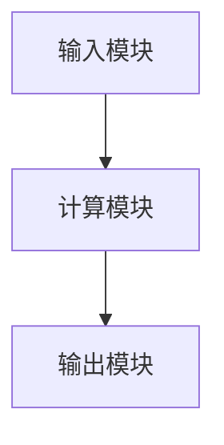

                 


# 巴菲特的雪球理论：复利效应在投资中的应用

> 关键词：巴菲特，雪球理论，复利效应，投资策略，风险管理，长期价值

> 摘要：本文深入探讨了巴菲特雪球理论的核心思想及其在投资中的应用。通过数学模型、算法实现和实际案例分析，揭示了复利效应在雪球理论中的关键作用，并结合系统架构设计和项目实战，总结了雪球理论在投资中的最佳实践和注意事项。

---

## 第一部分：巴菲特雪球理论的核心概念与背景

### 第1章：雪球理论的起源与核心思想

#### 1.1 巴菲特雪球理论的起源
巴菲特的雪球理论是其投资哲学的核心思想之一，起源于他对复利效应的深刻理解。雪球理论强调，优质资产的价值会随着时间的推移而滚雪球式增长，而这种增长的核心驱动力是复利效应。巴菲特认为，复利是“世界第八大奇迹”，能够将小额投资转化为巨额财富。

#### 1.2 雪球理论的核心理念
雪球理论的核心理念是通过选择具有竞争优势的企业进行长期投资，利用复利效应实现财富的指数级增长。巴菲特认为，投资的本质是寻找那些具有持续竞争优势、良好管理和合理估值的企业，并长期持有它们的股票，从而获得复利带来的收益。

#### 1.3 雪球理论与其他投资理论的区别
雪球理论与其他投资理论（如价值投资、成长投资）的区别在于其对复利效应的高度重视。雪球理论不仅关注企业的内在价值，还强调通过时间的积累，让价值不断增长，从而实现财富的雪球效应。

---

### 第2章：雪球理论的核心要素

#### 2.1 雪球理论的核心要素
雪球理论的核心要素包括以下几个方面：
- **本金**：初始投资金额，是雪球滚动的基础。
- **收益率**：投资的年化收益率，是雪球滚动的速度。
- **时间**：投资的时间长度，是雪球滚动的持续性。

#### 2.2 雪球理论的核心公式
雪球效应的数学表达式可以表示为：
$$ A = P \times (1 + r)^n $$
其中：
- \( A \) 是最终的财富值。
- \( P \) 是初始本金。
- \( r \) 是年化收益率。
- \( n \) 是投资的时间长度（年）。

#### 2.3 雪球效应的特征
雪球效应具有以下特征：
- **指数增长**：随着时间的推移，财富增长速度呈指数级。
- **时间敏感性**：投资时间越长，雪球效应越显著。
- **复利效应**：每期的收益再投资，形成滚雪球式增长。

---

## 第二部分：复利效应的数学模型与算法实现

### 第3章：复利效应的数学模型

#### 3.1 复利的定义与公式
复利是指在一定时间段内，将收益再投资，从而产生更多的收益。复利的公式可以表示为：
$$ A = P \times (1 + r)^n $$
其中：
- \( P \) 是初始本金。
- \( r \) 是年化收益率。
- \( n \) 是投资的时间长度（年）。

#### 3.2 复利与雪球效应的关系
雪球效应是复利效应的延伸。在雪球效应中，复利是推动财富增长的核心动力。通过长期持有优质资产，投资者可以利用复利效应，将初始本金转化为巨额财富。

#### 3.3 复利的几何级数增长
复利的几何级数增长可以用以下公式表示：
$$ A = P \times (1 + r)^n $$
这种增长方式意味着，随着时间的推移，财富增长的速度会越来越快。

---

### 第4章：雪球效应的算法实现

#### 4.1 雪球效应的算法流程
雪球效应的算法流程可以表示为：
1. 输入初始本金 \( P \)。
2. 输入年化收益率 \( r \)。
3. 输入投资时间长度 \( n \)。
4. 计算最终财富值 \( A = P \times (1 + r)^n \)。
5. 输出结果。

#### 4.2 雪球效应的Python实现
以下是一个简单的Python代码示例，用于计算雪球效应下的最终财富值：

```python
def compound_interest(principal, rate, years):
    amount = principal * (1 + rate) ** years
    return amount

# 示例计算
P = 10000  # 初始本金
r = 0.07    # 年化收益率
n = 30      # 投资时间（年）

result = compound_interest(P, r, n)
print(f"最终财富值为：{result:.2f}")
```

#### 4.3 雪球效应的边界条件
雪球效应的边界条件包括：
- 初始本金为0或负数（无效输入）。
- 收益率为负数（亏损情况）。
- 投资时间为0或负数（无效输入）。

---

## 第三部分：雪球效应在投资中的系统架构与应用

### 第5章：雪球效应的系统架构设计

#### 5.1 系统功能设计
雪球效应的系统功能设计包括以下几个方面：
- **输入模块**：用户输入初始本金、年化收益率和投资时间。
- **计算模块**：根据输入的参数，计算最终财富值。
- **输出模块**：显示最终财富值。

#### 5.2 系统架构图
以下是一个简单的系统架构图：



#### 5.3 系统接口设计
系统接口设计包括以下几个方面：
- **输入接口**：用户输入初始本金、年化收益率和投资时间。
- **输出接口**：显示最终财富值。

---

### 第6章：雪球效应的项目实战

#### 6.1 环境安装
为了运行雪球效应的Python代码，需要安装以下环境：
- Python 3.x
- 基本的Python开发工具（如PyCharm或VS Code）

#### 6.2 核心实现源代码
以下是一个完整的Python代码示例：

```python
def compound_interest(principal, rate, years):
    if principal <= 0:
        raise ValueError("本金不能为零或负数")
    if rate < 0:
        raise ValueError("收益率不能为负数")
    if years <= 0:
        raise ValueError("投资时间不能为零或负数")
    amount = principal * (1 + rate) ** years
    return amount

# 用户输入
P = float(input("请输入初始本金（元）："))
r = float(input("请输入年化收益率（如0.07）："))
n = int(input("请输入投资时间（年）："))

try:
    result = compound_interest(P, r, n)
    print(f"最终财富值为：{result:.2f} 元")
except ValueError as e:
    print(e)
```

#### 6.3 代码应用解读
上述代码通过用户输入初始本金、年化收益率和投资时间，计算并输出最终财富值。代码中还包含了输入参数的合法性检查，确保输入的合理性。

---

## 第四部分：雪球效应的最佳实践与注意事项

### 第7章：雪球效应的最佳实践

#### 7.1 长期投资的重要性
雪球效应的核心在于时间的积累。长期投资能够显著放大复利效应，从而实现财富的滚雪球式增长。

#### 7.2 风险管理的注意事项
在实际投资中，风险管理是雪球效应成功的关键。投资者需要选择具有稳定收益和低风险的优质资产，避免因短期波动影响长期收益。

#### 7.3 持续学习与调整
雪球效应的实现需要投资者具备持续学习和调整的能力。市场环境不断变化，投资者需要根据市场变化调整投资策略，以确保雪球效应的持续性。

---

### 第8章：雪球效应的总结与展望

#### 8.1 小结
雪球效应是复利效应在投资中的具体应用，通过长期持有优质资产，投资者可以实现财富的指数级增长。雪球效应的核心在于时间、本金和收益率的合理搭配。

#### 8.2 注意事项
- 投资者需要选择具有持续竞争优势的企业。
- 风险管理是雪球效应成功的关键。
- 长期投资需要耐心和坚持。

#### 8.3 拓展阅读
- 巴菲特的其他投资理论。
- 复利效应在其他领域的应用。

---

## 结语

巴菲特的雪球理论通过复利效应揭示了财富增长的奥秘。通过本文的详细解读，读者可以深入了解雪球效应的数学模型、算法实现和实际应用，并能够在投资实践中灵活运用这些理论。记住，雪球效应的成功需要时间、耐心和正确的选择，只有长期坚持优质投资，才能让财富实现滚雪球式增长。

---

**参考文献**：
1. 巴菲特的雪球理论相关书籍。
2. 《富爸爸穷爸爸》罗伯特·清崎。
3. 《证券分析》本杰明·格雷厄姆。

---

**附录**：雪球效应的Python代码示例

