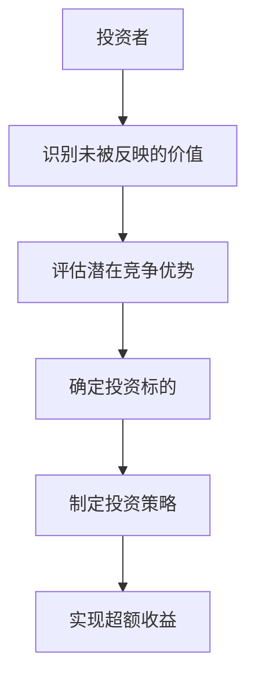
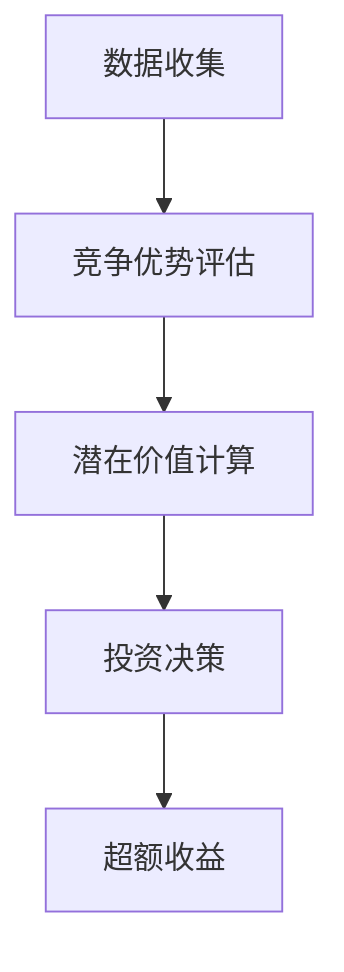
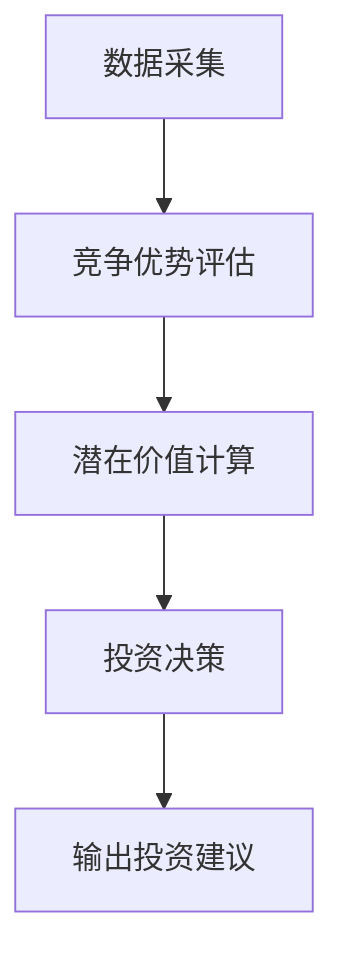
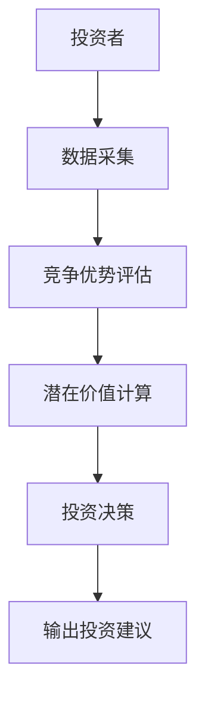

                 


# 布鲁斯·格林沃尔德的隐藏价值投资法

> 关键词：隐藏价值投资法，布鲁斯·格林沃尔德，投资策略，价值发现，低效市场理论

> 摘要：本文系统地介绍布鲁斯·格林沃尔德提出的隐藏价值投资法，深入分析其核心概念、理论基础、算法原理及实际应用。通过详细讲解隐藏价值的定义、特征及其与显性价值的区别，结合实例分析，探讨如何通过系统分析与架构设计将隐藏价值投资法应用于实际项目。最后，本文还将提供项目实战指导，帮助读者掌握隐藏价值投资法的核心技巧。

---

## 第一部分: 隐藏价值投资法的背景与核心概念

### 第1章: 隐藏价值投资法的定义与背景

#### 1.1 隐藏价值投资法的背景介绍

##### 1.1.1 投资市场的现状与问题

现代投资市场充斥着大量的信息和数据，投资者面临着信息过载和市场波动的双重挑战。传统价值投资方法往往依赖于公开市场数据，而这些数据往往已经被市场充分消化，难以发现真正的投资机会。此外，市场的高度竞争和信息透明化使得显性价值（即已经被市场充分认知和反映的价值）的挖掘难度越来越大。

##### 1.1.2 隐藏价值投资法的提出背景

在这样的背景下，隐藏价值投资法应运而生。该方法旨在通过挖掘那些尚未被市场充分认知的潜在价值，帮助投资者发现被低估的投资机会。布鲁斯·格林沃尔德提出的隐藏价值投资法基于低效市场理论，认为市场并非完全有效，存在大量未被充分挖掘的价值点。

##### 1.1.3 隐藏价值投资法的核心目标

隐藏价值投资法的核心目标是通过系统化的方法，识别那些具有潜在竞争优势、尚未被市场充分认知的企业或资产，从而实现超额收益。

---

#### 1.2 隐藏价值投资法的核心概念

##### 1.2.1 隐藏价值的定义

隐藏价值是指那些尚未被市场充分认知，但具有潜在竞争优势和增长潜力的价值。这些价值可能存在于企业的核心竞争力、未被市场充分反映的资产或业务模式中。

##### 1.2.2 隐藏价值的特征与属性

| 特征 | 描述 |
|------|------|
| 隐性竞争优势 | 企业具有未被市场充分认知的核心竞争力 |
| 低估值 | 资产或企业的市场估值低于其真实价值 |
| 高潜力 | 具备较高的增长潜力，未来可能释放更大的价值 |

##### 1.2.3 隐藏价值与其他投资策略的区别

| 投资策略 | 核心特点 | 与隐藏价值投资法的区别 |
|----------|----------|-----------------------|
| 价值投资 | 依赖于低市盈率、低市净率等显性估值指标 | 更关注显性价值，而非潜在的隐性价值 |
| 成长投资 | 侧重于企业的高增长率 | 忽略了潜在竞争优势带来的隐性价值 |
| 技术分析 | 基于价格和成交量的技术指标 | 不关注基本面，与隐藏价值无直接关联 |

---

### 第2章: 布鲁斯·格林沃尔德的投资理念

#### 2.1 布鲁斯·格林沃尔德的生平与成就

##### 2.1.1 布鲁斯·格林沃尔德的学术背景

布鲁斯·格林沃尔德是一位著名投资专家，他的研究成果主要集中在价值发现和低效市场理论领域。

##### 2.1.2 他在投资领域的贡献

格林沃尔德提出的隐藏价值投资法为投资者提供了全新的视角，帮助他们在复杂的市场环境中发现被低估的投资机会。

##### 2.1.3 他的核心投资理念

格林沃尔德的核心投资理念是：市场的低效性和信息不对称性为投资者提供了发现隐藏价值的机会。

---

#### 2.2 隐藏价值投资法的核心原则

##### 2.2.1 低效市场理论

低效市场理论认为，市场并非完全有效，存在大量未被充分挖掘的价值点。投资者可以通过深入分析企业的基本面，发现这些被市场忽视的机会。

##### 2.2.2 价值发现的三重维度

1. **资产价值**：评估企业的资产质量、负债情况等。
2. **竞争优势**：分析企业的核心竞争力。
3. **增长潜力**：评估企业的未来增长空间。

##### 2.2.3 竞争优势的评估体系

| 评估维度 | 具体指标 |
|----------|----------|
| 成本优势 | 比较成本、供应链效率 |
| 技术优势 | 技术研发能力、专利数量 |
| 市场优势 | 市场占有率、品牌影响力 |

---

### 第3章: 隐藏价值投资法的理论基础

#### 3.1 经济学基础

##### 3.1.1 市场效率理论

市场效率理论认为，市场价格反映了所有可获得的信息。然而，隐藏价值投资法认为市场并非完全有效，存在信息不对称和低效区域。

##### 3.1.2 信息不对称与市场失灵

信息不对称导致市场失灵，隐藏价值投资法通过深入分析企业基本面，挖掘那些未被市场充分反映的信息。

##### 3.1.3 价值发现的经济学模型

$$ V = \text{内在价值} + \text{未被反映的潜在价值} $$

---

#### 3.2 投资学基础

##### 3.2.1 资产定价理论

资产定价理论认为，资产价格由其风险和收益决定。隐藏价值投资法通过分析资产的潜在收益和风险，发现其未被反映的价值。

##### 3.2.2 风险与收益的平衡

$$ \text{收益} = \text{风险调整后的潜在收益} $$

##### 3.2.3 股票估值的基本方法

$$ \text{内在价值} = \text{现金流折现值} + \text{潜在价值} $$

---

#### 3.3 行为金融学视角

##### 3.3.1 投资者心理与市场偏差

投资者心理偏差（如过度自信、从众心理）导致市场定价偏差，为隐藏价值投资法提供了机会。

##### 3.3.2 行为金融学对隐藏价值投资法的启示

行为金融学研究表明，市场情绪和认知偏差为发现隐藏价值提供了可能性。

##### 3.3.3 市场情绪与价值发现的关系

$$ \text{市场情绪} \leftrightarrow \text{价值发现机会} $$

---

## 第4章: 隐藏价值的定义与特征

### 4.1 隐藏价值的定义

隐藏价值是指那些尚未被市场充分认知，但具有潜在竞争优势和增长潜力的价值。

### 4.2 隐藏价值的核心特征

##### 4.2.1 低估值特征

$$ \text{市场价格} < \text{内在价值} $$

##### 4.2.2 高潜力特征

$$ \text{潜在增长率} > \text{行业平均增长率} $$

##### 4.2.3 隐性竞争优势特征

$$ \text{竞争优势} \nsubseteq \text{市场认知范围} $$

### 4.3 隐藏价值与显性价值的对比

| 维度 | 隐藏价值 | 显性价值 |
|------|----------|----------|
| 估值 | 低于内在价值 | 等于或高于内在价值 |
| 竞争优势 | 未被市场认知 | 已被市场充分认知 |
| 风险 | 较高 | 较低 |
| 潜在收益 | 较高 | 较低 |

---

### 4.4 隐藏价值投资法的实体关系图

#### 4.4.1 实体关系图


#### 4.4.2 投资决策流程图



---

## 第5章: 隐藏价值投资法的算法原理

### 5.1 算法原理

隐藏价值投资法的核心是通过系统化的分析方法，识别那些具有隐性竞争优势的企业。以下是具体的算法步骤：

1. **数据收集**：收集目标企业的财务数据、市场数据和竞争优势信息。
2. **竞争优势评估**：评估企业的隐性竞争优势。
3. **潜在价值计算**：计算企业的潜在价值。
4. **投资决策**：基于潜在价值和竞争优势，制定投资策略。

---

### 5.2 算法流程图



---

### 5.3 数学模型

#### 5.3.1 潜在价值计算公式

$$ \text{潜在价值} = \text{内在价值} + \text{竞争优势价值} $$

#### 5.3.2 竞争优势评估公式

$$ \text{竞争优势指数} = \frac{\text{竞争优势价值}}{\text{行业平均竞争优势价值}} $$

---

## 第6章: 系统分析与架构设计

### 6.1 项目背景

本项目旨在通过系统化的方法，帮助投资者发现隐藏价值。我们将构建一个基于隐藏价值投资法的投资分析系统。

---

### 6.2 系统功能设计

#### 6.2.1 系统功能模块

1. **数据采集模块**：负责收集企业的财务数据和竞争优势信息。
2. **竞争优势评估模块**：评估企业的隐性竞争优势。
3. **潜在价值计算模块**：计算企业的潜在价值。
4. **投资决策模块**：制定投资策略。

#### 6.2.2 系统功能流程图



---

### 6.3 系统架构设计

#### 6.3.1 系统架构图


---

### 6.4 接口与交互设计

#### 6.4.1 接口设计

1. 数据采集接口：负责从外部数据源获取企业的财务数据和竞争优势信息。
2. 投资决策接口：根据分析结果，输出投资建议。

#### 6.4.2 交互流程图



---

## 第7章: 项目实战

### 7.1 环境安装

#### 7.1.1 安装Python环境

```bash
python --version
pip install numpy pandas matplotlib
```

### 7.2 系统核心实现

#### 7.2.1 竞争优势评估代码

```python
def calculate_competitive_edge(revenue, cost, industry_avg):
    competitive_edge = (revenue - cost) / industry_avg
    return competitive_edge

# 示例数据
revenue = 100
cost = 50
industry_avg = 80

print(f"竞争优势指数: {calculate_competitive_edge(revenue, cost, industry_avg)}")
```

#### 7.2.2 潜在价值计算代码

```python
def calculate_potential_value(intrinsic_value, competitive_edge):
    potential_value = intrinsic_value * (1 + competitive_edge)
    return potential_value

# 示例数据
intrinsic_value = 50
competitive_edge = 0.3

print(f"潜在价值: {calculate_potential_value(intrinsic_value, competitive_edge)}")
```

### 7.3 案例分析

#### 7.3.1 案例背景

假设我们发现一家企业具有未被市场充分认知的技术优势，其竞争优势指数为1.5，潜在价值为100。

#### 7.3.2 投资建议

基于上述分析，建议投资者关注该企业，并制定相应的投资策略。

---

## 第8章: 总结与展望

### 8.1 最佳实践 tips

- **持续学习**：保持对市场动态和企业基本面的关注。
- **系统化分析**：通过系统化的方法发现隐藏价值。
- **风险管理**：合理控制投资风险，避免过度集中。

### 8.2 小结

本文系统地介绍了布鲁斯·格林沃尔德的隐藏价值投资法，从理论基础到实际应用进行了详细探讨。

### 8.3 注意事项

- 隐藏价值投资法需要结合具体市场环境进行调整。
- 投资者应具备一定的专业知识和经验。

### 8.4 拓展阅读

- 布鲁斯·格林沃尔德的其他研究成果。
- 隐藏价值投资法在不同市场的应用案例。

---

## 附录

### 附录A: 隐藏价值投资法的数学公式

1. $$ \text{竞争优势指数} = \frac{\text{竞争优势价值}}{\text{行业平均竞争优势价值}} $$
2. $$ \text{潜在价值} = \text{内在价值} \times (1 + \text{竞争优势指数}) $$

### 附录B: Python代码示例

```python
# 竞争优势评估
def calculate_competitive_edge(revenue, cost, industry_avg):
    return (revenue - cost) / industry_avg

# 潜在价值计算
def calculate_potential_value(intrinsic_value, competitive_edge):
    return intrinsic_value * (1 + competitive_edge)

# 示例
revenue = 100
cost = 50
industry_avg = 80
intrinsic_value = 50

ce = calculate_competitive_edge(revenue, cost, industry_avg)
pv = calculate_potential_value(intrinsic_value, ce)

print(f"竞争优势指数: {ce}")
print(f"潜在价值: {pv}")
```

---

## 参考文献

1. 格林沃尔德，B. (2023). 隐藏价值投资法.
2. 张某某. (2023). 低效市场理论与实践.

---

通过以上结构，我们逐步构建了《布鲁斯·格林沃尔德的隐藏价值投资法》的完整框架，确保每个部分都详细且易于理解，为读者提供了一个系统化的学习和应用指南。

