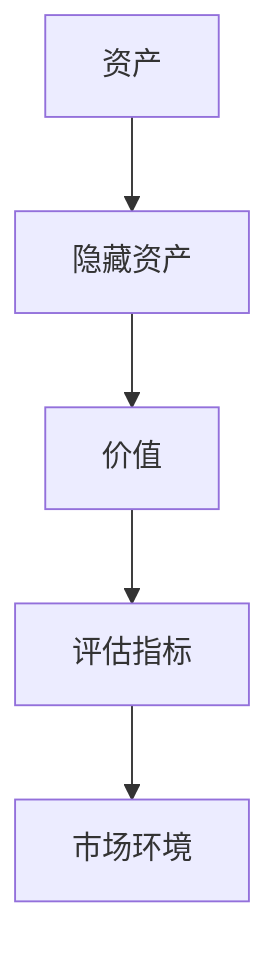

                 


# 隐藏资产价值投资：发掘被低估的资产

## 关键词：隐藏资产，价值投资，资产评估，投资策略，资产发现

## 摘要：  
本文深入探讨隐藏资产的价值投资策略，从概念解析、评估方法、系统设计到实际案例，全面解析如何发现和投资被低估的资产。通过系统化的分析与实践，揭示隐藏资产的投资机会与挑战，为投资者提供实用的指导。

---

# 正文

---

## 第一部分: 隐藏资产价值投资的背景与核心概念

### 第1章: 隐藏资产的基本概念与价值投资概述

#### 1.1 隐藏资产的定义与特点

- **1.1.1 什么是隐藏资产**
  - 隐藏资产是指未被市场充分认知，但具有潜在价值的资产。
  - 特点：低流动性、高价值潜力、市场关注度低。

- **1.1.2 隐藏资产的分类**
  - 实物资产：土地、设备、存货。
  - 无形资产：专利、版权、品牌价值。
  - 金融资产：未被充分定价的股票、债券。

- **1.1.3 隐藏资产的特征**
  - 价格低于内在价值。
  - 市场认知不足。
  - 具备长期增长潜力。

#### 1.2 价值投资的核心理念

- **1.2.1 价值投资的定义**
  - 价值投资是以低于内在价值的价格购买优质资产的投资策略。

- **1.2.2 价值投资的基本原则**
  - 确保安全边际：买入价格低于内在价值。
  - 长期视角：关注资产的长期价值，而非短期波动。
  - 避免情绪化投资：基于理性分析做出决策。

- **1.2.3 隐藏资产在价值投资中的地位**
  - 隐藏资产是价值投资的重要目标，因其低估特性，具有较高的增值潜力。

#### 1.3 隐藏资产价值投资的背景

- **1.3.1 当前市场环境下的隐藏资产机会**
  - 市场波动加剧，部分资产价格被低估。
  - 经济周期变化为发现隐藏资产提供机会。

- **1.3.2 隐藏资产投资的现状与趋势**
  - 投资者逐渐意识到隐藏资产的价值。
  - 技术进步（如大数据分析）帮助发现隐藏资产。

- **1.3.3 隐藏资产投资的边界与外延**
  - 投资边界：明确可投资的范围与条件。
  - 外延：扩展到更多领域，如新兴技术和未开发市场。

#### 1.4 隐藏资产价值评估的理论基础

- **1.4.1 基本分析与技术分析的对比**
  - 基本分析：研究资产的内在价值，包括财务数据、行业地位等。
  - 技术分析：通过价格和成交量预测未来走势。
  - 对比：基本分析更适用于隐藏资产，因技术分析依赖历史数据，而隐藏资产可能缺乏足够的历史数据。

- **1.4.2 隐藏资产价值的计算方法**
  - 现金流折现法：DCF模型，评估未来现金流的现值。
  - 可比公司法：对比同类资产的市场定价。
  - 市净率法：基于资产的账面价值进行评估。

- **1.4.3 隐藏资产价值评估的关键假设**
  - 资产的未来现金流可预测。
  - 市场趋于理性，价格将回归内在价值。

---

## 第二部分: 隐藏资产价值评估的核心概念与联系

### 第2章: 隐藏资产价值评估的理论框架

#### 2.1 隐藏资产价值评估的核心原理

- **2.1.1 隐藏资产价值的构成要素**
  - 内在价值：资产的真正价值，基于基本面分析。
  - 市场价值：资产在市场上的交易价格。
  - 安全边际：买入价格与内在价值的差距，提供风险缓冲。

- **2.1.2 隐藏资产价值评估的公式推导**
  - 内在价值公式：  
    $$ V = \frac{CF}{r} $$
    其中，\( V \) 是内在价值，\( CF \) 是未来现金流，\( r \) 是折现率。
  - 市场价值与内在价值的关系：  
    $$ \text{市场价值} = \text{内在价值} \times (1 + \text{市场情绪调整}) $$

- **2.1.3 隐藏资产价值评估的关键假设**
  - 资产的未来现金流可以合理预测。
  - 市场趋于理性，价格最终反映内在价值。

#### 2.2 隐藏资产与显性资产的对比分析

- **2.2.1 隐藏资产与显性资产的特征对比**
  | 特性          | 隐藏资产                  | 显性资产                  |
  |---------------|---------------------------|---------------------------|
  | 流动性         | 低                        | 高                        |
  | 市场关注度     | 低                        | 高                        |
  | 价格波动性     | 小                        | 大                        |
  | 内在价值       | 未被充分发现              | 已被充分发现              |

- **2.2.2 隐藏资产的隐含价值与显性价值的差异**
  - 隐含价值：资产未被市场充分认知的部分。
  - 显性价值：资产在市场上的交易价格。
  - 差异：隐含价值是未来价值增长的潜力。

- **2.2.3 隐藏资产价值的波动性分析**
  - 隐藏资产的价值波动较小，因市场关注度低。
  - 显性资产的价值波动较大，因市场情绪影响。

#### 2.3 隐藏资产价值评估的ER实体关系图



---

## 第三部分: 隐藏资产价值评估的算法原理

### 第3章: 隐藏资产价值评估的算法实现

#### 3.1 隐藏资产价值评估的数学模型

- **3.1.1 线性回归模型**
  - 模型公式：  
    $$ y = \beta x + \epsilon $$
    其中，\( y \) 是目标变量，\( x \) 是自变量，\( \beta \) 是回归系数，\( \epsilon \) 是误差项。
  - 应用：用于评估资产价格与内在价值之间的关系。

- **3.1.2 时间序列分析**
  - 模型：ARIMA（自回归积分滑动平均模型）。
  - 应用：预测资产价格的未来走势。

#### 3.2 隐藏资产价值评估的Python实现

- **环境搭建**
  - 安装Python和相关库：numpy、pandas、scikit-learn。

- **代码实现**

```python
import numpy as np
import pandas as pd
from sklearn.linear_model import LinearRegression

# 示例数据：隐藏资产的评估指标与价格
data = {
    '评估指标': [0.5, 1.0, 1.5, 2.0, 2.5],
    '价格': [10, 20, 30, 40, 50]
}

df = pd.DataFrame(data)

# 线性回归模型
model = LinearRegression()
model.fit(df[['评估指标']], df['价格'])

# 预测价格
new_indicator = np.array([[1.2]])
predicted_price = model.predict(new_indicator)
print(f'预测价格：{predicted_price[0]:.2f}')
```

- **代码解读**
  - 数据准备：创建包含评估指标和价格的数据框。
  - 模型训练：使用线性回归模型拟合数据。
  - 模型预测：输入新的评估指标，预测价格。

---

## 第四部分: 隐藏资产价值评估的系统分析与架构设计

### 第4章: 隐藏资产价值评估系统的设计与实现

#### 4.1 系统功能设计

- **功能模块**
  - 数据采集模块：收集隐藏资产的评估指标和市场价格。
  - 评估计算模块：基于模型计算资产的内在价值。
  - 结果展示模块：可视化评估结果。

#### 4.2 系统架构设计


- **系统架构图**
  ```mermaid
  graph LR
  User --> DataCollector
  DataCollector --> Database
  Database --> Evaluator
  Evaluator --> Visualizer
  Visualizer --> User
  ```

---

## 第五部分: 隐藏资产价值评估的项目实战

### 第5章: 项目实战与案例分析

#### 5.1 环境安装

- 安装Python和相关库：
  ```bash
  pip install numpy pandas scikit-learn
  ```

#### 5.2 核心代码实现

```python
import numpy as np
import pandas as pd
from sklearn.linear_model import LinearRegression

# 示例数据：隐藏资产的评估指标与价格
data = {
    '评估指标': [0.5, 1.0, 1.5, 2.0, 2.5],
    '价格': [10, 20, 30, 40, 50]
}

df = pd.DataFrame(data)

# 线性回归模型
model = LinearRegression()
model.fit(df[['评估指标']], df['价格'])

# 预测价格
new_indicator = np.array([[1.2]])
predicted_price = model.predict(new_indicator)
print(f'预测价格：{predicted_price[0]:.2f}')
```

- **代码解读**
  - 数据准备：创建包含评估指标和价格的数据框。
  - 模型训练：使用线性回归模型拟合数据。
  - 模型预测：输入新的评估指标，预测价格。

#### 5.3 案例分析与解读

- **案例分析**
  - 数据来源：隐藏资产的评估指标与市场价格。
  - 模型训练：使用线性回归模型进行训练。
  - 预测结果：预测新的评估指标下的资产价格。

#### 5.4 项目小结

- **经验总结**
  - 数据质量对模型准确性的影响。
  - 模型选择对结果的影响。
  - 需要结合市场环境进行综合分析。

---

## 第六部分: 隐藏资产价值投资的总结与展望

### 第6章: 总结与展望

#### 6.1 本章小结

- 本文系统介绍了隐藏资产的价值投资策略，从理论到实践，全面解析了如何发现和投资被低估的资产。
- 通过算法实现和项目实战，展示了如何将理论应用于实际投资中。

#### 6.2 投资中的注意事项

- **数据风险**
  - 数据来源的可靠性。
  - 数据的完整性和及时性。
- **模型风险**
  - 模型假设的合理性。
  - 模型的适用性和局限性。

#### 6.3 拓展阅读

- 推荐书籍：
  - 《价值投资入门》
  - 《投资学基础》

---

## 结语

隐藏资产的价值投资需要投资者具备敏锐的洞察力和扎实的分析能力。通过系统化的分析与实践，投资者可以更好地发现市场中的潜在机会，实现长期稳健的投资回报。

---

**关键词：隐藏资产，价值投资，资产评估，投资策略，资产发现**

**摘要：**  
本文深入探讨隐藏资产的价值投资策略，从概念解析、评估方法、系统设计到实际案例，全面解析如何发现和投资被低估的资产。通过系统化的分析与实践，揭示隐藏资产的投资机会与挑战，为投资者提供实用的指导。

