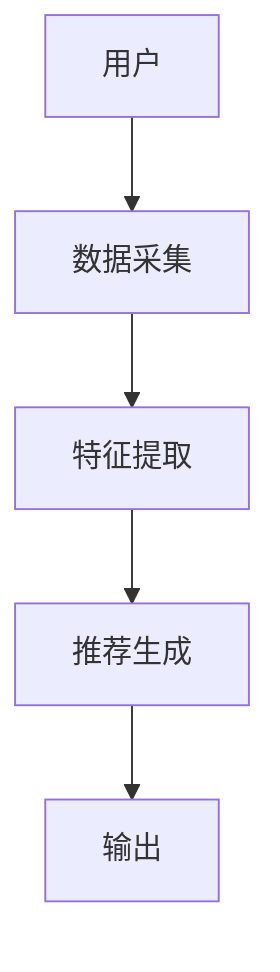

                 


# 开发AI Agent的上下文感知推荐系统

## 关键词：AI Agent，上下文感知推荐，推荐系统，协同过滤，深度学习，系统架构

## 摘要：本文深入探讨了AI Agent在上下文感知推荐系统中的应用，从核心概念到算法原理，再到系统架构和项目实战，详细分析了如何构建高效、智能的推荐系统。通过具体案例和代码实现，帮助读者掌握上下文感知推荐的核心技术，及其在实际应用中的优化方法。

---

## 第一部分：背景与核心概念

### 第1章：上下文感知推荐系统概述

#### 1.1 问题背景与描述
- 1.1.1 推荐系统的发展历程：从基于规则的简单推荐到机器学习驱动的智能推荐。
- 1.1.2 上下文感知推荐的必要性：传统推荐系统忽视了时间、地点和用户行为等动态因素。
- 1.1.3 问题解决的边界与外延：明确推荐系统的适用场景和限制。

#### 1.2 核心概念与组成
- 1.2.1 上下文感知推荐系统的定义：结合用户行为、环境和时间等因素，动态调整推荐结果。
- 1.2.2 AI Agent的核心特征：自主性、反应性、社会性。
- 1.2.3 系统组成与核心要素对比（表格）：
  | 组件 | 特性 |
  |------|------|
  | 数据源 | 多模态数据（文本、图像、行为） |
  | 推荐算法 | 协同过滤、深度学习、强化学习 |
  | 上下文 | 时间、地点、用户状态 |

### 第2章：AI Agent与上下文感知推荐的关系

#### 2.1 AI Agent的基本原理
- 2.1.1 AI Agent的定义与分类：简单Agent与智能Agent的区别。
- 2.1.2 上下文感知的核心机制：通过感知环境变化动态调整行为。
- 2.1.3 AI Agent与推荐系统的结合：AI Agent作为推荐系统的核心驱动力。

#### 2.2 实体关系分析
- 使用Mermaid绘制ER图，展示系统中用户、内容、上下文、推荐等实体的关系。

---

## 第二部分：算法原理

### 第3章：上下文感知推荐算法

#### 3.1 基于协同过滤的推荐
- 3.1.1 基本原理：通过用户行为相似性进行推荐。
- 3.1.2 算法流程图（Mermaid）：
  ```mermaid
  graph TD
    A[用户A] --> B[用户B]
    B --> C[推荐列表]
    C --> D[目标用户]
  ```
- 3.1.3 数学模型：$$相似度计算公式$$
  $$\text{相似度}(u, v) = \frac{\sum_{i} (r_{u,i} - \bar{r}_u)(r_{v,i} - \bar{r}_v)}{\sqrt{\sum_{i} (r_{u,i} - \bar{r}_u)^2} \cdot \sqrt{\sum_{i} (r_{v,i} - \bar{r}_v)^2}}$$

#### 3.2 基于深度学习的推荐
- 3.2.1 神经网络模型简介：如矩阵分解、神经协同过滤。
- 3.2.2 算法流程图（Mermaid）：
  ```mermaid
  graph TD
    A[输入层] --> B[嵌入层]
    B --> C[隐层]
    C --> D[输出层]
  ```
- 3.2.3 数学模型：$$损失函数公式$$
  $$L = \sum_{i,j} (r_{i,j} - \hat{r}_{i,j})^2$$

---

## 第三部分：系统架构与设计

### 第4章：系统架构设计

#### 4.1 问题场景分析
- 4.1.1 用户需求分析：个性化推荐、实时反馈。
- 4.1.2 系统目标设定：高准确率、低延迟。

#### 4.2 功能模块设计
- 4.2.1 数据采集模块：收集用户行为、内容特征。
- 4.2.2 特征提取模块：提取文本、图像特征。
- 4.2.3 推荐生成模块：基于上下文生成推荐列表。

#### 4.3 系统架构图（Mermaid）


---

## 第四部分：项目实战

### 第5章：环境搭建与核心实现

#### 5.1 环境搭建
- 5.1.1 安装Python与相关库：如numpy、pandas、tensorflow。
- 5.1.2 配置开发环境：如Jupyter Notebook。

#### 5.2 核心代码实现
- 5.2.1 数据预处理代码：
  ```python
  import pandas as pd
  data = pd.read_csv('data.csv')
  ```

- 5.2.2 推荐算法实现：
  ```python
  def similar_users(user):
      pass
  ```

- 5.2.3 代码应用解读与分析：解释代码的功能和实现细节。

#### 5.3 实际案例分析
- 通过具体案例分析，展示如何应用这些技术解决问题，并总结经验教训。

---

## 第五部分：最佳实践

### 第6章：最佳实践与经验分享

#### 6.1 开发中的注意事项
- 数据质量的重要性、模型调优技巧。

#### 6.2 性能优化技巧
- 并行计算、缓存优化。

#### 6.3 测试与调试
- 使用交叉验证、A/B测试。

#### 6.4 项目小结
- 总结项目的关键点和未来改进方向。

---

## 结语

通过本文，读者可以全面了解上下文感知推荐系统的核心技术及其在AI Agent中的应用。从理论到实践，逐步掌握如何构建高效的推荐系统，并在实际项目中灵活应用这些知识。

