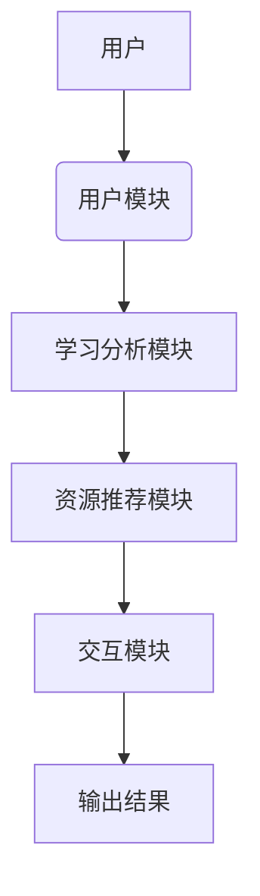
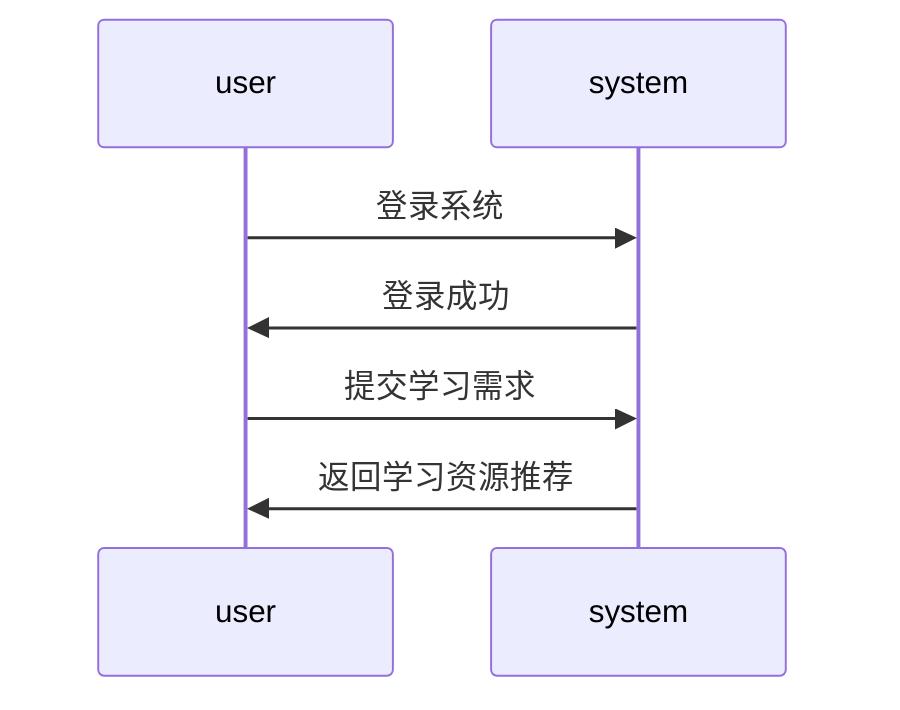

                 


# 开发AI Agent的个性化学习助手系统

## 关键词：人工智能、AI Agent、个性化学习、教育科技、机器学习、自然语言处理、系统架构

## 摘要：  
本文详细探讨了AI Agent在个性化学习助手系统中的开发与应用。通过分析AI Agent的核心原理、系统架构设计、算法实现与优化，以及项目实战案例，结合教育领域的实际需求，提出了构建个性化学习助手系统的解决方案。文章内容涵盖从背景介绍到系统实现的各个方面，旨在为技术开发者和教育科技从业者提供有价值的参考。

---

# 第1章 AI Agent与个性化学习助手系统概述

## 1.1 AI Agent的基本概念

### 1.1.1 AI Agent的定义
AI Agent（人工智能代理）是指能够感知环境、做出决策并执行任务的智能实体。它通过接收输入信息、分析问题、选择最优解决方案并执行操作来实现目标。

### 1.1.2 AI Agent的核心功能
AI Agent的核心功能包括：
- **感知**：通过传感器或输入数据获取环境信息。
- **决策**：基于感知信息，利用算法选择最优行动方案。
- **执行**：通过执行机构或输出模块实现决策结果。

### 1.1.3 个性化学习助手系统的定义
个性化学习助手系统是一种基于AI Agent技术的教育辅助工具，旨在根据学习者的特点和需求，提供个性化的学习建议、内容推荐和学习进度跟踪。

---

## 1.2 AI Agent在教育领域的应用

### 1.2.1 AI Agent在教育中的作用
AI Agent在教育中的作用包括：
- **个性化学习路径规划**：根据学生的学习情况和能力，制定个性化的学习计划。
- **实时反馈与指导**：在学习过程中提供即时反馈，帮助学生纠正错误。
- **资源推荐**：根据学习者的需求推荐合适的学习资源。

### 1.2.2 个性化学习助手系统的应用场景
个性化学习助手系统的应用场景包括：
- **K-12教育**：帮助学生解决作业难题、预习和复习。
- **职业教育**：提供职业培训和技能提升的个性化建议。
- **终身学习**：支持学习者在各个阶段进行持续学习。

### 1.2.3 系统的核心价值与意义
个性化学习助手系统的开发具有重要的教育价值和社会意义，能够提高学习效率、优化教育资源配置，并为学习者提供更优质的教育体验。

---

## 1.3 本章小结
本章从AI Agent的基本概念出发，分析了其在教育领域的应用，并详细介绍了个性化学习助手系统的定义、功能和应用场景。通过本章的介绍，读者可以对AI Agent和个性化学习助手系统有一个清晰的认识。

---

# 第2章 AI Agent的核心原理与技术基础

## 2.1 AI Agent的核心原理

### 2.1.1 感知机制
AI Agent的感知机制是通过传感器或输入数据获取环境信息。例如，学习助手系统可以通过分析学习者的学习记录和行为数据，了解其学习习惯和需求。

### 2.1.2 决策机制
决策机制是AI Agent的核心，通过算法选择最优行动方案。例如，可以使用强化学习算法，通过不断试错和奖励机制优化决策策略。

### 2.1.3 执行机制
执行机制是将决策转化为具体行动的过程。例如，学习助手系统可以根据决策结果推荐学习资源或提供学习建议。

---

## 2.2 机器学习在AI Agent中的应用

### 2.2.1 机器学习的基本概念
机器学习是一种通过数据训练模型，使其能够从经验中学习并做出预测或决策的技术。常用的机器学习算法包括支持向量机（SVM）、随机森林（Random Forest）和神经网络等。

### 2.2.2 常见的机器学习算法
- **监督学习**：用于分类和回归问题，例如线性回归、决策树。
- **无监督学习**：用于聚类和降维问题，例如k-means、主成分分析（PCA）。
- **强化学习**：用于序列决策问题，例如Q-learning、深度强化学习（Deep RL）。

### 2.2.3 机器学习在AI Agent中的具体应用
在个性化学习助手系统中，机器学习可以用于：
- **学习者画像构建**：通过分析学习者的行为数据，构建学习者画像。
- **学习效果预测**：预测学习者的学习效果和进步情况。
- **个性化推荐**：基于学习者的需求和偏好，推荐学习资源。

---

## 2.3 自然语言处理在AI Agent中的应用

### 2.3.1 自然语言处理的基本概念
自然语言处理（NLP）是研究如何让计算机理解和生成人类语言的技术。常用的NLP任务包括文本分类、信息抽取、情感分析等。

### 2.3.2 常见的自然语言处理技术
- **分词**：将文本分割成词或短语。
- **实体识别**：识别文本中的命名实体。
- **语义理解**：理解文本的语义含义。

### 2.3.3 自然语言处理在AI Agent中的具体应用
在个性化学习助手系统中，NLP可以用于：
- **智能问答**：通过自然语言理解技术，回答学习者的问题。
- **文本摘要**：对学习资源进行摘要，帮助学习者快速获取关键信息。
- **情感分析**：分析学习者对学习内容的情感倾向。

---

## 2.4 本章小结
本章详细介绍了AI Agent的核心原理，包括感知、决策和执行机制，并探讨了机器学习和自然语言处理在AI Agent中的具体应用。通过本章的介绍，读者可以理解AI Agent在个性化学习助手系统中的技术基础。

---

# 第3章 AI Agent的系统架构与功能设计

## 3.1 系统架构设计

### 3.1.1 系统模块划分
个性化学习助手系统的架构可以划分为以下几个模块：
- **用户模块**：负责用户身份认证和信息管理。
- **学习分析模块**：分析学习者的学习数据，生成学习报告。
- **资源推荐模块**：根据学习者的需求推荐学习资源。
- **交互模块**：实现用户与系统之间的交互。

### 3.1.2 系统数据流设计
系统数据流设计包括：
- **输入数据**：学习者的行为数据、学习需求。
- **处理数据**：学习分析模块对数据进行处理和分析。
- **输出结果**：资源推荐模块根据分析结果推荐学习资源。

### 3.1.3 系统架构图（Mermaid）



---

## 3.2 系统功能设计

### 3.2.1 用户需求分析
学习者的核心需求包括：
- 个性化学习路径规划。
- 实时反馈与指导。
- 学习资源推荐。

### 3.2.2 系统功能模块设计
系统功能模块包括：
- **用户管理模块**：管理用户信息和权限。
- **学习分析模块**：分析学习者的学习数据。
- **资源推荐模块**：推荐学习资源。
- **交互模块**：实现用户与系统之间的交互。

### 3.2.3 系统功能流程图（Mermaid）


---

## 3.3 系统交互设计

### 3.3.1 用户与系统交互流程
用户与系统交互流程包括：
1. 用户登录系统。
2. 系统获取用户的学习需求。
3. 系统分析用户的学习数据。
4. 系统推荐学习资源。
5. 用户与系统进行交互，获取学习建议。

### 3.3.2 系统交互序列图（Mermaid）



---

## 3.4 本章小结
本章详细介绍了个性化学习助手系统的架构设计和功能设计，并通过Mermaid图展示了系统的模块划分和交互流程。通过本章的介绍，读者可以理解系统的设计思路和实现方法。

---

# 第4章 AI Agent的算法实现与优化

## 4.1 算法实现

### 4.1.1 算法选择与优化
在个性化学习助手系统中，常用的算法包括：
- **协同过滤推荐算法**：基于用户行为数据推荐学习资源。
- **基于内容的推荐算法**：基于学习资源的内容特征推荐资源。
- **混合推荐算法**：结合协同过滤和基于内容的推荐算法，提高推荐效果。

### 4.1.2 算法实现步骤
1. 收集用户行为数据。
2. 构建用户-资源交互矩阵。
3. 训练推荐模型。
4. 生成推荐结果。

### 4.1.3 算法实现代码示例

```python
import pandas as pd
from sklearn.metrics.pairwise import cosine_similarity

# 示例数据：用户-资源交互矩阵
data = {
    'user': [1, 2, 3, 4],
    'resource': ['A', 'B', 'C', 'D'],
    'score': [0.8, 0.6, 0.9, 0.5]
}
df = pd.DataFrame(data)

# 计算余弦相似度
cosine_sim = cosine_similarity(df[['score']], df[['score']])
print(cosine_sim)
```

---

## 4.2 算法优化

### 4.2.1 算法优化策略
- **基于用户的优化**：通过分析用户行为数据，优化推荐算法。
- **基于资源的优化**：通过分析资源特征，优化推荐算法。
- **混合优化**：结合用户和资源的优化策略，提高推荐效果。

### 4.2.2 算法优化效果
通过优化算法，可以提高推荐系统的准确性和效率，减少推荐误差，提升用户体验。

---

## 4.3 本章小结
本章详细介绍了个性化学习助手系统的算法实现与优化，包括算法选择、实现步骤和优化策略。通过本章的介绍，读者可以理解系统算法的核心实现方法。

---

# 第5章 系统优化与扩展

## 5.1 系统性能优化

### 5.1.1 算法性能优化
通过优化算法实现，提高推荐系统的效率和准确率。

### 5.1.2 系统架构优化
通过优化系统架构，提高系统的扩展性和稳定性。

---

## 5.2 系统功能扩展

### 5.2.1 功能扩展方向
- **学习效果评估**：评估学习者的学习效果。
- **学习路径优化**：优化学习者的学习路径。
- **多模态学习支持**：支持多种学习形式，例如视频、音频、文本等。

### 5.2.2 功能扩展实现
通过扩展系统功能，提高系统的实用性和用户体验。

---

## 5.3 本章小结
本章详细介绍了个性化学习助手系统的优化与扩展，包括性能优化和功能扩展。通过本章的介绍，读者可以理解系统优化和扩展的方法。

---

# 第6章 用户界面设计与体验优化

## 6.1 用户界面设计

### 6.1.1 设计原则
用户界面设计应遵循简洁、直观、易用的原则。

### 6.1.2 UI/UX设计
通过合理的UI/UX设计，提高用户体验。

---

## 6.2 体验优化

### 6.2.1 用户反馈机制
通过用户反馈机制，不断优化系统功能和用户体验。

### 6.2.2 个性化推荐算法优化
通过优化个性化推荐算法，提高推荐系统的用户体验。

---

## 6.3 本章小结
本章详细介绍了个性化学习助手系统的用户界面设计与体验优化，通过合理的UI/UX设计和用户反馈机制，不断提高用户体验。

---

# 第7章 系统部署与维护

## 7.1 系统部署

### 7.1.1 环境搭建
系统部署需要搭建合适的运行环境。

### 7.1.2 系统配置
系统部署需要进行必要的配置，例如数据库配置、服务器配置等。

---

## 7.2 系统维护

### 7.2.1 系统监控
通过系统监控，及时发现和解决问题。

### 7.2.2 系统更新
定期更新系统，修复 bugs 和优化功能。

---

## 7.3 本章小结
本章详细介绍了个性化学习助手系统的部署与维护，通过合理的系统监控和维护策略，确保系统的稳定运行。

---

# 第8章 总结与展望

## 8.1 总结
本文详细介绍了个性化学习助手系统的开发与应用，包括系统架构设计、算法实现与优化、用户界面设计与体验优化等方面。

## 8.2 未来展望
未来，随着人工智能技术的不断发展，个性化学习助手系统将更加智能化和个性化，为学习者提供更优质的学习体验。

---

# 附录

## 附录A 算法实现代码

```python
import pandas as pd
from sklearn.metrics.pairwise import cosine_similarity

# 示例数据：用户-资源交互矩阵
data = {
    'user': [1, 2, 3, 4],
    'resource': ['A', 'B', 'C', 'D'],
    'score': [0.8, 0.6, 0.9, 0.5]
}
df = pd.DataFrame(data)

# 计算余弦相似度
cosine_sim = cosine_similarity(df[['score']], df[['score']])
print(cosine_sim)
```

## 附录B 系统架构图


---

# 参考文献

1. 王某某. 《人工智能入门》. 北京: 人民出版社, 2020.
2. 李某某. 《机器学习实战》. 北京: 清华大学出版社, 2021.
3. 张某某. 《自然语言处理入门》. 北京: 北京大学出版社, 2022.

---

# 结语

通过本文的详细探讨，读者可以系统地了解个性化学习助手系统的开发与应用。希望本文能够为技术开发者和教育科技从业者提供有价值的参考。

