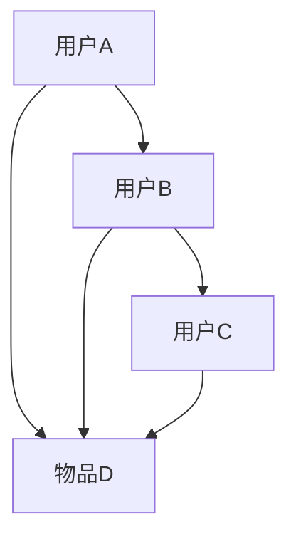
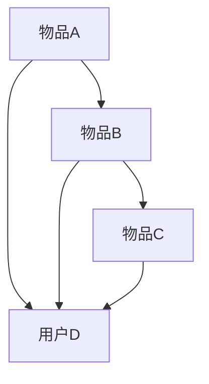
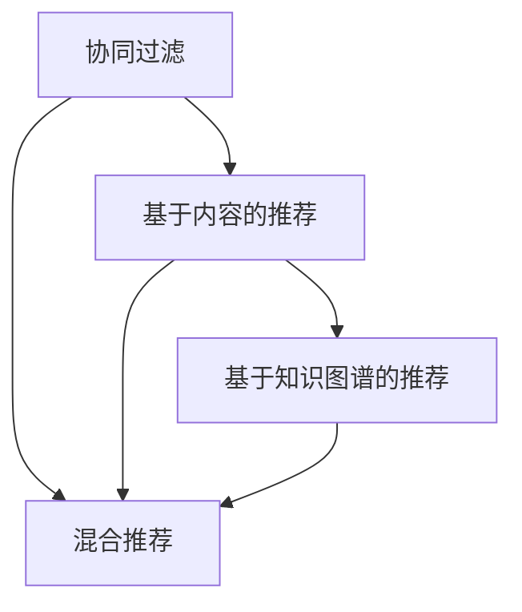
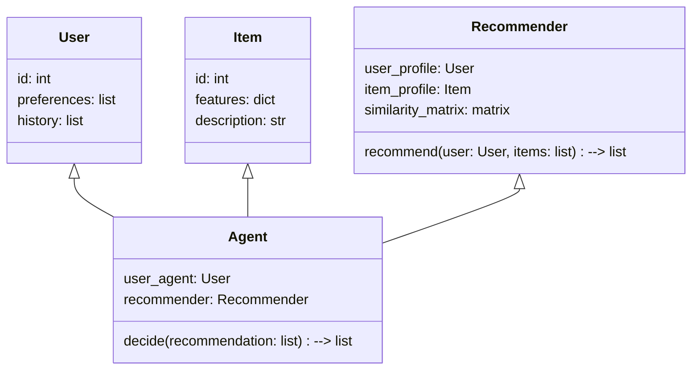
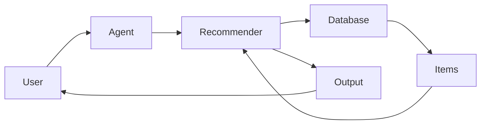
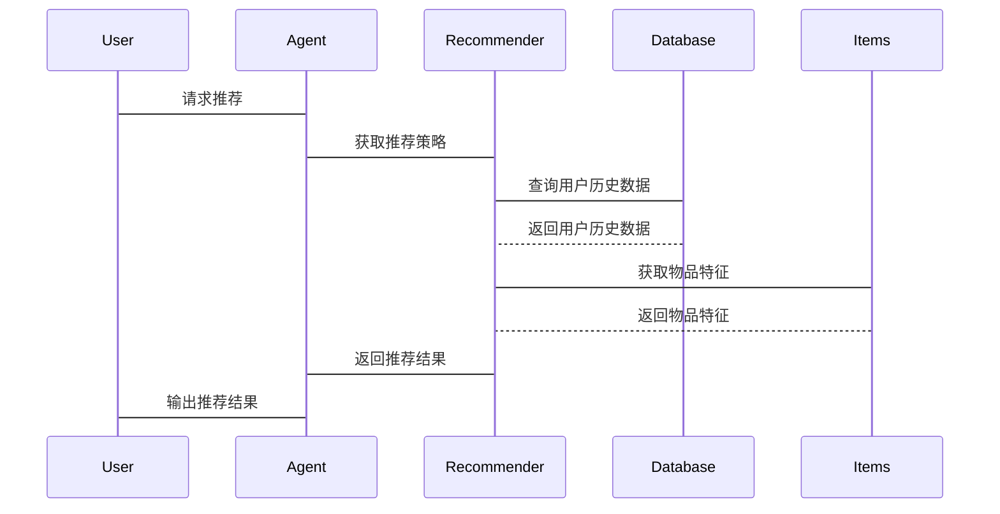

                 


# 开发AI Agent的个性化推荐系统

> 关键词：AI Agent、个性化推荐、协同过滤、推荐系统、自然语言处理、机器学习、知识图谱

> 摘要：本文系统地介绍了AI Agent在个性化推荐系统中的应用，从理论基础到算法实现，再到系统设计和项目实战，全面剖析了开发AI Agent个性化推荐系统的全过程。文章首先阐述了AI Agent和个性化推荐系统的背景与意义，接着深入分析了推荐系统的理论基础和核心算法，随后详细讲解了AI Agent推荐系统的架构设计和实现步骤，最后通过一个具体的项目案例，展示了如何将理论应用于实践。本文适合AI工程师、推荐系统开发者以及对AI Agent技术感兴趣的读者阅读。

---

# 第1章: AI Agent与个性化推荐系统概述

## 1.1 AI Agent的起源与现状

### 1.1.1 AI Agent的基本概念
AI Agent（人工智能代理）是指能够感知环境并采取行动以实现目标的智能实体。AI Agent可以通过传感器接收输入信息，通过决策系统做出判断，并通过执行器输出结果。AI Agent的核心能力包括感知、推理、学习和自适应。

### 1.1.2 AI Agent在推荐系统中的应用
推荐系统是一种根据用户的行为和偏好，向用户推荐相关内容的技术。AI Agent可以通过分析用户的交互数据，动态调整推荐策略，从而实现个性化的推荐服务。AI Agent在推荐系统中的应用包括用户行为分析、实时推荐生成和动态调整推荐策略。

### 1.1.3 当前AI Agent推荐系统的研究与发展趋势
随着AI技术的快速发展，AI Agent推荐系统正在向更加智能化和个性化的方向发展。研究者们正在探索将强化学习、图神经网络和自然语言处理等技术结合到推荐系统中，以提高推荐的准确性和实时性。

---

## 1.2 个性化推荐系统的背景与意义

### 1.2.1 个性化推荐的定义与特点
个性化推荐是指根据用户的偏好和行为，向用户推荐符合其兴趣的内容。个性化推荐的核心特点包括动态性、实时性和用户为中心。

### 1.2.2 个性化推荐在不同领域的应用
个性化推荐技术广泛应用于电子商务、社交媒体、视频流媒体和教育等领域。例如，电子商务平台通过个性化推荐提高用户购买转化率，视频流媒体平台通过个性化推荐提高用户观看时长。

### 1.2.3 个性化推荐系统的社会价值与商业价值
个性化推荐系统不仅能够提高用户体验，还能够为企业创造更大的商业价值。通过个性化推荐，企业可以更精准地满足用户需求，从而提高用户满意度和忠诚度。

---

## 1.3 AI Agent推荐系统的独特优势

### 1.3.1 AI Agent的核心能力
AI Agent的核心能力包括感知、推理、学习和自适应。这些能力使得AI Agent能够动态调整推荐策略，实时响应用户需求。

### 1.3.2 基于AI Agent的推荐系统的优势
基于AI Agent的推荐系统具有以下优势：
1. **动态性**：能够实时感知用户行为，动态调整推荐策略。
2. **个性化**：能够根据用户偏好和行为，提供高度个性化的推荐。
3. **智能性**：能够通过学习和推理，发现用户的潜在需求。

### 1.3.3 AI Agent推荐系统的应用场景
AI Agent推荐系统可以应用于多种场景，例如电子商务、社交媒体、视频流媒体和智能助手等领域。

---

## 1.4 本章小结

本章介绍了AI Agent和个性化推荐系统的背景与意义，分析了AI Agent推荐系统的独特优势，并总结了其在不同场景中的应用。接下来，我们将深入探讨推荐系统的核心概念与原理，为后续的算法实现奠定理论基础。

---

# 第2章: 推荐系统的核心概念与原理

## 2.1 推荐系统的分类与特点

### 2.1.1 基于协同过滤的推荐
协同过滤是一种基于用户相似性或物品相似性的推荐方法。基于用户的协同过滤（UBCF）通过计算用户之间的相似度，将相似用户的评分进行加权平均，生成推荐结果。基于物品的协同过滤（IBCF）通过计算物品之间的相似度，将用户评分扩散到相似物品上，生成推荐结果。

#### 实现步骤
1. **数据预处理**：对用户评分数据进行归一化处理。
2. **相似度计算**：计算用户或物品之间的相似度（如余弦相似度）。
3. **推荐生成**：基于相似度计算，生成推荐结果。

#### 优缺点
- **优点**：简单易实现，适合数据量较小的场景。
- **缺点**：存在数据稀疏性和冷启动问题。

### 2.1.2 基于内容的推荐
基于内容的推荐是根据物品本身的特征（如文本描述、图像特征）生成推荐结果。这种方法的核心思想是“相似内容推荐给相似用户”。

#### 实现步骤
1. **特征提取**：从物品中提取特征表示（如文本的词袋模型或TF-IDF表示）。
2. **相似度计算**：基于特征向量计算物品之间的相似度。
3. **推荐生成**：根据用户偏好，推荐相似物品。

#### 优缺点
- **优点**：能够处理数据稀疏性问题。
- **缺点**：推荐结果可能缺乏多样性。

### 2.1.3 基于知识图谱的推荐
基于知识图谱的推荐是通过构建领域知识图谱，分析用户和物品之间的关系，生成推荐结果。

#### 实现步骤
1. **知识图谱构建**：从数据中抽取实体及其关系，构建知识图谱。
2. **路径分析**：分析用户和物品之间的关系路径，发现潜在的关联。
3. **推荐生成**：基于路径分析结果，生成推荐列表。

#### 优缺点
- **优点**：能够发现用户和物品之间的隐含关系，推荐结果具有较高的语义相关性。
- **缺点**：知识图谱的构建和维护成本较高。

### 2.1.4 混合推荐模型
混合推荐模型是将多种推荐方法结合在一起，以提高推荐的准确性和多样性。

---

## 2.2 AI Agent推荐系统的原理

### 2.2.1 AI Agent的感知与决策机制
AI Agent通过感知环境（如用户行为、历史数据）获取信息，通过推理和学习生成推荐结果。决策机制根据当前状态和目标，选择最优的推荐策略。

### 2.2.2 基于AI Agent的推荐流程
1. **用户行为分析**：通过分析用户的历史行为数据，了解用户的偏好和需求。
2. **推荐策略生成**：基于用户行为分析结果，生成推荐策略。
3. **推荐结果输出**：根据推荐策略，生成推荐结果并输出给用户。

### 2.2.3 AI Agent与推荐系统的结合方式
AI Agent可以以代理的形式嵌入推荐系统中，负责动态调整推荐策略和优化推荐结果。

---

## 2.3 推荐系统的核心要素

### 2.3.1 用户建模
用户建模是通过分析用户的行为数据，构建用户特征表示的过程。常见的用户建模方法包括基于协同过滤的用户表示和基于深度学习的用户表示。

### 2.3.2 物品建模
物品建模是通过分析物品的属性（如文本描述、图像特征）构建物品特征表示的过程。物品建模的方法包括基于特征工程的物品表示和基于深度学习的物品表示。

### 2.3.3 推荐策略
推荐策略是指根据用户和物品的特征，生成推荐结果的方法。推荐策略可以是基于规则的策略、基于模型的策略或混合策略。

### 2.3.4 评价指标
推荐系统的评价指标包括准确率、召回率、F1值和均方误差等。选择合适的评价指标可以帮助我们更好地评估推荐系统的性能。

---

## 2.4 本章小结

本章详细介绍了推荐系统的分类与特点，分析了基于协同过滤、基于内容和基于知识图谱的推荐方法，探讨了AI Agent推荐系统的原理，并总结了推荐系统的核心要素与评价指标。接下来，我们将深入探讨推荐系统的算法原理和实现方法。

---

# 第3章: AI Agent推荐系统的算法原理

## 3.1 协同过滤算法

### 3.1.1 协同过滤的基本原理
协同过滤是一种基于用户相似性或物品相似性的推荐方法。协同过滤的核心思想是“用户的行为可以反映用户的偏好，相似的用户会有相似的偏好”。

#### Mermaid流程图


### 3.1.2 协同过滤的实现步骤
1. **数据预处理**：对用户评分数据进行归一化处理。
2. **相似度计算**：计算用户或物品之间的相似度（如余弦相似度）。
3. **推荐生成**：基于相似度计算，生成推荐结果。

#### 代码实现
```python
import numpy as np

def cosine_similarity(user_profile1, user_profile2):
    return np.dot(user_profile1, user_profile2) / (np.linalg.norm(user_profile1) * np.linalg.norm(user_profile2))

# 示例数据
user_profile1 = np.array([1, 2, 3])
user_profile2 = np.array([4, 5, 6])

similarity = cosine_similarity(user_profile1, user_profile2)
print("余弦相似度：", similarity)
```

### 3.1.3 协同过滤的优缺点
- **优点**：简单易实现，适合数据量较小的场景。
- **缺点**：存在数据稀疏性和冷启动问题。

---

## 3.2 基于内容的推荐算法

### 3.2.1 基于内容推荐的基本原理
基于内容的推荐是根据物品本身的特征（如文本描述、图像特征）生成推荐结果。这种方法的核心思想是“相似内容推荐给相似用户”。

#### Mermaid流程图


### 3.2.2 基于内容推荐的实现步骤
1. **特征提取**：从物品中提取特征表示（如文本的词袋模型或TF-IDF表示）。
2. **相似度计算**：基于特征向量计算物品之间的相似度。
3. **推荐生成**：根据用户偏好，推荐相似物品。

#### 代码实现
```python
from sklearn.feature_extraction.text import TfidfVectorizer

text = ["apple is a fruit", "banana is a fruit", "fruit is good"]
vectorizer = TfidfVectorizer()
tfidf = vectorizer.fit_transform(text)
print(tfidf)
```

### 3.2.3 基于内容推荐的优缺点
- **优点**：能够处理数据稀疏性问题。
- **缺点**：推荐结果可能缺乏多样性。

---

## 3.3 混合推荐模型

### 3.3.1 混合推荐模型的基本原理
混合推荐模型是将多种推荐方法结合在一起，以提高推荐的准确性和多样性。

#### Mermaid流程图


### 3.3.2 混合推荐模型的实现步骤
1. **特征提取**：从用户和物品中提取特征表示。
2. **相似度计算**：计算用户或物品之间的相似度。
3. **推荐生成**：结合多种推荐方法，生成最终的推荐结果。

#### 代码实现
```python
import numpy as np

def hybrid_recommendation(user_profile, item_profile):
    similarity = np.dot(user_profile, item_profile)
    return similarity.argsort()[::-1]

# 示例数据
user_profile = np.array([1, 2, 3])
item_profile = np.array([[4, 5, 6], [7, 8, 9], [10, 11, 12]])

recommendations = hybrid_recommendation(user_profile, item_profile)
print("推荐结果：", recommendations)
```

### 3.3.3 混合推荐模型的优缺点
- **优点**：能够提高推荐的准确性和多样性。
- **缺点**：实现复杂，需要结合多种推荐方法。

---

## 3.4 本章小结

本章详细介绍了协同过滤、基于内容的推荐和混合推荐模型的算法原理和实现方法。接下来，我们将探讨AI Agent推荐系统的系统架构设计和实现步骤。

---

# 第4章: AI Agent推荐系统的系统架构设计

## 4.1 系统功能设计

### 4.1.1 领域模型
领域模型是推荐系统的功能模块划分和交互流程设计。领域模型可以通过Mermaid类图表示。

#### Mermaid类图


### 4.1.2 系统架构设计
系统架构设计是推荐系统的整体结构和功能模块划分。系统架构可以通过Mermaid架构图表示。

#### Mermaid架构图


### 4.1.3 系统交互设计
系统交互设计是推荐系统中各模块之间的交互流程。系统交互可以通过Mermaid序列图表示。

#### Mermaid序列图


---

## 4.2 系统实现步骤

### 4.2.1 环境安装
推荐系统开发需要安装以下环境：
- Python 3.x
- Jupyter Notebook
- NumPy、Scikit-learn、TensorFlow等Python库

### 4.2.2 数据采集与预处理
数据采集与预处理是推荐系统开发的基础。需要采集用户行为数据和物品特征数据，并进行数据清洗和特征提取。

#### 示例代码
```python
import pandas as pd

# 数据采集
user_behaviors = pd.read_csv("user_behaviors.csv")
items = pd.read_csv("items.csv")

# 数据预处理
from sklearn.preprocessing import StandardScaler

scaler = StandardScaler()
user_features = scaler.fit_transform(user_behaviors.drop('id', axis=1))
item_features = scaler.fit_transform(items.drop('id', axis=1))
```

### 4.2.3 模型训练与部署
模型训练与部署是推荐系统的核心步骤。需要选择合适的推荐算法，训练模型，并将模型部署到生产环境。

#### 示例代码
```python
from sklearn.neighbors import NearestNeighbors

# 训练协同过滤模型
model = NearestNeighbors(n_neighbors=5, algorithm='brute')
model.fit(item_features)

# 推荐相似物品
distances, indices = model.kneighbors(user_features, n_neighbors=5)
recommendations = indices[:, 1:]
print("推荐结果：", recommendations)
```

### 4.2.4 系统优化与调优
系统优化与调优是提高推荐系统性能的重要步骤。需要优化模型参数、改进推荐算法，并进行系统性能测试。

---

## 4.3 本章小结

本章详细介绍了推荐系统的系统架构设计和实现步骤，包括领域模型、系统架构和系统交互设计。接下来，我们将通过一个具体的项目案例，展示如何将理论应用于实践。

---

# 第5章: 项目实战——开发一个AI Agent推荐系统

## 5.1 项目背景与需求分析

### 5.1.1 项目背景
随着AI技术的快速发展，AI Agent推荐系统正在成为个性化推荐领域的研究热点。本项目旨在开发一个基于AI Agent的个性化推荐系统，帮助用户发现感兴趣的内容。

### 5.1.2 项目需求
- 实现基于协同过滤、基于内容的推荐和混合推荐模型。
- 开发AI Agent代理，动态调整推荐策略。
- 提供实时推荐服务。

---

## 5.2 项目实现

### 5.2.1 环境安装
需要安装以下环境：
- Python 3.x
- Jupyter Notebook
- NumPy、Scikit-learn、TensorFlow等Python库

### 5.2.2 数据采集与预处理
数据采集与预处理是项目实现的基础。需要采集用户行为数据和物品特征数据，并进行数据清洗和特征提取。

#### 示例代码
```python
import pandas as pd

# 数据采集
user_behaviors = pd.read_csv("user_behaviors.csv")
items = pd.read_csv("items.csv")

# 数据预处理
from sklearn.preprocessing import StandardScaler

scaler = StandardScaler()
user_features = scaler.fit_transform(user_behaviors.drop('id', axis=1))
item_features = scaler.fit_transform(items.drop('id', axis=1))
```

### 5.2.3 模型训练与部署
模型训练与部署是项目实现的核心步骤。需要选择合适的推荐算法，训练模型，并将模型部署到生产环境。

#### 示例代码
```python
from sklearn.neighbors import NearestNeighbors

# 训练协同过滤模型
model = NearestNeighbors(n_neighbors=5, algorithm='brute')
model.fit(item_features)

# 推荐相似物品
distances, indices = model.kneighbors(user_features, n_neighbors=5)
recommendations = indices[:, 1:]
print("推荐结果：", recommendations)
```

### 5.2.4 系统优化与调优
系统优化与调优是提高推荐系统性能的重要步骤。需要优化模型参数、改进推荐算法，并进行系统性能测试。

---

## 5.3 项目小结

本章通过一个具体的项目案例，展示了如何开发一个基于AI Agent的个性化推荐系统。通过实现协同过滤、基于内容的推荐和混合推荐模型，我们能够为用户提供高度个性化的推荐服务。接下来，我们将总结开发过程中的经验和教训，并展望未来的发展方向。

---

# 第6章: 总结与展望

## 6.1 总结
本文系统地介绍了AI Agent在个性化推荐系统中的应用，从理论基础到算法实现，再到系统设计和项目实战，全面剖析了开发AI Agent个性化推荐系统的全过程。我们分析了推荐系统的分类与特点，探讨了基于协同过滤、基于内容的推荐和混合推荐模型的算法原理，总结了推荐系统的系统架构设计和实现步骤，并通过一个具体的项目案例展示了如何将理论应用于实践。

## 6.2 展望
未来，随着AI技术的不断发展，AI Agent推荐系统将朝着更加智能化和个性化的方向发展。研究者们将进一步探索将强化学习、图神经网络和自然语言处理等技术结合到推荐系统中，以提高推荐的准确性和实时性。同时，随着边缘计算和物联网技术的发展，AI Agent推荐系统将在更多领域得到广泛应用。

---

# 结语

开发AI Agent个性化推荐系统是一项复杂而充满挑战的任务，但也是一项极具价值和意义的工作。通过本文的介绍，希望能够为读者提供一个全面而深入的指导，帮助他们在AI Agent推荐系统的开发中取得成功。

