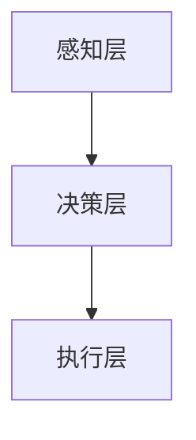
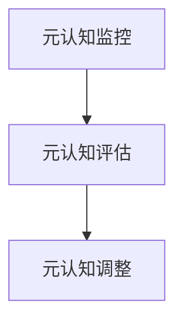
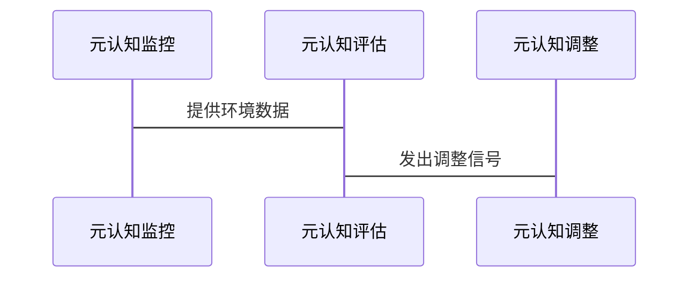

                 


# 开发AI Agent的元认知能力：自我监控和调整

## 关键词：AI Agent，元认知能力，自我监控，自我调整，智能系统，AI开发

## 摘要：  
本文探讨了AI Agent的元认知能力，特别是自我监控和调整机制。通过分析元认知能力的核心概念、算法实现和系统架构，本文为开发者提供了从理论到实践的全面指导。文章详细介绍了元认知能力的数学模型、系统架构设计以及实际项目案例，帮助读者理解如何开发具备自我监控和调整能力的AI Agent。

---

# 第一部分: 背景介绍

## 第1章: AI Agent与元认知能力概述

### 1.1 AI Agent的基本概念

#### 1.1.1 AI Agent的定义
AI Agent（智能体）是具有感知环境、做出决策并采取行动以实现目标的实体。它可以是一个软件程序、机器人或其他智能系统。

#### 1.1.2 元认知能力的定义
元认知能力是指个体对自身认知过程的认知和调控能力，包括对思维过程的监控、评估和调整。在AI Agent中，元认知能力使其能够监控自身的状态、行为和结果，并根据反馈进行调整。

#### 1.1.3 元认知能力在AI Agent中的作用
元认知能力使AI Agent具备自适应性，能够在复杂环境中动态调整策略，提高任务执行的效率和准确性。

---

### 1.2 元认知能力的核心要素

#### 1.2.1 自我监控
自我监控是元认知能力的基础，指AI Agent对自身行为、状态和环境的实时观察和记录。

#### 1.2.2 自我评估
自我评估是对监控到的信息进行分析，评估当前行为的有效性和合理性。

#### 1.2.3 自我调整
自我调整是根据评估结果，调整策略、行为或参数以优化性能的过程。

---

### 1.3 元认知能力的背景与应用

#### 1.3.1 元认知能力的起源与理论基础
元认知概念最早由Flavell提出，强调对认知过程的认知和调控。在AI领域，元认知能力的研究始于20世纪90年代，随着深度学习和强化学习的发展，其应用逐渐广泛。

#### 1.3.2 元认知能力在AI领域的应用现状
当前，元认知能力在自动驾驶、智能助手、机器人等领域得到应用，帮助AI Agent更好地适应动态环境。

#### 1.3.3 元认知能力的未来发展趋势
未来，元认知能力将与边缘计算、分布式系统结合，实现更高效、更自适应的AI Agent。

---

# 第二部分: 核心概念与联系

## 第2章: 元认知能力的理论基础

### 2.1 元认知理论的核心观点

#### 2.1.1 元认知的双层次结构
元认知包括元认知知识（关于认知过程的知识）和元认知调控（对认知过程的调控）。

#### 2.1.2 元认知的三大功能
1. **监控功能**：监控认知过程。
2. **评估功能**：评估认知结果。
3. **调控功能**：调整认知策略。

#### 2.1.3 元认知的自我调节机制
通过反馈机制，AI Agent可以实时调整行为策略，确保目标的实现。

---

### 2.2 元认知与AI Agent的结合

#### 2.2.1 元认知在AI Agent中的实现路径
1. **感知层**：收集环境信息。
2. **决策层**：基于元认知能力做出决策。
3. **执行层**：根据决策采取行动。

#### 2.2.2 元认知能力的层次化模型
- **第一层**：感知和数据采集。
- **第二层**：数据处理和分析。
- **第三层**：策略调整和优化。

#### 2.2.3 元认知与AI Agent的协同作用
元认知能力使AI Agent具备自适应性，能够根据环境变化动态调整行为。

---

## 第3章: 元认知能力的核心算法与数学模型

### 3.1 元认知能力的数学模型

#### 3.1.1 元认知的层次化模型
层次化模型将元认知能力分解为多个层次，每一层负责特定的功能。

#### 3.1.2 元认知的反馈机制
反馈机制通过误差信号调整模型参数，优化预测结果。

#### 3.1.3 元认知的优化算法
优化算法基于反馈信息，调整模型参数以提高性能。

---

### 3.2 元认知能力的算法实现

#### 3.2.1 基于反馈的元认知算法
- 输入：环境反馈。
- 输出：调整策略。

#### 3.2.2 基于强化学习的元认知算法
- 奖励函数：定义任务目标。
- 动作选择：基于策略网络选择动作。

#### 3.2.3 基于注意力机制的元认知算法
- 注意力机制：聚焦关键信息。
- 上下文感知：增强决策能力。

---

### 3.3 元认知能力的数学公式

#### 3.3.1 元认知反馈机制的公式
$$
f(x) = \beta x + \alpha
$$

#### 3.3.2 元认知优化算法的公式
$$
\theta_{t+1} = \theta_t + \eta \nabla f(\theta_t)
$$

#### 3.3.3 元认知注意力机制的公式
$$
\alpha_i = \frac{e^{x_i}}{\sum_j e^{x_j}}
$$

---

# 第三部分: 系统分析与架构设计

## 第4章: 系统架构设计

### 4.1 系统架构概述

#### 4.1.1 系统整体架构
系统分为感知层、决策层和执行层，各层之间通过接口交互。

#### 4.1.2 系统功能模块划分
- **感知模块**：数据采集。
- **决策模块**：策略制定。
- **执行模块**：行动执行。

#### 4.1.3 系统交互流程
1. 感知模块采集数据。
2. 决策模块分析数据。
3. 执行模块执行决策。

---

### 4.2 系统功能设计

#### 4.2.1 元认知监控模块
- 监控环境状态。
- 监控自身行为。

#### 4.2.2 元认知评估模块
- 评估行为效果。
- 评估环境变化。

#### 4.2.3 元认知调整模块
- 调整行为策略。
- 调整参数设置。

---

### 4.3 系统架构图

#### 4.3.1 系统架构Mermaid图


#### 4.3.2 功能模块交互图


---

## 第5章: 系统接口设计

### 5.1 系统接口设计

#### 5.1.1 接口定义
- 输入接口：接收环境数据。
- 输出接口：发送调整信号。

#### 5.1.2 接口实现
- 数据格式：JSON。
- 通信协议：HTTP。

---

### 5.2 系统交互序列图

#### 5.2.1 元认知监控流程


---

# 第四部分: 项目实战

## 第6章: 项目实战

### 6.1 项目介绍

#### 6.1.1 项目背景
开发一个具备自我监控和调整能力的智能助手。

#### 6.1.2 项目目标
实现元认知能力在智能助手中的应用。

---

### 6.2 核心代码实现

#### 6.2.1 环境配置
```python
import numpy as np
import matplotlib.pyplot as plt
```

#### 6.2.2 元认知监控模块
```python
class MetaCognitionMonitor:
    def __init__(self):
        self.data = []
    
    def monitor(self, state):
        self.data.append(state)
        return self.data
```

#### 6.2.3 元认知评估模块
```python
class MetaCognitionEvaluator:
    def __init__(self):
        self.performance = 0
    
    def evaluate(self, action, reward):
        self.performance += reward
        return self.performance
```

#### 6.2.4 元认知调整模块
```python
class MetaCognitionAdjuster:
    def __init__(self):
        self.strategy = "default"
    
    def adjust(self, performance):
        if performance < 0.5:
            self.strategy = "alternative"
        return self.strategy
```

---

### 6.3 测试与优化

#### 6.3.1 测试环境
在模拟环境中测试智能助手的元认知能力。

#### 6.3.2 优化方法
通过强化学习优化元认知调整模块的策略。

---

## 第7章: 最佳实践与注意事项

### 7.1 最佳实践

#### 7.1.1 数据质量的重要性
确保数据的准确性和完整性。

#### 7.1.2 算法选择的策略
根据任务需求选择合适的算法。

#### 7.1.3 系统维护的注意事项
定期更新模型和优化算法。

---

### 7.2 小结

本文详细介绍了开发AI Agent的元认知能力，从理论到实践，为开发者提供了全面的指导。通过实际案例，展示了如何实现自我监控和调整能力，帮助AI Agent更好地适应复杂环境。

---

### 7.3 拓展阅读

建议阅读相关领域的最新论文和技术报告，以获取更多关于元认知能力的研究进展。

---

通过以上内容，读者可以全面理解AI Agent的元认知能力开发，掌握从理论到实践的完整流程。

