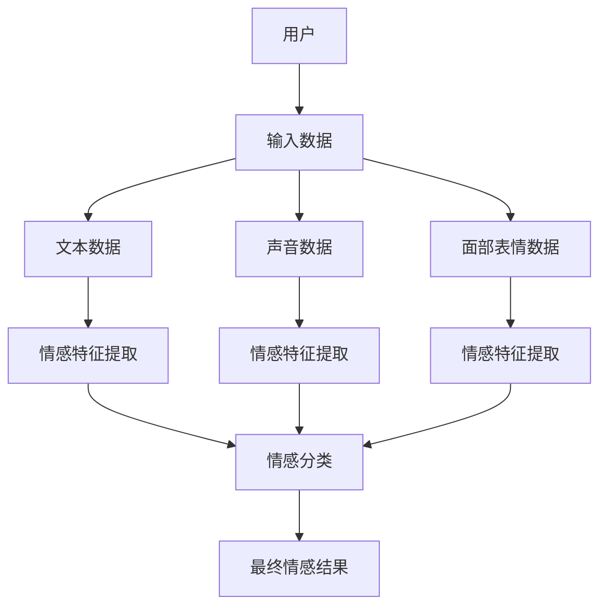

                 

# 开发AI Agent的多模态情感识别系统

> 关键词：AI Agent，多模态情感识别，深度学习，情感计算，系统架构设计

> 摘要：本文详细探讨了开发AI Agent的多模态情感识别系统的各个方面。从背景概念到核心算法，再到系统架构设计和实际项目实现，文章全面介绍了如何构建一个高效的多模态情感识别系统。通过详细的技术分析和实际案例，本文为读者提供了从理论到实践的完整指南。

---

# 第一部分: 多模态情感识别系统概述

## 第1章: 多模态情感识别系统背景与概念

### 1.1 情感计算与AI Agent的背景
情感计算是人工智能领域的重要分支，旨在理解和模拟人类情感。随着技术的进步，情感计算从简单的关键词分析发展到基于深度学习的复杂模型。AI Agent作为情感计算的载体，能够实时感知和处理情感信息，广泛应用于客服系统、智能助手等领域。

### 1.2 多模态情感识别的定义与特点
多模态数据整合了文本、声音和面部表情等多种信息，显著提高了情感识别的准确性。与单模态识别相比，多模态能够捕捉更多情感特征，适用于复杂场景。

### 1.3 AI Agent与情感识别的结合
AI Agent通过多模态情感识别技术，能够提供更智能化的服务，如情绪敏感对话和个性化推荐。这种结合提升了用户体验，使AI Agent更具人性化。

### 1.4 本章小结
本章介绍了情感计算的发展、多模态数据的优势，以及AI Agent在情感识别中的应用，为后续内容打下基础。

---

## 第2章: 多模态数据与情感识别的关联

### 2.1 多模态数据的特征分析
文本数据通过关键词和语调分析情感，声音数据利用声学特征识别，面部表情数据则通过面部动作捕捉。

### 2.2 多模态数据融合的原理
数据融合通过加权和融合策略，综合多模态信息，提升识别准确率。挑战包括数据异构性和冗余问题。

### 2.3 情感识别的实体关系图

### 2.4 本章小结
本章分析了多模态数据的特征及其在情感识别中的作用，并通过图表展示了数据流，帮助读者理解系统结构。

---

## 第3章: 多模态情感识别算法概述

### 3.1 基于深度学习的情感识别
深度学习模型如LSTM和Transformer广泛应用于情感识别，通过处理序列数据捕捉情感变化。

### 3.2 多模态融合算法
多模态融合算法如注意力机制和自适应融合，有效结合多种数据特征，提升识别精度。

### 3.3 情感识别算法的数学模型
情感分类模型使用交叉熵损失函数：
$$ L = -\sum_{i=1}^{n} y_i \log(p_i) + (1-y_i)\log(1-p_i) $$

### 3.4 本章小结
本章介绍了深度学习模型和多模态融合算法，并通过数学公式展示了模型的核心，帮助读者理解算法原理。

---

## 第4章: 系统分析与架构设计

### 4.1 系统应用场景
系统应用于实时监控和教育辅助，帮助识别用户情绪，提供及时反馈。

### 4.2 系统功能设计
系统功能模块包括数据采集、预处理和模型训练，确保数据高效处理和准确识别。

### 4.3 系统架构设计

### 4.4 本章小结
本章详细描述了系统架构设计和功能模块，展示了系统的整体结构和数据流。

---

## 第5章: 项目实战

### 5.1 环境配置
安装Python、TensorFlow和Keras，配置开发环境。

### 5.2 核心代码实现
实现数据预处理、模型训练和结果分析的代码，展示情感识别的具体实现。

### 5.3 代码解读与分析
解释代码功能，展示如何处理多模态数据并训练模型。

### 5.4 实际案例分析
通过具体案例分析，展示系统的实际应用和效果。

### 5.5 本章小结
本章通过实际项目展示了系统的开发过程和实现细节。

---

## 第6章: 最佳实践与注意事项

### 6.1 经验与教训
分享开发中的经验教训，如数据质量和模型调优的重要性。

### 6.2 使用建议
建议读者根据具体需求调整模型和数据源，确保系统高效运行。

### 6.3 注意事项
提醒读者注意数据隐私和模型泛化能力，避免过拟合。

### 6.4 拓展阅读
推荐相关书籍和技术博客，供读者进一步学习。

### 6.5 本章小结
本章总结了开发经验，并为读者提供了实用建议和拓展资源。

---

通过以上结构，文章系统地介绍了从背景到实现的全过程，帮助读者全面理解多模态情感识别系统的开发。

