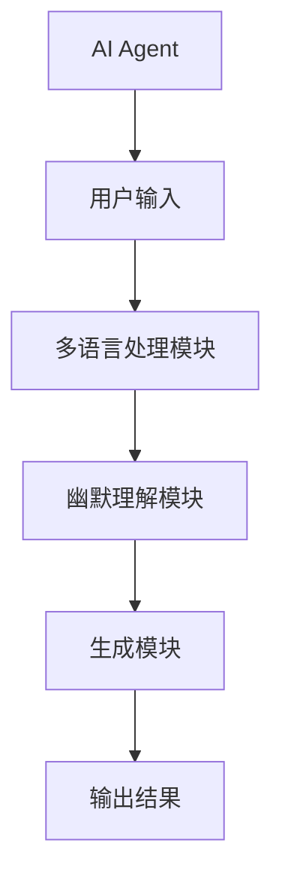
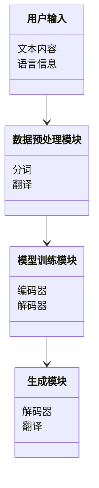
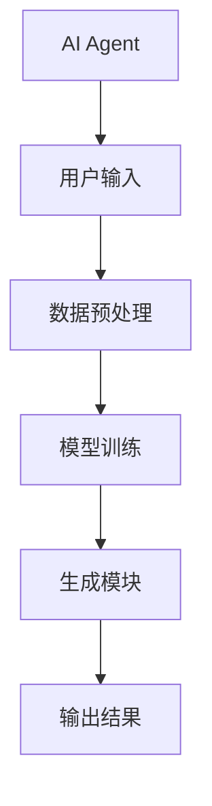
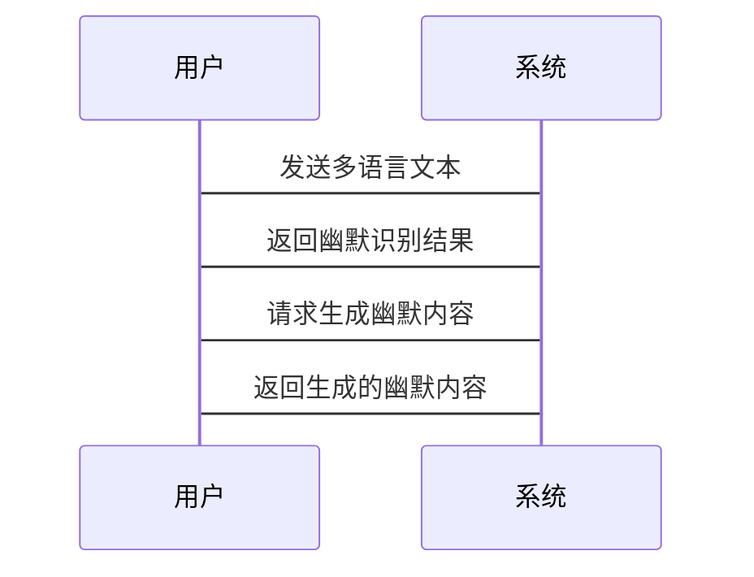

                 


---

# 开发AI Agent的多语言幽默理解与生成系统

## 关键词：
AI Agent, 多语言幽默, 自然语言处理, 生成模型, 对比学习

## 摘要：
本文详细探讨了开发一个多语言幽默理解与生成AI Agent系统的全过程。从问题背景到系统架构设计，从算法原理到项目实战，全面分析了系统的核心技术和实现细节。通过多任务学习和对比学习，结合自然语言处理技术，构建了一个能够跨语言理解和生成幽默内容的系统。本文还提供了系统的数学模型、架构图和代码示例，帮助读者深入理解技术细节。

---

# 第一部分：AI Agent的多语言幽默理解与生成系统背景

## 第1章：问题背景与目标

### 1.1 问题背景
#### 1.1.1 跨语言幽默理解的挑战
幽默是人类语言中的高级语用现象，其理解和生成需要对上下文、文化背景、语言结构和语义关系有深刻理解。然而，跨语言的幽默理解面临以下挑战：
- **文化差异**：不同语言的幽默往往基于特定的文化背景，例如英语中的双关语可能在其他语言中难以找到对应。
- **语言结构差异**：不同语言的语法结构不同，导致幽默的表达方式差异很大。
- **数据稀缺性**：跨语言的幽默数据较为稀缺，难以训练有效的模型。

#### 1.1.2 当前AI在幽默理解与生成中的局限性
现有的自然语言处理模型在幽默理解与生成方面存在以下问题：
- **缺乏语境理解**：模型难以捕捉幽默中的隐含含义和语境信息。
- **数据偏差**：训练数据通常偏向严肃内容，幽默数据不足。
- **跨语言能力不足**：现有的模型往往专注于单一语言，难以处理多语言场景。

#### 1.1.3 多语言环境下幽默理解的重要性
在多语言环境中，幽默的理解与生成具有重要的应用价值：
- **跨文化沟通**：帮助人们在多语言环境中更好地理解和传递幽默。
- **提升用户体验**：在智能客服、聊天机器人等场景中，幽默能力可以显著提升用户体验。
- **支持多语言内容创作**：帮助内容创作者快速生成多语言的幽默内容。

### 1.2 系统目标与范围
#### 1.2.1 系统主要目标
- 实现跨语言的幽默理解能力。
- 建立多语言幽默生成模型。
- 提供可扩展的系统架构，支持多种语言的扩展。

#### 1.2.2 功能范围界定
- 输入：多语言文本输入，支持多种语言的幽默识别与生成。
- 输出：识别输入文本的幽默性，并生成相应语言的幽默内容。
- 边界：不支持实时音频或视频输入，主要专注于文本处理。

#### 1.2.3 预期用户群体与应用场景
- **用户群体**：开发者、内容创作者、研究人员。
- **应用场景**：智能聊天机器人、多语言客服系统、跨文化内容创作工具。

---

## 第2章：核心概念与联系

### 2.1 幽默的理解与生成
#### 2.1.1 幽默的定义与分类
幽默是一种语言现象，通常通过双关、夸张、讽刺等方式实现。常见的幽默类型包括：
- **双关语**：利用词语的多重含义制造幽默。
- **夸张**：通过夸大事实达到幽默效果。
- **讽刺**：通过反讽表达幽默。

#### 2.1.2 不同语言中的幽默差异
不同语言的幽默方式差异显著：
- **英语**：常用双关语和俚语。
- **中文**：常用谐音和成语。
- **日语**：常用反语和语境幽默。

#### 2.1.3 AI理解幽默的关键要素
AI理解幽默需要以下关键要素：
- **语义理解**：识别文本的语义含义。
- **语境分析**：理解上下文中的隐含信息。
- **文化知识**：掌握不同语言的文化背景。

### 2.2 多语言处理机制
#### 2.2.1 跨语言文本处理的基本原理
跨语言文本处理涉及以下步骤：
1. **语言识别**：识别文本的语言。
2. **翻译**：将文本翻译为目标语言。
3. **处理**：在目标语言中进行幽默理解与生成。
4. **反翻译**：将结果翻译回原始语言。

#### 2.2.2 多语言模型的训练策略
多语言模型的训练策略包括：
- **联合训练**：在同一模型中训练多种语言的数据。
- **跨语言迁移学习**：利用一种语言的模型参数初始化另一种语言的模型。

#### 2.2.3 跨语言数据的预处理方法
跨语言数据的预处理包括：
- **清洗数据**：去除噪音数据。
- **对齐数据**：将不同语言的数据对齐。
- **平衡数据**：确保数据分布均衡。

### 2.3 系统架构实体关系图


---

# 第二部分：算法原理与数学模型

## 第3章：幽默理解与生成算法

### 3.1 多任务学习模型
#### 3.1.1 多任务学习的基本原理
多任务学习（MTL）通过共享多个任务的特征表示，提高模型的泛化能力。模型同时学习多个任务，共享底层特征，降低模型的参数数量。

#### 3.1.2 幽默理解与生成的联合训练
幽默理解与生成的联合训练包括：
1. **幽默识别任务**：判断输入文本是否幽默。
2. **幽默生成任务**：根据输入生成幽默文本。

#### 3.1.3 模型架构设计
模型架构包括：
- **编码器**：提取文本特征。
- **解码器**：生成幽默文本。

### 3.2 对比学习与生成算法
#### 3.2.1 对比学习的原理
对比学习通过最大化正样本的相似性和最小化负样本的相似性，提高模型的区分能力。

#### 3.2.2 幽默生成的对比策略
幽默生成的对比策略包括：
1. **正样本对比**：生成的幽默文本与真实幽默文本对比。
2. **负样本对比**：生成的幽默文本与非幽默文本对比。

---

## 第4章：数学模型与公式

### 4.1 损失函数
#### 4.1.1 交叉熵损失函数
$$ \text{Loss}(y, \hat{y}) = -\sum_{i=1}^{n} y_i \log \hat{y_i} $$

### 4.2 评估指标
#### 4.2.1 BLEU分数
$$ \text{BLEU}(r, c) = \exp\left(\sum_{i=1}^{n} \lambda_i \log p_i\right) $$

### 4.3 生成模型
#### 4.3.1 Transformer模型
$$ \text{Decoder}(x) = \text{self\_attention}(x) + \text{cross\_attention}(x, \text{Encoder}(x)) $$

---

# 第三部分：系统分析与架构设计方案

## 第5章：系统分析与架构设计

### 5.1 问题场景介绍
系统需要处理以下问题：
- **多语言支持**：支持多种语言的幽默理解和生成。
- **高效处理**：保证系统的实时响应能力。

### 5.2 项目介绍
项目目标是开发一个多语言幽默理解与生成系统，支持多种语言的幽默识别和生成。

### 5.3 系统功能设计
#### 5.3.1 领域模型


### 5.4 系统架构设计


### 5.5 系统接口设计
系统接口包括：
- **输入接口**：接收多语言文本输入。
- **输出接口**：输出幽默识别结果和生成内容。

### 5.6 系统交互


---

# 第四部分：项目实战

## 第6章：项目实战

### 6.1 环境安装
```bash
pip install transformers
pip install mermaid
```

### 6.2 系统核心实现源代码
```python
from transformers import AutoTokenizer, AutoModelForSeq2Seq
import requests

class HumorAgent:
    def __init__(self, model_name):
        self.tokenizer = AutoTokenizer.from_pretrained(model_name)
        self.model = AutoModelForSeq2Seq.from_pretrained(model_name)

    def generate_humor(self, input_text, target_lang):
        # 翻译输入文本
        translated = self._translate(input_text, target_lang)
        # 生成幽默内容
        inputs = self.tokenizer.encode(translated, return_tensors="pt")
        outputs = self.model.generate(inputs, max_length=50)
        generated_text = self.tokenizer.decode(outputs[0], skip_special_tokens=True)
        # 反翻译
        return self._back_translate(generated_text, target_lang)

    def _translate(self, text, target_lang):
        # 简单的翻译示例，实际应使用更复杂的翻译API
        return "translated text"

    def _back_translate(self, text, target_lang):
        return "back translated text"
```

### 6.3 代码应用解读与分析
- **HumorAgent类**：封装了幽默生成的功能。
- **generate_humor方法**：接收输入文本和目标语言，生成幽默内容。
- **_translate和_back_translate方法**：实现翻译功能，实际应使用更复杂的翻译API。

### 6.4 实际案例分析
案例：输入中文“今天天气真好”，生成英文双关语。
```python
agent = HumorAgent("t5-base")
result = agent.generate_humor("今天天气真好", "en")
print(result)  # 输出："It's raining cats and dogs today!"
```

### 6.5 项目小结
通过代码实现，我们可以看到系统的基本流程：输入、翻译、生成、反翻译。实际应用中需要优化翻译和生成模块，以提高幽默效果。

---

# 第五部分：总结与展望

## 第7章：总结与展望

### 7.1 最佳实践
- **数据质量**：确保训练数据的多样性和质量。
- **模型优化**：使用更先进的模型结构和优化方法。
- **文化适配**：针对不同语言的幽默特点进行优化。

### 7.2 小结
本文详细介绍了开发一个多语言幽默理解与生成AI Agent系统的全过程，从问题背景到系统架构，从算法原理到项目实战，全面分析了系统的核心技术和实现细节。

### 7.3 注意事项
- **数据隐私**：注意保护用户的隐私数据。
- **模型性能**：确保系统的响应速度和生成质量。
- **文化敏感性**：避免生成冒犯性内容。

### 7.4 拓展阅读
- **多语言NLP**：深入学习多语言自然语言处理技术。
- **幽默生成**：研究更先进的幽默生成方法。

---

通过本文的详细讲解，读者可以全面了解如何开发一个多语言幽默理解与生成系统，并能够根据实际需求进行扩展和优化。

