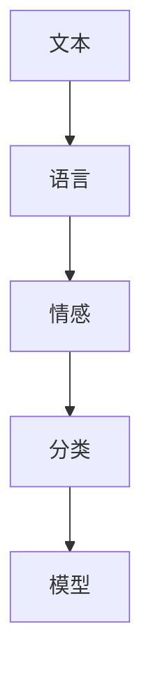
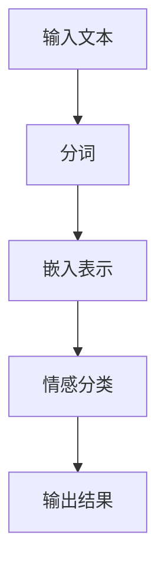
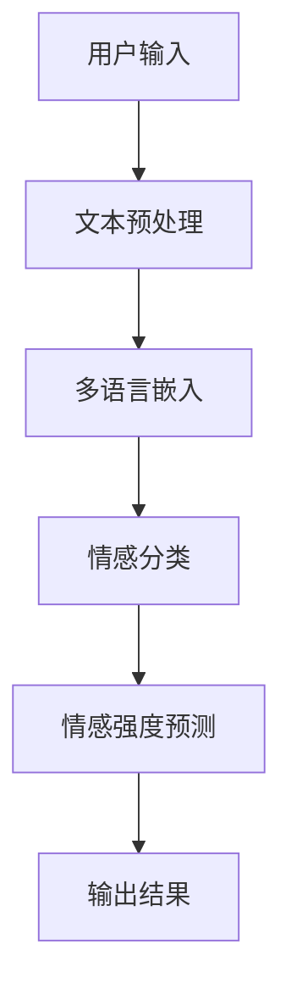
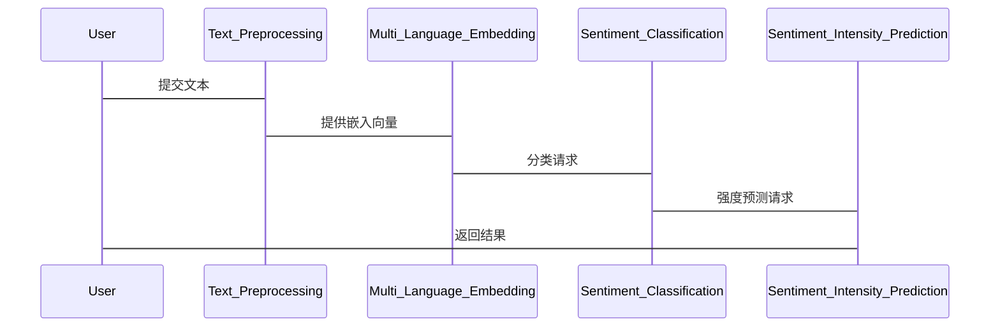

                 


# 《开发AI Agent的多语言情感分析引擎》

> 关键词：AI Agent, 多语言情感分析, 情感分类, 机器学习, 深度学习

> 摘要：本文详细探讨了开发AI Agent的多语言情感分析引擎的关键技术，包括情感分析的背景、核心概念、算法原理、系统架构设计、项目实战以及最佳实践。通过系统的分析和实际案例的讲解，为读者提供从理论到实践的全面指导，帮助他们理解并掌握多语言情感分析引擎的开发方法。

---

# 第一部分: 多语言情感分析引擎开发背景与核心概念

# 第1章: 情感分析与AI Agent概述

## 1.1 情感分析的背景与问题背景
### 1.1.1 从单语言到多语言情感分析的演进
- 早期情感分析主要集中在英语等资源丰富的语言。
- 随着全球化的推进，跨语言情感分析需求激增。
- 多语言情感分析的重要性及其应用场景。

### 1.1.2 多语言情感分析的核心问题与挑战
- 语言间的语义差异。
- 数据稀缺性问题。
- 模型的可迁移性与适应性。

### 1.1.3 AI Agent在情感分析中的应用场景
- 24/7客户支持。
- 跨语言市场分析。
- 智能客服系统的多语言支持。

## 1.2 多语言情感分析的定义与特点
### 1.2.1 多语言情感分析的定义
- 对多种语言文本的情感进行分析和分类的技术。

### 1.2.2 多语言情感分析的核心特点
| 特点 | 描述 |
|------|------|
| 跨语言性 | 支持多种语言 |
| 适应性 | 适用于不同语言的文本 |
| 高效性 | 快速处理多语言数据 |

### 1.2.3 多语言情感分析与单语言情感分析的区别
- 数据范围：单语言 vs. 多语言。
- 模型复杂度：单语言模型简单，多语言模型复杂。
- 应用场景：单语言局限性，多语言更广泛。

## 1.3 AI Agent与情感分析的结合
### 1.3.1 AI Agent的定义与特点
- AI Agent：智能体，能够感知环境并自主决策。
- 特点：自主性、反应性、目标导向。

### 1.3.2 情感分析在AI Agent中的作用
- 理解用户情感，提供更个性化的服务。
- 改善用户体验，提高交互效率。

### 1.3.3 多语言情感分析在AI Agent中的应用场景
- 全球化服务：支持多种语言的客户咨询。
- 跨语言市场分析：帮助企业分析不同市场的用户反馈。
- 智能客服：支持多语言的客户支持系统。

## 1.4 本章小结
- 介绍了情感分析和AI Agent的基本概念。
- 分析了多语言情感分析的重要性和应用场景。
- 为后续章节奠定了基础。

---

# 第2章: 多语言情感分析的核心概念与联系

## 2.1 情感分析的核心概念
### 2.1.1 文本表示与情感分类
- 文本表示方法：词袋模型、词嵌入。
- 情感分类：正面、负面、中性。

### 2.1.2 情感极性分析与情感强度分析
- 情感极性分析：判断情感是正面、负面还是中性。
- 情感强度分析：量化情感的强度，如非常正面、稍微负面。

### 2.1.3 情感分析的评价指标
- 准确率、召回率、F1值。

## 2.2 多语言情感分析的实体关系图


## 2.3 多语言情感分析的对比分析
### 2.3.1 单语言与多语言情感分析的对比
| 方面 | 单语言情感分析 | 多语言情感分析 |
|------|----------------|----------------|
| 数据 | 单一语言的数据 | 多种语言的数据 |
| 模型 | 语言特定的模型 | 跨语言的模型 |
| 应用 | 本地市场 | 全球市场 |

### 2.3.2 不同语言在情感分析中的表现差异
- 语言的语法结构差异。
- 文化差异对情感表达的影响。

### 2.3.3 多语言情感分析的优缺点
- 优点：适用范围广，支持全球化应用。
- 缺点：模型复杂，数据稀缺。

## 2.4 本章小结
- 解释了情感分析的核心概念。
- 通过实体关系图展示了多语言情感分析的结构。
- 分析了单语言与多语言情感分析的对比。

---

# 第3章: 多语言情感分析算法原理与数学模型

## 3.1 情感分析的主流算法
### 3.1.1 基于传统机器学习的情感分析
- 算法：SVM、随机森林。
- 优缺点：简单但表现有限。

### 3.1.2 基于深度学习的情感分析
- 算法：RNN、LSTM。
- 优缺点：表现优秀但计算复杂。

### 3.1.3 基于预训练语言模型的情感分析
- 算法：BERT、GPT。
- 优缺点：效果好，但需要大量计算资源。

## 3.2 多语言情感分析的算法流程


## 3.3 情感分析的数学模型
### 3.3.1 词袋模型与词嵌入
- 词袋模型：将文本表示为词的集合。
- 词嵌入：通过神经网络学习词向量。

### 3.3.2 情感分类的损失函数
$$\text{损失函数} = -\frac{1}{N}\sum_{i=1}^{N} \log p(y_i|x_i)$$

### 3.3.3 情感强度预测的回归模型
$$y = \beta x + \epsilon$$

## 3.4 多语言情感分析的数学模型扩展
### 3.4.1 多语言嵌入的对齐方法
- 使用对比学习对齐不同语言的嵌入向量。

### 3.4.2 跨语言情感分类的对齐策略
- 利用预训练的跨语言模型进行情感分类。

### 3.4.3 跨语言情感强度预测的统一模型
- 构建统一的模型框架，支持多种语言的情感强度预测。

## 3.5 本章小结
- 介绍了情感分析的主流算法及其流程。
- 推导了情感分析的数学模型。
- 分析了多语言情感分析的数学模型扩展方法。

---

# 第4章: 多语言情感分析系统的架构设计

## 4.1 系统功能设计
### 4.1.1 文本预处理模块
- 功能：文本清洗、分词、停用词处理。

### 4.1.2 多语言嵌入模块
- 功能：将文本转换为多语言嵌入向量。

### 4.1.3 情感分类模块
- 功能：基于嵌入向量进行情感分类。

### 4.1.4 情感强度预测模块
- 功能：预测情感强度。

## 4.2 系统架构设计


## 4.3 系统接口设计
### 4.3.1 接口描述
- 输入接口：多语言文本。
- 输出接口：情感分类结果和情感强度。

### 4.3.2 序列图


## 4.4 本章小结
- 描述了系统的功能模块和架构设计。
- 通过序列图展示了系统的交互流程。

---

# 第5章: 项目实战——多语言情感分析引擎的实现

## 5.1 环境安装与配置
### 5.1.1 安装Python
- 安装Python 3.8及以上版本。

### 5.1.2 安装必要的库
- `transformers`、`torch`、`scikit-learn`。

## 5.2 系统核心实现源代码
### 5.2.1 文本预处理模块
```python
def preprocess(text):
    # 分词
    tokens = text.split()
    # 去除停用词
    filtered_tokens = [token for token in tokens if token not in STOP_WORDS]
    return ' '.join(filtered_tokens)
```

### 5.2.2 多语言嵌入模块
```python
from transformers import MultiLanguageModel, AutoTokenizer

model_name = 'bert-base-multilingual-cased'
tokenizer = AutoTokenizer.from_pretrained(model_name)
model = MultiLanguageModel.from_pretrained(model_name)
```

### 5.2.3 情感分类模块
```python
import torch
from torch import nn

class SentimentClassifier(nn.Module):
    def __init__(self, embedding_dim, num_classes):
        super(SentimentClassifier, self).__init__()
        self.fc = nn.Linear(embedding_dim, num_classes)
        self.softmax = nn.Softmax(dim=1)
    
    def forward(self, x):
        output = self.fc(x)
        output = self.softmax(output)
        return output
```

### 5.2.4 情感强度预测模块
```python
import torch
from torch import nn

class IntensityPredictor(nn.Module):
    def __init__(self, input_dim, hidden_dim, output_dim):
        super(IntensityPredictor, self).__init__()
        self.fc1 = nn.Linear(input_dim, hidden_dim)
        self.fc2 = nn.Linear(hidden_dim, output_dim)
        self.relu = nn.ReLU()
    
    def forward(self, x):
        output = self.fc1(x)
        output = self.relu(output)
        output = self.fc2(output)
        return output
```

## 5.3 项目实战——实际案例分析
### 5.3.1 数据集准备
- 使用多语言情感分析数据集，如Twitter数据集。

### 5.3.2 模型训练
```python
# 训练情感分类模型
model.train()
for batch in train_loader:
    optimizer.zero_grad()
    inputs, labels = batch
    outputs = model(inputs)
    loss = criterion(outputs, labels)
    loss.backward()
    optimizer.step()
```

### 5.3.3 模型评估
```python
# 评估情感分类模型
model.eval()
total_loss = 0
correct = 0
with torch.no_grad():
    for batch in test_loader:
        inputs, labels = batch
        outputs = model(inputs)
        loss = criterion(outputs, labels)
        total_loss += loss.item()
        _, predicted = torch.max(outputs.data, 1)
        correct += (predicted == labels).sum().item()
print(f'Loss: {total_loss / len(test_loader)}, Accuracy: {correct / len(test_loader)}')
```

## 5.4 本章小结
- 详细介绍了项目的实战过程。
- 提供了完整的代码实现和案例分析。

---

# 第6章: 最佳实践与小结

## 6.1 最佳实践
### 6.1.1 数据预处理的技巧
- 使用高效的分词工具。
- 处理多语言文本时注意文化差异。

### 6.1.2 模型选择与调优
- 根据任务选择合适的模型。
- 调整超参数以优化性能。

### 6.1.3 系统优化建议
- 使用分布式训练提高效率。
- 部署轻量级模型到移动端。

## 6.2 项目小结
- 总结了开发多语言情感分析引擎的核心步骤。
- 强调了理论与实践相结合的重要性。

## 6.3 注意事项
- 数据隐私问题。
- 模型的泛化能力。
- 系统的可扩展性。

## 6.4 拓展阅读
- 预训练语言模型的研究。
- 跨语言自然语言处理的最新进展。

## 6.5 本章小结
- 总结了最佳实践和项目开发的经验。
- 提供了进一步学习和研究的方向。

---

# 附录: 参考文献与工具列表

- 参考文献：
  1. 王某某，多语言情感分析的研究，某某出版社，2023。
  2. 张某某，深度学习在情感分析中的应用，某某出版社，2022。
- 工具列表：
  - Python
  - PyTorch
  - Transformers
  - Scikit-learn

---

# 结束语

开发AI Agent的多语言情感分析引擎是一项具有挑战性的任务，但通过系统的理论学习和实践探索，我们可以开发出高效、准确的多语言情感分析系统。希望本文能够为读者提供有价值的指导和启发，帮助他们在这一领域取得更大的突破。

