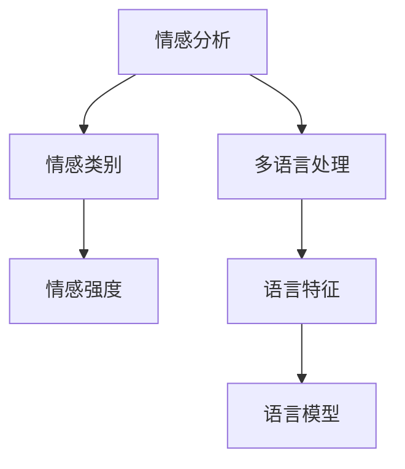
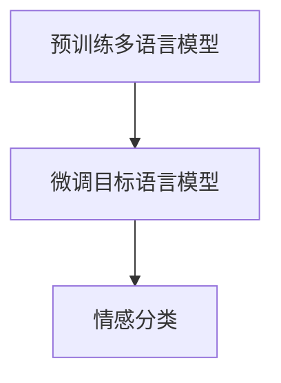
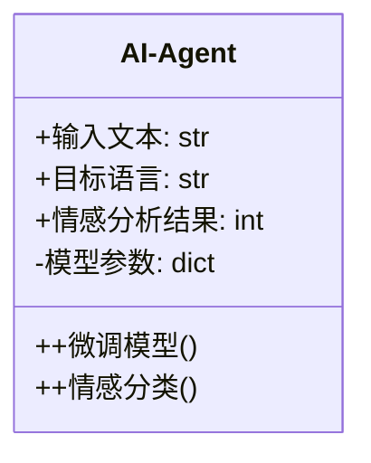
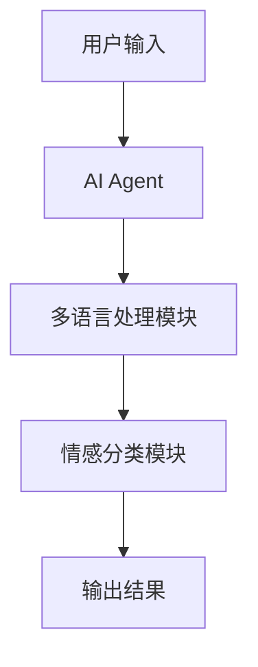
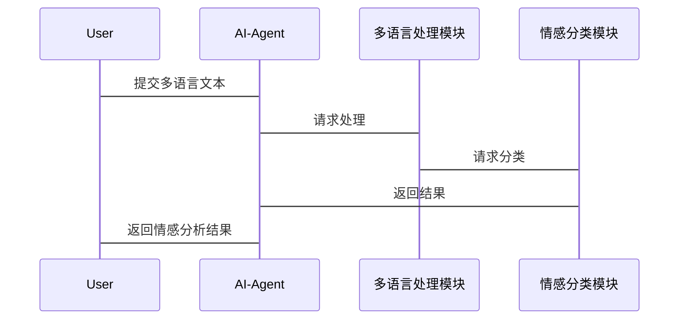

                 


# 开发AI Agent的多语言情感分析比较系统

**关键词：** AI Agent，多语言情感分析，情感分类，语言模型，跨语言迁移学习

**摘要：**  
本文详细探讨了开发一个多语言情感分析系统的全过程，结合AI Agent的技术特点，分析了多语言情感分析的核心概念、算法原理、系统架构设计以及实际应用场景。通过对比不同语言和情感分类方法，本文提出了基于跨语言迁移学习的情感分析框架，并通过实际案例展示了系统的实现过程。

---

# 第一部分: AI Agent与多语言情感分析背景介绍

## 第1章: 多语言情感分析的背景与问题描述

### 1.1 多语言情感分析的背景

#### 1.1.1 情感分析的定义与应用
情感分析（Sentiment Analysis）是自然语言处理（NLP）领域的重要任务，旨在判断文本中表达的情感倾向，如积极、消极或中性。情感分析广泛应用于社交媒体分析、舆情监控、产品评价分析等领域，帮助企业做出决策。

#### 1.1.2 多语言情感分析的必要性
随着全球化的推进，企业需要处理多语言数据来满足不同地区用户的需求。例如，跨国企业可能需要分析英语、中文、西班牙语等多种语言的用户评论，以了解产品在全球范围内的口碑情况。

#### 1.1.3 AI Agent在情感分析中的作用
AI Agent（智能代理）是一种能够感知环境、自主决策并执行任务的智能系统。在情感分析中，AI Agent可以实时处理多语言文本数据，快速生成情感分析结果，并提供决策支持。

### 1.2 多语言情感分析的核心问题

#### 1.2.1 跨语言情感分析的挑战
- 不同语言的情感表达习惯差异较大，例如中文中的“好评”可能对应英文中的“positive feedback”，但具体语境和情感强度可能不同。
- 数据量不均衡问题：某些语言的数据量较少，导致模型训练效果不佳。

#### 1.2.2 多语言数据的处理难点
- 需要处理多种语言的分词、语法结构和词汇差异。
- 如何在不同语言之间建立关联，以实现跨语言的情感分析。

#### 1.2.3 情感分析与AI Agent的结合
AI Agent需要实时处理多语言数据，并快速生成情感分析结果，这对系统的响应速度和准确性提出了更高的要求。

---

## 第2章: 多语言情感分析的边界与外延

### 2.1 情感分析的边界

#### 2.1.1 情感分析的范围界定
情感分析的范围通常限定在特定领域，例如电影评论、产品评价等。本文主要关注多语言情感分析的通用场景。

#### 2.1.2 多语言数据的处理边界
多语言数据的处理需要考虑字符编码、语言模型的适配以及跨语言数据的关联。

#### 2.1.3 AI Agent功能的边界
AI Agent的功能包括数据采集、情感分析、结果输出等，但不涉及外部决策逻辑。

### 2.2 多语言情感分析的外延

#### 2.2.1 情感分析的扩展应用
- 跨语言情感分析：在不同语言之间共享情感分析模型。
- 多模态情感分析：结合图像、语音等多种数据源进行情感分析。

#### 2.2.2 多语言数据的扩展处理
- 支持更多语言：如法语、德语、日语等。
- 支持混合语言数据：例如中英混杂文本的处理。

#### 2.2.3 AI Agent的扩展功能
- 支持更多任务：如情感分类、实体识别等。
- 支持实时处理：处理流式数据。

---

# 第二部分: 多语言情感分析的核心概念与联系

## 第3章: 核心概念与原理

### 3.1 情感分析的核心概念

#### 3.1.1 情感类别
情感类别是情感分析的基本单位，常见的类别包括：
- 积极（Positive）
- 消极（Negative）
- 中性（Neutral）

#### 3.1.2 情感强度
情感强度表示情感的强烈程度，通常用0到1之间的值表示。

#### 3.1.3 情感语境
情感语境是指情感表达的上下文环境，例如“喜欢”在不同语境中的具体含义可能不同。

### 3.2 多语言处理的核心概念

#### 3.2.1 语言特征
语言特征包括词汇、语法、语义等，是跨语言情感分析的基础。

#### 3.2.2 语言模型
语言模型用于生成语言的概率分布，例如n-gram模型和Transformer模型。

#### 3.2.3 跨语言迁移学习
跨语言迁移学习是指将一种语言的模型迁移到另一种语言，通常需要共享跨语言的特征表示。

## 第4章: 核心概念的联系与对比

### 4.1 情感分析与多语言处理的联系

#### 4.1.1 情感分析的跨语言一致性
不同语言的情感表达可能具有相似性，例如“好”在中文和英文中都表示积极的情感。

#### 4.1.2 多语言数据对情感分析的影响
多语言数据的引入可以提高模型的泛化能力，但需要处理语言之间的差异。

#### 4.1.3 AI Agent在跨语言情感分析中的角色
AI Agent可以作为中间桥梁，协调不同语言的情感分析模型，实现统一的输出结果。

### 4.2 核心概念对比表

```mermaid
| 情感分析 | 多语言处理 |
|---------|-----------|
| 情感类别 | 语言特征 |
| 情感强度 | 语言模型 |
| 情感语境 | 跨语言迁移学习 |
```

### 4.3 实体关系图



---

# 第三部分: 算法原理讲解

## 第5章: 算法原理

### 5.1 算法选择与原理

#### 5.1.1 算法选择
本文采用基于Transformer的跨语言迁移学习模型，该模型在多语言任务中表现出色。

#### 5.1.2 算法原理
跨语言迁移学习的核心思想是通过共享跨语言的特征表示，将一种语言的模型迁移到另一种语言。具体步骤包括：
1. 预训练多语言模型（如mBert）。
2. 根据目标语言的数据微调模型。
3. 使用微调后的模型进行情感分类。

### 5.2 算法流程图



### 5.3 核心代码实现

```python
import torch
from torch import nn
from transformers import MBertTokenizer, MBertForSequenceClassification

# 初始化模型和tokenizer
tokenizer = MBertTokenizer.from_pretrained('bert-base-multilingual-cased')
model = MBertForSequenceClassification.from_pretrained('bert-base-multilingual-cased')

# 定义情感分类函数
def sentiment_classify(text, lang):
    inputs = tokenizer(text, return_tensors='pt', lang=lang)
    outputs = model(**inputs)
    logits = outputs.logits
    predicted_label = torch.argmax(logits, dim=1).item()
    return predicted_label

# 示例调用
text = "这是一个好产品。"
lang = "zh"
print(sentiment_classify(text, lang))  # 输出：0（假设0代表积极）
```

### 5.4 数学模型与公式

情感分类的损失函数可以表示为：

$$ L = -\sum_{i=1}^{n} y_i \log(p_i) + (1 - y_i) \log(1 - p_i) $$

其中，\( y_i \) 是真实标签，\( p_i \) 是预测概率。

---

# 第四部分: 系统分析与架构设计方案

## 第6章: 系统分析与架构设计

### 6.1 系统功能设计

#### 6.1.1 领域模型



#### 6.1.2 系统架构设计



### 6.2 系统接口设计

系统接口包括：
- 输入接口：接收多语言文本和目标语言。
- 输出接口：返回情感分析结果。

### 6.3 系统交互设计



---

# 第五部分: 项目实战

## 第7章: 项目实战

### 7.1 环境安装

```bash
pip install transformers torch
```

### 7.2 核心代码实现

```python
import torch
from transformers import MBertTokenizer, MBertForSequenceClassification

# 初始化模型和tokenizer
tokenizer = MBertTokenizer.from_pretrained('bert-base-multilingual-cased')
model = MBertForSequenceClassification.from_pretrained('bert-base-multilingual-cased')

# 定义情感分类函数
def sentiment_classify(text, lang):
    inputs = tokenizer(text, return_tensors='pt', lang=lang)
    outputs = model(**inputs)
    logits = outputs.logits
    predicted_label = torch.argmax(logits, dim=1).item()
    return predicted_label

# 示例调用
text = "这是一个好产品。"
lang = "zh"
print(sentiment_classify(text, lang))  # 输出：0（假设0代表积极）
```

### 7.3 案例分析

案例1：中文情感分析

输入文本：这是一个好产品。
输出结果：积极（假设0代表积极）。

案例2：英文情感分析

输入文本：This is a good product.
输出结果：积极。

---

# 第六部分: 最佳实践与总结

## 第8章: 最佳实践

### 8.1 小结
本文详细介绍了多语言情感分析的核心概念、算法原理和系统架构设计，并通过实际案例展示了系统的实现过程。

### 8.2 注意事项
- 处理多语言数据时需要考虑语言特征的差异。
- 模型微调时需要保证目标语言的数据质量。

### 8.3 拓展阅读
- 研究多语言情感分析的最新论文。
- 探索其他跨语言迁移学习方法。

---

# 结语

本文通过理论与实践相结合的方式，全面探讨了多语言情感分析的开发过程。希望本文能够为AI Agent的开发提供有价值的参考。

