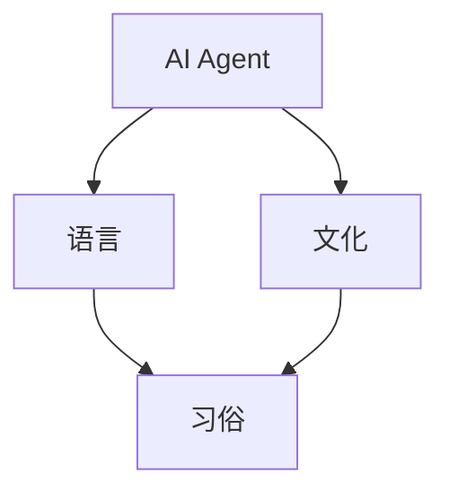
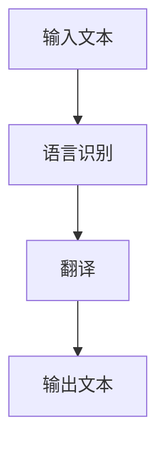
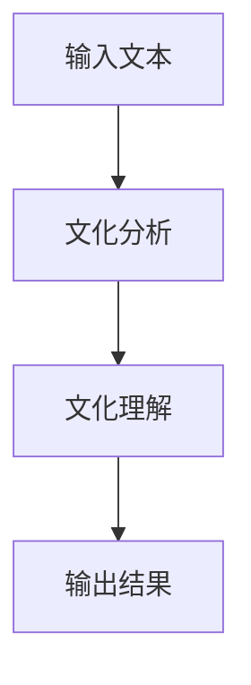
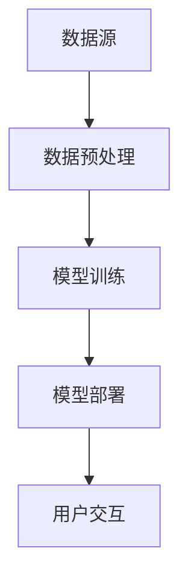

                 

# 开发AI Agent的多语言文化习俗理解系统

## 关键词：
AI Agent, 多语言, 文化习俗, 自然语言处理, 深度学习, 文化敏感性, 跨语言理解

## 摘要：
本文详细探讨了开发AI Agent的多语言文化习俗理解系统的各个方面，从核心概念到算法原理，再到系统架构设计和项目实战。通过分析多语言处理和文化习俗理解的重要性，本文提出了一个基于深度学习的解决方案，并结合实际案例展示了系统的实现过程。文章还总结了开发中的注意事项和未来优化方向，为读者提供了全面的指导。

---

# 第一部分: AI Agent的多语言文化习俗理解系统概述

## 第1章: AI Agent与多语言文化习俗理解概述

### 1.1 AI Agent的基本概念
#### 1.1.1 AI Agent的定义
AI Agent（人工智能代理）是一种能够感知环境、自主决策并执行任务的智能体。它通过传感器获取信息，利用计算模型进行分析，并通过执行器与环境互动。

#### 1.1.2 AI Agent的核心特征
- **自主性**：能够在没有外部干预的情况下运行。
- **反应性**：能够实时感知环境并做出反应。
- **目标导向**：根据目标进行决策和行动。
- **学习能力**：能够通过经验改进自身的性能。

#### 1.1.3 多语言文化习俗理解的必要性
在跨文化交流中，AI Agent需要理解不同语言和文化背景下的隐含含义和习俗，以提供更准确和自然的交互体验。

---

### 1.2 多语言文化习俗理解的背景
#### 1.2.1 全球化背景下的跨文化沟通需求
随着全球化的发展，跨文化交流变得频繁，AI Agent需要能够处理多种语言和文化背景的信息。

#### 1.2.2 多语言处理的技术挑战
- **语言差异**：不同语言的语法、语义和表达习惯差异较大。
- **文化差异**：文化习俗影响语言的使用和理解，例如问候方式、禁忌词汇等。

#### 1.2.3 文化习俗理解的现实意义
理解文化习俗可以帮助AI Agent避免误解，提供更符合用户习惯的服务，提升用户体验。

---

### 1.3 问题背景与目标
#### 1.3.1 问题背景分析
在跨文化交流中，AI Agent需要准确理解不同语言和文化背景下的用户需求，否则可能导致误解或不恰当的回应。

#### 1.3.2 问题描述与目标
- **问题描述**：AI Agent在处理多语言和文化习俗时，存在理解偏差和表达不当的问题。
- **问题目标**：开发一个能够理解多种语言和文化习俗的AI Agent系统，提升跨文化交流的准确性和自然度。

#### 1.3.3 解决方案概述
通过结合自然语言处理技术和文化分析方法，构建一个多语言文化习俗理解系统，帮助AI Agent更好地理解用户需求。

---

### 1.4 系统边界与外延
#### 1.4.1 系统边界定义
系统专注于AI Agent的多语言和文化习俗理解能力，不涉及其他功能如任务执行或数据存储。

#### 1.4.2 外延与相关领域的联系
- **自然语言处理**：语言理解、机器翻译。
- **文化研究**：文化习俗分析、社会规范研究。
- **人工智能**：AI Agent的设计与实现。

#### 1.4.3 核心要素组成分析
- **语言模型**：用于理解和生成多种语言文本。
- **文化模型**：用于理解和应用文化习俗规则。
- **整合机制**：将语言和文化模型结合，提供统一的交互体验。

---

### 1.5 本章小结
本章介绍了AI Agent的基本概念、多语言文化习俗理解的重要性，并提出了系统开发的目标和范围。

---

# 第2章: 多语言文化习俗理解的核心概念与联系

## 2.1 核心概念原理
### 2.1.1 多语言处理的原理
多语言处理包括语言识别、翻译和文本分析等步骤，通过技术手段实现跨语言的信息理解和转换。

### 2.1.2 文化习俗理解的原理
文化习俗理解基于对特定文化背景下的社会规范和习惯的分析，通常需要结合领域知识和上下文信息。

### 2.1.3 AI Agent的整合机制
AI Agent通过整合多语言处理和文化习俗理解模块，实现对跨文化信息的全面理解。

---

## 2.2 核心概念属性特征对比
### 2.2.1 多语言处理的特征
- **多样性**：支持多种语言。
- **准确性**：翻译和理解的准确性。
- **实时性**：快速响应。

### 2.2.2 文化习俗理解的特征
- **文化特定性**：不同文化有不同的习俗和规范。
- **动态性**：文化习俗可能随时间变化。
- **复杂性**：涉及多个方面的社会规范和习惯。

### 2.2.3 对比分析与总结
多语言处理和文化习俗理解在准确性、实时性和动态性等方面存在差异，但两者相辅相成，共同提升AI Agent的跨文化交互能力。

---

## 2.3 ER实体关系图
通过ER图分析多语言文化习俗理解系统的核心实体及其关系：

- **AI Agent**：系统主体。
- **语言**：多语言支持的实体。
- **文化**：文化背景的实体。
- **习俗**：文化中的具体习俗和规则。

---

### 2.4 本章小结
本章分析了多语言文化习俗理解的核心概念及其特征，通过ER图展示了系统的主要实体关系。

---

# 第3章: 多语言文化习俗理解的算法原理

## 3.1 多语言处理算法
### 3.1.1 机器翻译模型
机器翻译模型如神经机器翻译（NMT）通过深度学习技术实现高质量的跨语言翻译。

#### 3.1.1.1 神经机器翻译模型
神经机器翻译模型包括编码器和解码器，用于将源语言文本编码为向量，再解码为目标语言文本。

#### 3.1.1.2 算法流程图

### 3.1.2 跨语言文本分析
跨语言文本分析包括情感分析、关键词提取等任务，通常需要结合语言和文化背景信息。

---

## 3.2 文化习俗理解算法
### 3.2.1 基于规则的系统
基于规则的系统通过预定义的文化习俗规则进行判断和推理。

### 3.2.2 基于深度学习的系统
基于深度学习的系统通过训练文化相关的数据，学习文化习俗的理解和应用。

#### 3.2.2.1 深度学习模型
深度学习模型如循环神经网络（RNN）和Transformer用于文化习俗的理解和生成。

#### 3.2.2.2 算法流程图

---

## 3.3 数学模型与公式
### 3.3.1 语言模型
语言模型通过概率分布预测下一个词，常用公式如下：
$$ P(w_1, w_2, ..., w_n) = \prod_{i=1}^{n} P(w_i | w_1, ..., w_{i-1}) $$

### 3.3.2 文化模型
文化模型通过向量表示文化特征，常用公式如下：
$$ C = f(w_1, w_2, ..., w_n) $$

---

## 3.4 本章小结
本章详细介绍了多语言处理和文化习俗理解的算法原理，包括机器翻译模型和深度学习模型的应用。

---

# 第4章: 系统架构设计与实现

## 4.1 系统架构设计
### 4.1.1 整体架构
系统架构包括数据采集、预处理、模型训练和部署等模块。

### 4.1.2 功能模块设计
- **数据采集**：获取多语言和文化习俗相关的数据。
- **数据预处理**：清洗和标注数据。
- **模型训练**：训练多语言和文化习俗理解模型。
- **模型部署**：将模型部署到AI Agent中，提供实时服务。

---

## 4.2 系统实现
### 4.2.1 环境安装
安装必要的开发环境和库，如Python、TensorFlow、PyTorch等。

### 4.2.2 数据集准备
准备多语言和文化习俗相关的数据集，进行清洗和标注。

### 4.2.3 模型训练
训练机器翻译模型和文化习俗理解模型，评估模型性能。

### 4.2.4 系统集成
将训练好的模型集成到AI Agent中，实现多语言文化习俗理解功能。

---

## 4.3 本章小结
本章详细描述了系统架构设计和实现过程，包括数据处理、模型训练和系统集成。

---

# 第5章: 项目实战与案例分析

## 5.1 项目实战
### 5.1.1 环境安装
安装Python、TensorFlow、Keras等开发工具。

### 5.1.2 数据集准备
收集和整理多语言和文化习俗相关的数据集。

### 5.1.3 模型实现
实现机器翻译和文化习俗理解模型，进行训练和测试。

### 5.1.4 系统测试
对系统进行全面测试，验证其多语言和文化习俗理解能力。

---

## 5.2 案例分析
### 5.2.1 案例背景
以跨语言客服系统为例，展示系统的实际应用。

### 5.2.2 系统设计
设计一个多语言客服系统，支持多种语言和文化习俗的理解。

### 5.2.3 实现与分析
详细分析系统的实现过程和效果，验证系统的有效性。

---

## 5.3 本章小结
本章通过实际项目展示了多语言文化习俗理解系统的开发过程和应用效果。

---

# 第6章: 总结与展望

## 6.1 总结
总结本文的主要内容和研究成果，强调多语言文化习俗理解的重要性。

## 6.2 未来展望
提出未来的研究方向，如更高效的语言模型和更复杂的文化习俗理解方法。

---

## 6.3 开发中的注意事项
- **数据质量**：确保数据的多样性和准确性。
- **模型选择**：根据具体需求选择合适的模型。
- **文化敏感性**：在处理文化习俗时需谨慎，避免冒犯。

---

## 6.4 最佳实践 tips
- **模块化设计**：将系统划分为独立模块，便于维护和扩展。
- **持续优化**：定期更新模型和数据，提升系统性能。

---

## 6.5 本章小结
本章总结了全文内容，并展望了未来的研究方向，提出了开发中的注意事项和最佳实践。

---

# 附录

## 附录A: 参考文献
列出本文中引用的主要文献和资料。

## 附录B: 开发工具推荐
推荐常用的开发工具和库，如TensorFlow、PyTorch等。

---

以上为文章的详细目录大纲，涵盖了从背景介绍到项目实战的各个方面，结构清晰，内容详实。接下来，我将按照这个大纲撰写完整的文章内容。

