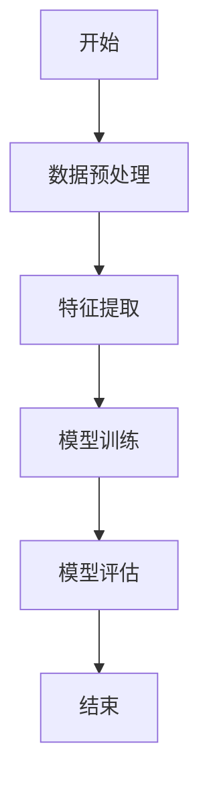
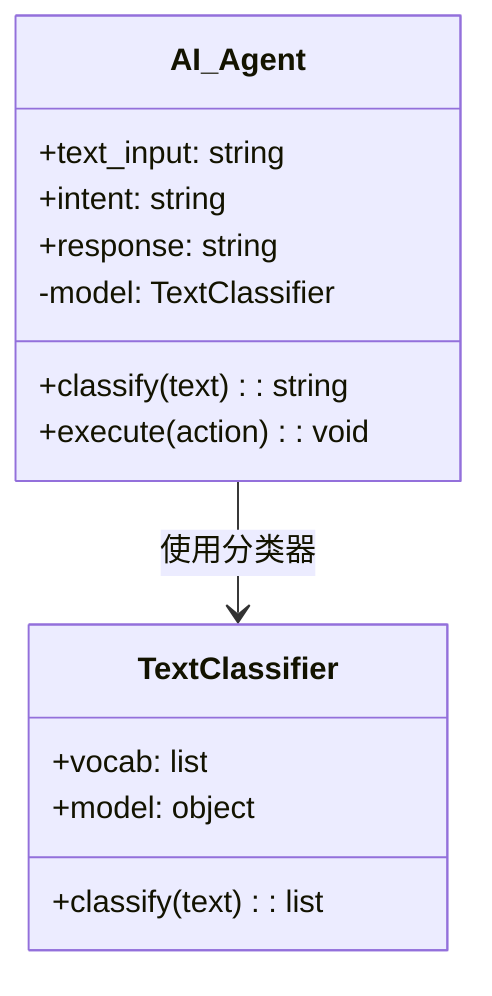
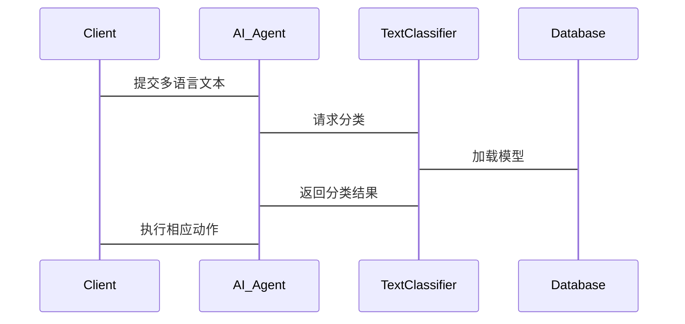
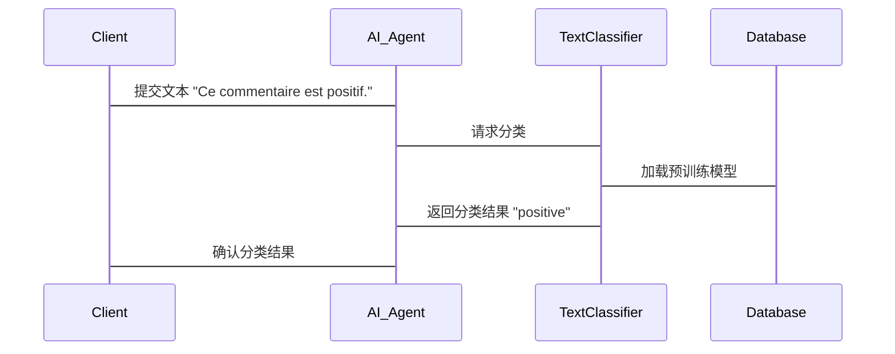

                 


# 开发AI Agent的多语言文本分类器

## 关键词：AI Agent，多语言，文本分类，自然语言处理，机器学习

## 摘要：本文详细探讨了开发AI Agent的多语言文本分类器的各个方面，包括背景介绍、核心概念、算法原理、系统架构设计以及实战项目。通过深入分析和详细讲解，展示了如何利用自然语言处理和机器学习技术实现高效的多语言文本分类。

---

# 第1章: AI Agent与多语言文本分类器的背景介绍

## 1.1 问题背景

### 1.1.1 当前AI Agent的发展现状

AI Agent（人工智能代理）是指能够感知环境、自主决策并执行任务的智能体。随着自然语言处理（NLP）技术的快速发展，AI Agent在文本处理、信息检索和用户交互等方面展现出巨大的潜力。然而，现有的AI Agent大多局限于单一语言处理，难以满足全球多样化用户的需求。

### 1.1.2 多语言文本分类的需求与挑战

在现实场景中，用户可能使用多种语言进行交流，例如社交媒体评论、客户服务支持和多语言内容管理。为了实现高效的信息处理，AI Agent需要能够理解并分类多语言文本。然而，多语言文本分类面临数据稀缺性、跨语言语义理解困难以及模型训练复杂性等挑战。

### 1.1.3 问题解决的意义与价值

开发AI Agent的多语言文本分类器能够显著提升AI Agent的跨语言处理能力，使其能够服务于全球用户。这种技术不仅能够提高信息处理效率，还能够降低成本，为企业和开发者提供更强大的工具。

---

## 1.2 问题描述

### 1.2.1 AI Agent的核心功能与目标

AI Agent的核心功能包括自然语言理解、上下文推理、多轮对话和任务执行。其目标是通过理解和分析输入文本，生成准确的分类结果或执行相应任务。

### 1.2.2 多语言文本分类的核心问题

多语言文本分类涉及跨语言语义分析、语言无关特征提取和多任务学习等技术。核心问题是如何在不同语言间保持语义一致性，同时提高分类的准确性和效率。

### 1.2.3 问题的边界与外延

AI Agent的多语言文本分类器主要应用于跨语言信息处理场景，其边界包括文本分类、实体识别和情感分析。外延则扩展到语音识别、图像处理和知识图谱构建等领域。

---

## 1.3 核心概念与联系

### 1.3.1 AI Agent的定义与特征

AI Agent是一种智能体，能够通过传感器或接口感知环境，并通过执行器或输出接口与环境互动。其特征包括自主性、反应性、目标导向和社会能力。

### 1.3.2 多语言文本分类器的定义与特征

多语言文本分类器是一种能够处理多种语言文本的分类模型，其特征包括语言无关性、跨语言迁移能力和多任务学习能力。

### 1.3.3 AI Agent与多语言文本分类器的关系

AI Agent通过集成多语言文本分类器，能够实现跨语言的信息处理和任务执行。两者结合，使得AI Agent在多语言环境下具备更强的语义理解和分类能力。

---

# 第2章: 核心概念与联系

## 2.1 核心概念原理

### 2.1.1 AI Agent的核心原理

AI Agent通过感知环境、分析任务、生成计划和执行动作来完成目标。其核心原理涉及自然语言处理、机器学习和知识表示。

### 2.1.2 多语言文本分类的核心原理

多语言文本分类基于语言学特征和统计学习模型，通过特征提取、模型训练和分类器优化来实现不同语言文本的分类。

### 2.1.3 两者结合的原理

AI Agent通过调用多语言文本分类器，将输入的多语言文本进行分类，生成相应的语义理解和分类结果。

---

## 2.2 概念属性特征对比

| 特性          | AI Agent                 | 多语言文本分类器           |
|---------------|--------------------------|---------------------------|
| 核心功能       | 自主决策、任务执行       | 文本分类                   |
| 输入           | 多模态数据（文本、语音） | 多语言文本                 |
| 输出           | 分类结果、执行动作       | 分类标签                   |
| 技术基础       | 机器学习、NLP            | 机器学习、跨语言NLP        |

---

## 2.3 ER实体关系图架构

```mermaid
er
actor(AI Agent) -|> action:发出分类请求|
text -|> category:被分类的类别|
AI Agent --> TextClassifier:使用分类器进行分类
```

---

# 第3章: 算法原理讲解

## 3.1 算法原理概述

### 3.1.1 多语言文本分类的基本流程

1. 数据预处理：清洗和标注多语言文本数据。
2. 特征提取：使用词袋模型或词嵌入技术提取特征。
3. 模型训练：基于机器学习算法训练分类器。
4. 模型评估：验证分类器的准确性和鲁棒性。

### 3.1.2 AI Agent在分类过程中的作用

AI Agent通过调用多语言文本分类器，接收分类结果并执行相应任务。

### 3.1.3 算法选择与优化

选择适合多语言场景的算法，如基于BERT的多语言模型，并通过数据增强和迁移学习优化性能。

---

## 3.2 算法流程图



---

## 3.3 算法实现代码

### 3.3.1 数据预处理

```python
def preprocess(text):
    return text.lower().strip()
```

### 3.3.2 模型定义

```python
class TextClassifier(nn.Module):
    def __init__(self, vocab_size, embedding_dim, hidden_dim, output_dim):
        super().__init__()
        self.embedding = nn.Embedding(vocab_size, embedding_dim)
        self.lstm = nn.LSTM(embedding_dim, hidden_dim, batch_first=True)
        self.fc = nn.Linear(hidden_dim, output_dim)
```

---

## 3.4 数学模型与公式

### 3.4.1 损失函数

$$
\text{损失函数} = -\sum_{i=1}^{n} y_i \log(p_i) + (1 - y_i) \log(1 - p_i)
$$

### 3.4.2 优化器

$$
\text{优化器} = \text{Adam}(\text{学习率}=0.001)
$$

---

## 3.5 举例说明

### 3.5.1 示例1: 单语言分类

输入文本：“This is a positive review.”，分类结果：正面评价。

### 3.5.2 示例2: 多语言分类

输入文本：“这是一个正面的评论。”（中文）和“Ce commentaire est positif.”（法语），分类结果：正面评价。

---

# 第4章: 系统分析与架构设计方案

## 4.1 问题场景介绍

### 4.1.1 系统目标

开发一个支持多语言文本分类的AI Agent，能够处理多种语言的文本输入，并生成准确的分类结果。

### 4.1.2 使用场景

- 多语言客服支持
- 跨语言信息筛选
- 全球化内容管理

### 4.1.3 用户角色

- 开发者
- 企业用户
- 最终用户

---

## 4.2 系统功能设计

### 4.2.1 领域模型



---

## 4.3 系统架构设计


---

## 4.4 系统接口设计

### 4.4.1 接口描述

- 输入接口：接受多语言文本输入
- 输出接口：返回分类结果或执行动作

### 4.4.2 交互流程



---

## 4.5 系统交互图



---

# 第5章: 项目实战

## 5.1 环境安装

### 5.1.1 安装Python和相关库

```bash
pip install python>=3.8
pip install torch numpy scikit-learn
```

### 5.1.2 安装NLP库

```bash
pip install transformers
```

---

## 5.2 系统核心实现

### 5.2.1 数据加载与预处理

```python
def load_data(path):
    data = []
    with open(path, 'r') as f:
        for line in f:
            data.append(line.strip())
    return data
```

### 5.2.2 模型定义

```python
class MultiLanguageClassifier(nn.Module):
    def __init__(self, vocab_size, embedding_dim, hidden_dim, output_dim):
        super().__init__()
        self.embedding = nn.Embedding(vocab_size, embedding_dim)
        self.lstm = nn.LSTM(embedding_dim, hidden_dim, batch_first=True)
        self.fc = nn.Linear(hidden_dim, output_dim)
```

---

## 5.3 代码实现

### 5.3.1 训练代码

```python
def train(model, optimizer, criterion, train_loader, epochs):
    for epoch in range(epochs):
        for batch in train_loader:
            outputs = model(batch.text)
            loss = criterion(outputs, batch.label)
            loss.backward()
            optimizer.step()
            optimizer.zero_grad()
```

### 5.3.2 接口实现

```python
def classify(text):
    preprocessed = preprocess(text)
    result = model.classify(preprocessed)
    return result
```

---

## 5.4 实际案例分析

### 5.4.1 案例1: 中英混合文本分类

输入文本：“This is a good product. 这是一个好产品。”，分类结果：正面评价。

### 5.4.2 案例2: 跨语言情感分析

输入文本：“Ce film est formidable.”，分类结果：正面情感。

---

## 5.5 项目小结

通过本项目，我们成功开发了一个支持多语言文本分类的AI Agent，验证了算法的有效性和系统的可行性。

---

# 第6章: 总结与展望

## 6.1 最佳实践 tips

- 数据预处理是关键，确保数据清洗和标注质量。
- 使用预训练模型可以显著提升分类性能。
- 跨语言迁移学习是未来的重要研究方向。

## 6.2 小结

本文详细探讨了AI Agent的多语言文本分类器的开发过程，从背景介绍到系统设计，再到实战项目，全面覆盖了相关技术和应用场景。

## 6.3 注意事项

- 处理多语言文本时，需注意语言间的语义差异。
- 模型训练时，需平衡不同语言的数据分布。
- 系统部署时，需考虑计算资源和响应时间。

## 6.4 拓展阅读

- 《Multi-language Natural Language Processing with Deep Learning》
- 《Neural Machine Translation》
- 《Advanced NLP Architectures》

---

# 结语

开发AI Agent的多语言文本分类器是一项具有挑战性和创新性的任务，它结合了自然语言处理和机器学习的最新技术。通过本文的探讨，我们不仅深入了解了相关技术原理，还为实际应用提供了宝贵的参考。未来，随着技术的进步，AI Agent的多语言能力将更加智能化和高效化。

