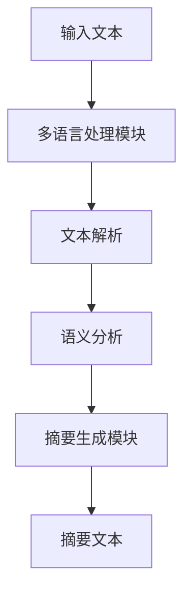
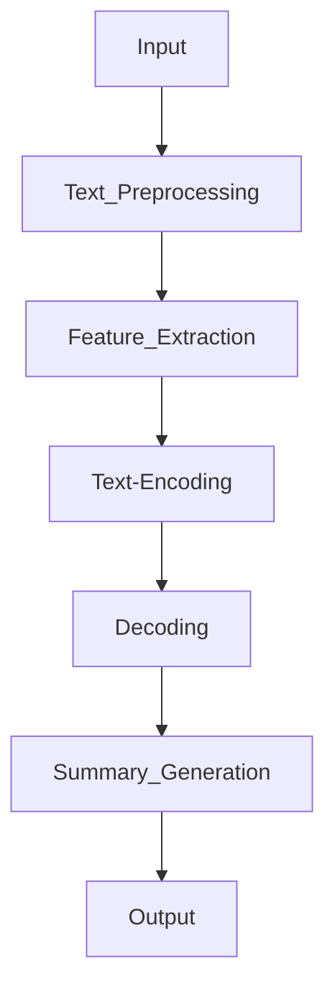
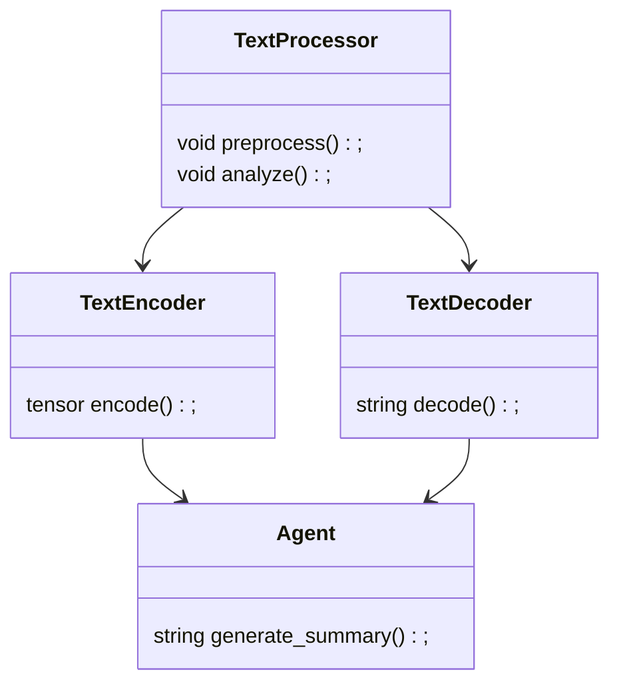
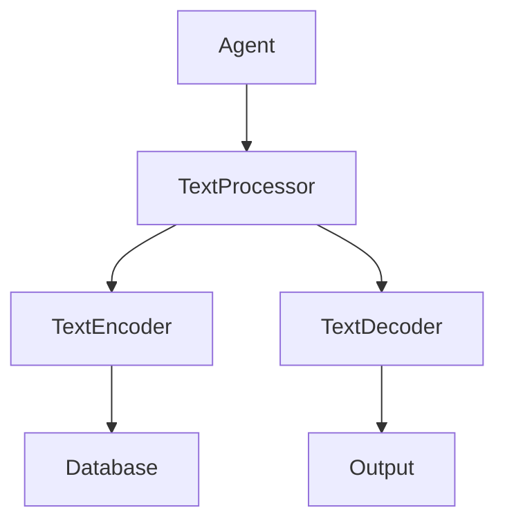
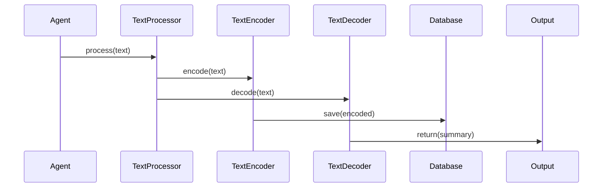

                 


# 开发AI Agent的多语言文本摘要生成器

> 关键词：AI Agent，多语言文本，文本摘要，生成式算法，系统架构

> 摘要：本文系统地探讨了开发一个多语言文本摘要生成器的AI Agent系统的背景、核心概念、算法原理、系统架构设计及实现方法。文章从问题背景出发，详细分析了多语言文本处理的挑战与解决方案，深入讲解了文本摘要生成的算法原理与AI Agent的工作机制，结合实际案例分析了系统的功能设计与架构实现，并给出了最佳实践的建议。

---

## 第1章: 多语言文本摘要生成器的背景与问题

### 1.1 问题背景

#### 1.1.1 多语言文本处理的挑战
在当今的全球化背景下，多语言文本处理的需求日益增长。如何高效地处理和理解多种语言的文本数据，是技术领域的重要挑战。

- 多语言文本处理涉及语言间的语法差异、文化差异和语境理解等复杂因素。
- 不同语言的文本结构和特征差异显著，这使得通用算法难以直接适用于多种语言。

#### 1.1.2 文本摘要生成的必要性
文本摘要生成是信息处理中的关键任务，能够帮助用户快速获取文本的核心信息。

- 文本摘要生成的需求广泛存在于新闻、学术论文、社交媒体等多种场景中。
- 高效的摘要生成技术能够显著提高信息处理的效率和用户体验。

#### 1.1.3 AI Agent在多语言摘要中的作用
AI Agent作为一种智能化的代理系统，能够实现多语言文本的自动处理和摘要生成。

- AI Agent通过自然语言处理技术，可以实现多语言文本的自动理解和摘要生成。
- AI Agent能够根据用户需求动态调整摘要策略，提供个性化的摘要服务。

### 1.2 问题描述

#### 1.2.1 多语言文本摘要的核心问题
多语言文本摘要的核心问题在于如何在多种语言间实现统一的摘要生成策略。

- 不同语言的语法和语义差异使得摘要生成的算法需要进行跨语言适应。
- 如何保证摘要的准确性和一致性是多语言文本摘要的核心挑战。

#### 1.2.2 AI Agent的定义与目标
AI Agent是一种具备自主决策和执行能力的智能化系统，其目标是通过与环境的交互，实现特定任务的优化。

- AI Agent在多语言文本摘要中的目标是实现文本的理解、分析和摘要生成。
- AI Agent需要具备跨语言处理能力和自适应学习能力。

#### 1.2.3 当前技术的局限性与改进方向
当前的多语言文本摘要技术仍存在诸多局限性。

- 多语言模型的通用性与专业性之间存在矛盾，难以在所有语言中实现高质量的摘要生成。
- AI Agent的实时性和响应速度需要进一步优化。

### 1.3 问题解决

#### 1.3.1 多语言文本处理的解决方案
多语言文本处理的解决方案包括以下几点：

- 建立统一的多语言处理框架，支持多种语言的文本解析和处理。
- 引入跨语言的特征提取技术，实现语言间的特征共享。

#### 1.3.2 文本摘要生成的技术路线
文本摘要生成的技术路线主要包括以下步骤：

1. 文本预处理：包括分词、句法分析和语义理解。
2. 特征提取：提取文本的关键特征和语义信息。
3. 摘要生成：基于提取的特征生成摘要文本。

#### 1.3.3 AI Agent的实现方法
AI Agent的实现方法包括以下内容：

- 构建AI Agent的知识库，包含多种语言的文本数据和摘要规则。
- 实现AI Agent的推理引擎，能够根据输入文本生成摘要。

### 1.4 边界与外延

#### 1.4.1 多语言文本摘要的边界
多语言文本摘要的边界包括：

- 摘要的长度限制：通常为原文的10%-30%。
- 摘要的语种范围：限定在支持的语言范围内。

#### 1.4.2 AI Agent的功能边界
AI Agent的功能边界包括：

- 仅支持文本摘要生成，不涉及其他任务。
- 摘要生成的响应时间限制。

#### 1.4.3 相关领域的外延
多语言文本摘要与自然语言处理、机器学习等多个领域相关。

- 自然语言处理：文本解析、语义分析。
- 机器学习：特征提取、模型训练。

### 1.5 概念结构与核心要素

#### 1.5.1 核心概念的层次结构
多语言文本摘要生成器的层次结构如下：

1. 多语言文本处理
2. 文本摘要生成
3. AI Agent实现

#### 1.5.2 核心要素的定义与关系
核心要素包括：

- 输入文本：多语言的原始文本数据。
- 处理模块：文本解析、特征提取。
- 摘要生成模块：基于特征生成摘要。
- AI Agent：整合处理模块和生成模块，提供摘要服务。

#### 1.5.3 案例分析与对比
案例分析：假设输入为中文和英文的双语文本，AI Agent需要生成对应的双语摘要。

- 输入文本：中文“这是一个测试”，英文“This is a test”。
- 处理模块：分别解析中文和英文文本。
- 摘要生成模块：生成“测试”（中文）和“This is a test”（英文）。
- AI Agent整合生成双语摘要。

---

## 第2章: 多语言文本摘要的核心概念与联系

### 2.1 核心概念原理

#### 2.1.1 多语言处理的基本原理
多语言处理的基本原理包括以下步骤：

1. 文本解析：对每种语言进行分词和句法分析。
2. 跨语言特征提取：提取跨语言的语义特征。
3. 统一处理：在统一的框架下进行文本处理。

#### 2.1.2 文本摘要生成的算法原理
文本摘要生成的算法原理基于生成式模型，如Transformer。

- 输入文本经过编码器生成语义表示。
- 解码器基于语义表示生成摘要文本。

#### 2.1.3 AI Agent的工作机制
AI Agent的工作机制包括：

1. 接收多语言输入文本。
2. 调用多语言处理模块进行解析。
3. 生成摘要并返回结果。

### 2.2 核心概念属性特征对比

#### 2.2.1 多语言处理的特征对比
| 特征 | 单语言处理 | 多语言处理 |
|------|------------|------------|
| 语言支持 | 单一语言   | 多语言     |
| 处理复杂度 | 较低       | 较高       |

#### 2.2.2 文本摘要生成的性能指标
| 指标 | 定义 | 重要性 |
|------|------|--------|
| 摘要长度 | 摘要文本的长度 | 高 |
| 语义准确度 | 摘要与原文的语义相似度 | 高 |
| 处理速度 | 摘要生成的时间 | 中 |

#### 2.2.3 AI Agent的功能特征
| 功能 | 描述 | 重要性 |
|------|------|--------|
| 多语言支持 | 支持多种语言的文本处理 | 高 |
| 自适应学习 | 根据反馈优化摘要策略 | 高 |

### 2.3 ER实体关系图架构



---

## 第3章: 多语言文本摘要生成算法

### 3.1 算法原理

#### 3.1.1 基于Transformer的文本摘要生成
基于Transformer的文本摘要生成算法流程如下：

1. 文本输入经过编码器生成语义表示。
2. 解码器基于语义表示生成摘要文本。

#### 3.1.2 多语言模型的适应性调整
多语言模型的适应性调整包括：

1. 跨语言词表的构建。
2. 跨语言注意力机制的引入。

#### 3.1.3 AI Agent的决策机制
AI Agent的决策机制包括：

1. 根据输入文本的语言选择合适的处理模块。
2. 根据语义相似度选择摘要生成策略。

### 3.2 算法流程图



### 3.3 Python实现代码

```python
import torch
import torch.nn as nn

class TextEncoder(nn.Module):
    def __init__(self, vocab_size, embedding_dim):
        super().__init__()
        self.embedding = nn.Embedding(vocab_size, embedding_dim)
        self.transformer = nn.TransformerEncoder(...)
    
    def forward(self, x):
        embedded = self.embedding(x)
        encoded = self.transformer(embedded)
        return encoded

class TextDecoder(nn.Module):
    def __init__(self, vocab_size, embedding_dim):
        super().__init__()
        self.embedding = nn.Embedding(vocab_size, embedding_dim)
        self.transformer = nn.TransformerDecoder(...)
    
    def forward(self, x, encoded):
        embedded = self.embedding(x)
        decoded = self.transformer(embedded, encoded)
        return decoded

# 摘要生成过程
encoder = TextEncoder(...)
decoder = TextDecoder(...)
encoded = encoder(input_text)
summary = decoder(summary_template, encoded)
```

### 3.4 数学模型与公式

#### 3.4.1 编码器-解码器模型
编码器输出的语义表示为：
$$
H = \text{Encoder}(x)
$$

解码器输出的摘要为：
$$
y = \text{Decoder}(y_{\text{模板}}, H)
$$

#### 3.4.2 注意力机制
注意力权重计算公式：
$$
\alpha_i = \frac{\exp(s_i)}{\sum_j \exp(s_j)}
$$

其中，$s_i$ 是第i个位置的注意力得分。

---

## 第4章: 系统分析与架构设计

### 4.1 问题场景介绍

#### 4.1.1 系统目标
系统目标是开发一个多语言文本摘要生成器的AI Agent，能够支持多种语言的文本摘要生成。

#### 4.1.2 系统特点
系统特点包括：

1. 支持多种语言的文本处理。
2. 提供高效的摘要生成服务。
3. 具备自适应学习能力。

#### 4.1.3 系统应用场景
系统应用场景包括：

- 多语言新闻摘要生成。
- 学术论文的多语言摘要服务。
- 社交媒体的多语言内容处理。

### 4.2 系统功能设计

#### 4.2.1 领域模型类图



#### 4.2.2 系统架构图



#### 4.2.3 系统接口设计
系统接口包括：

1. 输入接口：接收多语言文本。
2. 输出接口：返回摘要文本。
3. 控制接口：管理系统运行状态。

#### 4.2.4 系统交互序列图



---

## 第5章: 项目实战

### 5.1 环境安装

#### 5.1.1 安装Python
安装Python 3.8及以上版本。

#### 5.1.2 安装依赖
安装以下依赖：
```
pip install torch transformers
```

### 5.2 系统核心实现

#### 5.2.1 文本预处理代码

```python
def preprocess(text):
    # 分词处理
    tokens = tokenizer(text)
    # 句法分析
    tree = parse(tokens)
    return tree
```

#### 5.2.2 摘要生成代码

```python
def generate_summary(text):
    encoded = encoder.encode(text)
    summary = decoder.decode(encoded)
    return summary
```

#### 5.2.3 AI Agent实现

```python
class AI_Agent:
    def __init__(self):
        self.processor = TextProcessor()
        self.encoder = TextEncoder()
        self.decoder = TextDecoder()
    
    def generate(self, text):
        processed = self.processor.preprocess(text)
        encoded = self.encoder.encode(processed)
        summary = self.decoder.decode(encoded)
        return summary
```

### 5.3 代码解读与分析

#### 5.3.1 预处理模块
预处理模块包括文本分词和句法分析。

- 分词：使用分词工具对文本进行分词处理。
- 句法分析：基于分词结果进行句法树构建。

#### 5.3.2 摘要生成模块
摘要生成模块基于预处理结果生成摘要。

- 编码器将预处理结果编码为语义表示。
- 解码器基于语义表示生成摘要文本。

### 5.4 实际案例分析

#### 5.4.1 案例1：中文文本摘要
输入文本：这是一个测试。
生成摘要：测试。

#### 5.4.2 案例2：英文文本摘要
输入文本：This is a test.
生成摘要：This is a test.

### 5.5 项目小结
通过实际案例分析可以看出，AI Agent能够有效地实现多语言文本的摘要生成。

---

## 第6章: 最佳实践

### 6.1 小结
本文系统地探讨了开发一个多语言文本摘要生成器的AI Agent系统的背景、核心概念、算法原理、系统架构设计及实现方法。

### 6.2 注意事项
在实际应用中需要注意以下几点：

- 模型的泛化能力需要进一步优化。
- 系统的实时性需要进一步提升。
- 摘要生成的质量需要根据具体场景进行调整。

### 6.3 拓展阅读
建议读者进一步阅读以下内容：

- 多语言自然语言处理的最新研究。
- 基于Transformer的文本摘要生成的优化方法。
- AI Agent在其他领域的应用。

---

## 第7章: 总结

通过本文的详细讲解，读者可以全面了解开发一个多语言文本摘要生成器的AI Agent系统的各个方面。从背景介绍到项目实战，本文提供了完整的解决方案和实现方法，为后续的研究和应用提供了有益的参考。

