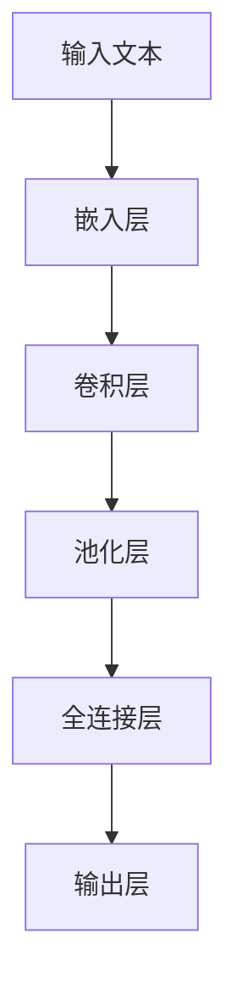
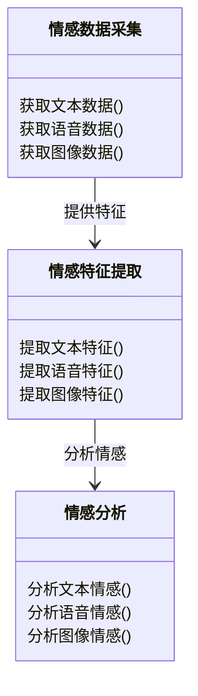
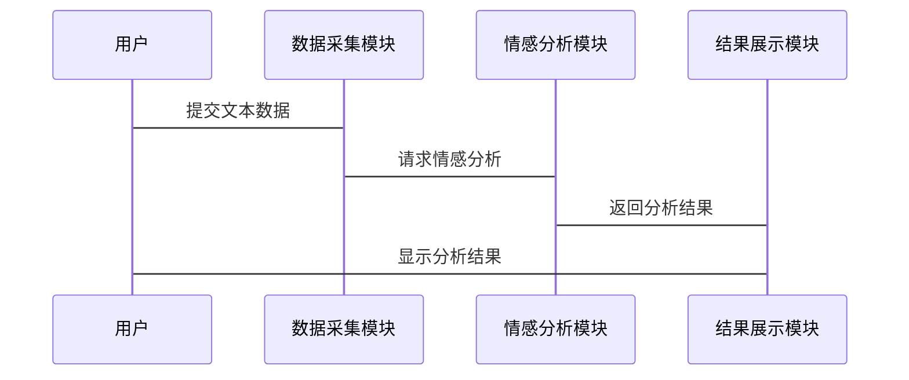

                 


# 开发AI Agent的情感计算在市场分析中的应用

> 关键词：AI Agent、情感计算、市场分析、深度学习、自然语言处理、情感分析、大数据分析

> 摘要：本文详细探讨了情感计算在市场分析中的应用，介绍了AI Agent如何通过情感计算技术进行市场预测和决策支持。文章从情感计算的基本概念、算法原理、系统架构到项目实战，全面解析了情感计算在市场分析中的核心作用，并通过实际案例展示了其在市场分析中的具体应用和优势。

---

# 正文

## 第一部分: 情感计算与市场分析的背景介绍

### 第1章: 情感计算的基本概念

#### 1.1 情感计算的定义与特点

情感计算（Affective Computing）是一种通过计算技术来识别、分析和处理人类情感信息的新兴技术。它结合了计算机科学、心理学和认知科学等多个领域的知识，旨在理解人类的情感状态并基于此进行智能化决策。

情感计算的特点包括实时性、情境感知和个性化。与传统数据分析不同，情感计算不仅关注数据的表面特征，还注重挖掘数据背后的情感信息，从而为市场分析提供更深层次的支持。

#### 1.2 情感计算在市场分析中的作用

在市场分析中，情感计算可以帮助企业更好地理解消费者行为和市场趋势。例如，通过对社交媒体上的用户评论进行情感分析，企业可以了解消费者对产品的满意度、偏好以及潜在的需求变化。这些信息可以用于优化产品设计、制定营销策略以及预测市场趋势。

#### 1.3 情感计算的核心要素

- **数据来源**：情感计算的数据来源包括文本、语音和图像。文本数据通常来自社交媒体评论、新闻报道等；语音数据则来自电话客服录音；图像数据则来自面部表情分析。
- **情感分析方法**：情感分析的方法主要有基于规则的方法、统计学习方法和深度学习方法。基于规则的方法依赖于预定义的规则，适用于特定场景；统计学习方法利用机器学习算法，能够处理更复杂的数据；深度学习方法则通过神经网络模型，能够自动学习数据特征。
- **情感计算的评价指标**：准确率、召回率和F1值是常用的评价指标。准确率表示分类的正确性，召回率表示识别的完整性，F1值则是两者的一种平衡。

### 第2章: 情感计算与市场分析的关联

#### 2.1 市场分析的基本流程

市场分析的基本流程包括数据收集、数据预处理、数据分析和数据可视化。情感计算主要在数据分析阶段发挥作用，通过对文本数据的情感进行分类，帮助企业更好地理解市场动态。

#### 2.2 情感计算在市场分析中的应用

- **舆情分析**：通过分析社交媒体上的评论，企业可以了解公众对某一产品的看法，及时调整市场策略。
- **消费者行为分析**：情感计算可以帮助企业预测消费者的购买行为，优化产品设计和营销策略。
- **市场趋势预测**：通过分析市场数据中的情感信息，企业可以更准确地预测市场趋势。

#### 2.3 情感计算与其他技术的关系

- **自然语言处理（NLP）**：情感计算是NLP的一个重要分支，主要用于分析文本中的情感信息。
- **机器学习**：情感计算依赖于机器学习算法，尤其是监督学习和无监督学习方法。
- **大数据分析**：情感计算需要处理大量的数据，因此与大数据分析技术密切相关。

---

## 第二部分: 情感计算的核心概念与联系

### 第3章: 情感计算的原理与方法

#### 3.1 情感计算的原理

情感计算的核心是将人类情感转化为计算机能够理解的数学模型。通过分析文本、语音和图像中的情感特征，计算机可以模拟人类的情感识别和分析能力。

#### 3.2 情感计算的主要方法

- **基于规则的情感分析**：这种方法依赖于预定义的规则和情感词典。例如，可以通过匹配文本中的情感词汇来判断整体情感倾向。
- **统计学习的情感分析**：这种方法利用机器学习算法，如支持向量机（SVM）和随机森林（Random Forest），通过训练数据学习情感特征。
- **深度学习的情感分析**：这种方法利用神经网络模型，如卷积神经网络（CNN）和长短期记忆网络（LSTM），能够自动学习数据特征，适用于复杂的文本数据。

#### 3.3 情感计算的特征提取

- **文本特征提取**：常用的方法包括TF-IDF和词嵌入（如Word2Vec）。
- **语音特征提取**：包括音调、语速和停顿等特征。
- **图像特征提取**：包括面部表情和颜色特征。

### 第4章: 情感计算的核心概念对比

#### 4.1 情感计算方法对比表

| 方法             | 描述                                                                 | 优点                           | 缺点                           |
|------------------|----------------------------------------------------------------------|--------------------------------|--------------------------------|
| 基于规则         | 依赖预定义规则和情感词典                                       | 简单易懂，适用于特定场景         | 需要大量人工规则设计           |
| 统计学习         | 利用机器学习算法，如SVM和随机森林                               | 能处理复杂数据，准确率较高       | 需要大量标注数据               |
| 深度学习         | 利用神经网络模型，如CNN和LSTM                                   | 能自动学习特征，适用于复杂场景   | 需要大量计算资源，训练时间长     |

#### 4.2 ER实体关系图架构

```mermaid
erd
    entity 情感数据 {
        id: int
        text: string
        emotion: string
        timestamp: datetime
    }
    
    entity 情感特征 {
        id: int
        feature_name: string
        feature_value: float
    }
    
    entity 情感分析结果 {
        id: int
        emotion_score: float
        category: string
    }
    
    情感数据 --> 情感特征: 提取特征
    情感数据 --> 情感分析结果: 分析结果
```

---

## 第三部分: 情感计算的算法原理

### 第5章: 情感计算的算法实现

#### 5.1 基于深度学习的情感分析模型

以下是一个基于深度学习的情感分析模型的流程图：



#### 5.2 情感分析模型的数学模型

情感分析模型的损失函数可以表示为：

$$ L = -\frac{1}{n}\sum_{i=1}^{n} y_i \log(p_i) + (1 - y_i) \log(1 - p_i) $$

其中，$y_i$ 是真实标签，$p_i$ 是模型预测的概率。

优化器可以使用Adam优化器，其更新规则为：

$$ \theta_{t+1} = \theta_t - \eta \frac{\partial L}{\partial \theta_t} $$

其中，$\eta$ 是学习率。

#### 5.3 情感分析模型的Python实现

以下是基于深度学习的情感分析模型的Python代码示例：

```python
import tensorflow as tf
from tensorflow.keras import layers

model = tf.keras.Sequential([
    layers.Embedding(input_dim=10000, output_dim=16),
    layers.Conv1D(filters=100, kernel_size=3, padding='valid', activation='relu'),
    layers.MaxPooling1D(pool_size=4),
    layers.Dense(16, activation='relu'),
    layers.Dense(2, activation='softmax')
])

model.compile(optimizer='adam', loss='sparse_categorical_crossentropy', metrics=['accuracy'])
```

---

## 第四部分: 情感计算的系统架构与设计

### 第6章: 情感计算的系统架构

#### 6.1 系统功能设计

以下是一个情感计算系统的类图：



#### 6.2 系统架构设计

以下是一个情感计算系统的架构图：


#### 6.3 系统交互设计

以下是一个系统交互的序列图：



---

## 第五部分: 情感计算的项目实战

### 第7章: 情感计算的项目实现

#### 7.1 环境安装

需要安装以下Python库：

```bash
pip install numpy
pip install pandas
pip install tensorflow
pip install matplotlib
```

#### 7.2 核心代码实现

以下是情感分析模型的实现代码：

```python
import numpy as np
import tensorflow as tf
from tensorflow.keras import layers

# 数据准备
X_train = np.array([...])
y_train = np.array([...])

model = tf.keras.Sequential([
    layers.Embedding(input_dim=10000, output_dim=16),
    layers.Conv1D(filters=100, kernel_size=3, padding='valid', activation='relu'),
    layers.MaxPooling1D(pool_size=4),
    layers.Dense(16, activation='relu'),
    layers.Dense(2, activation='softmax')
])

model.compile(optimizer='adam', loss='sparse_categorical_crossentropy', metrics=['accuracy'])

# 训练模型
model.fit(X_train, y_train, epochs=10, batch_size=32)
```

#### 7.3 项目小结

通过实际项目的实现，我们可以看到情感计算在市场分析中的巨大潜力。情感分析模型能够帮助我们更好地理解消费者情感，优化市场策略，提高市场预测的准确性。

---

## 第六部分: 总结与展望

### 第8章: 总结与展望

#### 8.1 最佳实践 tips

- 在进行情感计算时，需要注意数据的多样性和代表性。
- 深度学习模型在情感分析中表现优异，但在处理小数据时可能效果不佳。
- 情感计算需要结合具体业务场景，灵活调整模型参数。

#### 8.2 小结

情感计算作为一种新兴的技术，正在逐步改变市场分析的方式。通过情感计算，企业能够更深入地理解消费者需求，优化产品设计，制定更有效的市场策略。

#### 8.3 注意事项

- 情感计算模型需要不断更新和优化，以适应市场的变化。
- 情感计算的应用需要结合具体业务场景，避免泛化应用。

#### 8.4 拓展阅读

- 《Deep Learning for NLP》
- 《Affective Computing: A Computational Approach》
- 《Data Mining and Business Intelligence》

---

# 结语

情感计算作为人工智能领域的重要分支，正在为市场分析带来革命性的变化。通过本文的介绍，我们希望能够帮助读者更好地理解情感计算的核心概念、算法原理和实际应用，为开发更智能的市场分析系统提供参考。

