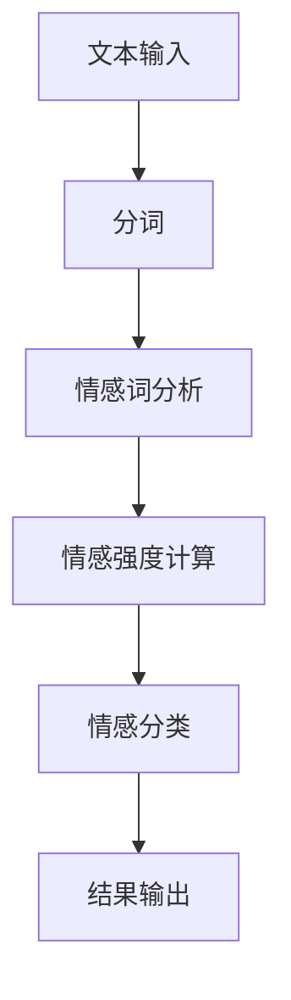

                 


# 开发AI Agent的情感计算在社交媒体分析中的应用

**关键词：** AI Agent，情感计算，社交媒体分析，文本挖掘，机器学习，自然语言处理

**摘要：** 本文探讨了AI Agent在情感计算中的应用，特别是在社交媒体分析中的具体实施方法。文章从基础概念、算法原理到系统架构和项目实战，详细阐述了情感计算的核心概念与技术实现。通过实际案例分析，展示了AI Agent如何帮助我们高效地从社交媒体数据中提取情感信息，为商业决策提供支持。

---

# 第一部分：情感计算与社交媒体分析基础

## 第1章：情感计算与社交媒体分析概述

### 1.1 情感计算的定义与背景

情感计算（Affective Computing）是一种通过计算机技术识别、理解和处理人类情感信息的跨学科研究领域。它结合了计算机科学、认知科学和心理学，旨在赋予计算机理解和响应人类情感的能力。情感计算的核心在于从多模态数据（如文本、语音、图像和视频）中提取情感特征，并通过算法进行分析和建模。

近年来，随着社交媒体的普及，情感计算在商业、教育、医疗和娱乐等领域的应用日益广泛。例如，企业可以通过分析社交媒体上的用户评论，了解消费者对产品的看法，从而优化产品设计和服务策略。情感计算的发展不仅推动了技术的进步，也为人类与计算机之间的交互带来了更多的可能性。

### 1.2 AI Agent在情感计算中的作用

AI Agent（智能代理）是一种能够感知环境、自主决策并执行任务的智能系统。在情感计算中，AI Agent充当了一个连接用户情感数据与实际应用场景的桥梁。它能够实时采集、分析和处理情感数据，并根据结果执行相应的操作。

AI Agent在社交媒体分析中的具体作用包括：

1. **数据采集**：AI Agent可以自动从社交媒体平台获取用户生成的内容，如 tweets、posts 和评论。
2. **情感分析**：通过自然语言处理技术，AI Agent能够识别文本中的情感倾向（如正面、负面或中性），并进一步提取情感强度和情感类别。
3. **情感反馈**：AI Agent可以根据分析结果生成相应的反馈，例如推荐相关的内容或产品，或者触发预设的事件（如发送通知或调整营销策略）。
4. **实时监控**：AI Agent可以实时跟踪社交媒体上的情感变化，帮助企业及时应对潜在的声誉危机或市场机会。

### 1.3 社交媒体分析的背景与重要性

社交媒体作为信息传播和用户互动的主要平台，每天产生海量的数据。这些数据中蕴含着丰富的用户情感信息，能够为企业提供宝贵的洞察。通过分析社交媒体数据，企业可以了解用户对品牌、产品或服务的真实看法，从而优化其市场策略。

社交媒体分析的重要性主要体现在以下几个方面：

- **市场洞察**：通过分析用户评论和反馈，企业可以了解市场趋势和消费者需求，从而制定更具针对性的营销策略。
- **品牌声誉管理**：实时监测社交媒体上的品牌相关话题，可以帮助企业及时发现并应对负面舆情，维护品牌形象。
- **客户关系管理**：通过分析用户情感数据，企业可以识别高价值客户，提供个性化服务，提升客户满意度和忠诚度。

### 1.4 情感计算与社交媒体分析的结合

情感计算与社交媒体分析的结合，使得企业能够更深入地理解用户情感，从而做出更精准的决策。通过分析社交媒体上的文本、图片和视频，AI Agent可以提取出用户的情感倾向和情感强度，进而预测用户的行为和偏好。

这种结合不仅提高了数据分析的效率和准确性，还为企业提供了新的竞争优势。例如，企业可以利用情感计算技术，实时监控产品的市场表现，快速响应用户反馈，从而在竞争激烈的市场中占据先机。

---

## 第2章：情感计算的核心概念与算法原理

### 2.1 情感计算的核心概念

#### 2.1.1 情感的三要素

情感计算中的情感可以分解为三个核心要素：情感倾向、情感强度和情感语境。这些要素相互关联，共同构成了情感计算的基本框架。

- **情感倾向**：指文本的情感方向，如正面、负面或中性。例如，用户评论“这个产品很好用”属于正面情感，“这个产品很不好用”属于负面情感。
- **情感强度**：指情感的强烈程度，如非常满意、比较满意或不满意。情感强度可以通过情感词的权重和上下文信息来衡量。
- **情感语境**：指情感表达的背景和环境，如时间、地点和用户身份等。语境会影响情感表达的含义和解读，例如“在疫情期间，这个政策让人感到焦虑”中的焦虑情绪与政策本身的关联性。

#### 2.1.2 情感计算的特征对比

为了更好地理解情感计算的核心要素，我们可以将情感计算与其他相关概念进行对比，具体如下：

| 概念       | 定义                                                                 | 特点                     |
|------------|----------------------------------------------------------------------|--------------------------|
| 情感计算   | 利用计算机技术识别、理解和处理人类情感信息的学科。             | 跨学科性质，注重情感特征的提取和建模。 |
| 文本挖掘   | 从大量文本数据中提取有用信息的过程。                            | 更广泛，涵盖情感分析、实体识别等多个方面。 |
| 自然语言处理 | 研究如何让计算机理解和生成人类语言的学科。                   | 技术基础，支持情感计算的实现。            |

#### 2.1.3 情感计算的实体关系图（Mermaid）


### 2.2 情感计算的核心算法

#### 2.2.1 基于统计的算法

基于统计的算法通过分析文本中的情感词和情感特征，计算文本的情感倾向。常用的方法包括词袋模型（Bag of Words）和情感词典（Sentiment Lexicon）。

- **词袋模型**：将文本表示为一个词语的集合，不考虑词语的顺序。例如，文本“这个产品很好用”可以表示为{“这个”，“产品”，“很好用”}。
- **情感词典**：预先定义一组情感词及其情感倾向，然后通过统计文本中情感词的出现频率和权重来计算情感倾向。例如，词典中的“好”为正面情感，权重为+1；“不好”为负面情感，权重为-1。

#### 2.2.2 基于机器学习的算法

基于机器学习的算法通过训练数据学习情感特征，建立情感分类模型。常用的算法包括支持向量机（SVM）、随机森林（Random Forest）和朴素贝叶斯（Naive Bayes）。

- **支持向量机（SVM）**：一种监督学习算法，适用于小规模数据集的情感分类。
- **随机森林（Random Forest）**：一种基于决策树的集成算法，适用于高维数据和大数据集的情感分类。
- **朴素贝叶斯（Naive Bayes）**：一种基于概率论的分类算法，简单高效，适合文本分类任务。

#### 2.2.3 基于深度学习的算法

基于深度学习的算法通过神经网络模型学习情感特征，能够自动提取文本中的语义信息。常用的模型包括卷积神经网络（CNN）、循环神经网络（RNN）和Transformer。

- **卷积神经网络（CNN）**：适用于短文本分类，通过卷积操作提取局部特征。
- **循环神经网络（RNN）**：适用于长文本分类，能够捕捉文本的上下文信息。
- **Transformer**：一种基于注意力机制的模型，能够全局捕捉文本特征，目前在情感分类任务中表现优异。

#### 2.2.4 情感计算的算法流程图（Mermaid）



---

## 第3章：社交媒体分析的系统架构与实现

### 3.1 系统功能模块设计

#### 3.1.1 数据采集模块

数据采集模块负责从社交媒体平台获取用户生成的内容。为了保证数据的全面性，需要支持多种数据源，如Twitter、Facebook和Instagram等。数据采集可以通过API接口实现，也可以通过网页爬虫技术进行。

#### 3.1.2 数据预处理模块

数据预处理模块负责对采集到的数据进行清洗和标注。清洗过程包括去除噪音数据（如停用词、特殊符号）和分词。标注过程包括为每个文本样本标注情感倾向和情感强度。

#### 3.1.3 情感计算模块

情感计算模块是系统的核心部分，负责对预处理后的文本进行情感分析。根据选择的算法，模块可以采用基于统计、机器学习或深度学习的方法，计算出文本的情感倾向和强度。

#### 3.1.4 结果可视化模块

结果可视化模块将情感分析的结果以图表和仪表盘的形式展示，帮助用户直观理解数据。例如，可以通过词云展示情感词的分布，或者通过时间线展示情感强度的变化趋势。

### 3.2 系统架构设计

#### 3.2.1 系统架构图（Mermaid）


---

## 第4章：项目实战与应用案例

### 4.1 环境安装与配置

为了实现AI Agent的情感计算功能，我们需要安装以下环境和工具：

1. **Python**：推荐使用Python 3.8及以上版本。
2. **自然语言处理库**：如NLTK、spaCy和TextBlob。
3. **机器学习库**：如Scikit-learn和XGBoost。
4. **深度学习库**：如Keras和TensorFlow。
5. **社交媒体API**：如Twitter API和Facebook Graph API。

### 4.2 核心代码实现

以下是一个基于Python的情感计算实现示例：

```python
import nltk
from sklearn.feature_extraction.text import TfidfVectorizer
from sklearn.svm import SVC

# 数据预处理
def preprocess(text):
    words = nltk.word_tokenize(text)
    return ' '.join(words)

# 情感分析
def sentiment_analysis(texts, labels):
    vectorizer = TfidfVectorizer()
    X = vectorizer.fit_transform(texts)
    model = SVC()
    model.fit(X, labels)
    return model

# 应用案例
tweets = [
    "I love this product! It's amazing.",
    "This product is terrible. I won't recommend it to anyone.",
    "The quality is good, but the price is too high."
]
labels = ['positive', 'negative', 'neutral']

# 数据预处理
processed_tweets = [preprocess(tweet) for tweet in tweets]

# 情感分析模型训练
model = sentiment_analysis(processed_tweets, labels)

# 模型预测
test_tweet = "I really enjoy using this product."
test_processed = preprocess(test_tweet)
test_vector = vectorizer.transform([test_processed])
prediction = model.predict(test_vector)
print(f"预测结果：{prediction[0]}")
```

### 4.3 实际案例分析

假设我们希望分析Twitter上某个品牌的情感变化。首先，我们可以通过Twitter API获取相关的推文，然后使用上述代码进行情感分析。分析结果可以以图表形式展示，帮助品牌方了解用户情感变化趋势，及时调整营销策略。

---

## 第5章：最佳实践与注意事项

### 5.1 小结

通过本文的介绍，我们了解了AI Agent在情感计算中的应用，特别是在社交媒体分析中的具体实施方法。从情感计算的核心概念到算法原理，再到系统架构和项目实战，我们详细探讨了情感计算的实现细节和应用场景。

### 5.2 注意事项

在实际应用中，需要注意以下几点：

1. **数据隐私**：在采集和处理用户数据时，必须遵守相关法律法规，确保用户隐私不被侵犯。
2. **模型泛化能力**：情感计算模型的泛化能力直接影响分析结果的准确性。建议使用交叉验证和网格搜索等方法优化模型性能。
3. **实时性与响应速度**：在社交媒体分析中，实时性是一个重要的指标。需要优化系统的数据处理和分析速度，确保能够快速响应用户需求。

### 5.3 扩展阅读

为了进一步深入学习情感计算和社交媒体分析，可以参考以下资料：

1. **《情感计算入门》**：介绍情感计算的基本概念和实现方法。
2. **《社交媒体数据分析实战》**：通过实际案例分析社交媒体数据的采集、处理和分析方法。
3. **《深度学习与自然语言处理》**：探讨深度学习在情感计算中的应用，如Transformer模型和BERT预训练模型。

---

通过本文的详细介绍，读者可以系统地了解AI Agent在情感计算中的应用，并掌握相关技术和实现方法。希望本文能够为读者在情感计算和社交媒体分析领域提供有价值的参考和指导。

