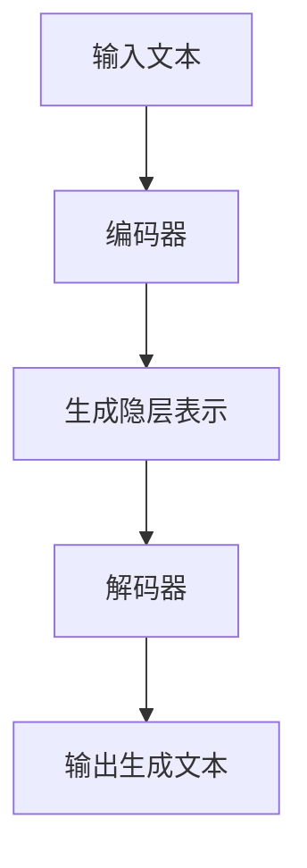
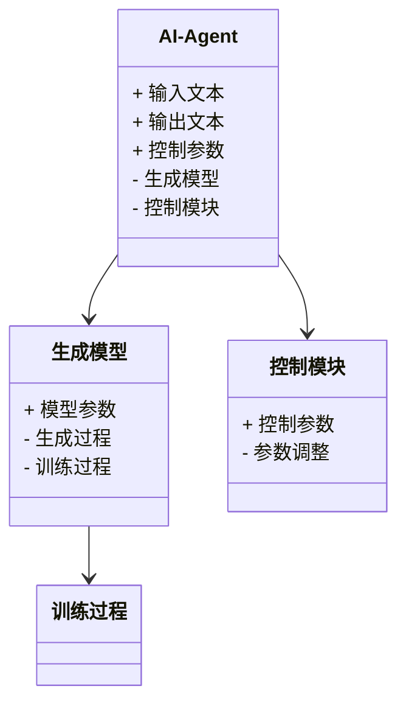
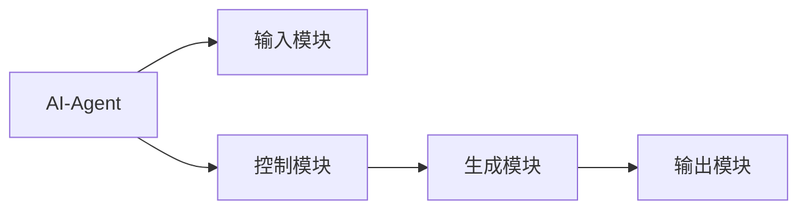
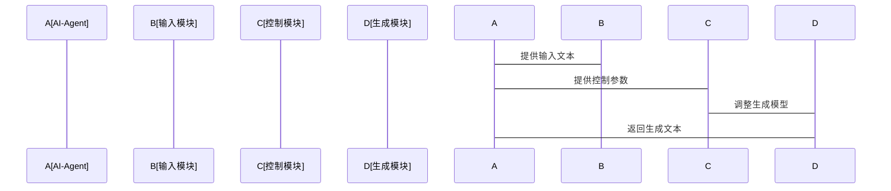

                 


# 开发AI Agent的文本生成控制能力

> 关键词：AI Agent，文本生成，控制能力，生成模型，算法原理

> 摘要：本文将详细介绍AI Agent的文本生成控制能力的开发过程，从基础概念到算法原理，再到系统架构和项目实战，为读者提供全面的指导。

---

# 第一部分: AI Agent与文本生成控制能力概述

## 第1章: AI Agent与文本生成控制能力的背景与概念

### 1.1 AI Agent的基本概念

#### 1.1.1 什么是AI Agent
AI Agent（人工智能代理）是一种能够感知环境、执行任务并做出决策的智能实体。它可以是一个软件程序、机器人或其他智能系统，通过与环境交互来实现特定目标。

#### 1.1.2 AI Agent的核心特征
- **自主性**：能够在没有外部干预的情况下独立运行。
- **反应性**：能够根据环境的变化实时调整行为。
- **目标导向**：通过实现目标来驱动行为。
- **社交能力**：能够与其他AI Agent或人类进行有效交互。

#### 1.1.3 AI Agent的分类与应用场景
- **按智能水平分类**：
  - 单点智能Agent：专注于特定任务（如文本生成）。
  - 多点智能Agent：具备多种功能（如对话、决策）。
- **应用场景**：
  - 自然语言处理：文本生成、对话系统。
  - 自动化控制：机器人、智能家居。
  - 游戏开发：NPC行为、游戏AI。

### 1.2 文本生成与控制能力的重要性

#### 1.2.1 文本生成的基本原理
文本生成是AI Agent的核心能力之一，通过自然语言处理技术生成符合上下文的文本内容。其基本原理包括：
- **输入处理**：接收输入文本或指令。
- **生成过程**：基于模型生成候选文本。
- **输出控制**：调整生成文本的语气、风格等属性。

#### 1.2.2 控制能力在文本生成中的作用
控制能力使AI Agent能够根据具体需求调整生成文本的风格、语气和内容。例如：
- **风格控制**：生成正式或非正式文本。
- **语气控制**：生成友好或中立的语气。
- **内容控制**：生成特定主题或领域的文本。

#### 1.2.3 文本生成控制能力的挑战与机遇
- **挑战**：
  - 如何精确控制生成文本的风格和内容。
  - 处理复杂语境下的生成需求。
- **机遇**：
  - 提升AI Agent的智能化水平。
  - 扩展文本生成的应用场景。

### 1.3 本章小结
本章介绍了AI Agent的基本概念、核心特征及其在文本生成中的应用。控制能力在文本生成中的重要性为后续章节的深入讨论奠定了基础。

---

# 第二部分: AI Agent文本生成的数学模型与算法原理

## 第2章: 文本生成的数学模型基础

### 2.1 概率论基础

#### 2.1.1 概率的基本概念
概率是描述随机事件发生可能性的数值，用于文本生成中表示不同词的选择概率。

#### 2.1.2 条件概率与贝叶斯定理
- **条件概率公式**：
  $$ P(A|B) = \frac{P(A \cap B)}{P(B)} $$
- **贝叶斯定理**：
  $$ P(A|B) = \frac{P(B|A)P(A)}{P(B)} $$

#### 2.1.3 马尔可夫链与马尔可夫过程
- **马尔可夫链**：一种描述系统状态转移的概率模型。
- **马尔可夫性质**：当前状态只依赖于前一状态，与更早的状态无关。

### 2.2 生成模型的数学基础

#### 2.2.1 生成模型的分类
- **基于规则的生成模型**：如语法分析树。
- **基于统计的生成模型**：如n-gram模型。
- **基于深度学习的生成模型**：如RNN、Transformer。

#### 2.2.2 变量的条件独立性
- **条件独立性假设**：在n-gram模型中，假设当前词只依赖于前n-1个词。

#### 2.2.3 贝叶斯网络与马尔可夫链的结合
- **贝叶斯网络**：通过有向无环图表示变量之间的依赖关系。
- **马尔可夫链**：用于建模生成过程中的状态转移。

### 2.3 文本生成的数学公式

#### 2.3.1 文本生成的概率分布公式
$$ P(y_1, y_2, ..., y_n) = \prod_{i=1}^{n} P(y_i | y_{<i}) $$

#### 2.3.2 条件概率的链式法则
$$ P(y|x) = \frac{P(y,x)}{P(x)} $$

### 2.4 本章小结
本章介绍了概率论和生成模型的基本数学基础，为后续的算法原理分析奠定了数学基础。

---

## 第3章: AI Agent文本生成的算法原理

### 3.1 生成对抗网络（GAN）原理

#### 3.1.1 GAN的基本结构
- **生成器**：负责生成文本。
- **判别器**：负责判断文本是否为真实文本。

#### 3.1.2 GAN的损失函数
- **生成器损失**：
  $$ \mathcal{L}_G = -\log(P(D(G(z))=1)) $$
- **判别器损失**：
  $$ \mathcal{L}_D = -[\log(D(x)) + \log(1-D(G(z)))] $$

#### 3.1.3 GAN在文本生成中的应用
- **文本生成**：通过对抗训练提升生成文本的质量。
- **风格迁移**：通过调整生成器的输入来改变文本风格。

### 3.2 变量自编码器（VAE）原理

#### 3.2.1 VAE的基本结构
- **编码器**：将输入映射到潜在空间。
- **解码器**：从潜在空间生成输出。

#### 3.2.2 VAE的重构损失与KL散度
- **重构损失**：
  $$ \mathcal{L}_{recon} = \mathbb{E}_{z}[ \log p(x|z) ] $$
- **KL散度**：
  $$ \mathcal{L}_{KL} = \mathbb{K}(q(z|x)||p(z)) $$

#### 3.2.3 VAE在文本生成中的应用
- **文本生成**：通过潜在空间的采样生成多样化文本。
- **文本编辑**：通过调整潜在向量实现文本风格的改变。

### 3.3 增量式生成模型（如GPT）

#### 3.3.1 GPT的基本结构
- **自注意力机制**：捕捉文本中的长距离依赖关系。
- **解码器**：基于自注意力生成后续文本。

#### 3.3.2 GPT的训练目标
$$ \arg \max_{y} \prod_{i=1}^{n} P(y_i | y_{<i}) $$

#### 3.3.3 GPT的文本生成过程
- **输入阶段**：输入初始文本片段。
- **生成阶段**：基于上下文生成后续文本。

### 3.4 算法原理的mermaid流程图


### 3.5 本章小结
本章详细介绍了生成对抗网络、变分自编码器和增量式生成模型的原理及其在文本生成中的应用，为后续的系统设计和项目实战提供了理论基础。

---

# 第三部分: AI Agent文本生成的系统架构与设计

## 第4章: AI Agent文本生成的系统架构设计

### 4.1 问题场景介绍
在开发AI Agent的文本生成系统时，需要考虑系统的模块化设计、可扩展性和容错能力。

### 4.2 系统功能设计

#### 4.2.1 领域模型mermaid类图


### 4.3 系统架构设计

#### 4.3.1 系统架构图


### 4.4 系统接口设计
- **输入接口**：接收输入文本和控制参数。
- **输出接口**：输出生成文本和状态信息。
- **控制接口**：调整生成文本的风格和内容。

### 4.5 系统交互mermaid序列图


### 4.6 本章小结
本章通过系统架构设计和接口设计，展示了如何构建一个高效的AI Agent文本生成系统。

---

# 第四部分: AI Agent文本生成的项目实战

## 第5章: AI Agent文本生成的项目实战

### 5.1 环境配置
- **Python版本**：3.8及以上。
- **依赖库安装**：
  ```bash
  pip install numpy matplotlib tensorflow
  ```

### 5.2 核心实现源代码

#### 5.2.1 生成器实现
```python
class Generator:
    def __init__(self, vocab_size):
        self.vocab_size = vocab_size
        self.embedding_dim = 128
        self.hidden_dim = 256
        self.sequence_length = 10

    def call(self, inputs):
        # 嵌入层
        x = tf.keras.layers.Embedding(self.vocab_size, self.embedding_dim)(inputs)
        # LSTM层
        x = tf.keras.layers.LSTM(self.hidden_dim, return_sequences=True)(x)
        # 输出层
        x = tf.keras.layers.Dense(self.vocab_size, activation='softmax')(x)
        return x
```

#### 5.2.2 判别器实现
```python
class Discriminator:
    def __init__(self, vocab_size):
        self.vocab_size = vocab_size
        self.embedding_dim = 128
        self.hidden_dim = 256

    def call(self, inputs):
        x = tf.keras.layers.Embedding(self.vocab_size, self.embedding_dim)(inputs)
        x = tf.keras.layers.LSTM(self.hidden_dim, return_sequences=True)(x)
        x = tf.keras.layers.TimeDistributed(tf.keras.layers.Dense(1, activation='sigmoid'))(x)
        return x
```

### 5.3 案例分析与代码实现

#### 5.3.1 训练过程
```python
def train_step(generator, discriminator, optimizer):
    # 生成假文本
    fake_text = generator.generate(batch_size)
    # 判别器判别
    real_prob = discriminator.discriminate(real_text)
    fake_prob = discriminator.discriminate(fake_text)
    
    # 计算损失
    gen_loss = -tf.math.log(fake_prob)
    disc_loss = - (tf.math.log(real_prob) + tf.math.log(1 - fake_prob))
    
    # 反向传播
    optimizer.minimize(gen_loss, generator.trainable_variables)
    optimizer.minimize(disc_loss, discriminator.trainable_variables)
```

### 5.4 项目总结
本章通过实际案例展示了AI Agent文本生成系统的开发过程，包括环境配置、代码实现和案例分析，帮助读者更好地理解和应用相关知识。

---

# 第五部分: 总结与扩展

## 第6章: 总结与扩展

### 6.1 最佳实践 tips
- **模型选择**：根据具体需求选择合适的生成模型。
- **参数调优**：通过实验调整模型参数以优化生成效果。
- **多模态生成**：结合图像、语音等多种模态信息提升生成质量。

### 6.2 注意事项
- **数据质量**：确保训练数据的多样性和代表性。
- **模型泛化能力**：避免过拟合特定训练数据。
- **生成结果的评估**：使用适当的指标（如BLEU、ROUGE）评估生成文本的质量。

### 6.3 拓展阅读
- **相关论文**：阅读GAN、VAE、Transformer等模型的经典论文。
- **技术博客**：关注AI领域的技术博客，获取最新动态。
- **工具与库**：学习使用TensorFlow、PyTorch等深度学习框架。

### 6.4 本章小结
本章总结了开发AI Agent文本生成系统的最佳实践，并提供了未来的研究方向和技术扩展建议。

---

# 附录

## 附录A: 常用数学公式汇总

## 附录B: 开源工具与库

## 附录C: 进一步阅读的资源

---

通过以上章节的内容，我们系统地介绍了AI Agent文本生成控制能力的开发过程，从理论基础到算法实现，再到系统设计和项目实战，为读者提供了一个全面的学习和实践指南。希望这本书能够帮助您在开发AI Agent的文本生成系统时提供有价值的指导和参考。

