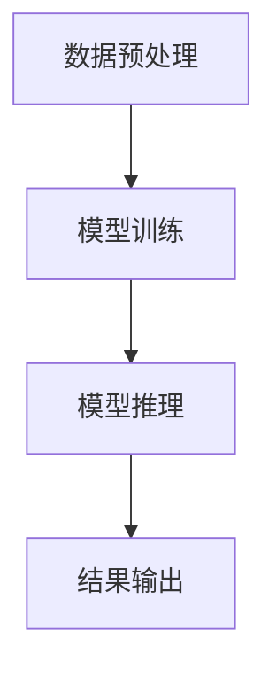
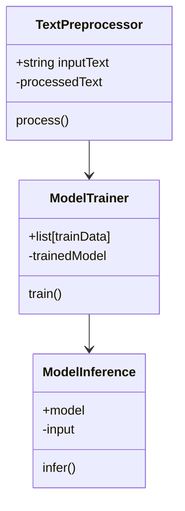

                 


# 开发AI Agent的语义理解深度：从字面到隐含

## 关键词：AI Agent，语义理解，自然语言处理，深度学习，对话系统

## 摘要：  
AI Agent的语义理解能力是实现智能化交互的核心技术，从字面意思到深层含义的解析是其发展的关键。本文从语义理解的背景出发，详细探讨其核心概念、算法原理、系统架构设计，结合项目实战，全面解析AI Agent语义理解的深度开发。通过分析当前技术的优缺点，提出改进方向和未来展望。

---

## 第一部分: AI Agent语义理解的背景与核心概念

### 第1章: AI Agent语义理解概述

#### 1.1 问题背景与问题描述
AI Agent的语义理解是实现人与AI交互的核心技术，旨在让AI能够理解用户的意图和情感。然而，现有的语义理解技术在处理复杂场景时存在以下问题：  
1. **语义漂移**：词语在不同上下文中的含义不同，导致理解偏差。  
2. **隐含意图**：用户需求未明确表达，AI需要推理潜在意图。  
3. **情感分析**：情感信息的捕捉对语义理解至关重要，但现有模型在细腻情感识别上仍有不足。  

#### 1.2 语义理解的定义与边界
- **定义**：语义理解是指AI系统对输入文本的含义进行解析，包括词语的含义、句子的逻辑关系以及上下文的信息。  
- **边界**：语义理解的边界包括语法分析、情感分析、对话管理和知识推理。  

#### 1.3 核心要素与概念结构
语义理解的核心要素包括：  
1. **词汇表**：词语的本义和使用场景。  
2. **语法结构**：句子的语法关系。  
3. **上下文**：对话历史、用户行为和知识库。  
4. **意图识别**：用户需求的明确或隐含表达。  

### 第2章: AI Agent语义理解的核心概念

#### 2.1 语义理解的特征对比
| 特征维度 | 传统NLP方法 | 深度学习方法 | 对比分析 |
|----------|--------------|--------------|----------|
| 处理方式 | 基于规则 | 基于数据驱动 | 规则灵活，数据丰富 |
| 性能 | 依赖语料库大小 | 依赖模型深度 | 深度学习在复杂场景表现更好 |
| 实时性 | 较低 | 较高 | 深度学习更适合实时交互 |

#### 2.2 ER实体关系图架构
```mermaid
entityDiagram
    class Word {
        +string token
        +int id
        +float vector
    }
    class Sentence {
        +list[Word] tokens
        +int id
        +float vector
    }
    class Context {
        +list[Sentence] sentences
        +int id
        +float vector
    }
    Word --> Sentence
    Sentence --> Context
```

---

## 第二部分: AI Agent语义理解的算法原理

### 第3章: 语义理解的算法原理

#### 3.1 基于概率的语义理解模型
- **N-Gram模型**：通过上下文概率计算词语的相关性。  
  $$ P(word|context) = \frac{P(context|word)}{P(context)} $$
- **条件随机场（CRF）**：用于序列标注任务，如命名实体识别。

#### 3.2 基于向量空间的语义理解模型
- **Word2Vec**：通过神经网络将词语映射到向量空间。  
  $$ sim(word1, word2) = \frac{word1 \cdot word2}{|word1||word2|} $$
- ** GloVe**：全局向量词嵌入，结合全局语料库信息。

#### 3.3 基于深度学习的语义理解模型
- **Transformer**：通过自注意力机制捕捉长距离依赖关系。  
  $$ f(x) = W_2 \sigma(W_1 x + b_1) + b_2 $$

#### 3.4 算法实现流程


---

## 第三部分: AI Agent语义理解的系统分析与架构设计

### 第4章: 系统分析与架构设计

#### 4.1 问题场景介绍
- **典型应用场景**：智能客服、语音助手、智能推荐。  
- **系统功能需求**：支持多轮对话、意图识别、情感分析。  
- **系统性能指标**：响应时间≤1s，准确率≥95%。

#### 4.2 系统功能设计


#### 4.3 系统架构设计
```mermaid
architectural
    client --> API Gateway
    API Gateway --> Load
    Load --> Service
    Service --> Database
```

---

## 第四部分: 项目实战与优化

### 第5章: 项目实战

#### 5.1 环境安装
- **Python版本**：Python 3.8+
- **依赖库**：numpy, tensorflow, nltk

#### 5.2 代码实现
```python
import numpy as np
from tensorflow import keras

# 示例代码：基于Word2Vec的语义理解
class Word2VecModel:
    def __init__(self, vocab_size):
        self.vocab_size = vocab_size
        self.embedding_dim = 100
        self.model = self.build_model()

    def build_model(self):
        input_layer = keras.Input(shape=(None,))
        embedding_layer = keras.layers.Embedding(self.vocab_size, self.embedding_dim)(input_layer)
        dense_layer = keras.layers.Dense(10, activation='relu')(embedding_layer)
        model = keras.Model(inputs=input_layer, outputs=dense_layer)
        return model

    def train(self, x_train, y_train):
        self.model.compile(optimizer='adam', loss='binary_crossentropy')
        self.model.fit(x_train, y_train, epochs=10, batch_size=32)
```

#### 5.3 案例分析与解读
- **案例背景**：智能客服系统中，用户输入“退款”，系统需要理解退款请求并提取相关信息。  
- **代码实现**：通过Word2Vec模型提取关键词，结合规则匹配提取退款信息。  

---

## 第五部分: 总结与展望

### 第6章: 总结与展望

#### 6.1 核心要点回顾
- 语义理解是AI Agent智能化交互的核心技术。  
- 深度学习模型在复杂场景下表现更优。  

#### 6.2 改进方向
- **多模态语义理解**：结合视觉和听觉信息，提升语义理解的准确性。  
- **实时推理优化**：优化模型推理速度，提升用户体验。  

#### 6.3 未来展望
随着AI技术的发展，语义理解将更加智能化和个性化，推动AI Agent在更多领域中的应用。

---

## 小结  
本文从语义理解的背景出发，详细探讨了AI Agent语义理解的核心概念、算法原理、系统架构设计，并结合项目实战，全面解析了语义理解的深度开发。通过分析当前技术的优缺点，提出了改进方向和未来展望。希望本文能为AI Agent的语义理解研究提供参考和启示。

