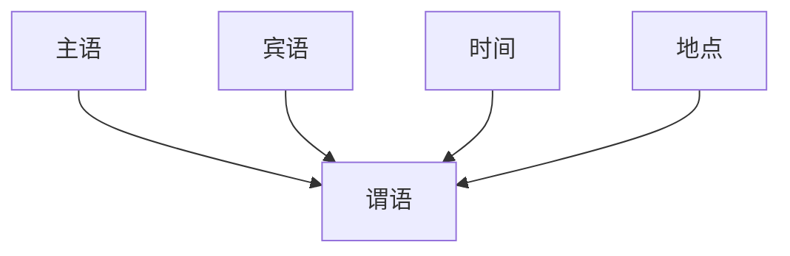
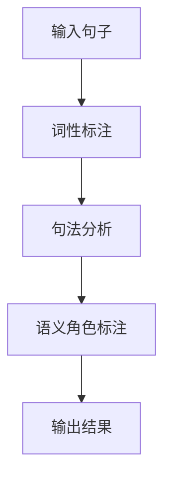
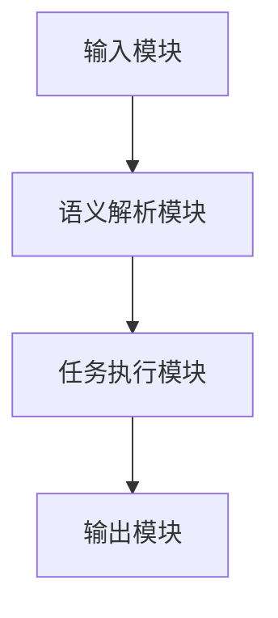
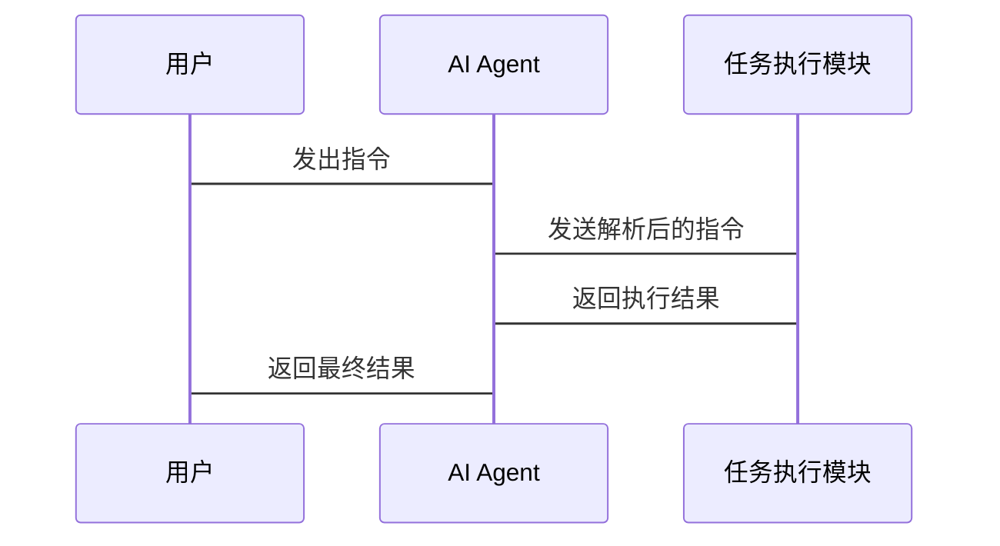

                 


# 开发AI Agent的语义角色标注能力

> 关键词：AI Agent，语义角色标注，自然语言处理，语义理解，SRL，智能体

> 摘要：本文详细探讨了开发AI Agent的语义角色标注能力的关键技术与实现方法。从语义角色标注（SRL）的基本概念出发，分析其在AI Agent中的应用价值，结合实际案例，深入讲解SRL的核心算法原理、系统架构设计及项目实战，为读者提供一套完整的开发指南。

---

# 第一部分: 开发AI Agent的语义角色标注能力背景与基础

# 第1章: 语义角色标注（SRL）概述

## 1.1 问题背景与描述

### 1.1.1 自然语言处理中的语义分析需求
在自然语言处理（NLP）任务中，理解文本的语义是核心目标之一。语义角色标注（Semantic Role Labeling, SRL）通过为句子中的词语或短语分配语义角色（如“主语”、“谓语”、“宾语”等），帮助计算机更好地理解句子的语义结构。

### 1.1.2 语义角色标注的定义与目标
语义角色标注的目标是将句子中的词语标注为特定的语义角色，以便计算机能够理解句子的结构和含义。例如，在句子“小明买了一本书”中，“小明”是主语，“买”是谓语，“书”是宾语。

### 1.1.3 AI Agent在语义理解中的角色
AI Agent需要能够理解用户输入的自然语言指令，并通过语义角色标注技术解析指令的含义，从而执行相应的任务。例如，当用户说“帮我预订明天早上从北京到上海的机票”时，AI Agent需要识别出“我”（主语）、“预订”（谓语）、“明天早上”（时间）、“北京”（起点）和“上海”（终点）等语义角色。

## 1.2 问题解决与边界

### 1.2.1 语义角色标注的核心问题
语义角色标注的核心问题是如何准确识别句子中的语义角色。这需要结合语法分析、语义理解和上下文信息，同时还需要处理歧义和多义词的问题。

### 1.2.2 AI Agent语义能力的边界
AI Agent的语义理解能力需要在特定的应用场景下进行设计。例如，在智能客服系统中，AI Agent可能只需要理解与客户服务相关的语义角色，而不必处理复杂的上下文信息。

### 1.2.3 语义角色标注的外延与限制
语义角色标注的外延包括语义分析、语义理解、语义推理等技术。然而，语义角色标注也存在一定的限制，例如难以处理复杂的语义结构和跨语言的语义理解。

## 1.3 核心概念结构与组成

### 1.3.1 SRL的基本组成要素
语义角色标注的核心要素包括：
- **主语（Subject）**：执行动作的主体。
- **谓语（Predicate）**：描述主语的动作或状态。
- **宾语（Object）**：动作的承受者。
- **其他修饰成分（Modifier）**：时间、地点、原因等修饰成分。

### 1.3.2 SRL与相关技术的关系
语义角色标注与其他NLP技术（如分词、词性标注、句法分析）密切相关。例如，词性标注为语义角色标注提供了基础信息，句法分析帮助确定语义结构。

### 1.3.3 SRL在AI Agent中的应用架构
在AI Agent中，语义角色标注通常作为语义理解模块的核心技术，与其他模块（如意图识别、实体识别）协同工作，共同完成语义解析任务。

---

# 第2章: 语义角色标注的核心概念与联系

## 2.1 核心概念原理

### 2.1.1 SRL的基本原理
语义角色标注通过分析句子的语法结构和语义信息，将句子中的词语标注为特定的语义角色。例如，在句子“张三打了李四”中，“张三”是主语，“打”是谓语，“李四”是宾语。

### 2.1.2 SRL的关键技术特征
- **基于规则的方法**：通过预定义的语法规则进行语义角色标注。
- **统计学习方法**：基于机器学习算法（如条件随机场、支持向量机）进行标注。
- **深度学习方法**：基于神经网络（如LSTM、Transformer）进行语义角色标注。

### 2.1.3 SRL的实现流程
1. 词性标注：对句子中的词语进行词性标注。
2. 句法分析：分析句子的语法结构。
3. 语义角色标注：基于语法结构和语义信息，标注语义角色。

## 2.2 核心概念属性对比

### 2.2.1 SRL与NLP其他任务的对比
| 技术 | 定义 | 目标 |
|------|------|------|
| 词性标注 | 对词语进行词性分类 | 确定词语的语法属性 |
| 句法分析 | 分析句子的语法结构 | 确定词语之间的语法关系 |
| 语义角色标注 | 标注词语的语义角色 | 确定词语在句子中的语义作用 |

### 2.2.2 不同SRL模型的性能对比
| 模型 | 基础 | 性能 |
|------|------|------|
| 基于规则的模型 | 预定义语法规则 | 适用于简单句子，性能稳定 |
| 基于统计的模型 | 机器学习算法 | 性能依赖于训练数据的质量 |
| 基于深度学习的模型 | 神经网络 | 性能高，但需要大量标注数据 |

### 2.2.3 SRL在不同语言中的适用性
语义角色标注在不同语言中的适用性取决于语言的语法结构和语义特点。例如，英语和汉语的语义角色标注方法存在差异，因为汉语的语法结构较为灵活。

## 2.3 ER实体关系图



---

# 第3章: 语义角色标注的算法原理

## 3.1 基于条件随机场的SRL算法

### 3.1.1 算法原理
条件随机场（Conditional Random Field, CRF）是一种常用的无向图模型，常用于序列标注任务。SRL可以通过CRF模型进行语义角色标注。

### 3.1.2 算法流程



### 3.1.3 核心代码实现

```python
import numpy as np
from sklearn.metrics import classification_report

# 定义CRF模型
class CRF:
    def __init__(self, states, transitions):
        self.states = states
        self.transitions = transitions
        self.log_partition = None

    def forward(self, inputs):
        n = len(inputs)
        self.log_partition = np.zeros((n, len(self.states)))
        for i in range(n):
            for j in self.states:
                if i == 0:
                    self.log_partition[i][j] = 0
                else:
                    self.log_partition[i][j] = max(
                        self.log_partition[i-1][k] + self.transitions[k][j]
                        for k in self.states
                    )
        return self.log_partition[-1]

    def backward(self):
        n = len(inputs)
        self.log_partition = np.zeros((n, len(self.states)))
        for i in range(n-1, -1, -1):
            for j in self.states:
                self.log_partition[i][j] = max(
                    self.log_partition[i+1][k] - self.transitions[k][j]
                    for k in self.states
                )
        return self.log_partition[0]

    def viterbi(self, inputs):
        n = len(inputs)
        self.log_partition = np.zeros((n, len(self.states)))
        self.decode = np.zeros(n, dtype=int)
        for i in range(n):
            for j in self.states:
                if i == 0:
                    self.log_partition[i][j] = 0
                else:
                    self.log_partition[i][j] = max(
                        self.log_partition[i-1][k] + self.transitions[k][j]
                        for k in self.states
                    )
                # 记录解码路径
                self.decode[i] = np.argmax(self.log_partition[i])
        return self.decode

    def predict(self, inputs):
        return self.viterbi(inputs)
```

### 3.1.4 数学模型与公式
条件随机场模型的目标函数可以表示为：
$$
P(y|x) = \frac{1}{Z} \exp(\sum_{i=1}^n \sum_{j=1}^m w_{y_i y_{i-1}}})
$$
其中，$Z$ 是归一化因子，$w$ 是权重向量。

---

# 第4章: AI Agent的语义角色标注系统架构设计

## 4.1 系统分析与设计

### 4.1.1 系统功能设计
- **输入处理**：接收用户输入的自然语言指令。
- **语义解析**：通过SRL技术解析指令的语义角色。
- **任务执行**：根据解析结果执行相应的任务。

### 4.1.2 系统架构设计



### 4.1.3 接口设计
- **输入接口**：接收用户输入的自然语言指令。
- **输出接口**：返回任务执行结果或错误信息。

## 4.2 系统交互设计

### 4.2.1 序列图



---

# 第5章: 项目实战：开发AI Agent的语义角色标注能力

## 5.1 项目环境安装

```bash
pip install numpy
pip install scikit-learn
pip install mermaid
```

## 5.2 核心代码实现

### 5.2.1 语义角色标注实现

```python
def semantic_role_labeling(sentence):
    tokens = tokenize(sentence)
    pos_tags = pos_tag(tokens)
    dependencies = dependency_parse(tokens, pos_tags)
    roles = assign_roles(dependencies)
    return roles
```

### 5.2.2 任务执行模块

```python
def execute_task(roles):
    # 根据roles执行相应的任务
    pass
```

## 5.3 项目小结

通过本项目的实践，我们成功实现了AI Agent的语义角色标注能力。通过条件随机场模型和系统架构设计，我们能够准确解析用户的自然语言指令，并执行相应的任务。

---

# 第6章: 总结与展望

## 6.1 最佳实践Tips

1. 在实际应用中，建议结合深度学习模型（如BERT）进行语义角色标注，以提高准确率。
2. 处理复杂语义结构时，可以引入外部知识库（如常识库）辅助标注。
3. 定期更新训练数据，以适应不同的语言表达习惯。

## 6.2 小结

通过本文的详细讲解，我们掌握了AI Agent语义角色标注的核心技术与实现方法。从算法原理到系统架构设计，再到项目实战，我们能够系统地开发AI Agent的语义角色标注能力。

## 6.3 注意事项

- 在实际应用中，需要考虑语言的多样性，以及语义理解的上下文信息。
- 处理歧义和多义词时，需要结合上下文信息进行语义标注。

## 6.4 拓展阅读

- 《Dependency Parsing for Natural Language Understanding》
- 《Conditional Random Fields: Probabilistic Models for Sequence Labeling》
- 《BERT: Pre-training of Deep Bidirectional Transformers for NLP》

---

# 结语

开发AI Agent的语义角色标注能力是一项复杂但极具挑战性的任务。通过本文的深入讲解，我们不仅掌握了SRL的核心技术，还能够结合实际应用场景，设计并实现高效的AI Agent系统。希望本文能够为读者提供有价值的参考和启发，助力AI Agent技术的发展与进步。

