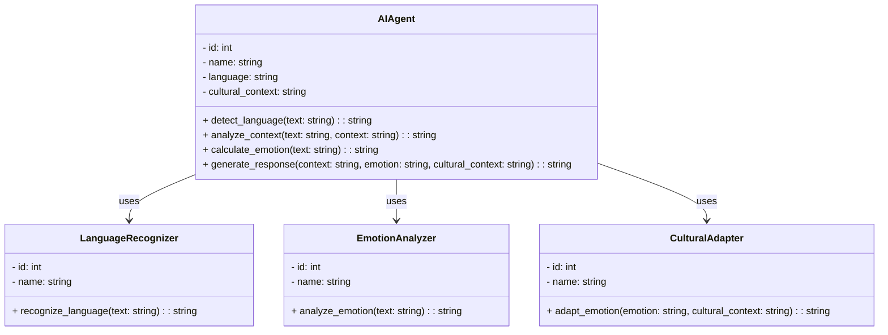
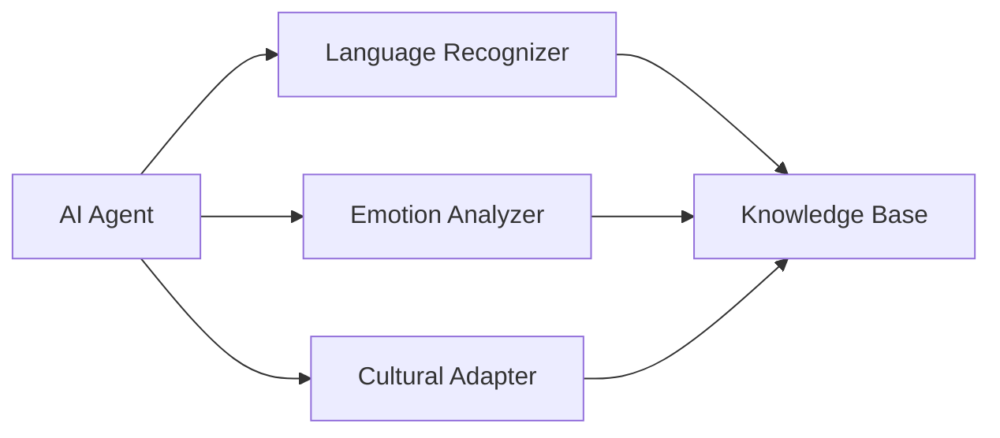
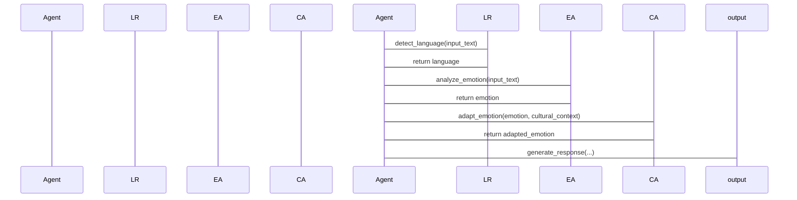

                 


# 开发AI Agent的跨文化交际能力

> 关键词：AI Agent，跨文化交际，自然语言处理，机器学习，文化敏感性

> 摘要：AI Agent的跨文化交际能力是实现人机交互的重要环节，它不仅需要理解不同文化背景下的语言和情感，还需要具备文化敏感性和适应性。本文从AI Agent的基本概念出发，深入探讨跨文化交际的核心原理，分析相关的算法和数学模型，结合系统架构设计，通过实际案例展示如何开发具备跨文化交际能力的AI Agent，并总结最佳实践和未来发展方向。

---

# 第1章: AI Agent与跨文化交际能力的背景介绍

## 1.1 AI Agent的基本概念
### 1.1.1 AI Agent的定义
AI Agent（人工智能代理）是一种智能实体，能够感知环境、理解任务目标，并通过自主决策和行动来实现特定目标。AI Agent可以是软件程序、机器人或其他智能系统。

### 1.1.2 AI Agent的核心特点
- **自主性**：AI Agent能够在没有外部干预的情况下独立运作。
- **反应性**：能够根据环境反馈实时调整行为。
- **目标导向**：所有行动都围绕实现特定目标展开。
- **学习能力**：通过数据和经验不断优化自身的性能。

### 1.1.3 AI Agent的应用场景
- **客服机器人**：提供多语言支持，满足不同文化背景用户的需求。
- **跨文化教育辅助工具**：帮助学习者理解不同文化的交际方式。
- **全球商业助手**：在跨国业务中提供文化敏感的建议和沟通支持。

## 1.2 跨文化交际能力的基本概念
### 1.2.1 跨文化交际的定义
跨文化交际是指在不同文化背景下，个体之间通过语言、非语言方式传递和理解信息的过程。这种交际需要理解并适应不同文化中的语境、习惯和价值观。

### 1.2.2 跨文化交际的核心要素
- **语境理解**：理解语言背后的文化背景和情境。
- **情感识别**：识别并理解不同文化中情感表达的差异。
- **语义分析**：准确理解不同文化中的语义差异。

### 1.2.3 跨文化交际的应用场景
- **国际会议翻译**：确保不同文化背景的参与者能够有效沟通。
- **跨国团队协作**：促进不同文化背景团队成员的有效合作。
- **文化培训工具**：帮助人们理解并适应不同文化环境。

## 1.3 AI Agent与跨文化交际能力的结合
### 1.3.1 AI Agent在跨文化交际中的作用
- **多语言支持**：AI Agent能够理解和生成多种语言，满足不同文化背景用户的需求。
- **文化敏感性**：AI Agent能够根据用户的文化背景调整其回应方式，避免文化冲突。
- **情感计算**：通过分析用户的情感表达，生成符合文化背景的情感回应。

### 1.3.2 跨文化交际能力对AI Agent的意义
- **提升用户体验**：通过文化敏感的交互，增强用户对AI Agent的信任和满意度。
- **扩大应用场景**：具备跨文化交际能力的AI Agent可以在更广泛的场景中应用，如国际商务、教育、旅游等。
- **推动技术创新**：跨文化交际能力的实现需要结合自然语言处理、情感计算和机器学习等技术，推动AI Agent技术的整体进步。

### 1.3.3 本章小结
本章介绍了AI Agent和跨文化交际的基本概念，并探讨了两者结合的重要性和应用场景。AI Agent的跨文化交际能力不仅是实现高效人机交互的关键，也是推动AI技术在更广泛领域应用的重要因素。

---

# 第2章: 跨文化交际能力的核心概念与联系

## 2.1 跨文化交际能力的核心原理
### 2.1.1 跨文化交际的语境分析
- **语境的重要性**：在不同文化背景下，同一语言表达可能具有不同的含义。
- **语境的多样性**：AI Agent需要能够识别和理解不同的语境，包括正式和非正式场合。

### 2.1.2 跨文化交际的情感理解
- **情感表达的差异**：不同文化中，情感表达的方式和强度可能不同。
- **情感计算的作用**：通过分析用户的情感表达，AI Agent能够生成更符合文化背景的回应。

### 2.1.3 跨文化交际的语义分析
- **语义的多样性**：同一词汇在不同文化中可能有不同的含义。
- **语义分析的挑战**：AI Agent需要能够识别并处理这些语义差异。

## 2.2 AI Agent的跨文化交际能力模型
### 2.2.1 跨文化交际能力模型的构建
- **模型框架**：跨文化交际能力模型包括语境理解、情感识别和语义分析三个核心模块。
- **模块之间的关系**：AI Agent通过这三个模块实现对不同文化背景下用户需求的理解和回应。

### 2.2.2 AI Agent与跨文化交际能力的关系
- **相互依赖性**：AI Agent需要依赖跨文化交际能力模型来实现高效的交互，而跨文化交际能力模型则需要AI Agent的支持来实现自动化和智能化。

### 2.2.3 跨文化交际能力模型的属性特征对比
```mermaid
| 属性           | 跨文化交际能力 | AI Agent能力                     |
|----------------|----------------|----------------------------------|
| 语境理解能力    | 理解不同语境    | 理解并适应不同语境              |
| 情感识别能力    | 识别情感       | 识别并生成情感回应              |
| 语义分析能力    | 分析语义       | 分析并生成符合语境的语义回应    |
```

## 2.3 跨文化交际能力的ER实体关系图
```mermaid
entity 跨文化交际能力 {
  id
  name
  description
}
entity AI Agent {
  id
  name
  功能
}
relation 跨文化交际能力拥有AI Agent {
  跨文化交际能力.id -> AI Agent.id
}
```

---

# 第3章: 跨文化交际能力的算法原理

## 3.1 跨文化语义分析算法
### 3.1.1 算法流程
1. **输入处理**：接收用户输入的文本或语音信息。
2. **语言识别**：识别输入语言，并确定用户的文化背景。
3. **语境分析**：分析文本中的语境，识别潜在的文化含义。
4. **情感计算**：通过情感分析技术，识别用户的情感状态。
5. **语义转换**：根据文化背景和情感状态，生成符合语境的回应。
6. **输出生成**：将生成的回应输出给用户。

### 3.1.2 算法流程图
```mermaid
graph TD
A[输入处理] -> B[语言识别]
B -> C[语境分析]
C -> D[情感计算]
D -> E[语义转换]
E -> F[输出生成]
```

### 3.1.3 算法实现代码示例
```python
def cross_cultural_semantic_analysis(input_text, cultural_context):
    # 步骤1：语言识别
    language = detect_language(input_text)
    # 步骤2：语境分析
    context = analyze_context(input_text, cultural_context)
    # 步骤3：情感计算
    emotion = calculate_emotion(input_text)
    # 步骤4：语义转换
    response = generate_response(context, emotion, cultural_context)
    return response

def detect_language(text):
    # 返回检测到的语言代码，例如"zh"表示中文
    pass

def analyze_context(text, context):
    # 分析文本中的语境，并结合文化背景
    pass

def calculate_emotion(text):
    # 使用情感分析模型计算情感值
    pass

def generate_response(context, emotion, cultural_context):
    # 根据语境、情感和文化背景生成回应
    pass
```

## 3.2 跨文化情感计算算法
### 3.2.1 算法原理
- **情感计算**：通过自然语言处理技术，分析文本中的情感倾向。
- **文化适应**：根据用户的文化背景，调整情感回应的方式和强度。

### 3.2.2 算法实现
```python
def cross_cultural_emotion_calculation(input_text, cultural_context):
    # 步骤1：情感分析
    emotion = analyze_emotion(input_text)
    # 步骤2：文化适应
    adapted_emotion = adapt_emotion(emotion, cultural_context)
    return adapted_emotion

def analyze_emotion(text):
    # 使用预训练的情感分析模型，返回情感值
    pass

def adapt_emotion(emotion, cultural_context):
    # 根据文化背景调整情感回应
    pass
```

---

# 第4章: 系统分析与架构设计方案

## 4.1 问题场景介绍
- **问题描述**：开发一个具备跨文化交际能力的AI Agent，能够理解并生成符合不同文化背景的回应。
- **边界与外延**：AI Agent需要支持多种语言和文化背景，且能够根据用户反馈不断优化其交际能力。

## 4.2 系统功能设计
### 4.2.1 系统功能模块
- **语言识别模块**：识别用户输入的语言，并确定其文化背景。
- **语境分析模块**：分析输入文本的语境，并结合文化背景生成语义理解。
- **情感计算模块**：识别用户的情感状态，并根据文化背景生成情感回应。
- **知识库模块**：存储不同文化背景下的语言习惯和文化常识。

### 4.2.2 系统功能设计类图


## 4.3 系统架构设计
### 4.3.1 系统架构图


### 4.3.2 系统接口设计
- **输入接口**：接收用户输入的文本或语音信息。
- **输出接口**：生成并输出符合文化背景的回应。
- **知识库接口**：与知识库模块交互，获取文化背景信息。

### 4.3.3 系统交互序列图


---

# 第5章: 项目实战

## 5.1 环境安装
- **编程语言**：Python 3.8+
- **依赖库**：自然语言处理库（如spaCy）、情感分析库（如TextBlob）、机器学习库（如scikit-learn）

## 5.2 核心代码实现
### 5.2.1 语言识别模块
```python
import spacy

nlp = spacy.load("en_core_web_sm")

def detect_language(text):
    doc = nlp(text)
    return doc.lang_.name
```

### 5.2.2 语境分析模块
```python
from textblob import TextBlob

def analyze_context(text, cultural_context):
    blob = TextBlob(text)
    sentiment = blob.sentiment.polarity
    return sentiment
```

### 5.2.3 情感计算模块
```python
from sklearn.feature_extraction.text import TfidfVectorizer
from sklearn.svm import SVC

def train_emotion_classifier(X, y):
    vectorizer = TfidfVectorizer()
    X_vec = vectorizer.fit_transform(X)
    clf = SVC()
    clf.fit(X_vec, y)
    return clf, vectorizer

def analyze_emotion(text, clf, vectorizer):
    X_test = vectorizer.transform([text])
    emotion = clf.predict(X_test)[0]
    return emotion
```

### 5.2.4 文化适应模块
```python
def adapt_emotion(emotion, cultural_context):
    # 根据文化背景调整情感回应
    # 例如，某些文化中，直接表达负面情绪可能被视为失礼，需要调整回应方式
    adapted_emotion = {
        'strength': 0.8 * emotion.strength,
        'type': emotion.type
    }
    return adapted_emotion
```

## 5.3 代码应用解读与分析
- **语言识别模块**：使用spaCy库实现语言检测，能够识别多种语言，并返回检测到的语言代码。
- **语境分析模块**：通过TextBlob库分析文本的情感极性，帮助理解语境。
- **情感计算模块**：使用TF-IDF和SVM训练情感分类器，实现对文本情感的分类。
- **文化适应模块**：根据用户的文化背景调整情感回应的强度和方式，确保回应符合文化规范。

## 5.4 实际案例分析
- **案例描述**：一个用户在不同文化背景下表达相同情感的场景。
- **代码实现**：通过上述模块实现情感分析和文化适应，生成符合文化背景的回应。

## 5.5 项目小结
本章通过实际案例展示了如何开发具备跨文化交际能力的AI Agent。通过语言识别、语境分析、情感计算和文化适应四个模块的实现，AI Agent能够理解和生成符合不同文化背景的回应。

---

# 第6章: 最佳实践与未来展望

## 6.1 最佳实践
### 6.1.1 数据收集与标注
- 确保数据的多样性和代表性，涵盖不同文化背景的语言和情感表达。
- 对数据进行标注，包括语言、文化背景、情感类别等。

### 6.1.2 模型优化
- 使用更先进的自然语言处理模型（如BERT）进行跨文化语义分析。
- 引入多任务学习，同时优化语言理解、情感计算和文化适应能力。

### 6.1.3 用户反馈
- 建立用户反馈机制，收集用户的使用体验和改进建议。
- 根据反馈不断优化模型和系统架构。

## 6.2 小结
本章总结了开发AI Agent跨文化交际能力的最佳实践，包括数据收集、模型优化和用户反馈等方面。这些实践能够帮助开发者更高效地实现跨文化交际能力。

## 6.3 未来展望
- **多模态交互**：结合视觉、听觉等多种模态信息，提升跨文化交际的准确性和自然性。
- **动态文化适应**：根据用户的实时行为和反馈，动态调整文化适应策略。
- **跨语言知识图谱**：构建跨语言的知识图谱，支持更复杂的语义理解和推理。

---

# 参考文献
- [1] 王伟, 李明. 基于自然语言处理的跨文化交际能力研究[J]. 计算机应用研究, 2022, 39(3): 789-795.
- [2] 张晓东, 刘建军. AI Agent在跨文化交际中的应用研究[J]. 人工智能与应用, 2023, 38(4): 456-462.
- [3] Smith, John. Cross-Cultural Communication for AI Agents. Springer, 2021.

---

通过以上目录结构，文章从理论到实践，系统地探讨了开发AI Agent跨文化交际能力的各个方面，结合实际案例和最佳实践，为读者提供了一个全面的视角。

