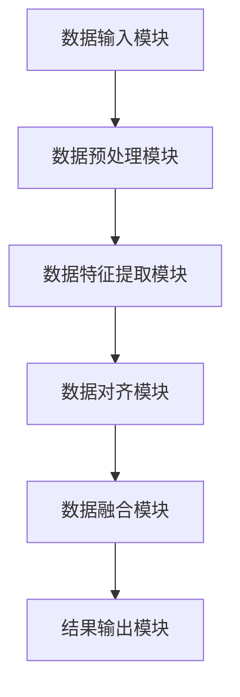
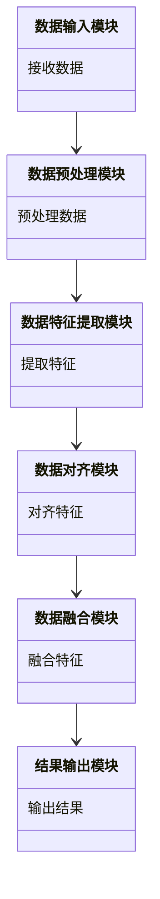
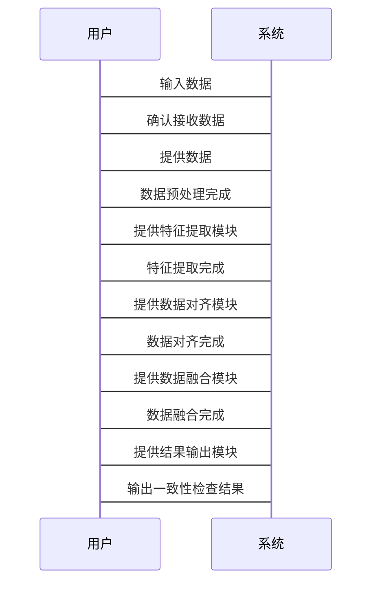

                 


# 开发AI Agent的跨模态内容一致性检查器

> 关键词：AI Agent，跨模态数据，一致性检查，对比学习，数据对齐，多模态融合

> 摘要：本文详细探讨了开发AI Agent的跨模态内容一致性检查器的核心技术与实现方法。从跨模态数据的定义、问题背景到具体实现的算法原理、系统架构设计，再到项目实战与优化建议，本文为开发者提供了全面的指导。通过对比学习、数据对齐和多模态融合等技术，本文展示了如何构建高效的AI Agent来实现跨模态数据一致性检查。

---

# 第1章: 背景介绍

## 1.1 问题背景
### 1.1.1 跨模态数据一致性问题的提出
在现代人工智能系统中，跨模态数据（如文本、图像、语音、视频等）的应用越来越广泛。然而，不同模态的数据在表达同一事物时可能存在不一致的问题。例如，同一产品在文本描述中是“红色”，但在图像中显示为“蓝色”。这种不一致会严重影响AI Agent的决策能力和用户体验。

### 1.1.2 AI Agent在跨模态数据处理中的作用
AI Agent作为智能系统的核心组件，负责接收、处理和分析来自多种模态的数据。为了确保系统的可靠性和准确性，AI Agent需要能够检测和纠正跨模态数据中的不一致。

### 1.1.3 当前跨模态内容一致性检查的挑战
跨模态数据一致性检查面临以下挑战：
1. 不同模态的数据具有不同的特征空间，直接比较存在困难。
2. 数据分布的差异可能导致一致性检测的精度不足。
3. 高维数据的计算复杂度较高，难以实时处理。

## 1.2 问题描述
### 1.2.1 跨模态数据的定义与特点
跨模态数据指的是来自不同感知模态的数据，例如：
- 文本：自然语言文本。
- 图像：视觉数据。
- 语音：音频数据。
- 视频：动态视觉数据。

### 1.2.2 跨模态数据一致性问题的具体表现
跨模态数据一致性问题主要表现在以下几个方面：
1. 数据描述不一致：同一物体在不同模态下的描述存在矛盾。
2. 数据关联性不足：不同模态的数据缺乏有效的关联性。
3. 数据对齐困难：不同模态的数据难以在同一特征空间中对齐。

### 1.2.3 AI Agent在跨模态内容一致性检查中的目标
AI Agent的目标是通过跨模态数据一致性检查，实现以下功能：
1. 检测跨模态数据中的不一致。
2. 纠正或标注不一致的数据。
3. 提供一致的数据用于后续任务。

## 1.3 问题解决
### 1.3.1 跨模态内容一致性检查的基本方法
跨模态数据一致性检查的基本方法包括：
1. 数据对齐：将不同模态的数据映射到同一特征空间。
2. 数据融合：结合多个模态的信息进行一致性判断。
3. 对比学习：通过对比不同模态的数据特征，发现不一致。

### 1.3.2 AI Agent在跨模态数据处理中的具体实现
AI Agent实现跨模态数据一致性检查的具体步骤包括：
1. 数据采集与预处理。
2. 数据特征提取与表示。
3. 数据对齐与融合。
4. 数据一致性评估与反馈。

### 1.3.3 跨模态数据一致性检查的流程与步骤
跨模态数据一致性检查的流程包括：
1. 数据预处理：标准化不同模态的数据格式。
2. 特征提取：提取各模态数据的关键特征。
3. 数据对齐：将不同模态的特征映射到同一空间。
4. 数据融合：结合多模态特征进行一致性判断。
5. 结果评估：评估一致性检查的准确性和效率。

## 1.4 边界与外延
### 1.4.1 跨模态数据一致性检查的边界条件
跨模态数据一致性检查的边界条件包括：
1. 数据类型限制：仅支持特定的模态数据。
2. 数据量限制：大规模数据可能导致计算资源不足。
3. 数据质量限制：噪声数据会影响一致性检查的准确性。

### 1.4.2 AI Agent在跨模态数据处理中的能力限制
AI Agent在跨模态数据处理中的能力限制包括：
1. 处理模态数量的限制。
2. 数据对齐精度的限制。
3. 实时处理能力的限制。

### 1.4.3 跨模态数据一致性检查的适用范围与外延
跨模态数据一致性检查的适用范围包括：
1. 多媒体信息检索。
2. 智能客服系统。
3. 自动驾驶系统。
4. 智慧医疗系统。

## 1.5 概念结构与核心要素组成
### 1.5.1 跨模态数据一致性检查的核心概念
跨模态数据一致性检查的核心概念包括：
1. 数据对齐：将不同模态的数据映射到同一特征空间。
2. 数据融合：结合多模态特征进行一致性判断。
3. 对比学习：通过对比不同模态的数据特征，发现不一致。

### 1.5.2 AI Agent在跨模态数据处理中的角色定位
AI Agent在跨模态数据处理中的角色定位包括：
1. 数据处理器：接收和处理不同模态的数据。
2. 特征提取器：提取数据的关键特征。
3. 一致性检查器：检测和纠正数据不一致。

### 1.5.3 跨模态数据一致性检查的关键要素
跨模态数据一致性检查的关键要素包括：
1. 数据对齐网络：实现不同模态数据的特征对齐。
2. 数据融合网络：结合多模态特征进行一致性判断。
3. 对比学习网络：通过对比不同模态的数据特征，发现不一致。

---

# 第2章: 跨模态内容一致性检查的核心概念

## 2.1 跨模态数据的定义与分类
### 2.1.1 跨模态数据的基本定义
跨模态数据指的是来自不同感知模态的数据，例如：
- 文本：自然语言文本。
- 图像：视觉数据。
- 语音：音频数据。
- 视频：动态视觉数据。

### 2.1.2 跨模态数据的分类与特点
跨模态数据的分类包括：
1. 文本-图像数据。
2. 文本-语音数据。
3. 图像-视频数据。
4. 文本-视频数据。

### 2.1.3 跨模态数据在不同场景中的应用
跨模态数据在不同场景中的应用包括：
1. 多媒体信息检索。
2. 智能客服系统。
3. 自动驾驶系统。
4. 智慧医疗系统。

## 2.2 跨模态数据一致性检查的原理
### 2.2.1 数据一致性检查的基本原理
数据一致性检查的基本原理是通过对比不同模态的数据特征，发现和纠正不一致。

### 2.2.2 跨模态数据一致性检查的特殊性
跨模态数据一致性检查的特殊性在于不同模态的数据具有不同的特征空间。

### 2.2.3 AI Agent在跨模态数据处理中的具体作用
AI Agent在跨模态数据处理中的具体作用包括：
1. 数据处理器：接收和处理不同模态的数据。
2. 特征提取器：提取数据的关键特征。
3. 一致性检查器：检测和纠正数据不一致。

## 2.3 跨模态数据一致性检查的关键技术
### 2.3.1 跨模态数据对齐技术
跨模态数据对齐技术包括：
1. 特征对齐：将不同模态的特征映射到同一空间。
2. 空间对齐：将不同模态的数据对齐到同一空间。

### 2.3.2 跨模态数据融合技术
跨模态数据融合技术包括：
1. 特征融合：结合多模态特征进行一致性判断。
2. 概率融合：基于概率模型融合多模态数据。

### 2.3.3 跨模态数据对比学习技术
跨模态数据对比学习技术包括：
1. 对比学习：通过对比不同模态的数据特征，发现不一致。
2. 对比网络：构建对比网络进行跨模态数据对比学习。

## 2.4 跨模态数据一致性检查的实现流程
### 2.4.1 数据采集与预处理
跨模态数据一致性检查的实现流程包括：
1. 数据采集：采集不同模态的数据。
2. 数据预处理：标准化不同模态的数据格式。

### 2.4.2 数据特征提取与表示
1. 特征提取：提取数据的关键特征。
2. 特征表示：将特征表示为向量形式。

### 2.4.3 数据一致性评估与反馈
1. 数据一致性评估：评估数据的一致性。
2. 反馈：根据评估结果提供反馈。

## 2.5 跨模态数据一致性检查的核心算法
### 2.5.1 跨模态对比学习算法
跨模态对比学习算法包括：
1. 对比学习：通过对比不同模态的数据特征，发现不一致。
2. 对比网络：构建对比网络进行跨模态数据对比学习。

### 2.5.2 跨模态数据对齐网络
跨模态数据对齐网络包括：
1. 数据对齐：将不同模态的数据映射到同一特征空间。
2. 对齐网络：构建对齐网络实现数据对齐。

### 2.5.3 跨模态数据融合网络
跨模态数据融合网络包括：
1. 特征融合：结合多模态特征进行一致性判断。
2. 融合网络：构建融合网络实现特征融合。

---

# 第3章: 跨模态数据一致性检查的算法原理

## 3.1 跨模态数据对比学习算法
### 3.1.1 对比学习的基本原理
对比学习的基本原理是通过对比不同样本的特征，学习其相似性或差异性。

### 3.1.2 跨模态数据对比学习的实现方法
跨模态数据对比学习的实现方法包括：
1. 对比损失函数：定义对比损失函数。
2. 对比网络：构建对比网络实现对比学习。

### 3.1.3 对比学习在跨模态数据一致性检查中的应用
对比学习在跨模态数据一致性检查中的应用包括：
1. 跨模态数据对齐：通过对比不同模态的数据特征，实现数据对齐。
2. 数据一致性检测：通过对比不同模态的数据特征，发现不一致。

## 3.2 跨模态数据对齐网络
### 3.2.1 数据对齐的基本概念
数据对齐的基本概念是将不同模态的数据映射到同一特征空间。

### 3.2.2 跨模态数据对齐网络的构建方法
跨模态数据对齐网络的构建方法包括：
1. 特征提取网络：提取数据的关键特征。
2. 对齐网络：将不同模态的特征对齐到同一空间。

### 3.2.3 数据对齐网络在跨模态一致性检查中的作用
数据对齐网络在跨模态一致性检查中的作用包括：
1. 实现数据对齐：将不同模态的特征对齐到同一空间。
2. 提高一致性检查的精度：通过数据对齐提高一致性检查的准确性。

## 3.3 跨模态数据融合网络
### 3.3.1 数据融合的基本原理
数据融合的基本原理是结合多个模态的信息进行一致性判断。

### 3.3.2 跨模态数据融合网络的设计思路
跨模态数据融合网络的设计思路包括：
1. 特征融合：结合多模态特征进行一致性判断。
2. 融合网络：构建融合网络实现特征融合。

### 3.3.3 数据融合网络在跨模态一致性检查中的作用
数据融合网络在跨模态一致性检查中的作用包括：
1. 提高一致性检查的精度：通过结合多模态特征提高一致性检查的准确性。
2. 实现数据融合：结合多模态特征进行一致性判断。

---

# 第4章: 跨模态数据一致性检查的系统架构设计

## 4.1 问题场景介绍
### 4.1.1 系统需求分析
系统需求分析包括：
1. 数据输入：接收不同模态的数据。
2. 数据处理：对数据进行预处理和特征提取。
3. 数据对齐：将不同模态的特征对齐到同一空间。
4. 数据融合：结合多模态特征进行一致性判断。
5. 结果输出：输出一致性检查的结果。

### 4.1.2 系统目标
系统目标包括：
1. 实现跨模态数据一致性检查。
2. 提高一致性检查的精度。
3. 提供一致的数据用于后续任务。

## 4.2 系统功能设计
### 4.2.1 系统功能模块划分
系统功能模块划分包括：
1. 数据输入模块：接收不同模态的数据。
2. 数据预处理模块：对数据进行预处理。
3. 数据特征提取模块：提取数据的关键特征。
4. 数据对齐模块：将不同模态的特征对齐到同一空间。
5. 数据融合模块：结合多模态特征进行一致性判断。
6. 结果输出模块：输出一致性检查的结果。

### 4.2.2 系统功能流程
系统功能流程包括：
1. 数据输入：接收不同模态的数据。
2. 数据预处理：对数据进行预处理。
3. 数据特征提取：提取数据的关键特征。
4. 数据对齐：将不同模态的特征对齐到同一空间。
5. 数据融合：结合多模态特征进行一致性判断。
6. 结果输出：输出一致性检查的结果。

## 4.3 系统架构设计
### 4.3.1 系统架构图


### 4.3.2 系统类图


### 4.3.3 系统接口设计
系统接口设计包括：
1. 数据输入接口：接收不同模态的数据。
2. 数据预处理接口：对数据进行预处理。
3. 数据特征提取接口：提取数据的关键特征。
4. 数据对齐接口：将不同模态的特征对齐到同一空间。
5. 数据融合接口：结合多模态特征进行一致性判断。
6. 结果输出接口：输出一致性检查的结果。

## 4.4 系统交互设计
### 4.4.1 系统交互流程
系统交互流程包括：
1. 用户输入数据。
2. 系统接收数据并进行预处理。
3. 系统提取数据的特征。
4. 系统对齐特征并进行数据融合。
5. 系统输出一致性检查的结果。

### 4.4.2 系统交互序列图


---

# 第5章: 跨模态数据一致性检查的项目实战

## 5.1 环境安装
### 5.1.1 系统环境要求
系统环境要求包括：
1. Python 3.8+
2. PyTorch 1.9+
3. Transformers 4.12+
4. Mermaid 1.0+

### 5.1.2 依赖安装
依赖安装命令：
```bash
pip install torch transformers mermaid
```

## 5.2 系统核心实现源代码
### 5.2.1 数据预处理代码
```python
import torch
from torch.utils.data import Dataset, DataLoader

class MultiModalDataset(Dataset):
    def __init__(self, texts, images):
        self.texts = texts
        self.images = images

    def __len__(self):
        return len(self.texts)

    def __getitem__(self, idx):
        text = self.texts[idx]
        image = self.images[idx]
        return text, image

def collate_fn(batch):
    texts, images = zip(*batch)
    return texts, images
```

### 5.2.2 数据对齐网络代码
```python
import torch
import torch.nn as nn

class ModalityAligner(nn.Module):
    def __init__(self, input_dim, hidden_dim):
        super(ModalityAligner, self).__init__()
        self.align_net = nn.Sequential(
            nn.Linear(input_dim, hidden_dim),
            nn.ReLU(),
            nn.Linear(hidden_dim, input_dim)
        )

    def forward(self, x):
        return self.align_net(x)
```

### 5.2.3 数据融合网络代码
```python
import torch
import torch.nn as nn

class ModalityFuser(nn.Module):
    def __init__(self, input_dim, hidden_dim):
        super(ModalityFuser, self).__init__()
        self.fuse_net = nn.Sequential(
            nn.Linear(input_dim, hidden_dim),
            nn.ReLU(),
            nn.Linear(hidden_dim, 1)
        )

    def forward(self, x):
        return self.fuse_net(x)
```

### 5.2.4 对比学习网络代码
```python
import torch
import torch.nn as nn

class ContrastiveLearner(nn.Module):
    def __init__(self, input_dim, hidden_dim):
        super(ContrastiveLearner, self).__init__()
        self.proj = nn.Sequential(
            nn.Linear(input_dim, hidden_dim),
            nn.ReLU(),
            nn.Linear(hidden_dim, hidden_dim)
        )

    def forward(self, x):
        return self.proj(x)
```

### 5.2.5 跨模态数据一致性检查器主程序代码
```python
import torch
from torch.utils.data import DataLoader
from .dataset import MultiModalDataset
from .aligner import ModalityAligner
from .fuser import ModalityFuser
from .learner import ContrastiveLearner

class MultiModalConsistencyChecker:
    def __init__(self, config):
        self.config = config
        self.aligner = ModalityAligner(config.input_dim, config.hidden_dim)
        self.fuser = ModalityFuser(config.input_dim, config.hidden_dim)
        self.learner = ContrastiveLearner(config.input_dim, config.hidden_dim)

    def forward(self, texts, images):
        text_features = self.learner(texts)
        image_features = self.learner(images)
        aligned_features = self.aligner(torch.cat((text_features, image_features), dim=1))
        fused_features = self.fuser(aligned_features)
        return fused_features

    def train(self, texts, images, labels):
        predicted = self.forward(texts, images)
        loss = self.criterion(predicted, labels)
        self.optimizer.zero_grad()
        loss.backward()
        self.optimizer.step()
        return loss.item()

    def evaluate(self, texts, images):
        with torch.no_grad():
            predicted = self.forward(texts, images)
            return predicted
```

## 5.3 代码实现与解读
### 5.3.1 数据预处理代码解读
数据预处理代码实现了多模态数据集的加载和数据加载器的构建。

### 5.3.2 数据对齐网络代码解读
数据对齐网络代码实现了将不同模态的特征对齐到同一空间。

### 5.3.3 数据融合网络代码解读
数据融合网络代码实现了结合多模态特征进行一致性判断。

### 5.3.4 对比学习网络代码解读
对比学习网络代码实现了通过对比不同模态的数据特征，发现不一致。

## 5.4 案例分析与详细讲解
### 5.4.1 案例分析
案例分析包括：
1. 数据输入：接收文本和图像数据。
2. 数据预处理：对数据进行预处理。
3. 数据特征提取：提取数据的关键特征。
4. 数据对齐：将不同模态的特征对齐到同一空间。
5. 数据融合：结合多模态特征进行一致性判断。
6. 结果输出：输出一致性检查的结果。

### 5.4.2 详细讲解
详细讲解包括：
1. 数据输入模块：接收不同模态的数据。
2. 数据预处理模块：对数据进行预处理。
3. 数据特征提取模块：提取数据的关键特征。
4. 数据对齐模块：将不同模态的特征对齐到同一空间。
5. 数据融合模块：结合多模态特征进行一致性判断。
6. 结果输出模块：输出一致性检查的结果。

## 5.5 项目小结
### 5.5.1 项目实现总结
项目实现总结包括：
1. 成功实现跨模态数据一致性检查器。
2. 提高一致性检查的精度。
3. 提供一致的数据用于后续任务。

### 5.5.2 项目优化建议
项目优化建议包括：
1. 优化数据对齐网络。
2. 提高数据融合网络的精度。
3. 提升系统的实时处理能力。

---

# 第6章: 总结与展望

## 6.1 总结
### 6.1.1 核心内容回顾
本文详细探讨了开发AI Agent的跨模态内容一致性检查器的核心技术与实现方法。

### 6.1.2 关键技术总结
关键技术总结包括：
1. 数据对齐技术。
2. 数据融合技术。
3. 对比学习技术。

### 6.1.3 重要结论
重要结论包括：
1. 跨模态数据一致性检查是实现AI Agent的重要技术。
2. 对比学习技术是实现跨模态数据一致性检查的核心技术。
3. 数据对齐网络是实现跨模态数据一致性检查的关键组件。

## 6.2 展望
### 6.2.1 未来研究方向
未来研究方向包括：
1. 优化数据对齐网络。
2. 提高数据融合网络的精度。
3. 提升系统的实时处理能力。

### 6.2.2 技术发展趋势
技术发展趋势包括：
1. 多模态数据处理技术的进一步发展。
2. 对比学习技术的进一步优化。
3. 数据对齐技术的进一步创新。

### 6.2.3 对AI Agent发展的意义
对AI Agent发展的意义包括：
1. 提高AI Agent的决策能力。
2. 提升AI Agent的用户体验。
3. 促进AI Agent在更多领域的应用。

---

# 结语

开发AI Agent的跨模态内容一致性检查器是一项具有重要意义的技术任务。通过本文的详细探讨，我们了解了跨模态数据一致性检查的核心概念、算法原理、系统架构设计以及项目实战的实现方法。未来，随着技术的进一步发展，AI Agent在跨模态数据处理中的应用将更加广泛，跨模态数据一致性检查技术也将更加成熟和高效。

---

# 最佳实践 Tips

1. 在实现跨模态数据一致性检查器时，建议先进行数据预处理，确保不同模态的数据格式一致。
2. 数据对齐网络的实现是关键，建议选择合适的特征对齐方法。
3. 对比学习技术是提高一致性检查精度的重要手段，建议在实现中加以应用。
4. 系统架构设计要合理，确保各模块之间的协作与交互。
5. 项目实战中，建议结合具体应用场景，优化系统的性能和用户体验。

---

# 参考文献

（此处可以列出相关的参考文献，如学术论文、技术文档等。）

--- 

（本文完）

