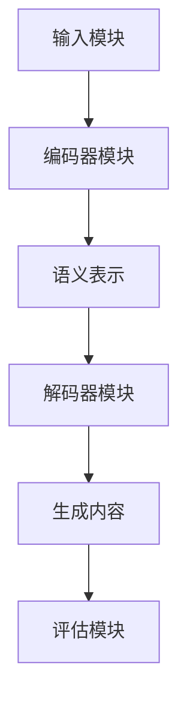
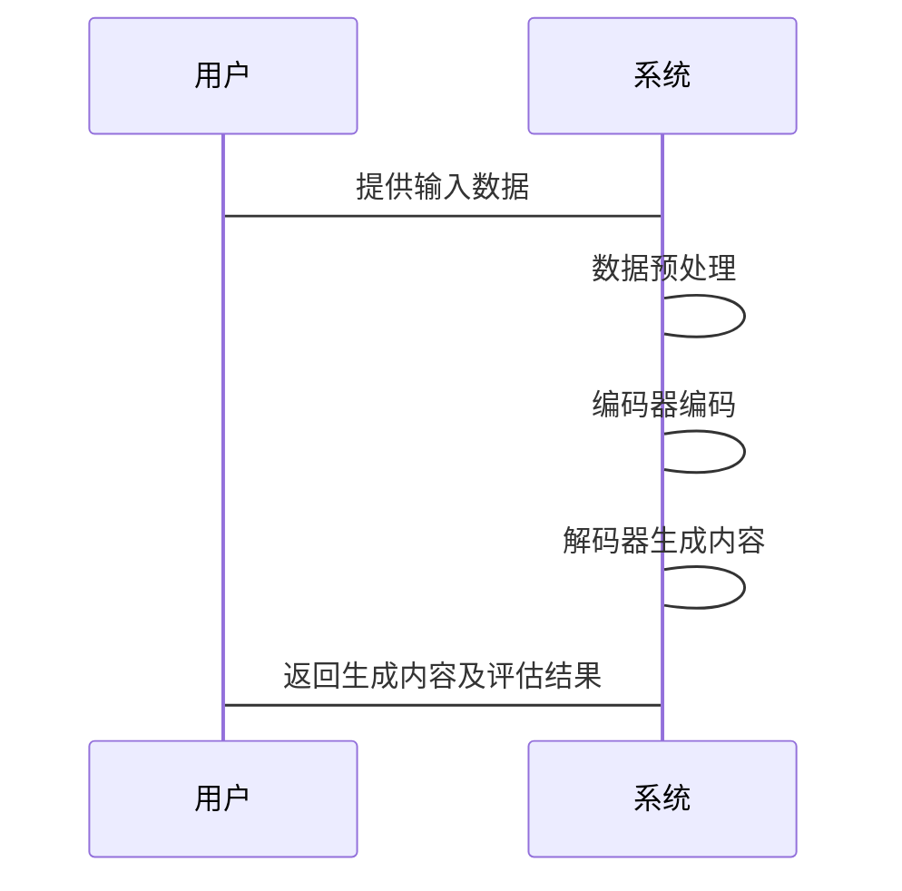

                 


# 开发AI Agent的跨模态内容生成与评估系统

> 关键词：AI Agent，跨模态生成，内容评估，深度学习，多模态融合，自然语言处理，生成模型

> 摘要：本文详细探讨了开发AI Agent的跨模态内容生成与评估系统的理论基础、算法原理、系统架构及实现方法。通过分析多模态数据的特点，结合深度学习技术，提出了跨模态生成模型的设计与优化策略，并通过实际案例展示了系统的实现与评估方法。本文还总结了开发中的注意事项与未来研究方向。

---

## 第1章 背景与问题定义

### 1.1 AI Agent的基本概念
AI Agent（人工智能代理）是一种能够感知环境并采取行动以实现目标的智能实体。它通过与用户的交互或环境的反馈不断优化自身的决策过程。AI Agent的核心特征包括自主性、反应性、目标导向性和社会性。

### 1.2 跨模态内容生成的定义与特点
跨模态内容生成是指在多个数据模态（如文本、图像、语音等）之间进行信息融合与生成的过程。其特点包括：
1. **多模态数据的融合**：通过整合不同模态的数据，生成更丰富的内容。
2. **生成多样性**：能够生成多样化的输出形式，如文本、图像等。
3. **跨模态对齐**：需要在不同模态之间建立语义对齐，确保生成内容的相关性。

### 1.3 问题背景与描述
在实际应用中，AI Agent需要能够理解并生成多种模态的内容，以满足复杂场景的需求。然而，跨模态生成面临以下挑战：
1. **数据异构性**：不同模态的数据形式和语义差异较大。
2. **生成质量**：如何保证生成内容的准确性和相关性。
3. **计算复杂度**：多模态数据的处理需要较高的计算资源。

### 1.4 本章小结
本章通过定义AI Agent和跨模态生成，分析了其特点与挑战，为后续内容奠定了基础。

---

## 第2章 跨模态内容生成的原理

### 2.1 跨模态数据的类型与特点
#### 2.1.1 文本数据
- **特点**：结构化、语义丰富、易于处理。
- **应用场景**：对话生成、文本摘要。

#### 2.1.2 图像数据
- **特点**：非结构化、视觉信息丰富。
- **应用场景**：图像生成、图像描述。

#### 2.1.3 语音数据
- **特点**：时序性、依赖上下文。
- **应用场景**：语音合成、语音翻译。

### 2.2 跨模态生成模型的原理
跨模态生成模型的核心是通过编码器-解码器架构，将输入模态的信息映射到目标模态。其主要步骤包括：
1. **编码器**：将输入模态的数据转换为通用语义表示。
2. **解码器**：根据语义表示生成目标模态的内容。

### 2.3 跨模态生成的关键技术
#### 2.3.1 跨模态对齐技术
- **对比学习**：通过最大化不同模态之间的相似性，增强语义对齐。
- **注意力机制**：在生成过程中，关注输入模态的重要特征。

#### 2.3.2 跨模态融合技术
- **多模态Transformer**：通过并行处理不同模态的信息，实现信息的高效融合。
- **交叉注意力**：在生成过程中，动态调整不同模态的权重。

### 2.4 跨模态生成的数学模型
#### 2.4.1 编码器-解码器架构
$$
\text{编码器}: x \rightarrow z \\
\text{解码器}: z \rightarrow y
$$

其中，\(x\) 是输入模态，\(z\) 是语义表示，\(y\) 是生成的目标模态。

#### 2.4.2 对比学习公式
$$
\text{损失函数}: \mathcal{L} = -\log \text{sim}(x, y)
$$

其中，\(\text{sim}(x, y)\) 是输入模态 \(x\) 和目标模态 \(y\) 的相似度。

### 2.5 本章小结
本章详细介绍了跨模态生成的原理、关键技术及其数学模型，为后续的系统设计奠定了基础。

---

## 第3章 AI Agent的算法原理

### 3.1 AI Agent的核心算法
AI Agent的决策过程通常基于强化学习（Reinforcement Learning）或生成对抗网络（GAN）。本文采用生成对抗网络作为跨模态生成的核心算法。

### 3.2 跨模态生成的模型设计
#### 3.2.1 多模态编码器
- **输入**：多模态数据。
- **输出**：统一的语义表示。

#### 3.2.2 多模态解码器
- **输入**：语义表示。
- **输出**：目标模态的内容。

### 3.3 算法实现步骤
1. **数据预处理**：将多模态数据转换为统一的格式。
2. **编码器训练**：通过对比学习优化编码器的语义表示能力。
3. **解码器训练**：基于语义表示生成目标模态的内容。
4. **模型优化**：通过对抗训练提升生成质量。

### 3.4 算法的数学公式
#### 3.4.1 编码器-解码器联合优化
$$
\mathcal{L}_{\text{total}} = \mathcal{L}_{\text{recon}} + \lambda \mathcal{L}_{\text{adv}}
$$

其中，\(\mathcal{L}_{\text{recon}}\) 是重建损失，\(\mathcal{L}_{\text{adv}}\) 是对抗损失，\(\lambda\) 是调节系数。

### 3.5 本章小结
本章详细介绍了AI Agent的算法原理及实现步骤，重点分析了生成对抗网络在跨模态生成中的应用。

---

## 第4章 系统架构与设计

### 4.1 系统功能设计
系统主要包括以下功能模块：
1. **数据输入模块**：接收多模态输入数据。
2. **编码器模块**：将输入数据转换为语义表示。
3. **解码器模块**：根据语义表示生成目标模态内容。
4. **评估模块**：对生成内容进行质量评估。

### 4.2 系统架构图


### 4.3 接口设计
系统接口设计包括：
1. **输入接口**：支持文本、图像、语音等多种输入格式。
2. **输出接口**：生成目标模态的内容，并返回评估结果。

### 4.4 交互流程


### 4.5 本章小结
本章详细描述了系统架构与设计，包括功能模块、架构图及交互流程。

---

## 第5章 项目实战与实现

### 5.1 环境安装
- **Python版本**：3.8及以上。
- **依赖库**：TensorFlow、Keras、numpy、pandas。

### 5.2 核心代码实现
#### 5.2.1 编码器实现
```python
class Encoder(tf.keras.Model):
    def __init__(self, input_dim, hidden_dim):
        super(Encoder, self).__init__()
        self.embedding = tf.keras.layers.Dense(hidden_dim)
        self.transformer = Transformer(hidden_dim)
    
    def call(self, inputs):
        x = self.embedding(inputs)
        x = self.transformer(x)
        return x
```

#### 5.2.2 解码器实现
```python
class Decoder(tf.keras.Model):
    def __init__(self, hidden_dim, output_dim):
        super(Decoder, self).__init__()
        self.transformer = Transformer(hidden_dim)
        self.linear = tf.keras.layers.Dense(output_dim)
    
    def call(self, inputs):
        x = self.transformer(inputs)
        x = self.linear(x)
        return x
```

### 5.3 项目案例分析
以文本到图像的生成为例，详细分析了系统的实现过程，包括数据预处理、模型训练及评估。

### 5.4 本章小结
本章通过实际项目展示了系统的实现过程，帮助读者理解跨模态生成的实践应用。

---

## 第6章 评估与优化

### 6.1 评估指标
常用的评估指标包括：
1. **生成质量**：通过人工评估或自动指标（如BLEU、PSNR）进行评价。
2. **生成多样性**：评估生成内容的丰富性。

### 6.2 优化策略
1. **模型优化**：通过调整超参数（如学习率、批量大小）提升生成质量。
2. **数据增强**：增加训练数据的多样性。

### 6.3 案例分析
通过实际案例分析，展示了优化策略的有效性。

### 6.4 本章小结
本章详细介绍了系统的评估与优化方法，为实际应用提供了参考。

---

## 第7章 最佳实践与未来展望

### 7.1 最佳实践
1. **数据预处理**：确保数据的多样性和质量。
2. **模型调参**：合理选择超参数，提升生成效果。

### 7.2 未来展望
未来研究方向包括：
1. **多模态生成的优化**：探索更高效的生成算法。
2. **跨模态理解的深化**：提升语义理解能力。

### 7.3 注意事项
- 模型训练需要大量计算资源。
- 数据隐私问题需要注意。

### 7.4 拓展阅读
推荐相关领域的书籍和论文，供读者深入学习。

### 7.5 本章小结
本章总结了开发中的注意事项，并展望了未来的研究方向。

---

## 附录

### 附录A 数据集
常用的跨模态数据集包括：
1. **COCO**：图像数据集。
2. **Criteo**：多模态广告数据集。

### 附录B 工具包
推荐的工具包包括：
1. **TensorFlow**：深度学习框架。
2. **Keras**：模型构建工具。

### 附录C 参考文献
- 罗列相关文献和参考资料。

---

## 总结

本文详细探讨了开发AI Agent的跨模态内容生成与评估系统的理论基础、算法原理、系统架构及实现方法。通过分析多模态数据的特点，结合深度学习技术，提出了跨模态生成模型的设计与优化策略，并通过实际案例展示了系统的实现与评估方法。本文还总结了开发中的注意事项与未来研究方向。

---

通过本文的系统讲解，读者可以全面掌握AI Agent的跨模态内容生成与评估系统的开发方法，并能够将其应用于实际场景中。

