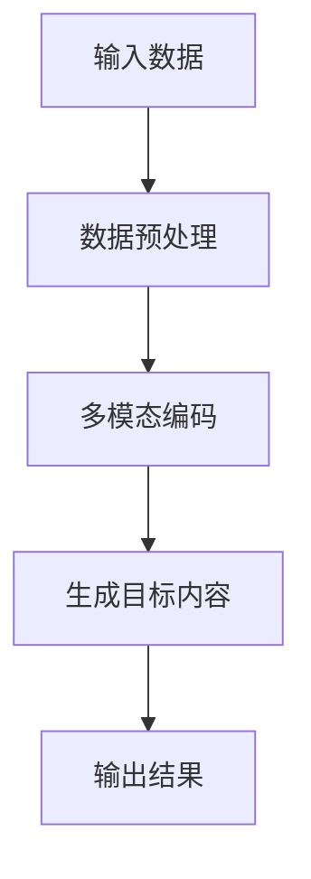

                 


# 开发AI Agent的跨模态内容生成系统

> 关键词：AI Agent，跨模态内容生成，多模态模型，生成式AI，深度学习

> 摘要：随着人工智能技术的飞速发展，AI Agent（智能代理）与跨模态内容生成的结合成为了一个新兴的研究方向。本文将详细探讨如何开发一个基于AI Agent的跨模态内容生成系统，涵盖从核心概念到系统架构设计，再到项目实战的各个方面。文章首先介绍了AI Agent和跨模态内容生成的基本概念，然后分析了跨模态内容生成的算法原理，接着详细设计了系统的架构，并通过实际案例展示了如何实现一个完整的跨模态内容生成系统。

---

## 第1章: AI Agent与跨模态内容生成概述

### 1.1 AI Agent的基本概念

AI Agent（智能代理）是一种能够感知环境、自主决策并执行任务的智能系统。它可以分为两类：**反应式AI Agent** 和 **认知式AI Agent**。反应式AI Agent主要关注当前环境状态并做出实时反应，而认知式AI Agent则具备更复杂的推理和规划能力。

跨模态内容生成是指将多种数据类型（如文本、图像、语音、视频等）进行融合，生成多样化的内容。例如，结合文本和图像生成带图像的文本描述，或者结合语音和文本生成智能对话。

### 1.2 跨模态内容生成的背景与应用

随着AI技术的发展，跨模态内容生成在多个领域展现出巨大的潜力。例如，在自然语言处理中，跨模态生成可以用于生成带有图像的新闻标题；在图像处理中，可以用于生成图像的描述文本。跨模态内容生成的核心挑战在于如何有效地融合多种数据类型，并生成高质量的内容。

---

## 第2章: 跨模态内容生成的核心概念与联系

### 2.1 跨模态内容生成的核心概念

跨模态内容生成涉及多个关键概念，包括：

1. **跨模态数据**：指多种数据类型（如文本、图像、语音）的结合。
2. **跨模态模型**：用于处理和生成跨模态数据的模型。
3. **生成式AI**：基于深度学习的生成模型，如GPT和Diffusion模型。

### 2.2 跨模态内容生成的核心要素对比

下表对比了跨模态内容生成与其他生成任务的核心要素：

| 对比维度       | 跨模态内容生成             | 单模态生成             |
|----------------|--------------------------|------------------------|
| 数据输入类型     | 文本、图像、语音等         | 单一数据类型（如文本）  |
| 生成内容类型     | 文本、图像、语音等         | 单一数据类型（如文本）  |
| 模型复杂度       | 更高，需要处理多模态特征   | 较低，专注于单模态处理   |

---

## 第3章: 跨模态内容生成的算法原理

### 3.1 跨模态理解与生成的算法基础

跨模态生成的核心是将不同数据类型的信息进行编码和解码。例如，多模态编码器将文本、图像等多种数据编码为一个共同的表示空间，然后多模态解码器根据编码后的表示生成目标模态的内容。

### 3.2 跨模态内容生成的数学模型

跨模态生成的数学模型可以表示为：

$$ P(y|x) = \text{Decoder}(x) $$

其中，$x$ 是输入的多模态数据，$y$ 是生成的目标内容。

---

## 第4章: 跨模态内容生成的系统架构设计

### 4.1 系统功能模块设计

跨模态内容生成系统的功能模块包括：

1. 数据输入模块：接收多种数据类型。
2. 跨模态处理模块：对输入数据进行编码和融合。
3. 内容生成模块：根据编码后的表示生成目标内容。

### 4.2 系统架构图

下图展示了跨模态内容生成系统的整体架构：



---

## 第5章: 跨模态内容生成的项目实战

### 5.1 环境搭建与配置

开发跨模态内容生成系统需要以下环境：

- Python 3.8+
- PyTorch 2.0+
- Transformers库

### 5.2 核心代码实现

以下是多模态编码器的实现示例：

```python
import torch
import torch.nn as nn

class MultiModalEncoder(nn.Module):
    def __init__(self, input_dim1, input_dim2):
        super().__init__()
        self.encoder1 = nn.Linear(input_dim1, 128)
        self.encoder2 = nn.Linear(input_dim2, 128)
        self.decoder = nn.Linear(256, output_dim)
    
    def forward(self, x1, x2):
        x1_encoded = self.encoder1(x1)
        x2_encoded = self.encoder2(x2)
        concatenated = torch.cat((x1_encoded, x2_encoded), dim=-1)
        output = self.decoder(concatenated)
        return output
```

### 5.3 案例分析与实现

以下是一个简单的跨模态生成案例：

```python
# 输入数据
text_input = "这是一张猫的图片"
image_input = # 加载图片数据

# 调用编码器
encoder = MultiModalEncoder()
result = encoder(text_input, image_input)
print("生成结果：", result)
```

---

## 第6章: 总结与展望

跨模态内容生成是一个充满挑战和机遇的领域。随着AI技术的进步，未来将有更多的创新应用出现。开发AI Agent的跨模态内容生成系统需要结合深厚的算法理解、系统的架构设计和丰富的实战经验。

---

通过本文的详细讲解，读者可以系统地了解跨模态内容生成的核心概念、算法原理和系统设计，并能够实际操作一个完整的跨模态生成项目。希望本文能为相关领域的研究者和开发者提供有价值的参考和启示。

