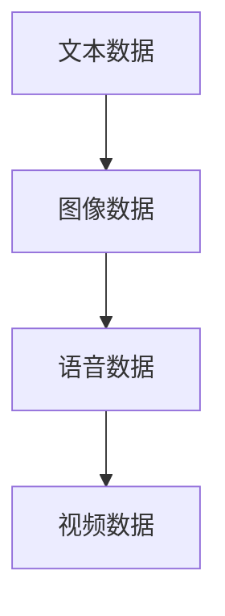
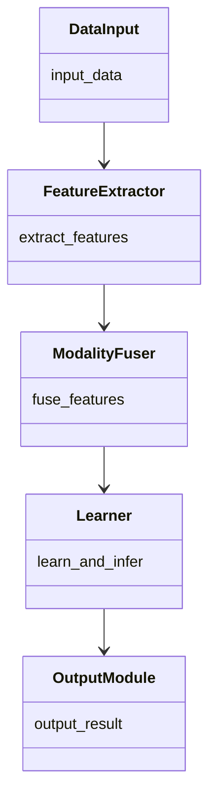
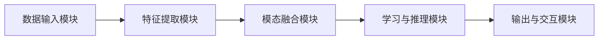
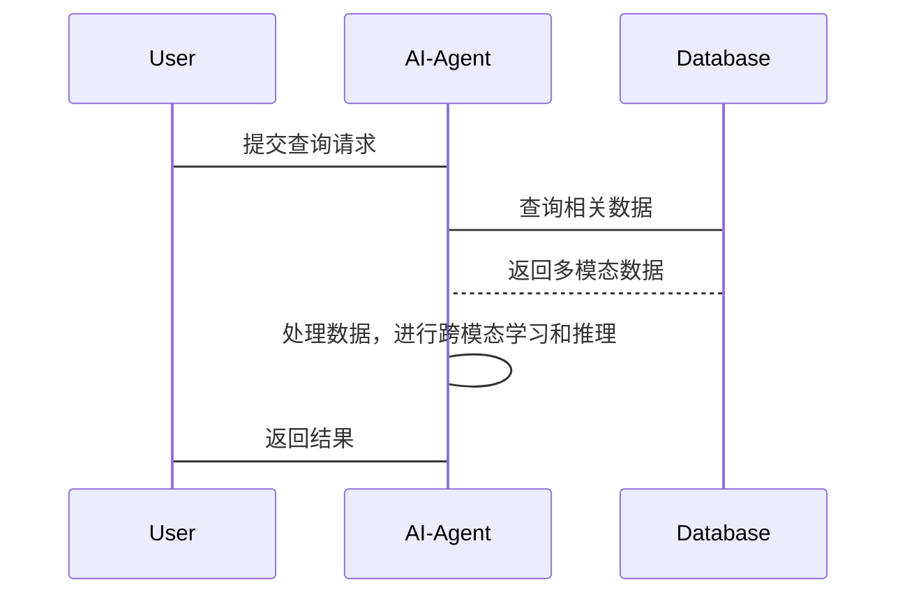

                 


# 开发AI Agent的跨模态学习能力：整合多源信息

> 关键词：AI Agent, 跨模态学习, 多源信息整合, 人工智能, 跨模态数据, 深度学习, 跨模态推理

> 摘要：本文深入探讨了开发具备跨模态学习能力的AI Agent的关键技术，从多源信息的整合到复杂的跨模态推理，系统性地分析了跨模态学习的背景、核心概念、算法原理、系统架构以及实际应用案例。通过详细的理论分析和实践指导，帮助读者全面理解并掌握跨模态学习在AI Agent中的应用。

---

## 第一部分: 跨模态学习的背景与定义

### 第1章: 跨模态学习的背景与定义

#### 1.1 跨模态学习的背景

##### 1.1.1 人工智能的发展历程
人工智能（AI）技术的发展经历了多个阶段，从最初的符号逻辑推理到基于规则的专家系统，再到如今的深度学习和大语言模型。AI Agent（智能体）作为人工智能的核心应用形式，逐渐从单一模态处理向多模态、跨模态方向发展。跨模态学习的兴起是AI技术进步的必然结果，它使得AI Agent能够更好地理解和处理现实世界中复杂的多源信息。

##### 1.1.2 跨模态学习的兴起
随着深度学习技术的突破，AI Agent开始具备处理多种模态数据的能力，如文本、图像、语音、视频等。跨模态学习技术的出现，使得AI Agent能够从不同模态的数据中提取信息，并通过融合这些信息来提高决策的准确性和智能性。

##### 1.1.3 跨模态学习的重要性
跨模态学习的重要性体现在以下几个方面：
1. **信息整合**：通过整合多模态数据，AI Agent能够获得更全面的信息，从而做出更准确的判断。
2. **增强智能性**：跨模态学习使得AI Agent能够理解复杂的语义信息，从而具备更高的智能性。
3. **实际应用**：在现实场景中，多源信息的整合能够提升AI Agent的应用效果，例如在智能客服、自动驾驶等领域。

#### 1.2 跨模态学习的定义

##### 1.2.1 跨模态学习的核心概念
跨模态学习（Cross-modal Learning）是指在同一学习任务中，利用来自不同模态的数据进行学习和推理。例如，利用文本和图像数据进行图像分类任务，或者利用语音和文本数据进行语音识别。

##### 1.2.2 跨模态学习的关键特征
跨模态学习的关键特征包括：
1. **多模态数据**：跨模态学习涉及多种不同类型的数据，如文本、图像、语音等。
2. **模态间关联**：不同模态的数据之间存在一定的关联性，跨模态学习需要发现这些关联性。
3. **联合学习**：跨模态学习需要将不同模态的数据进行联合建模，以提高学习效果。

##### 1.2.3 跨模态学习的边界与外延
跨模态学习的边界在于，它专注于同一学习任务中不同模态数据的整合，而多模态学习则可能涉及多个学习任务。跨模态学习的外延包括多模态数据处理、跨模态推理、跨模态生成等多种技术。

---

## 第二部分: 跨模态学习的核心概念与联系

### 第2章: 跨模态学习的核心原理

#### 2.1 跨模态数据的表示方法

##### 2.1.1 基于嵌入的表示方法
跨模态数据可以通过嵌入（Embedding）的方式进行表示。例如，文本可以通过词嵌入（如Word2Vec）或句嵌入（如BERT）表示，图像可以通过卷积神经网络（CNN）提取特征表示。

##### 2.1.2 跨模态嵌入的对齐方法
为了实现跨模态数据的联合学习，需要将不同模态的嵌入进行对齐。常用的方法包括：
1. **对齐网络**：通过设计对齐网络，将不同模态的嵌入映射到同一个 latent 空间。
2. **对比学习**：通过对比损失函数，使得不同模态的相同语义内容的嵌入尽可能接近。

##### 2.1.3 跨模态数据的融合策略
跨模态数据的融合策略包括：
1. **早期融合**：在特征提取阶段对不同模态的数据进行融合。
2. **晚期融合**：在特征提取之后，对不同模态的特征进行融合。
3. **混合融合**：结合早期和晚期融合的优势，进行多阶段融合。

#### 2.2 跨模态学习的数学模型

##### 2.2.1 跨模态嵌入模型
跨模态嵌入模型可以通过以下数学公式表示：
$$
f_i(x) = g_i(y)
$$
其中，$f_i$ 表示第i个模态的嵌入函数，$x$ 表示输入数据，$y$ 表示输出嵌入。

##### 2.2.2 跨模态注意力机制
跨模态注意力机制可以通过以下公式表示：
$$
\alpha_i = \frac{\exp(a_i)}{\sum_j \exp(a_j)}
$$
其中，$\alpha_i$ 表示第i个模态的注意力权重，$a_i$ 表示第i个模态的注意力得分。

##### 2.2.3 跨模态对比学习
跨模态对比学习的目标是最小化不同模态之间相同语义内容的特征差异，最大化不同语义内容的特征差异。其数学公式可以表示为：
$$
L = -\log\left(\frac{\exp(s_i)}{\sum_j \exp(s_j)}\right)
$$
其中，$s_i$ 表示第i个模态与第j个模态之间的相似度。

#### 2.3 跨模态学习的ER实体关系图



---

## 第三部分: 跨模态学习的算法原理

### 第3章: 跨模态学习的算法原理

#### 3.1 对比学习算法

##### 3.1.1 对比学习的流程
1. **数据预处理**：将输入数据分成不同的模态。
2. **特征提取**：对每种模态的数据进行特征提取，得到嵌入表示。
3. **对比损失计算**：计算不同模态之间相同语义内容的特征相似度，并计算对比损失。
4. **模型优化**：通过优化器（如Adam）优化模型参数，最小化对比损失。

##### 3.1.2 对比学习的代码实现
```python
import torch
import torch.nn as nn
import torch.optim as optim

class ContrastiveLoss(nn.Module):
    def __init__(self, temperature=0.1):
        super(ContrastiveLoss, self).__init__()
        self.temperature = temperature

    def forward(self, features, labels):
        # 计算相似度
        similarity = torch.mm(features, features.t())
        # 计算正样本和负样本的相似度
        positive = torch.exp(torch.sum(similarity * labels, dim=1) / labels.sum())
        negative = torch.exp(torch.sum(similarity * (1 - labels), dim=1))
        # 计算损失
        loss = -torch.mean(torch.log(positive / negative))
        return loss

# 初始化模型和优化器
model = ContrastiveLoss()
optimizer = optim.Adam(model.parameters(), lr=0.001)

# 训练循环
for epoch in range(num_epochs):
    optimizer.zero_grad()
    features = ...  # 特征向量
    labels = ...    # 标签向量
    loss = model(features, labels)
    loss.backward()
    optimizer.step()
```

#### 3.2 自监督学习算法

##### 3.2.1 自监督学习的流程
1. **数据增强**：对输入数据进行数据增强，生成多个变体。
2. **特征提取**：对每个变体进行特征提取，得到嵌入表示。
3. **自监督目标**：通过对比不同变体的特征，学习数据的潜在结构。
4. **模型优化**：通过优化器优化模型参数，最小化自监督损失。

##### 3.2.2 自监督学习的代码实现
```python
import torch
import torch.nn as nn
import torch.optim as optim

class SelfSupervisedLoss(nn.Module):
    def __init__(self, temperature=0.1):
        super(SelfSupervisedLoss, self).__init__()
        self.temperature = temperature

    def forward(self, features1, features2):
        # 计算相似度
        similarity = torch.mm(features1, features2.t())
        # 计算正样本和负样本的相似度
        positive = torch.exp(torch.sum(similarity * labels, dim=1) / labels.sum())
        negative = torch.exp(torch.sum(similarity * (1 - labels), dim=1))
        # 计算损失
        loss = -torch.mean(torch.log(positive / negative))
        return loss

# 初始化模型和优化器
model = SelfSupervisedLoss()
optimizer = optim.Adam(model.parameters(), lr=0.001)

# 训练循环
for epoch in range(num_epochs):
    optimizer.zero_grad()
    features1 = ...  # 第一种模态的特征向量
    features2 = ...  # 第二种模态的特征向量
    labels = ...     # 标签向量
    loss = model(features1, features2, labels)
    loss.backward()
    optimizer.step()
```

---

## 第四部分: 系统分析与架构设计

### 第4章: 跨模态学习的系统架构设计

#### 4.1 跨模态学习系统的功能设计

##### 4.1.1 系统功能模块
跨模态学习系统通常包括以下功能模块：
1. **数据输入模块**：接收多种模态的数据输入。
2. **特征提取模块**：对每种模态的数据进行特征提取。
3. **模态融合模块**：将不同模态的特征进行融合。
4. **学习与推理模块**：基于融合的特征进行学习和推理。
5. **输出与交互模块**：输出推理结果，并与用户进行交互。

##### 4.1.2 功能模块的类图



#### 4.2 跨模态学习系统的架构设计

##### 4.2.1 系统架构设计



##### 4.2.2 系统交互设计



---

## 第五部分: 项目实战

### 第5章: 跨模态学习的项目实战

#### 5.1 跨模态学习项目环境配置

##### 5.1.1 环境配置
```bash
pip install torch numpy matplotlib
```

##### 5.1.2 数据准备
```python
import torch
import numpy as np
import matplotlib.pyplot as plt

# 示例数据：文本和图像
text_data = "This is an example text."
image_data = np.random.rand(3, 32, 32)  # 随机生成图像数据
```

#### 5.2 跨模态学习项目核心代码实现

##### 5.2.1 特征提取代码

```python
def extract_features(text, image):
    # 提取文本特征
    text_features = ...  # 具体实现根据模型而定
    # 提取图像特征
    image_features = ...  # 具体实现根据模型而定
    return text_features, image_features
```

##### 5.2.2 跨模态融合代码

```python
def fuse_features(text_features, image_features):
    # 将文本和图像特征进行融合
    fused_features = torch.cat((text_features, image_features), dim=1)
    return fused_features
```

##### 5.2.3 跨模态学习模型代码

```python
class CrossModalLearner(nn.Module):
    def __init__(self, input_dim, hidden_dim, output_dim):
        super(CrossModalLearner, self).__init__()
        self.fc1 = nn.Linear(input_dim, hidden_dim)
        self.fc2 = nn.Linear(hidden_dim, output_dim)
        self.relu = nn.ReLU()

    def forward(self, x):
        x = self.fc1(x)
        x = self.relu(x)
        x = self.fc2(x)
        return x

# 初始化模型
model = CrossModalLearner(input_dim=512, hidden_dim=256, output_dim=1)
```

#### 5.3 跨模态学习项目案例分析

##### 5.3.1 案例分析
以一个简单的跨模态图像分类任务为例，假设输入包括文本描述和图像数据，目标是通过跨模态学习提高分类准确率。

##### 5.3.2 代码实现与结果分析
```python
# 训练循环
optimizer = optim.Adam(model.parameters(), lr=0.001)
criterion = nn.CrossEntropyLoss()

for epoch in range(num_epochs):
    for batch_idx, (texts, images, labels) in enumerate(train_loader):
        # 提取特征
        text_features, image_features = extract_features(texts, images)
        # 融合特征
        fused_features = fuse_features(text_features, image_features)
        # 前向传播
        outputs = model(fused_features)
        # 计算损失
        loss = criterion(outputs, labels)
        # 反向传播和优化
        optimizer.zero_grad()
        loss.backward()
        optimizer.step()
    # 验证阶段
    with torch.no_grad():
        for texts, images, labels in val_loader:
            text_features, image_features = extract_features(texts, images)
            fused_features = fuse_features(text_features, image_features)
            outputs = model(fused_features)
            _, predicted = torch.max(outputs.data, 1)
            accuracy = (predicted == labels).sum().item() / len(labels)
            print(f"Epoch {epoch}, Validation Accuracy: {accuracy}")
```

---

## 第六部分: 总结与展望

### 第6章: 跨模态学习的总结与展望

#### 6.1 跨模态学习总结

##### 6.1.1 核心要点总结
跨模态学习通过整合多模态数据，能够显著提高AI Agent的智能性和决策能力。其核心在于如何有效地对齐和融合不同模态的数据。

##### 6.1.2 成功经验总结
跨模态学习的成功经验包括：
1. **有效的数据对齐方法**：如对比学习、对齐网络等。
2. **先进的融合策略**：如注意力机制、多阶段融合等。
3. **高效的算法实现**：如自监督学习、对比学习等。

#### 6.2 跨模态学习的注意事项

##### 6.2.1 实际应用中的注意事项
1. **数据质量**：跨模态学习对数据质量要求较高，需要确保不同模态数据的准确性和一致性。
2. **计算资源**：跨模态学习通常需要大量的计算资源，尤其是在处理大规模数据时。
3. **模型复杂性**：跨模态学习模型通常较为复杂，需要进行充分的调优和优化。

##### 6.2.2 潜在问题与解决方案
1. **模态间信息量不均衡**：可以通过数据增强、权重调整等方法进行解决。
2. **模型过拟合**：可以通过正则化、数据增强等方法进行解决。
3. **计算效率**：可以通过优化算法、分布式计算等方法进行解决。

#### 6.3 跨模态学习的未来展望

##### 6.3.1 跨模态学习的未来发展方向
1. **更高效的融合方法**：研究更高效的模态融合方法，如基于图神经网络的融合方法。
2. **多模态生成模型**：研究能够生成多模态数据的生成模型，如多模态扩散模型。
3. **跨模态推理与决策**：研究跨模态推理在复杂决策任务中的应用，如自动驾驶、智能客服等。

##### 6.3.2 跨模态学习的技术趋势
1. **轻量化模型**：研究轻量化跨模态模型，以适应边缘计算和移动设备的需求。
2. **多模态预训练模型**：类似于BERT的多模态预训练模型，能够更好地理解和生成多模态数据。
3. **跨模态人机交互**：研究跨模态人机交互技术，使得人与AI Agent之间的交互更加自然和高效。

---

## 第七部分: 最佳实践与小结

### 第7章: 跨模态学习的最佳实践

#### 7.1 跨模态学习的最佳实践 tips

##### 7.1.1 数据处理
- 确保不同模态数据的对齐和一致性。
- 对数据进行充分的预处理和增强。

##### 7.1.2 模型选择
- 根据具体任务选择合适的跨模态学习方法。
- 结合实际应用场景选择模型的复杂度和规模。

##### 7.1.3 训练优化
- 使用高效的优化器和学习率调度策略。
- 进行充分的训练和验证，避免过拟合。

#### 7.2 跨模态学习的小结

##### 7.2.1 核心内容回顾
跨模态学习是整合多源信息、提升AI Agent智能性的关键技术。本文从理论到实践，系统性地分析了跨模态学习的背景、核心概念、算法原理、系统架构以及实际应用案例。

##### 7.2.2 未来学习方向
建议读者进一步学习以下内容：
1. **先进的跨模态模型**：如多模态预训练模型、生成式跨模态模型。
2. **跨模态推理与决策**：研究跨模态推理在复杂任务中的应用。
3. **跨模态人机交互**：探索更自然的人机交互方式。

#### 7.3 跨模态学习的注意事项

##### 7.3.1 实际应用中的注意事项
- 数据质量对跨模态学习效果至关重要。
- 模型的复杂性和计算资源需要权衡。

##### 7.3.2 技术发展中的挑战
- 模态间信息量不均衡的问题仍需进一步研究。
- 跨模态学习的可解释性和透明性需要进一步提升。

#### 7.4 跨模态学习的拓展阅读

##### 7.4.1 推荐书籍
1. 《Deep Learning》——Ian Goodfellow
2. 《Multi-modal Machine Learning》——李航

##### 7.4.2 推荐论文
1. "Contrastive Learning of Visual and Textual Modalities for Image Classification"。
2. "Unsupervised Cross-Modal Hashing for Image-Text Retrieval"。

---

## 结语

开发具备跨模态学习能力的AI Agent是一项具有挑战性但又充满机遇的前沿技术。通过整合多源信息，AI Agent能够更好地理解和应对复杂的现实场景。希望本文能够为读者提供有价值的技术指导和实践参考，帮助他们在跨模态学习领域取得更大的突破。

