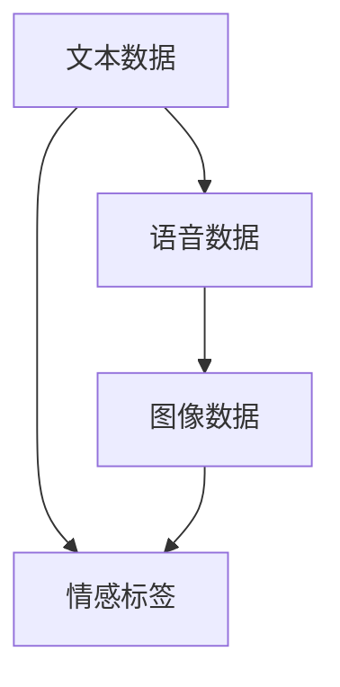
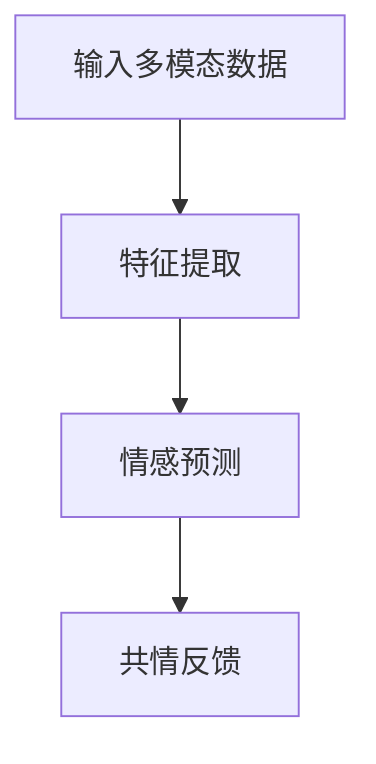

                 


# 开发AI Agent的跨模态情感共情能力

## 关键词：
AI Agent，跨模态情感共情，多模态数据，情感计算，深度学习

## 摘要：
本文详细探讨了开发具备跨模态情感共情能力的AI Agent的关键技术。通过分析多模态数据的处理方法、情感计算的原理以及两者之间的融合策略，本文提出了一种创新的算法框架，并通过实际案例展示了如何实现这一能力。文章内容涵盖背景介绍、核心概念、算法原理、系统架构、项目实战和最佳实践，为读者提供了全面的技术指导。

---

## 第一部分: 跨模态情感共情能力的背景与核心概念

### 第1章: 跨模态情感共情能力的背景与问题背景

#### 1.1 问题背景
- **情感共情能力在AI Agent中的重要性**  
  情感共情能力是AI Agent与人类交互的核心要素。具备这种能力的AI Agent能够理解用户的情感状态，并做出相应的反馈，从而提升用户体验。
  
- **跨模态数据处理的必要性**  
  用户的输入可以是文本、语音或图像等多种形式，AI Agent需要能够同时处理这些模态的数据，以全面理解用户的情感状态。

- **当前AI Agent在情感共情能力上的局限性**  
  当前的AI Agent大多只能处理单一模态的数据，无法有效融合多模态信息，导致情感理解的准确性有限。

#### 1.2 问题描述
- **跨模态情感共情能力的定义**  
  跨模态情感共情能力是指AI Agent能够从多种模态的数据中提取情感信息，并根据这些信息生成相应的共情反馈。

- **跨模态数据的特点与挑战**  
  跨模态数据具有多样性和异构性的特点，处理起来需要克服数据格式、特征提取和模型融合等多方面的挑战。

- **情感共情能力的核心要素**  
  包括情感识别的准确性、多模态数据的融合能力以及反馈生成的实时性。

#### 1.3 问题解决
- **跨模态数据融合的解决方案**  
  采用多模态数据融合技术，将不同模态的信息进行整合，提升情感理解的准确性。

- **情感共情能力的实现路径**  
  结合深度学习技术，构建多模态情感识别模型，并设计高效的反馈生成机制。

- **当前技术的边界与外延**  
  当前技术主要集中在文本、语音和图像三种模态的融合，未来可以扩展到更多模态，如视频和手势。

### 1.4 核心概念与联系
- **跨模态情感共情能力的概念结构**  
  通过构建概念图，展示跨模态数据、情感计算和共情反馈之间的关系。

- **核心要素组成与关系**  
  列表对比不同模态的特点，包括输入形式、特征提取方法和情感识别的难易程度。

- **跨模态数据与情感计算的实体关系图**  
  使用Mermaid图展示文本、语音和图像数据之间的关系，以及它们如何共同作用于情感标签。

---

## 第二部分: 跨模态情感共情能力的核心概念与联系

### 第2章: 跨模态情感共情能力的核心概念

#### 2.1 跨模态数据处理
- **多模态数据的定义与分类**  
  多模态数据包括文本、语音、图像等多种形式，每种形式都有其独特的特征和应用场景。

- **跨模态数据融合的原理**  
  通过特征提取和模态对齐，将不同模态的数据进行融合，提升情感理解的准确性。

- **跨模态数据的特征提取方法**  
  文本特征提取可以使用词袋模型或词嵌入（如Word2Vec）；语音特征提取可以使用MFCC；图像特征提取可以使用CNN。

#### 2.2 情感共情能力
- **情感计算的基本原理**  
  情感计算通过分析文本、语音或图像中的情感特征，预测用户的情感状态。

- **情感共情能力的实现方法**  
  结合多模态数据的情感识别结果，生成相应的共情反馈，如调整语气或提供情感支持。

- **情感共情能力的评估指标**  
  包括准确率、召回率和F1分数等指标，用于衡量情感识别的准确性。

#### 2.3 跨模态情感共情能力的核心要素
- **数据模态的多样性**  
  多模态数据能够提供更全面的情感信息，提升情感理解的准确性。

- **情感理解的准确性**  
  准确的情感识别是实现共情反馈的基础。

- **共情能力的实时性**  
  实时的反馈能够提升用户体验，增强交互的自然性。

### 第3章: 跨模态情感共情能力的核心概念与联系

#### 3.1 跨模态数据处理与情感计算的关系
- **跨模态数据处理对情感计算的影响**  
  跨模态数据的融合可以显著提升情感识别的准确性和鲁棒性。

- **情感计算对跨模态数据处理的依赖**  
  情感计算需要依赖跨模态数据的特征提取和融合技术，才能实现准确的情感识别。

#### 3.2 跨模态数据融合的实体关系图


#### 3.3 跨模态情感共情能力的算法流程图


---

## 第三部分: 跨模态情感共情能力的算法原理

### 第4章: 跨模态情感共情能力的算法原理

#### 4.1 算法输入与输出
- **算法输入形式**  
  输入可以是文本、语音或图像等多种形式的数据。

- **算法输出形式**  
  输出是情感标签（如正面、负面或中性）以及相应的共情反馈。

#### 4.2 特征提取与模态融合
- **文本特征提取**  
  使用词嵌入模型（如Word2Vec）提取文本特征，然后通过注意力机制进行加权。

- **语音特征提取**  
  使用MFCC提取语音特征，并通过卷积神经网络（CNN）进行特征学习。

- **图像特征提取**  
  使用深度卷积神经网络（如ResNet）提取图像特征，然后进行全局平均池化。

#### 4.3 情感预测与反馈生成
- **情感预测算法**  
  使用多模态融合模型（如Late Fusion或Early Fusion）进行情感预测，模型结构可以是基于Transformer的多模态编码器。

- **反馈生成机制**  
  根据预测的情感状态，生成相应的反馈，如调整语气或提供情感支持。

---

## 第四部分: 跨模态情感共情能力的系统分析与架构设计

### 第5章: 系统分析与架构设计

#### 5.1 问题场景介绍
- **问题场景描述**  
  用户与AI Agent进行多轮对话，输入可以是文本、语音或图像等多种形式。

#### 5.2 系统功能设计
- **领域模型设计**  
  使用Mermaid类图展示系统的领域模型，包括用户、AI Agent、情感识别模块和反馈生成模块。

#### 5.3 系统架构设计
- **系统架构图**  
  使用Mermaid架构图展示系统的分层结构，包括数据采集层、特征提取层、情感识别层和反馈生成层。

#### 5.4 系统接口设计
- **系统接口设计**  
  定义API接口，如`/api/v1/emotion/recognize`，用于接收多模态数据并返回情感标签。

#### 5.5 系统交互流程
- **交互流程图**  
  使用Mermaid序列图展示用户与AI Agent之间的交互流程，包括数据输入、特征提取、情感识别和反馈生成。

---

## 第五部分: 跨模态情感共情能力的项目实战

### 第6章: 项目实战

#### 6.1 环境安装
- **安装Python环境**  
  使用Anaconda安装Python 3.8及以上版本。

- **安装依赖库**  
  安装必要的库，如numpy、pandas、tensorflow和pytorch。

#### 6.2 核心代码实现
- **数据预处理代码**  
  ```python
  import numpy as np
  from sklearn.model_selection import train_test_split
  # 加载数据
  data = np.load('multimodal_data.npy')
  labels = np.load('emotions.npy')
  # 划分训练集和测试集
  train_data, test_data, train_labels, test_labels = train_test_split(data, labels, test_size=0.2)
  ```

- **模型训练代码**  
  ```python
  import tensorflow as tf
  model = tf.keras.Sequential([
      tf.keras.layers.Dense(64, activation='relu'),
      tf.keras.layers.Dense(1, activation='sigmoid')
  ])
  model.compile(optimizer='adam', loss='binary_crossentropy', metrics=['accuracy'])
  model.fit(train_data, train_labels, epochs=10, batch_size=32)
  ```

#### 6.3 代码应用解读与分析
- **代码功能解读**  
  数据预处理代码用于加载和划分数据集，模型训练代码构建了一个简单的神经网络模型，用于进行情感分类。

- **实际案例分析**  
  通过实际案例分析，展示如何使用代码实现跨模态情感共情能力。

#### 6.4 项目小结
- **项目总结**  
  通过项目实战，读者可以掌握跨模态数据处理和情感计算的基本方法，为后续的深入学习打下基础。

---

## 第六部分: 跨模态情感共情能力的最佳实践

### 第7章: 最佳实践

#### 7.1 小结
- **核心观点总结**  
  开发具备跨模态情感共情能力的AI Agent需要综合运用多模态数据处理技术、情感计算方法和深度学习算法。

#### 7.2 注意事项
- **数据质量的重要性**  
  数据的多样性和代表性对情感识别的准确性至关重要。

- **模型的可解释性**  
  在实际应用中，模型的可解释性可以帮助开发者更好地理解情感预测的结果。

#### 7.3 拓展阅读
- **推荐书籍**  
  推荐《Deep Learning》和《Pattern Recognition and Machine Learning》等书籍，帮助读者深入理解相关技术。

---

## 结语
开发具备跨模态情感共情能力的AI Agent是一项具有挑战性的任务，但通过综合运用多模态数据处理技术、情感计算方法和深度学习算法，我们可以实现更智能、更自然的人机交互。希望本文能够为读者提供有价值的技术指导，帮助他们在这一领域取得更大的突破。

