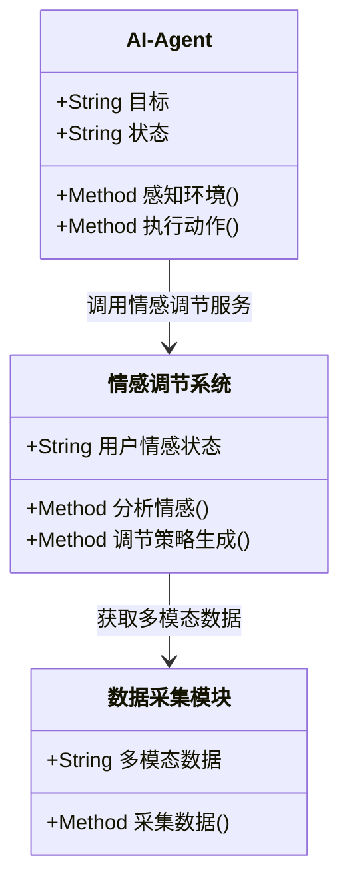
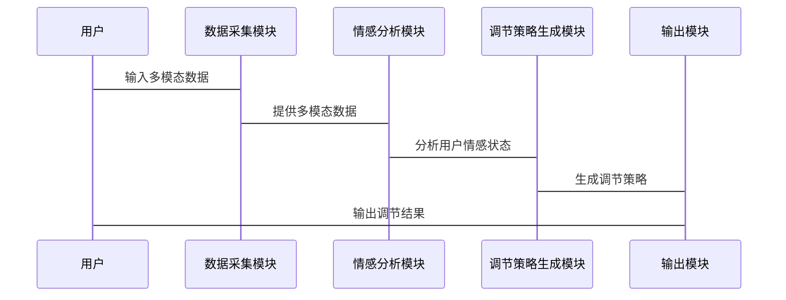

                 


# 开发AI Agent的跨模态情感调节系统

> 关键词：AI Agent，跨模态情感调节，情感分析，情感调节机制，多模态数据融合

> 摘要：本文将深入探讨AI Agent的跨模态情感调节系统的开发过程，从概念、算法原理到系统架构设计，详细阐述如何通过多模态数据融合和情感调节机制实现智能化的情感管理。文章将结合实际案例，分析系统实现的关键步骤和注意事项，为开发者提供全面的技术指导。

---

# 开发AI Agent的跨模态情感调节系统

## 第1章 背景与概念解析

### 1.1 AI Agent的基本概念

AI Agent（人工智能代理）是指能够感知环境、执行任务并采取行动以实现特定目标的智能实体。AI Agent可以是软件程序、机器人或其他智能系统，其核心能力包括感知、推理、决策和执行。

#### 1.1.1 AI Agent的特点
- **自主性**：能够在没有外部干预的情况下独立运行。
- **反应性**：能够根据环境变化实时调整行为。
- **社会性**：能够与其他Agent或人类进行交互和协作。
- **学习能力**：能够通过经验或数据优化自身行为。

### 1.2 跨模态情感调节系统

跨模态情感调节系统是一种能够理解并调节人类情感的AI系统，通过整合文本、语音、视觉等多种模态数据，实现对用户情感状态的精准识别和有效调节。

#### 1.2.1 跨模态情感调节系统的定义
跨模态情感调节系统是一种结合多模态数据（如文本、语音、图像）来分析用户情感状态，并通过调整输入或输出来优化用户体验的AI系统。

### 1.3 问题背景与应用

#### 1.3.1 情感分析的背景
- **挑战**：传统的情感分析主要依赖单一模态（如文本或语音），难以充分利用多模态信息。
- **跨模态融合的优势**：通过整合多种模态数据，可以更全面地理解用户情感状态，提高情感分析的准确性和鲁棒性。

#### 1.3.2 跨模态情感调节系统的应用场景
- **智能助手**：通过理解用户情感，提供更贴心的服务。
- **教育科技**：帮助学生缓解压力，提升学习体验。
- **健康管理**：通过情感调节促进用户的身心健康。
- **智能客服**：通过情感分析优化客户服务质量。

---

## 第2章 跨模态数据处理与情感分析

### 2.1 跨模态数据的处理

#### 2.1.1 跨模态数据的采集与预处理
- **数据采集**：通过传感器、摄像头、麦克风等设备获取多模态数据。
- **数据预处理**：对数据进行清洗、归一化和特征提取。

#### 2.1.2 跨模态数据的融合方法
- **早期融合**：在数据预处理阶段进行融合。
- **晚期融合**：在特征提取或模型训练阶段进行融合。
- **自适应融合**：根据任务需求动态调整融合策略。

### 2.2 情感分析的核心算法

#### 2.2.1 基于文本的情感分析
- **文本特征提取**：使用词袋模型或词嵌入（如Word2Vec、GloVe）提取文本特征。
- **模型选择**：使用LSTM、GRU或Transformer等模型进行文本情感分类。

#### 2.2.2 基于语音的情感分析
- **语音特征提取**：提取语音的音调、语速、音高变化等特征。
- **模型选择**：使用CNN或RNN进行语音情感分类。

#### 2.2.3 基于视觉的情感分析
- **视觉特征提取**：提取面部表情、肢体语言等视觉特征。
- **模型选择**：使用CNN或GAN进行视觉情感分类。

### 2.3 跨模态情感分析的融合策略

#### 2.3.1 跨模态特征融合
- **多模态特征向量的融合**：将文本、语音、视觉特征向量进行融合，形成联合特征向量。
- **注意力机制的应用**：通过注意力机制动态调整各模态特征的重要性。

#### 2.3.2 情感一致性与冲突处理
- **情感一致性检测**：通过分析多模态数据，检测情感表达的一致性。
- **情感冲突处理**：当不同模态数据的情感表达不一致时，采用加权平均、投票机制等方式进行优化。

---

## 第3章 情感调节机制与系统实现

### 3.1 情感调节的基本原理

#### 3.1.1 情感调节的目标
- **提升用户体验**：通过调节情感，提供更个性化和贴心的服务。
- **优化人机交互**：通过情感调节，增强人机交互的自然性和流畅性。

#### 3.1.2 情感调节的实现方式
- **反馈调节**：根据用户情感反馈，动态调整系统输出。
- **主动调节**：基于用户情感状态预测，主动采取调节措施。

### 3.2 跨模态情感调节的策略设计

#### 3.2.1 基于文本的情感调节策略
- **情感语言优化**：根据用户情感状态调整回复的语气和用词。

#### 3.2.2 基于语音的情感调节策略
- **语速与音调调节**：根据用户情感状态调整语音输出的语速和音调。

#### 3.2.3 基于视觉的情感调节策略
- **视觉反馈优化**：通过视觉反馈（如表情符号、图像）调节用户情感。

#### 3.2.4 跨模态协同调节策略
- **多模态反馈优化**：结合文本、语音、视觉等多种模态反馈，进行综合调节。

### 3.3 情感调节系统的实现框架

#### 3.3.1 系统功能模块
- **数据采集模块**：采集多模态数据。
- **情感分析模块**：分析用户情感状态。
- **调节策略生成模块**：根据情感分析结果生成调节策略。
- **输出模块**：输出调节后的结果。

#### 3.3.2 系统架构设计
- **模块化设计**：各功能模块独立开发，便于维护和扩展。
- **数据流设计**：数据在各模块之间流动，确保高效处理。

---

## 第4章 跨模态情感调节系统的算法实现

### 4.1 跨模态情感调节算法的核心模型

#### 4.1.1 多模态情感分析模型
- **模型结构**：使用多模态融合网络（MMFN）进行情感分析。
- **数学公式**：$$P(y|x) = \sigma(w_1x_1 + w_2x_2 + b)$$，其中$x_1$和$x_2$分别表示不同模态的特征向量。

#### 4.1.2 跨模态注意力机制
- **注意力权重计算**：$$\alpha_i = \frac{e^{w_i x_i}}{\sum_j e^{w_j x_j}}$$，其中$w_i$是注意力权重，$x_i$是第$i$个模态的特征向量。

#### 4.1.3 跨模态融合模型
- **融合策略**：通过加权融合不同模态的特征向量，$$x_{\text{fusion}} = \sum_{i=1}^n \alpha_i x_i$$。

### 4.2 語言模型与情感调节算法的结合

#### 4.2.1 語言模型的选择
- **预训练语言模型**：使用BERT、GPT等预训练语言模型进行文本特征提取。

#### 4.2.2 情感调节算法的实现
- **动态调整语言模型输出**：根据用户情感状态动态调整语言模型的输出内容。

---

## 第5章 系统分析与架构设计

### 5.1 系统功能设计

#### 5.1.1 领域模型设计
- **领域模型**：使用Mermaid绘制领域模型类图，展示系统各模块之间的关系。



#### 5.1.2 系统架构设计
- **分层架构**：将系统划分为数据采集层、特征提取层、情感分析层和调节策略生成层。

### 5.2 系统交互设计

#### 5.2.1 系统交互流程
- **用户输入**：用户通过多种模态输入情感信息。
- **系统处理**：系统分析用户情感状态，并生成调节策略。
- **反馈输出**：系统根据调节策略输出结果。

#### 5.2.2 交互流程图


---

## 第6章 项目实战与最佳实践

### 6.1 环境配置与安装

#### 6.1.1 环境配置
- **Python版本**：建议使用Python 3.8及以上版本。
- **依赖库安装**：安装必要的库，如TensorFlow、PyTorch、OpenCV等。

### 6.2 核心代码实现

#### 6.2.1 数据预处理代码
```python
import numpy as np
from tensorflow.keras.layers import Input, Dense, Activation
from tensorflow.keras.models import Model

# 定义多模态输入
input_text = Input(shape=(max_len,))  # 文本输入
input_audio = Input(shape=(n_features_audio,))  # 语音特征
input_visual = Input(shape=(n_features_visual,))  # 视觉特征

# 文本特征提取
x_text = Dense(64, activation='relu')(input_text)
x_text = Dense(32, activation='relu')(x_text)

# 语音特征提取
x_audio = Dense(64, activation='relu')(input_audio)
x_audio = Dense(32, activation='relu')(x_audio)

# 视觉特征提取
x_visual = Dense(64, activation='relu')(input_visual)
x_visual = Dense(32, activation='relu')(x_visual)

# 跨模态融合
x = concatenate([x_text, x_audio, x_visual])
x = Dense(16, activation='relu')(x)
x = Dense(1, activation='sigmoid')(x)

model = Model(inputs=[input_text, input_audio, input_visual], outputs=x)
model.compile(optimizer='adam', loss='binary_crossentropy', metrics=['accuracy'])
```

#### 6.2.2 情感调节策略生成代码
```python
def generate_regulation_strategy(user_emotion):
    if user_emotion == 'happy':
        return '保持积极态度'
    elif user_emotion == 'sad':
        return '提供情感支持'
    elif user_emotion == 'neutral':
        return '保持中立态度'
    else:
        return '调整至舒适状态'
```

### 6.3 项目小结与注意事项

#### 6.3.1 项目小结
- **实现目标**：完成了AI Agent的跨模态情感调节系统的开发。
- **主要挑战**：跨模态数据融合和情感一致性检测是系统实现的关键难点。

#### 6.3.2 注意事项
- **数据质量**：确保多模态数据的准确性和完整性。
- **模型调优**：通过实验优化模型参数，提升情感分析和调节的准确率。
- **用户体验**：注重用户隐私保护，避免情感调节过程中的过度干预。

---

## 第7章 总结与展望

### 7.1 总结
本文详细介绍了AI Agent的跨模态情感调节系统的开发过程，从概念解析到算法实现，再到系统架构设计，为开发者提供了全面的技术指导。通过多模态数据融合和情感调节机制的结合，可以显著提升人机交互的智能化水平。

### 7.2 未来展望
- **模型优化**：探索更高效的跨模态融合方法，如基于图神经网络的多模态数据建模。
- **应用场景扩展**：将跨模态情感调节技术应用于更多领域，如智能家居、虚拟现实、医疗健康等。
- **伦理与隐私保护**：加强用户隐私保护，确保情感调节过程中的伦理合规性。

---

通过本文的学习，读者可以系统地掌握AI Agent的跨模态情感调节系统的开发方法，并能够将其应用于实际项目中。希望本文能为相关领域的研究和应用提供有价值的参考和指导。

