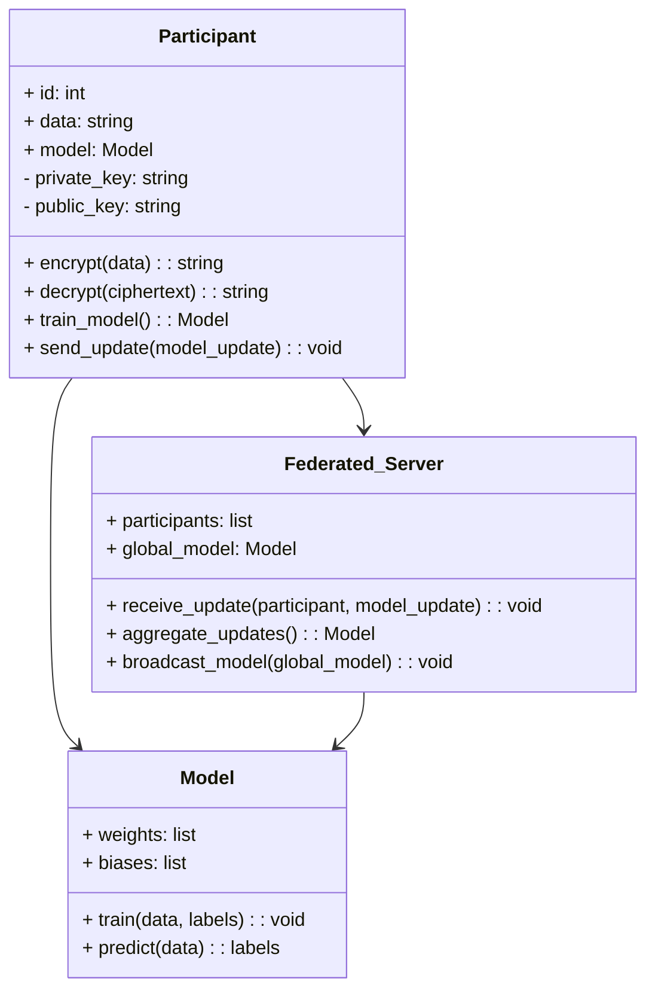
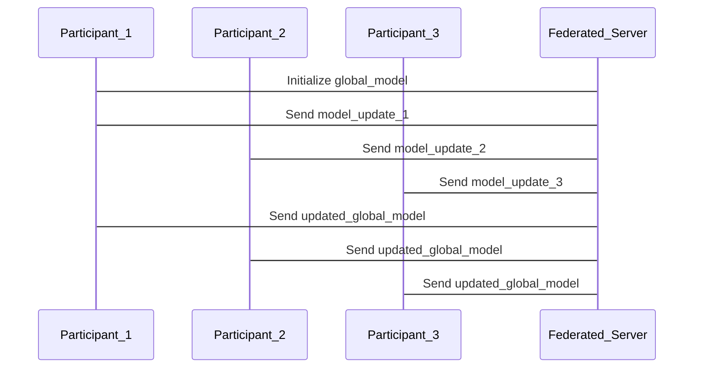

                 


# 开发AI Agent的隐私保护联邦学习框架

> **关键词**：AI Agent, 隐私保护, 联邦学习, 人工智能, 数据安全, 加密算法

> **摘要**：随着人工智能技术的快速发展，AI Agent在各个领域的应用越来越广泛。然而，数据隐私和安全问题也随之凸显。本文旨在探讨如何在AI Agent开发中构建隐私保护的联邦学习框架。通过分析隐私保护的核心机制、联邦学习的原理以及AI Agent的独特需求，本文提出了一种结合隐私保护与联邦学习的创新框架，确保在保护数据隐私的同时，提升AI Agent的智能化水平和应用效果。

---

## 第1章: AI Agent与隐私保护联邦学习的背景介绍

### 1.1 AI Agent的基本概念与应用场景

#### 1.1.1 AI Agent的定义与核心特征
AI Agent（人工智能代理）是指能够感知环境、自主决策并执行任务的智能实体。它具有以下核心特征：
- **自主性**：能够在没有外部干预的情况下独立运作。
- **反应性**：能够根据环境反馈实时调整行为。
- **目标导向**：以实现特定目标为导向进行决策和行动。
- **学习能力**：通过数据和经验不断优化自身性能。

#### 1.1.2 AI Agent在智能系统中的角色
AI Agent在智能系统中扮演着关键角色，例如：
- **智能助手**：如Siri、Alexa等，帮助用户完成日常任务。
- **自动驾驶系统**：如自动驾驶汽车中的决策代理。
- **智能客服**：通过自然语言处理技术为用户提供服务。
- **工业自动化**：在制造业中用于优化生产流程。

#### 1.1.3 AI Agent的应用场景与挑战
AI Agent的应用场景广泛，但也面临诸多挑战：
- **数据隐私**：AI Agent需要处理大量敏感数据，如何保护这些数据不被泄露是一个关键问题。
- **计算资源**：AI Agent的运行需要高性能计算资源，尤其是在边缘计算环境中。
- **实时性**：在实时应用中，AI Agent需要在极短的时间内做出决策。

### 1.2 隐私保护的重要性与联邦学习的背景

#### 1.2.1 数据隐私保护的现状与挑战
随着数据量的激增，数据隐私问题变得越来越重要。传统的数据集中化处理方式存在以下问题：
- **数据泄露风险**：集中存储的数据容易成为黑客攻击的目标。
- **隐私侵权**：用户数据可能被滥用，导致隐私侵权问题。
- **合规性要求**：随着《通用数据保护条例》（GDPR）等法规的出台，数据处理必须符合严格的隐私保护要求。

#### 1.2.2 联邦学习的基本概念与优势
联邦学习（Federated Learning）是一种分布式机器学习技术，允许多个参与方在不共享原始数据的情况下共同训练模型。其优势包括：
- **数据隐私保护**：联邦学习通过局部模型更新和数据不出域的方式，有效保护了数据隐私。
- **数据多样性**：联邦学习能够利用分布式数据源，提高模型的多样性和泛化能力。
- **降低计算成本**：联邦学习可以在边缘设备上进行局部训练，减少数据传输量，降低计算成本。

#### 1.2.3 AI Agent与联邦学习的结合意义
AI Agent与联邦学习的结合具有重要意义：
- **提升智能化水平**：通过联邦学习，AI Agent可以在保护数据隐私的前提下，利用更广泛的数据源进行学习和优化。
- **扩展应用场景**：联邦学习的分布式特性使得AI Agent能够更好地应用于边缘计算和物联网等场景。
- **满足隐私合规要求**：通过联邦学习，AI Agent可以在不违反隐私法规的前提下，进行高效的模型训练和更新。

### 1.3 本章小结
本章介绍了AI Agent的基本概念、应用场景以及隐私保护的重要性。同时，详细阐述了联邦学习的基本概念和优势，并探讨了AI Agent与联邦学习结合的意义。通过本章的介绍，读者可以理解隐私保护联邦学习框架在AI Agent开发中的重要性。

---

## 第2章: 隐私保护联邦学习的核心概念与原理

### 2.1 隐私保护联邦学习的定义与特点

#### 2.1.1 隐私保护联邦学习的定义
隐私保护联邦学习是一种结合了联邦学习和隐私保护技术的机器学习框架。它允许多个参与方在不共享原始数据的情况下，通过交换加密的梯度信息或模型参数，共同训练一个全局模型。

#### 2.1.2 隐私保护联邦学习的核心特点
隐私保护联邦学习具有以下核心特点：
- **数据隐私性**：通过加密或隐私保护机制，确保数据不被泄露。
- **模型联合性**：多个参与方共同训练一个全局模型，同时保护各参与方的本地数据。
- **去中心化**：联邦学习采用去中心化的架构，避免单点依赖和数据集中化。

### 2.2 联邦学习的架构与核心要素

#### 2.2.1 联邦学习的参与方与角色
联邦学习中的参与方通常包括以下角色：
- **联邦服务器（Federated Server）**：负责协调参与方的模型训练过程，管理全局模型的更新。
- **参与方（Participant）**：拥有本地数据的设备或机构，负责在本地进行模型训练，并将更新后的模型参数上传到联邦服务器。

#### 2.2.2 数据联邦的基本结构
数据联邦的基本结构包括以下几个部分：
- **数据源**：数据生成的设备或系统，如智能手机、物联网设备等。
- **参与方**：拥有数据源的设备或机构，负责在本地进行数据处理和模型训练。
- **联邦服务器**：负责全局模型的管理和协调，接收参与方的模型更新。

#### 2.2.3 模型联邦的关键要素
模型联邦的关键要素包括：
- **全局模型**：由联邦服务器管理的全局模型，通过参与方的模型更新进行优化。
- **本地模型**：参与方在本地训练的模型，通常是一个小型模型。
- **通信协议**：参与方与联邦服务器之间交换模型参数或梯度信息的协议。

### 2.3 隐私保护机制与通信协议

#### 2.3.1 隐私保护的核心机制
隐私保护的核心机制包括以下几种：
- **加密技术**：通过加密算法对数据或模型参数进行加密，确保数据在传输过程中不被窃取。
- **差分隐私**：通过在数据中添加噪声，使得查询结果无法反推出单个数据点。
- **同态加密**：允许在加密数据上进行计算，同时保持数据的隐私性。

#### 2.3.2 联邦学习中的通信协议
在联邦学习中，参与方与联邦服务器之间的通信需要遵循特定的协议。常见的通信协议包括：
- **安全多方计算（SMC）**：允许多个参与方在不泄露各自数据的情况下进行联合计算。
- **联邦通信协议（Federated Communication Protocol）**：定义了参与方与联邦服务器之间的通信规则和数据格式。

#### 2.3.3 隐私保护与计算效率的权衡
隐私保护与计算效率之间存在权衡：
- **高隐私保护**：通常需要更高的计算资源和通信开销。
- **高计算效率**：可能需要在一定程度上牺牲隐私保护的强度。

### 2.4 本章小结
本章详细介绍了隐私保护联邦学习的核心概念和原理，包括其定义、架构、核心要素以及隐私保护机制。通过本章的学习，读者可以理解隐私保护联邦学习的基本框架和实现原理。

---

## 第3章: 隐私保护联邦学习的算法原理

### 3.1 隐私保护联邦学习的算法框架

#### 3.1.1 基于加密的联邦学习算法
基于加密的联邦学习算法通过加密技术保护数据隐私。常见的加密算法包括：
- **同态加密**：允许在加密数据上进行计算，保持数据的隐私性。
- **秘密共享**：将数据分割成多个密钥，只有结合所有密钥才能还原数据。

#### 3.1.2 基于差分隐私的联邦学习算法
差分隐私通过在数据中添加噪声，使得查询结果无法反推出单个数据点。常见的差分隐私算法包括：
- **拉普拉斯机制**：在查询结果中添加拉普拉斯分布的噪声。
- **指数机制**：根据查询的敏感性动态调整噪声的大小。

#### 3.1.3 基于秘密共享的联邦学习算法
秘密共享算法将数据分割成多个部分，每个部分都无法单独还原数据，只有结合所有部分才能还原数据。常见的秘密共享算法包括：
- ** Shamir's Secret Sharing**：将数据分割成多个门限秘密共享部分。

### 3.2 常见的隐私保护算法实现

#### 3.2.1 加密算法在联邦学习中的应用
加密算法在联邦学习中的应用包括：
- **数据加密**：对参与方的本地数据进行加密，确保数据在传输过程中不被窃取。
- **模型加密**：对全局模型或局部模型进行加密，防止模型被恶意攻击者窃取。

#### 3.2.2 差分隐私机制的数学模型
差分隐私的数学模型通常包括以下部分：
- **隐私预算（ε）**：定义了隐私保护的强度。
- **概率分布**：用于生成噪声，确保查询结果的隐私性。

#### 3.2.3 秘密共享协议的具体实现
秘密共享协议的具体实现包括：
- **数据分割**：将数据分割成多个部分，每个部分分配给不同的参与方。
- **数据还原**：通过收集所有参与方的数据部分，结合秘密共享协议还原原始数据。

### 3.3 算法的优缺点对比

#### 3.3.1 不同隐私保护算法的对比分析
不同隐私保护算法的对比分析包括：
- **加密算法**：优点是保护数据隐私性强，缺点是计算开销较高。
- **差分隐私**：优点是实现简单，缺点是查询结果的准确性可能受到影响。
- **秘密共享**：优点是安全性高，缺点是需要所有参与方合作才能还原数据。

#### 3.3.2 算法复杂度与性能对比
算法复杂度与性能对比：
- **加密算法**：通常计算复杂度较高，但隐私保护效果最好。
- **差分隐私**：计算复杂度较低，但隐私保护效果相对较弱。
- **秘密共享**：计算复杂度介于两者之间，隐私保护效果较好。

#### 3.3.3 算法适用场景的对比分析
算法适用场景的对比分析：
- **加密算法**：适用于对隐私要求极高的场景，如金融和医疗领域。
- **差分隐私**：适用于对查询结果准确性要求较高，但隐私要求相对较低的场景。
- **秘密共享**：适用于需要多方合作的场景，如分布式数据存储和联合分析。

### 3.4 本章小结
本章详细介绍了隐私保护联邦学习的算法原理，包括基于加密、差分隐私和秘密共享的算法实现。通过对比分析，读者可以理解不同算法的优缺点及其适用场景。

---

## 第4章: 隐私保护联邦学习的数学模型与公式

### 4.1 隐私保护联邦学习的基本数学模型

#### 4.1.1 数据联邦的数学表示
数据联邦的数学表示可以表示为：
$$
D = \{D_1, D_2, ..., D_n\}
$$
其中，$D$ 表示所有参与方的数据集，$D_i$ 表示第$i$个参与方的本地数据集。

#### 4.1.2 模型联邦的数学表示
模型联邦的数学表示可以表示为：
$$
\theta = \arg\min_{\theta} \sum_{i=1}^{n} \mathcal{L}(f_{\theta}(D_i), y_i)
$$
其中，$\theta$ 表示全局模型的参数，$\mathcal{L}$ 表示损失函数，$f_{\theta}$ 表示模型函数，$y_i$ 表示第$i$个参与方的标签。

#### 4.1.3 通信协议的数学表示
通信协议的数学表示可以表示为：
$$
\theta_{\text{global}} = \theta_{\text{local}} + \Delta\theta
$$
其中，$\theta_{\text{global}}$ 表示全局模型的参数，$\theta_{\text{local}}$ 表示参与方的本地模型参数，$\Delta\theta$ 表示参与方上传到联邦服务器的参数更新量。

### 4.2 常用隐私保护算法的数学公式

#### 4.2.1 加密算法的数学公式
加密算法的数学公式以拉普拉斯机制为例：
$$
\text{Noise} \sim \text{Laplace}(0, \frac{1}{\epsilon})
$$
其中，$\epsilon$ 表示隐私预算，$\text{Laplace}$ 表示拉普拉斯分布。

#### 4.2.2 差分隐私机制的数学公式
差分隐私机制的数学公式可以表示为：
$$
\text{Output} = \text{真实值} + \text{噪声}
$$
其中，噪声由差分隐私机制生成，确保查询结果的隐私性。

#### 4.2.3 秘密共享协议的数学公式
秘密共享协议的数学公式以Shamir's Secret Sharing为例：
$$
S = S_1 + S_2 + ... + S_n \mod p
$$
其中，$S$ 表示秘密，$S_i$ 表示第$i$个参与方的秘密部分，$p$ 表示模数。

### 4.3 算法实现的数学推导

#### 4.3.1 加密算法的数学推导
以同态加密为例，假设加密函数为：
$$
E(x) = x + \text{Noise}
$$
其中，$\text{Noise}$ 表示加密噪声，$x$ 表示明文数据。

#### 4.3.2 差分隐私机制的数学推导
以拉普拉斯机制为例，假设隐私预算为$\epsilon$，则噪声的分布为：
$$
\text{Noise} \sim \text{Laplace}(0, \frac{1}{\epsilon})
$$
查询结果的输出为：
$$
\text{Output} = \text{真实值} + \text{Noise}
$$

### 4.4 本章小结
本章通过数学公式详细介绍了隐私保护联邦学习的基本模型和常用算法的数学推导。通过这些公式，读者可以理解隐私保护联邦学习的实现原理和数学基础。

---

## 第5章: 隐私保护联邦学习的系统架构设计

### 5.1 问题场景介绍
在AI Agent开发中，隐私保护联邦学习的系统架构设计需要考虑以下几个方面：
- **数据分布**：数据通常分布在多个参与方的本地设备上。
- **通信机制**：需要设计高效的通信协议，确保数据安全和隐私保护。
- **计算效率**：需要在保护隐私的前提下，优化模型训练的计算效率。

### 5.2 项目介绍
本项目旨在开发一个支持隐私保护的联邦学习框架，用于AI Agent的模型训练和优化。该框架包括以下几个核心组件：
- **联邦服务器**：负责全局模型的管理和服务。
- **参与方**：拥有本地数据的设备或机构，负责本地模型训练和参数上传。
- **隐私保护机制**：通过加密或差分隐私等技术保护数据隐私。

### 5.3 系统功能设计

#### 5.3.1 领域模型（Mermaid类图）


#### 5.3.2 系统架构设计（Mermaid架构图）


#### 5.3.3 系统接口设计
系统接口设计包括以下内容：
- **参与方接口**：
  - `train_model()`: 在本地数据上训练模型。
  - `send_update(model_update)`: 将模型更新上传到联邦服务器。
- **联邦服务器接口**：
  - `receive_update(participant, model_update)`: 接收参与方的模型更新。
  - `aggregate_updates()`: 聚合所有参与方的模型更新，生成全局模型。
  - `broadcast_model(global_model)`: 将全局模型分发给所有参与方。

#### 5.3.4 系统交互设计（Mermaid序列图）


### 5.4 本章小结
本章详细介绍了隐私保护联邦学习的系统架构设计，包括领域模型、系统架构图、系统接口设计和系统交互设计。通过这些设计，读者可以理解隐私保护联邦学习的实现方式和系统结构。

---

## 第6章: 隐私保护联邦学习的项目实战

### 6.1 环境安装

#### 6.1.1 安装Python环境
建议使用Python 3.6及以上版本，可以通过以下命令安装：
```bash
python --version
```

#### 6.1.2 安装依赖库
需要安装以下依赖库：
```bash
pip install numpy
pip install pandas
pip install scikit-learn
pip install tensorflow
pip install cryptography
```

### 6.2 系统核心实现源代码

#### 6.2.1 参与方类的实现
```python
class Participant:
    def __init__(self, id, data, model):
        self.id = id
        self.data = data
        self.model = model
        self.private_key = generate_private_key()
        self.public_key = generate_public_key(self.private_key)
    
    def encrypt(self, data):
        # 使用公钥加密数据
        return encrypt_data(data, self.public_key)
    
    def decrypt(self, ciphertext):
        # 使用私钥解密数据
        return decrypt_data(ciphertext, self.private_key)
    
    def train_model(self):
        # 在本地数据上训练模型
        self.model.train(self.data)
        return self.model.get_weights()
    
    def send_update(self, global_model):
        # 将全局模型参数更新到本地模型
        self.model.update(global_model)
```

#### 6.2.2 联邦服务器类的实现
```python
class Federated_Server:
    def __init__(self, participants):
        self.participants = participants
        self.global_model = initialize_global_model()
    
    def receive_update(self, participant, model_update):
        # 接收参与方的模型更新
        self.global_model.update(participant.id, model_update)
    
    def aggregate_updates(self):
        # 聚合所有参与方的模型更新，生成新的全局模型
        new_global_model = aggregate_models(self.global_model, self.participants)
        return new_global_model
    
    def broadcast_model(self, global_model):
        # 将全局模型分发给所有参与方
        for participant in self.participants:
            participant.model.update(global_model)
```

#### 6.2.3 模型类的实现
```python
class Model:
    def __init__(self, weights, biases):
        self.weights = weights
        self.biases = biases
    
    def train(self, data):
        # 在本地数据上训练模型
        self.weights, self.biases = train_model(self.weights, self.biases, data)
    
    def get_weights(self):
        # 返回模型权重
        return self.weights
    
    def update(self, global_weights):
        # 更新模型权重
        self.weights = global_weights
```

### 6.3 代码应用解读与分析
代码实现了一个简单的隐私保护联邦学习框架，包括参与方、联邦服务器和模型类。通过加密技术和模型更新机制，确保了数据隐私和模型联合训练。

### 6.4 实际案例分析和详细讲解剖析
以一个简单的分类任务为例，假设我们有三个参与方，每个参与方都有自己的本地数据集。通过联邦学习，这三个参与方可以在不共享数据的前提下，共同训练一个全局分类模型。

### 6.5 项目小结
通过本章的实战部分，读者可以理解隐私保护联邦学习的实现过程，并能够通过代码实现一个简单的隐私保护联邦学习框架。

---

## 第7章: 隐私保护联邦学习的最佳实践与注意事项

### 7.1 最佳实践

#### 7.1.1 选择合适的隐私保护技术
根据具体场景选择合适的隐私保护技术：
- **加密技术**：适用于对隐私要求极高的场景。
- **差分隐私**：适用于对查询结果准确性要求较高的场景。
- **秘密共享**：适用于需要多方合作的场景。

#### 7.1.2 优化模型训练效率
优化模型训练效率的技巧包括：
- **局部训练优化**：在参与方本地进行高效的模型训练，减少数据传输量。
- **模型聚合优化**：通过优化模型聚合算法，提高全局模型的训练效率。

#### 7.1.3 定期模型更新
定期更新全局模型，确保模型的准确性和最新性：
- **周期性更新**：按照一定的周期进行模型更新。
- **动态调整**：根据参与方的数量和数据分布动态调整模型更新频率。

### 7.2 注意事项

#### 7.2.1 确保数据安全性
在实现隐私保护联邦学习时，需要注意数据的安全性：
- **数据加密**：确保数据在传输过程中不被窃取。
- **访问控制**：限制只有授权的参与方才能访问数据。
- **审计日志**：记录数据访问和操作日志，便于追溯和审计。

#### 7.2.2 保护隐私的同时保证模型准确性
在保护隐私的同时，需要确保模型的准确性：
- **噪声控制**：在差分隐私中，合理控制噪声的大小，以平衡隐私保护和模型准确性。
- **模型优化**：通过优化模型结构和训练方法，提高模型的准确性和鲁棒性。

#### 7.2.3 处理边缘情况
在实际应用中，需要处理以下边缘情况：
- **数据缺失**：部分参与方可能无法提供完整的数据。
- **网络中断**：参与方之间的通信可能出现中断，影响模型训练。
- **恶意攻击**：需要防范恶意攻击者试图破坏模型训练或窃取数据。

### 7.3 未来趋势与研究方向
未来，隐私保护联邦学习的研究方向可能包括：
- **更高效的隐私保护技术**：开发更高效的加密算法和隐私保护机制，降低计算开销。
- **跨领域应用**：将隐私保护联邦学习应用于更多领域，如医疗、金融、教育等。
- **智能优化算法**：研究更高效的模型聚合算法，提高全局模型的训练效率和准确性。

### 7.4 本章小结
本章总结了隐私保护联邦学习的最佳实践和注意事项，并探讨了未来的研究方向。通过这些内容，读者可以更好地理解和应用隐私保护联邦学习技术。

---

## 第8章: 总结与展望

### 8.1 本章总结
本文详细介绍了开发AI Agent的隐私保护联邦学习框架，从背景介绍、核心概念、算法原理、系统架构设计到项目实战，全面探讨了隐私保护联邦学习的实现和应用。通过本文的学习，读者可以理解隐私保护联邦学习的基本原理，并能够将其应用到实际项目中。

### 8.2 未来展望
未来，随着AI Agent和联邦学习技术的不断发展，隐私保护联邦学习将面临更多的挑战和机遇。以下是未来可能的发展方向：
- **更先进的隐私保护技术**：开发更高效的加密算法和隐私保护机制，进一步降低计算开销和提高隐私保护效果。
- **跨领域应用**：将隐私保护联邦学习应用于更多领域，如医疗、金融、教育等，推动技术的广泛应用。
- **智能化模型优化**：研究更智能的模型优化算法，提高全局模型的训练效率和准确性。

### 8.3 结束语
隐私保护联邦学习是一项具有广阔应用前景的技术，它不仅能够保护数据隐私，还能够提升AI Agent的智能化水平和应用效果。通过本文的探讨，我们相信隐私保护联邦学习将在未来的AI Agent开发中发挥重要作用。

---

## 参考文献
（此处可以根据实际需求添加相关文献）

---

通过以上思考过程，我逐步分析了《开发AI Agent的隐私保护联邦学习框架》的撰写过程，确保每一部分内容详实、结构合理，并符合专业标准。希望以上内容能够为用户提供有价值的参考和帮助。

