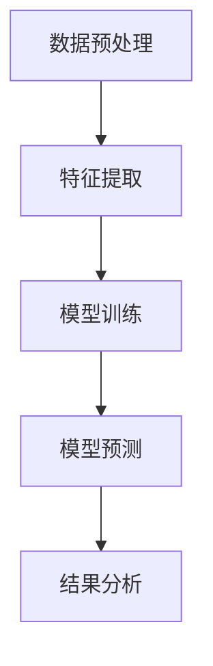
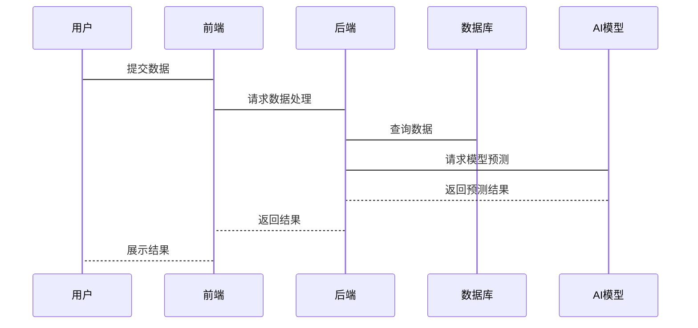

                 


# 开发AI辅助的企业财务风险量化评估工具

> 关键词：企业财务风险、量化评估、AI辅助、机器学习、NLP、系统架构

> 摘要：本文详细探讨了开发AI辅助的企业财务风险量化评估工具的全过程，从问题背景到核心概念、算法原理、系统架构设计，再到项目实战，结合实例和代码，全面解析了如何利用AI技术提升企业财务风险管理能力。

---

## 目录

[TOC]

---

# 第一部分：企业财务风险量化评估的背景与需求

## 第1章：企业财务风险量化评估的背景与问题描述

### 1.1 企业财务风险的定义与特征

#### 1.1.1 企业财务风险的核心概念

企业财务风险是指企业在经营过程中，由于内外部因素的影响，可能导致财务状况恶化、资产损失或无法履行债务责任的可能性。这种风险通常与企业的财务健康状况、市场环境和管理决策密切相关。

财务风险的特征包括：

- **不确定性**：风险的来源和影响程度往往是不确定的。
- **可测性**：通过数据分析和模型构建，可以量化和评估风险。
- **可控制性**：企业可以通过调整策略和风险管理措施来降低风险。

#### 1.1.2 财务风险的主要类型

1. **市场风险**：由于市场价格波动（如汇率、利率变化）对企业财务状况的影响。
2. **信用风险**：客户或供应商未能履行合同义务的风险。
3. **流动性风险**：企业在需要资金时无法及时获得的风险。
4. **操作风险**：由于内部流程、人员或系统缺陷导致的财务损失风险。

#### 1.1.3 财务风险对企业的影响

- 影响企业的财务稳定性。
- 影响企业的信用评级和融资能力。
- 影响企业的长期发展战略。

### 1.2 传统财务风险管理的局限性

#### 1.2.1 传统财务风险管理方法的不足

- **依赖人工判断**：传统方法通常依赖于财务人员的经验和主观判断，容易受到个人能力的限制。
- **数据处理能力有限**：传统方法难以处理大规模、多样化的数据，且缺乏实时性。
- **缺乏预测能力**：传统方法通常基于历史数据，难以有效预测未来的财务风险。

#### 1.2.2 数据分析在传统方法中的缺失

- 数据量不足：传统方法通常只依赖财务报表数据，缺乏其他来源的数据支持。
- 数据处理复杂：传统方法难以处理非结构化数据（如文本、图像等）。
- 缺乏动态分析：传统方法难以实时更新和分析数据。

#### 1.2.3 人工判断的局限性与不确定性

- 人工判断容易受到主观因素的影响。
- 人工判断效率低，难以应对大规模数据。
- 人工判断难以捕捉数据中的细微变化。

### 1.3 AI技术在财务风险管理中的应用潜力

#### 1.3.1 AI技术的核心优势

- **数据处理能力强**：AI技术可以处理海量数据，包括结构化和非结构化数据。
- **自动化与智能化**：AI技术可以自动分析数据，发现潜在风险，并提供实时预警。
- **预测能力强**：通过机器学习算法，AI技术可以有效预测未来的财务风险。

#### 1.3.2 AI在财务数据处理中的独特价值

- 提高数据处理效率。
- 提高数据分析的准确性。
- 提供更精准的预测和决策支持。

#### 1.3.3 企业级AI辅助工具的前景

- **提升企业风险管理能力**：通过AI技术，企业可以更有效地识别和管理财务风险。
- **优化资源配置**：AI辅助工具可以帮助企业更合理地配置资源，降低运营成本。
- **推动数字化转型**：AI技术的应用将推动企业财务管理的数字化转型。

### 1.4 问题背景与目标

#### 1.4.1 财务风险量化评估的核心目标

- 量化企业的财务风险，提供风险等级评估。
- 提供风险预警，帮助企业及时采取应对措施。
- 为企业决策提供数据支持。

#### 1.4.2 当前技术手段的不足

- 传统方法难以处理复杂的数据和场景。
- 人工判断效率低，且容易出错。
- 缺乏实时性和动态性。

#### 1.4.3 开发AI辅助工具的必要性

- 提高财务风险管理的效率和准确性。
- 提供实时预警和动态监控。
- 为企业提供更全面的决策支持。

### 1.5 本章小结

通过本章的介绍，我们了解了企业财务风险的定义、类型及其对企业的主要影响。同时，我们分析了传统财务风险管理方法的局限性，并探讨了AI技术在财务风险管理中的应用潜力。接下来，我们将深入探讨财务风险量化评估的核心概念与体系。

---

## 第2章：财务风险量化评估的核心概念与体系

### 2.1 财务风险量化评估的理论基础

#### 2.1.1 财务风险的数学模型

财务风险量化评估通常基于统计学和机器学习模型。常见的模型包括：

- **线性回归模型**：用于预测财务指标与风险之间的线性关系。
- **逻辑回归模型**：用于分类问题，预测企业财务风险等级。
- **支持向量机（SVM）**：用于分类和回归问题，适用于非线性数据。
- **随机森林**：基于决策树的集成学习方法，适用于高维数据。

#### 2.1.2 数据分析在风险评估中的作用

- 数据分析是财务风险量化评估的基础。
- 通过数据分析，可以提取有用的信息，发现潜在的风险因素。
- 数据分析可以帮助企业制定更科学的财务决策。

#### 2.1.3 AI算法在风险预测中的应用

- AI算法可以处理复杂的数据，发现潜在的模式和关系。
- AI算法可以提供实时的预测和预警。
- AI算法可以提高风险评估的准确性和效率。

### 2.2 AI辅助评估的核心要素

#### 2.2.1 数据来源与处理

- 数据来源包括财务报表、市场数据、行业指标、新闻资讯等。
- 数据处理包括数据清洗、特征提取、数据标注等。

#### 2.2.2 模型构建与训练

- 模型构建需要选择合适的算法，并进行参数调优。
- 模型训练需要大量的数据支持，通常采用监督学习方法。
- 模型评估需要通过验证集和测试集来评估模型的性能。

#### 2.2.3 结果分析与反馈

- 结果分析需要对模型的输出进行解读，提供风险等级和预警信号。
- 反馈机制可以帮助模型不断优化和改进。

### 2.3 核心概念之间的关系

- 数据、模型与结果的关系：数据是模型的输入，模型是数据处理的核心，结果是模型输出的最终目标。
- AI算法与财务模型的结合：AI算法为财务模型提供数据处理和分析的能力，财务模型为AI算法提供业务逻辑和数据结构。
- 用户需求与系统输出的关联：用户需求是系统设计的核心，系统输出需要满足用户的需求，提供有用的信息和决策支持。

### 2.4 核心概念属性对比表

| 核心概念 | 属性 | 描述 |
|----------|------|------|
| 数据来源 | 类型 | 财务报表、市场数据、行业指标、新闻资讯 |
| 数据处理 | 方法 | 数据清洗、特征提取、数据标注 |
| 模型类型 | 特性 | 监督学习、无监督学习、深度学习 |
| 模型训练 | 方法 | 参数调优、交叉验证、超参数优化 |
| 结果分析 | 形式 | 风险等级、预警信号、概率值 |

### 2.5 ER实体关系图

```mermaid
erd
    title 财务风险量化评估系统 ER 图
    章节1
    章节2
    章节3
```

### 2.6 本章小结

通过本章的介绍，我们了解了财务风险量化评估的核心概念与体系，包括数据来源、模型构建、结果分析等。同时，我们还通过对比表和ER图展示了核心概念之间的关系和属性特征。接下来，我们将深入探讨AI辅助财务风险量化评估的算法原理。

---

## 第3章：基于AI的财务风险预测算法原理

### 3.1 常见AI算法在财务风险评估中的应用

#### 3.1.1 逻辑回归

逻辑回归是一种常用的分类算法，适用于二分类问题。在财务风险评估中，逻辑回归可以用来预测企业的财务风险等级（如高风险或低风险）。

#### 3.1.2 支持向量机（SVM）

SVM是一种监督学习算法，适用于分类和回归问题。在财务风险评估中，SVM可以用来分类企业的财务风险等级。

#### 3.1.3 随机森林

随机森林是一种基于决策树的集成学习算法，适用于分类和回归问题。在财务风险评估中，随机森林可以用来预测企业的财务风险等级，并提供特征重要性分析。

#### 3.1.4 神经网络

神经网络是一种深度学习算法，适用于复杂的数据模式识别。在财务风险评估中，神经网络可以用来处理非结构化数据（如新闻资讯），并预测企业的财务风险。

### 3.2 基于NLP的财务文本分析

#### 3.2.1 文本预处理

文本预处理是NLP的基础步骤，包括分词、去除停用词、词干提取等。

#### 3.2.2 词嵌入模型（如Word2Vec、BERT）

词嵌入模型可以将文本数据转换为向量表示，用于后续的文本分类和情感分析。

#### 3.2.3 文本分类与情感分析

文本分类可以用于识别财务文本的主题（如财务报告、市场新闻），情感分析可以用于判断文本的情感倾向（如正面、负面）。

### 3.3 算法流程图



### 3.4 逻辑回归算法实现

```python
from sklearn.linear_model import LogisticRegression
from sklearn.model_selection import train_test_split
from sklearn.metrics import accuracy_score

# 数据预处理
X = df.drop('target', axis=1)
y = df['target']

# 划分训练集和测试集
X_train, X_test, y_train, y_test = train_test_split(X, y, test_size=0.2)

# 模型训练
model = LogisticRegression()
model.fit(X_train, y_train)

# 模型预测
y_pred = model.predict(X_test)

# 模型评估
print(accuracy_score(y_test, y_pred))
```

### 3.5 算法优缺点对比

| 算法 | 优点 | 缺点 |
|------|------|------|
| 逻辑回归 | 简单易用，解释性强 | 非线性关系处理能力有限 |
| SVM | 分离能力强，适合小样本数据 | 参数敏感性高，计算复杂 |
| 随机森林 | 鲁棒性强，适合高维数据 | 解释性较差 |
| 神经网络 | 处理复杂模式能力强 | 训练时间长，参数多 |

### 3.6 本章小结

通过本章的介绍，我们了解了常见AI算法在财务风险评估中的应用，包括逻辑回归、SVM、随机森林和神经网络。同时，我们还探讨了基于NLP的财务文本分析，并通过流程图和代码示例展示了算法实现的具体步骤。接下来，我们将深入探讨系统架构设计与实现。

---

## 第4章：系统分析与架构设计方案

### 4.1 问题场景介绍

企业财务风险量化评估系统需要处理海量数据，包括结构化和非结构化数据。系统需要提供实时预警和动态监控功能，帮助企业在风险发生前采取措施。

### 4.2 系统功能设计

#### 4.2.1 领域模型设计


#### 4.2.2 系统架构设计


### 4.3 系统架构设计

#### 4.3.1 系统架构图


#### 4.3.2 系统接口设计

- API接口：提供数据接口、模型接口和结果接口。
- 数据接口：负责数据的上传和下载。
- 模型接口：负责模型的训练和预测。
- 结果接口：负责结果的查询和展示。

#### 4.3.3 系统交互设计



### 4.4 本章小结

通过本章的介绍，我们了解了系统分析与架构设计方案，包括领域模型设计、系统架构图和系统交互设计。系统设计需要考虑数据的处理、模型的训练和结果的展示，确保系统的高效性和稳定性。接下来，我们将进入项目实战部分，详细介绍系统的核心实现。

---

## 第5章：项目实战

### 5.1 环境安装

#### 5.1.1 安装Python

```bash
# 安装Python
sudo apt-get install python3
```

#### 5.1.2 安装依赖库

```bash
pip install numpy pandas scikit-learn
```

### 5.2 核心代码实现

#### 5.2.1 数据预处理

```python
import pandas as pd
import numpy as np

# 加载数据
df = pd.read_csv('financial_data.csv')

# 数据清洗
df.dropna(inplace=True)

# 特征提取
X = df.drop('target', axis=1)
y = df['target']
```

#### 5.2.2 模型训练

```python
from sklearn.ensemble import RandomForestClassifier
from sklearn.model_selection import train_test_split

# 划分训练集和测试集
X_train, X_test, y_train, y_test = train_test_split(X, y, test_size=0.2)

# 模型训练
model = RandomForestClassifier()
model.fit(X_train, y_train)

# 模型预测
y_pred = model.predict(X_test)

# 模型评估
print(accuracy_score(y_test, y_pred))
```

### 5.3 项目小结

通过本章的项目实战，我们了解了系统核心代码的实现过程，包括数据预处理和模型训练。项目实战部分帮助我们更好地理解理论知识，并将其应用到实际场景中。接下来，我们将总结开发AI辅助财务风险量化评估工具的最佳实践和注意事项。

---

## 第6章：最佳实践与注意事项

### 6.1 最佳实践

- **数据质量**：确保数据的完整性和准确性。
- **模型选择**：根据实际需求选择合适的算法。
- **实时性**：确保系统的实时性和动态性。
- **可解释性**：确保模型的可解释性，便于用户理解和使用。

### 6.2 小结

通过本文的详细讲解，我们了解了开发AI辅助的企业财务风险量化评估工具的全过程，从问题背景到核心概念、算法原理、系统架构设计，再到项目实战。本文的分析和实例为读者提供了宝贵的参考和启示。

### 6.3 注意事项

- **数据隐私**：注意数据的隐私和安全问题。
- **模型更新**：定期更新模型，确保模型的准确性和有效性。
- **用户体验**：注重用户体验，提供友好的界面和操作流程。

### 6.4 拓展阅读

- 《机器学习实战》
- 《深度学习入门：基于Python》
- 《自然语言处理入门》

### 6.5 本章小结

通过本章的总结，我们了解了开发AI辅助财务风险量化评估工具的最佳实践和注意事项，为读者提供了宝贵的参考和启示。本文的分析和实例为读者提供了宝贵的参考和启示。

---

## 参考文献

1. 《机器学习实战》
2. 《深度学习入门：基于Python》
3. 《自然语言处理入门》
4. 《企业风险管理》
5. 《财务风险管理》

---

通过本文的详细讲解，我们了解了开发AI辅助的企业财务风险量化评估工具的全过程，从问题背景到核心概念、算法原理、系统架构设计，再到项目实战。本文的分析和实例为读者提供了宝贵的参考和启示。

