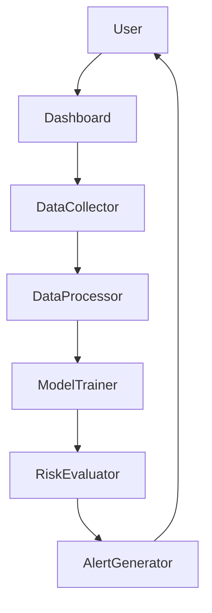

                 


# 开发AI辅助的企业财务风险预警仪表盘

---

## 关键词：
AI、财务风险、预警系统、机器学习、仪表盘、数据分析、风险管理

---

## 摘要：
随着企业经营环境的日益复杂化，财务风险的及时识别和预警变得至关重要。传统的财务风险预警方法依赖于人工分析和统计模型，存在效率低、滞后性和覆盖面有限等问题。而人工智能（AI）技术的快速发展为企业提供了更高效、更精准的解决方案。本文将深入探讨如何开发一款基于AI的财务风险预警仪表盘，从系统架构设计、算法原理、数据处理流程到实际应用案例，全面解析其开发过程和实现细节。通过本文，读者将能够理解AI在企业财务风险管理中的核心作用，并掌握如何利用AI技术构建高效的财务风险预警系统。

---

## 第一部分：企业财务风险预警的背景与挑战

### 第1章：企业财务风险预警的背景与挑战

#### 1.1 企业财务风险的定义与重要性
企业财务风险是指企业在经营过程中由于内外部因素的变化，导致财务状况恶化或财务目标无法实现的可能性。它涵盖了企业可能面临的多种风险，如流动性风险、信用风险、市场风险和操作风险等。

- **财务风险的核心要素**包括：资产流动性、负债结构、盈利能力、现金流状况、应收账款回收率等。
- **财务风险对企业的影响**：直接关系到企业的生存与发展，可能导致资金链断裂、信用评级下降、股东价值损失等严重后果。

#### 1.2 传统财务风险预警方法的局限性
传统财务风险预警方法主要依赖于财务报表分析和统计模型，如Z-score模型、Altman五因子模型等。然而，这些方法存在以下问题：

- **数据滞后性**：财务报表通常按季度或年度更新，无法捕捉到实时的财务变化。
- **维度有限**：传统模型关注的指标相对固定，难以覆盖企业经营中的复杂场景。
- **人工干预多**：从数据收集到分析结果的输出需要大量人工操作，效率低下。

#### 1.3 AI技术在财务风险预警中的优势
AI技术的引入为财务风险预警系统带来了革命性的变化：

- **数据处理能力**：AI能够快速处理海量数据，包括非结构化数据（如文本、语音）和结构化数据（如财务报表）。
- **实时性**：AI算法可以实时分析企业财务数据，提供即时预警。
- **精准性**：通过机器学习算法，AI能够识别复杂的数据模式，提高预警的准确性。

#### 1.4 本章小结
本章介绍了企业财务风险的基本概念、传统预警方法的局限性以及AI技术在其中的核心作用。接下来将详细探讨AI辅助财务风险预警的核心概念和系统架构。

---

## 第二部分：AI辅助财务风险预警的核心概念

### 第2章：AI辅助财务风险预警的核心概念

#### 2.1 财务风险预警系统的组成与功能
AI辅助的财务风险预警系统通常由以下几个核心模块组成：

- **数据采集模块**：负责从企业内部和外部获取相关的财务数据，包括财务报表、交易记录、市场数据等。
- **数据分析模块**：对数据进行清洗、转换和特征提取，为后续的模型训练提供高质量的数据。
- **风险评估模块**：利用机器学习算法对数据进行建模和分析，评估企业的财务风险等级。
- **预警反馈模块**：根据模型的输出结果生成预警信息，并通过仪表盘或其他渠道反馈给企业决策者。

#### 2.2 AI在财务风险预警中的关键作用
AI在财务风险预警中的应用主要体现在以下几个方面：

- **数据特征提取**：通过自然语言处理（NLP）和深度学习技术，提取文本数据中的隐含信息，丰富数据维度。
- **模型训练与优化**：利用监督学习、无监督学习等算法，训练高效的财务风险预测模型。
- **实时预警生成**：基于实时数据流，动态更新模型，实现对企业财务状况的实时监控。

#### 2.3 核心概念的ER实体关系图
以下是财务风险预警系统的核心实体关系图：

```mermaid
er
  actor: 用户
  dashboard: 仪表盘
  risk_factors: 风险因素
  data_source: 数据源
  model: 预警模型
  alert: 预警信息
  relations:
    - 用户 --> 仪表盘
    - 数据源 --> 风险因素
    - 风险因素 --> 预警模型
    - 预警模型 --> 预警信息
```

#### 2.4 本章小结
本章详细介绍了AI辅助财务风险预警系统的组成和功能，并通过ER图展示了核心概念之间的关系。接下来将深入探讨系统的算法原理和实现细节。

---

## 第三部分：AI辅助财务风险预警的算法原理

### 第3章：AI辅助财务风险预警的算法原理

#### 3.1 常见的机器学习算法及其适用场景
在财务风险预警中，常用的机器学习算法包括：

- **逻辑回归**：适用于二分类问题，如企业财务健康状况的分类。
- **支持向量机（SVM）**：适用于小样本数据的分类和回归问题。
- **随机森林**：适用于高维数据的特征选择和非线性关系建模。
- **神经网络**：适用于复杂的非线性关系和深度特征提取。

#### 3.2 基于逻辑回归的财务风险预测模型
逻辑回归是一种常用的二分类算法，适用于将企业财务状况分为“健康”和“风险”两类。

- **模型原理**：
  - 逻辑回归通过sigmoid函数将线性回归的结果映射到概率空间。
  - 损失函数通常采用对数损失函数，通过梯度下降法优化参数。

- **模型流程**：
  ```mermaid
  graph TD
    A[数据预处理] --> B[特征选择]
    B --> C[模型训练]
    C --> D[模型评估]
    D --> E[结果输出]
  ```

- **数学模型**：
  损失函数：
  $$\text{损失函数} = -\frac{1}{m}\sum_{i=1}^{m} [y_i\log(h(x_i)) + (1-y_i)\log(1-h(x_i))]$$

  其中，$$h(x) = \frac{1}{1 + e^{-\beta x}}$$

#### 3.3 本章小结
本章详细介绍了几种常用的机器学习算法及其在财务风险预警中的应用，并以逻辑回归为例，展示了模型的实现流程和数学原理。接下来将探讨系统的架构设计和实现细节。

---

## 第四部分：财务风险预警系统的架构设计

### 第4章：财务风险预警系统的架构设计

#### 4.1 系统总体架构
财务风险预警系统的总体架构可以分为以下几个层次：

- **数据采集层**：负责从企业内部系统和外部数据源获取数据。
- **数据处理层**：对数据进行清洗、转换和特征提取。
- **模型训练层**：利用机器学习算法训练风险预警模型。
- **预警展示层**：通过仪表盘向用户展示实时的预警信息。

- **系统架构图**：
  ```mermaid
  graph TD
    API Gateway --> L[数据处理层]
    L --> M[模型训练层]
    M --> D[数据存储层]
    D --> V[预警展示层]
  ```

#### 4.2 系统功能模块设计
- **数据采集模块**：从企业ERP系统、财务系统等获取数据。
- **数据分析模块**：对数据进行清洗和特征工程，生成可用于模型训练的数据集。
- **模型训练模块**：利用训练好的模型对数据进行预测，并生成风险评估结果。
- **预警展示模块**：通过仪表盘向用户展示风险评估结果和实时预警信息。

#### 4.3 系统架构图


#### 4.4 本章小结
本章详细描述了财务风险预警系统的总体架构和功能模块设计，展示了系统各部分之间的关系。接下来将通过项目实战部分，展示系统的具体实现过程。

---

## 第五部分：项目实战——开发AI辅助的财务风险预警仪表盘

### 第5章：项目实战

#### 5.1 项目概述
本项目的目标是开发一款基于AI的财务风险预警仪表盘，帮助企业在实时监控财务状况的基础上，快速识别潜在风险，并提供预警信息。

#### 5.2 环境安装与配置
- **Python环境**：安装Python 3.8及以上版本。
- **依赖库安装**：
  ```bash
  pip install numpy pandas scikit-learn matplotlib seaborn flask
  ```

#### 5.3 核心代码实现
以下是系统的核心代码实现：

```python
import pandas as pd
from sklearn.model_selection import train_test_split
from sklearn.linear_model import LogisticRegression
from sklearn.metrics import accuracy_score, confusion_matrix

# 数据加载与预处理
data = pd.read_csv('financial_data.csv')
X = data.drop('target', axis=1)
y = data['target']

# 数据分割
X_train, X_test, y_train, y_test = train_test_split(X, y, test_size=0.2, random_state=42)

# 模型训练
model = LogisticRegression(max_iter=1000)
model.fit(X_train, y_train)

# 模型评估
y_pred = model.predict(X_test)
print("Accuracy:", accuracy_score(y_test, y_pred))
print("Confusion Matrix:\n", confusion_matrix(y_test, y_pred))
```

#### 5.4 实际案例分析
以某制造企业的财务数据为例，假设我们有以下数据：

| 财务指标 | 数据值 |
|--------|-------|
| 资产负债率 | 75%   |
| 净利润率   | 5%    |
| 应收账款周转率 | 2次/年 |

通过模型预测，系统可能会生成以下预警信息：

- **风险等级**：高风险
- **风险类型**：流动性风险
- **建议措施**：优化应收账款管理，加快资金回笼。

#### 5.5 项目小结
本章通过实际案例展示了AI辅助财务风险预警系统的实现过程，从数据加载到模型训练，再到结果展示，详细讲解了系统的核心代码和实际应用。

---

## 第六部分：总结与展望

### 第6章：总结与展望

#### 6.1 最佳实践与注意事项
- **数据质量**：确保数据的准确性和完整性，避免噪声数据对模型的影响。
- **模型优化**：定期更新模型，引入新的数据和特征，保持模型的预测能力。
- **用户反馈**：根据用户的使用反馈不断优化系统功能和界面。

#### 6.2 未来发展趋势
- **多模态数据融合**：将结构化数据、文本数据和图像数据相结合，提高预警的准确性。
- **自动化运维**：实现系统的自动化部署和监控，降低维护成本。
- **智能化决策**：结合自然语言处理和知识图谱技术，提供智能化的决策支持。

#### 6.3 本章小结
本文详细探讨了AI辅助的企业财务风险预警仪表盘的开发过程，从系统架构设计到算法实现，再到实际应用案例，全面解析了其核心技术和实现细节。未来，随着AI技术的不断发展，财务风险预警系统将更加智能化和高效化。

---

## 结语
通过本文的介绍，读者可以深入了解如何利用AI技术开发企业财务风险预警系统，并掌握其实现的关键技术和应用方法。希望本文能够为企业的财务风险管理提供有价值的参考和指导。

