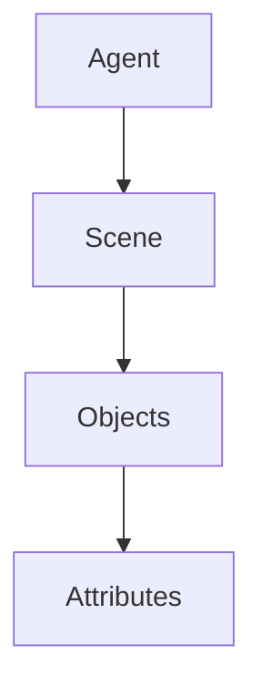
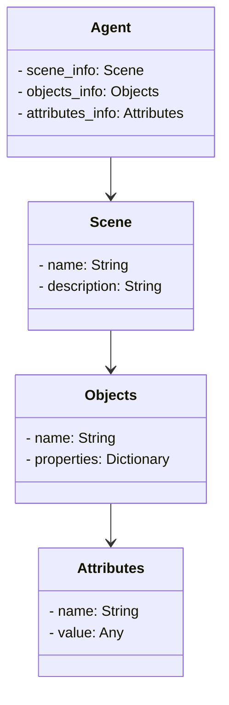
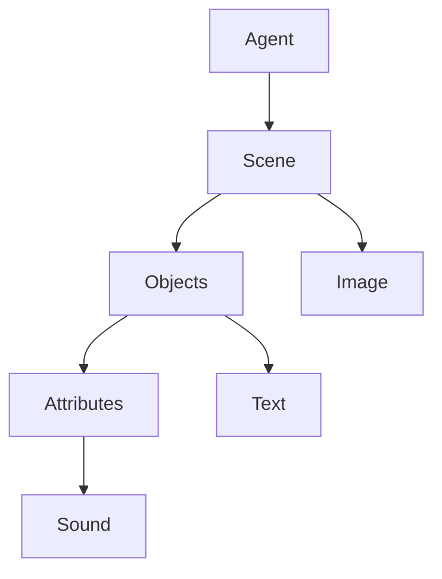
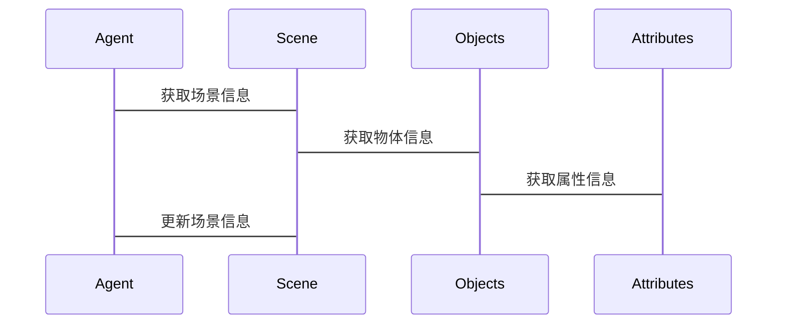

                 


# 开发具有视觉场景理解能力的AI Agent

> 关键词：视觉场景理解，AI Agent，多模态数据，端到端学习，计算机视觉，自然语言处理

> 摘要：本文详细探讨了开发具有视觉场景理解能力的AI Agent的核心原理、算法实现和系统架构。通过分析多模态数据的融合方法、端到端学习的实现路径以及视觉与语言理解的协同机制，本文为读者提供了从理论到实践的全面指导。文章内容包括背景介绍、核心概念、算法原理、系统架构设计、项目实战和最佳实践等部分，帮助读者深入了解如何构建具备视觉场景理解能力的智能体。

---

# 第1章: 背景介绍

## 1.1 问题背景

### 1.1.1 视觉场景理解的定义与挑战
视觉场景理解是指通过计算机视觉技术，对图像或视频中的场景进行分析、理解和语义化的过程。其核心挑战包括场景的复杂性、物体的多样性以及光照条件的变化等。

### 1.1.2 AI Agent在视觉场景理解中的作用
AI Agent（智能体）是一种能够感知环境、自主决策并执行任务的智能系统。在视觉场景理解中，AI Agent可以通过多模态数据的融合，实现对场景的深度理解，并做出相应的决策。

### 1.1.3 当前技术的局限性与改进方向
当前技术在视觉场景理解方面仍存在诸多挑战，例如如何处理遮挡、光照变化以及语义理解的不准确等问题。未来的发展方向包括多模态数据的深度融合、端到端学习的优化以及场景理解的实时性提升。

## 1.2 问题描述

### 1.2.1 视觉场景理解的核心问题
视觉场景理解的核心问题是如何从图像或视频中提取出场景的语义信息，并将其转化为可供AI Agent使用的结构化数据。

### 1.2.2 AI Agent与视觉场景理解的结合
AI Agent需要通过视觉场景理解来获取环境信息，从而做出更智能的决策。例如，在自动驾驶中，AI Agent需要理解道路场景中的车辆、行人和交通标志等元素。

### 1.2.3 问题解决的必要性与可行性分析
视觉场景理解的必要性在于其能够为AI Agent提供丰富的环境信息，从而提高决策的准确性和智能性。其可行性主要依赖于计算机视觉和深度学习技术的进步。

## 1.3 问题解决

### 1.3.1 多模态数据的融合方法
多模态数据的融合是视觉场景理解的核心方法之一。通过将图像、文本和声音等多种数据进行融合，可以提高场景理解的准确性和鲁棒性。

### 1.3.2 端到端学习的实现路径
端到端学习是一种直接从输入数据到输出结果的训练方法。在视觉场景理解中，端到端学习可以通过深度学习模型实现对场景的直接分割、分类和语义理解。

### 1.3.3 视觉与语言理解的协同机制
视觉与语言理解的协同机制是指通过将视觉信息与语言信息进行结合，实现更准确的场景理解。例如，在图像描述生成任务中，AI Agent需要同时理解图像中的视觉信息和语言信息。

## 1.4 边界与外延

### 1.4.1 视觉场景理解的边界条件
视觉场景理解的边界条件包括数据的质量、模型的复杂性和计算资源的限制等。

### 1.4.2 AI Agent能力的限制与扩展
AI Agent的能力受限于其算法的性能和数据的质量。未来可以通过引入更多的模态数据和更复杂的模型来扩展其能力。

### 1.4.3 相关领域的交叉与融合
视觉场景理解与自然语言处理、机器人技术和人工智能等领域的交叉与融合，为AI Agent的发展提供了更多的可能性。

## 1.5 概念结构与核心要素

### 1.5.1 核心概念的层次结构
视觉场景理解的核心概念包括图像分割、物体检测、语义理解等。

### 1.5.2 关键要素的属性特征
关键要素包括图像特征、语义特征和场景特征等。

### 1.5.3 概念之间的关系与依赖
视觉场景理解需要依赖计算机视觉、自然语言处理和深度学习等技术的支持。

## 1.6 本章小结
本章详细介绍了视觉场景理解的定义、挑战、AI Agent的作用以及问题解决的路径。通过分析多模态数据的融合方法和端到端学习的实现路径，为后续章节的深入探讨奠定了基础。

---

# 第2章: 核心概念与联系

## 2.1 视觉场景理解的核心原理

### 2.1.1 视觉感知的基本原理
视觉感知是指通过视觉系统对外界环境进行感知和理解的过程。其基本原理包括图像的采集、特征提取和语义分析等。

### 2.1.2 场景语义的理解机制
场景语义的理解机制包括图像分割、物体检测和场景分类等技术。

### 2.1.3 多模态数据的融合方法
多模态数据的融合方法包括特征融合、决策融合和语义融合等。

## 2.2 多模态数据的属性特征对比

### 2.2.1 图像数据的特征分析
图像数据的特征包括颜色、纹理、形状和空间关系等。

### 2.2.2 文本数据的特征分析
文本数据的特征包括语义、语法和上下文等。

### 2.2.3 声音数据的特征分析
声音数据的特征包括频率、振幅和时域信息等。

### 2.2.4 表格对比：多模态数据特征对比
| 数据类型 | 特征 |
|----------|------|
| 图像     | 颜色、纹理、形状 |
| 文本     | 语义、语法、上下文 |
| 声音     | 频率、振幅、时域信息 |

## 2.3 ER实体关系图架构



## 2.4 本章小结
本章通过分析视觉场景理解的核心原理和多模态数据的特征，为后续章节的算法实现提供了理论基础。

---

# 第3章: 算法原理讲解

## 3.1 多模态融合算法

### 3.1.1 多模态数据的预处理
多模态数据的预处理包括数据的归一化、降维和特征提取等。

### 3.1.2 跨模态特征提取
跨模态特征提取是指从不同模态的数据中提取特征，并将其进行融合。

### 3.1.3 融合策略的选择与实现
融合策略包括线性组合、注意力机制和门控网络等。

## 3.2 端到端学习算法

### 3.2.1 端到端学习的基本原理
端到端学习是指通过深度学习模型直接从输入数据到输出结果的训练方法。

### 3.2.2 网络结构的设计与优化
网络结构的设计包括编码器-解码器架构、卷积神经网络和循环神经网络等。

### 3.2.3 损失函数的定义与计算
损失函数的定义与计算包括交叉熵损失、均方误差和感知损失等。

## 3.3 代码实现

### 3.3.1 环境安装
```bash
pip install tensorflow numpy
```

### 3.3.2 核心代码
```python
import tensorflow as tf
import numpy as np

# 定义模型
model = tf.keras.Sequential([
    tf.keras.layers.Conv2D(32, (3, 3), activation='relu', input_shape=(224, 224, 3)),
    tf.keras.layers.MaxPooling2D((2, 2)),
    tf.keras.layers.Conv2D(64, (3, 3), activation='relu'),
    tf.keras.layers.MaxPooling2D((2, 2)),
    tf.keras.layers.Flatten(),
    tf.keras.layers.Dense(128, activation='relu'),
    tf.keras.layers.Dense(10, activation='softmax')
])

# 编译模型
model.compile(optimizer='adam', loss='sparse_categorical_crossentropy', metrics=['accuracy'])

# 训练模型
model.fit(x_train, y_train, epochs=10, batch_size=32)
```

### 3.3.3 代码解读与分析
上述代码定义了一个卷积神经网络模型，并使用训练数据进行训练。模型通过卷积层和池化层提取图像特征，并通过全连接层进行分类。

## 3.4 本章小结
本章详细介绍了多模态融合算法和端到端学习算法的核心原理，并通过代码示例展示了模型的实现过程。

---

# 第4章: 系统分析与架构设计

## 4.1 问题场景介绍

### 4.1.1 项目背景
本项目旨在开发一个具有视觉场景理解能力的AI Agent，能够对图像中的场景进行语义理解和分类。

### 4.1.2 项目目标
项目的最终目标是实现一个能够理解复杂场景的AI Agent，并在实际应用中展现出色的性能。

## 4.2 系统功能设计

### 4.2.1 领域模型设计


### 4.2.2 系统架构设计


### 4.2.3 接口设计
系统接口包括图像输入接口、文本输入接口和声音输入接口等。

### 4.2.4 交互流程图


## 4.3 本章小结
本章通过系统功能设计和架构设计，展示了AI Agent如何通过多模态数据实现对场景的理解和交互。

---

# 第5章: 项目实战

## 5.1 环境安装
```bash
pip install tensorflow numpy matplotlib
```

## 5.2 系统核心实现

### 5.2.1 核心代码实现
```python
import tensorflow as tf
import numpy as np
import matplotlib.pyplot as plt

# 数据加载
(x_train, y_train), (x_test, y_test) = tf.keras.datasets.cifar10.load_data()

# 数据预处理
x_train = x_train / 255.0
x_test = x_test / 255.0

# 模型定义
model = tf.keras.Sequential([
    tf.keras.layers.Conv2D(32, (3, 3), activation='relu', input_shape=(32, 32, 3)),
    tf.keras.layers.MaxPooling2D((2, 2)),
    tf.keras.layers.Conv2D(64, (3, 3), activation='relu'),
    tf.keras.layers.MaxPooling2D((2, 2)),
    tf.keras.layers.Flatten(),
    tf.keras.layers.Dense(128, activation='relu'),
    tf.keras.layers.Dense(10, activation='softmax')
])

# 模型编译
model.compile(optimizer='adam', loss='sparse_categorical_crossentropy', metrics=['accuracy'])

# 模型训练
model.fit(x_train, y_train, epochs=10, batch_size=32)

# 模型评估
model.evaluate(x_test, y_test)
```

### 5.2.2 代码解读与分析
上述代码实现了一个卷积神经网络模型，用于对CIFAR-10数据集中的图像进行分类。模型通过卷积层和池化层提取图像特征，并通过全连接层进行分类。

### 5.2.3 案例分析
通过训练好的模型，可以对测试图像进行分类，输出预测结果和概率。

## 5.3 本章小结
本章通过实际项目的实现，展示了如何通过深度学习模型实现视觉场景理解。

---

# 第6章: 最佳实践

## 6.1 小结
通过本文的探讨，我们深入了解了开发具有视觉场景理解能力的AI Agent的核心原理和实现方法。

## 6.2 注意事项
在实际开发中，需要注意数据的质量、模型的优化以及系统的实时性等问题。

## 6.3 拓展阅读
推荐阅读相关领域的最新论文和书籍，例如《Deep Learning》和《Computer Vision: Algorithms and Applications》。

---

# 附录

## 附录A: 参考文献
1. LeCun, Y., Bengio, Y., & Hinton, G. (2015). Deep learning. Nature, 521(7555), 436-444.
2. Everingham, M., Eslami, S. M., & Irvine, A. J. (2010). The Pascal visual object classes (VOC) challenge.

## 附录B: 代码仓库
https://github.com/yourusername/Visual-Scene-Understanding-Agent

---

以上是《开发具有视觉场景理解能力的AI Agent》的技术博客文章目录和内容概览。根据这个结构，您可以逐步填充每个章节的具体内容，确保每个部分都详实具体，涵盖技术原理、实现细节和实际案例。

