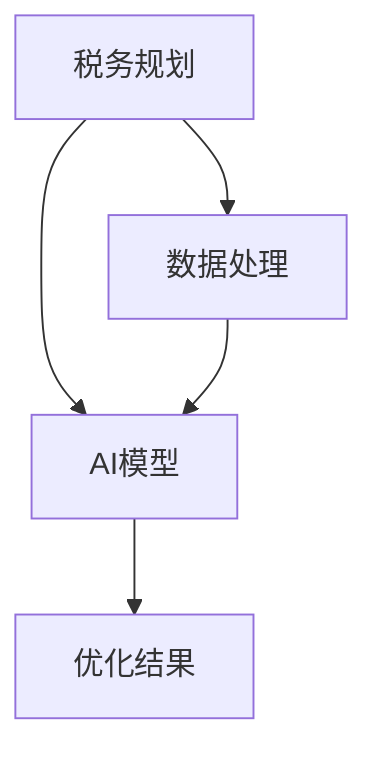
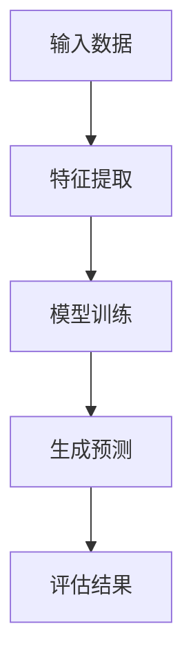
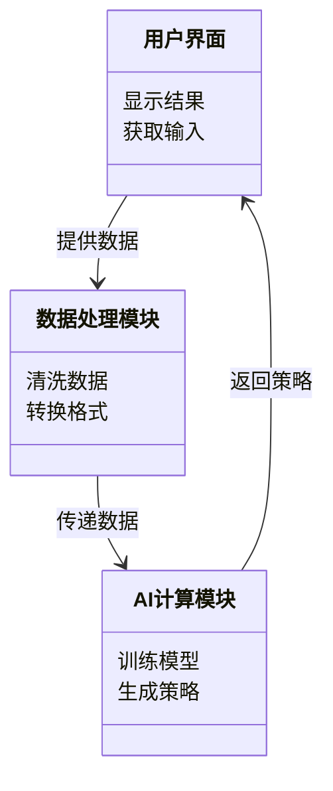
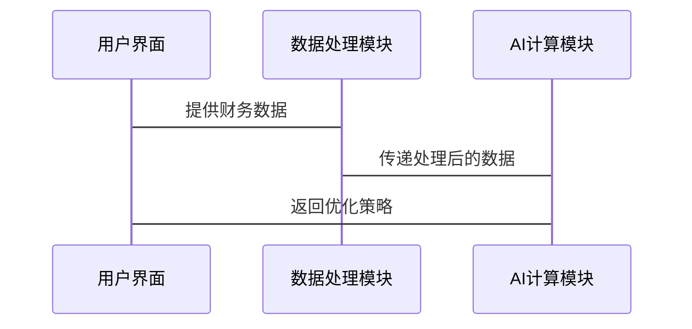

                 


# 开发基于AI的智能税务规划助手

## 关键词：
- 智能税务规划助手
- AI
- 税务优化
- 算法原理
- 系统架构

## 摘要：
随着人工智能技术的迅速发展，智能税务规划助手成为优化税务策略的重要工具。本文详细探讨了开发基于AI的智能税务规划助手的背景、核心概念、算法原理、系统架构以及项目实战，旨在为读者提供全面的技术指导。

---

## 第1章: 智能税务规划助手的背景介绍

### 1.1 税务规划的背景与问题背景
#### 1.1.1 税务规划的基本概念
税务规划是通过合法手段优化税务负担的过程，通常涉及企业或个人的财务策略调整。

#### 1.1.2 当前税务规划的主要问题
- 传统税务规划依赖人工经验，效率低且容易出错。
- 复杂的税务法规和多变的政策增加了规划的难度。

#### 1.1.3 传统税务规划的局限性
- 信息处理能力有限，难以覆盖所有可能的优化点。
- 缺乏实时数据更新，无法及时应对政策变化。

### 1.2 智能税务规划助手的定义与问题描述
#### 1.2.1 智能税务规划助手的定义
智能税务规划助手是一种基于AI技术的工具，能够根据用户提供的财务数据，生成最优的税务规划方案。

#### 1.2.2 税务规划助手的目标与功能
- **目标：** 实现税务优化，降低税负，提高资金使用效率。
- **功能：** 数据分析、策略生成、风险评估、实时监控。

#### 1.2.3 税务规划助手的应用场景
- 企业税务优化：帮助企业合理避税，优化税务结构。
- 个人税务规划：帮助个人制定最优的税务策略，如资产配置、投资规划。

### 1.3 智能税务规划助手的核心问题解决
#### 1.3.1 数据驱动的税务规划
通过大数据分析，识别潜在的税务优化机会。

#### 1.3.2 AI算法在税务优化中的应用
利用机器学习模型预测税务风险，优化税务结构。

#### 1.3.3 税务规划助手的核心价值
- 提高效率：自动化处理复杂的税务计算。
- 降低成本：减少人工错误，降低税务风险。
- 实时优化：根据最新的税务政策调整规划。

### 1.4 核心概念结构与核心要素
#### 1.4.1 核心概念结构图


#### 1.4.2 核心要素的对比分析
| 要素 | 描述 |
|------|------|
| 数据源 | 输入的财务数据 |
| AI模型 | 用于优化的算法 |
| 优化目标 | 最低税负 |

#### 1.4.3 核心要素的关联关系
- 数据源为AI模型提供输入。
- AI模型通过分析数据源生成优化结果。

---

## 第2章: 智能税务规划助手的核心概念与联系

### 2.1 核心概念的原理分析
#### 2.1.1 AI模型的核心原理
- 机器学习：通过训练数据预测最优策略。
- 深度学习：利用神经网络处理复杂数据。

#### 2.1.2 税务规划的数学模型
- 优化模型：目标是最小化税负，约束是符合税务法规。

#### 2.1.3 数据驱动的优化算法
- 使用线性规划或非线性优化算法，根据数据调整模型参数。

### 2.2 核心概念的属性特征对比
#### 2.2.1 不同AI模型的对比分析
| 模型类型 | 描述 | 优点 | 缺点 |
|----------|------|------|------|
| 监督学习 | 根据标记数据进行预测 | 高准确性 | 数据依赖性强 |
| 强化学习 | 通过试错优化策略 | 灵活性高 | 训练时间长 |
| 生成模型 | 生成新的数据 | 创新能力强 | 需大量数据 |

#### 2.2.2 数据特征的对比分析
- 数据量：越多越准确。
- 数据类型：结构化数据更适合传统机器学习。

#### 2.2.3 税务规划目标的对比分析
- 最低税负：首要目标。
- 合规性：必须满足税务法规。

### 2.3 ER实体关系图架构
```mermaid
erDiagram
    user {
        id INTEGER
        name VARCHAR
        tax_id VARCHAR
    }
    tax_data {
        id INTEGER
        data_type VARCHAR
        value DECIMAL
    }
    planning_strategy {
        id INTEGER
        strategy_type VARCHAR
        description TEXT
    }
    user --> tax_data : 提供
    tax_data --> planning_strategy : 生成
```

---

## 第3章: 智能税务规划助手的算法原理讲解

### 3.1 算法原理的数学模型与公式
#### 3.1.1 监督学习模型
目标函数：$$\text{loss}(y, \hat{y}) = \frac{1}{n}\sum_{i=1}^{n}(y_i - \hat{y}_i)^2$$

优化函数：$$\text{优化目标} = \text{loss} + \lambda \text{regularization}$$

#### 3.1.2 强化学习模型
状态空间：$$S$$

动作空间：$$A$$

奖励函数：$$R: S \times A \rightarrow \mathbb{R}$$

#### 3.1.3 生成模型
生成器：$$G(z)$$

判别器：$$D(x)$$

损失函数：$$\mathcal{L}(G, D) = \mathbb{E}_{x}[ \log D(x)] + \mathbb{E}_{z}[ \log (1 - D(G(z)))]$$

### 3.2 算法原理的详细讲解与举例说明
#### 3.2.1 监督学习的详细讲解
- 数据预处理：清洗、特征提取。
- 模型训练：使用训练数据调整参数。
- 预测与评估：计算准确率、召回率。

#### 3.2.2 强化学习的详细讲解
- 状态空间定义：如当前税务情况。
- 动作选择：生成可能的优化策略。
- 奖励机制：优化税负降低奖励。

#### 3.2.3 生成模型的详细讲解
- 生成新的税务策略。
- 判别模型评估策略的有效性。

### 3.3 算法原理的 mermaid 流程图


---

## 第4章: 智能税务规划助手的系统分析与架构设计方案

### 4.1 系统分析与问题场景介绍
#### 4.1.1 系统目标与功能分析
- 目标：优化税务策略。
- 功能：数据输入、模型计算、结果输出。

#### 4.1.2 系统的输入与输出分析
- 输入：财务数据、税务参数。
- 输出：优化策略、风险评估。

#### 4.1.3 系统的约束与假设
- 数据必须准确无误。
- 模型需定期更新。

### 4.2 系统架构设计
#### 4.2.1 系统架构的模块划分
- 数据处理模块：负责数据清洗和转换。
- AI计算模块：执行模型训练和预测。
- 用户界面模块：展示结果和交互。

#### 4.2.2 系统架构的 mermaid 类图


#### 4.2.3 系统架构的 mermaid 架构图
```mermaid
archiDiagram
    财务数据 --> 数据处理模块
    数据处理模块 --> AI计算模块
    AI计算模块 --> 用户界面
```

### 4.3 系统接口设计与交互流
#### 4.3.1 系统接口设计
- 数据接口：提供财务数据输入。
- 结果接口：输出优化策略。

#### 4.3.2 系统交互的 mermaid 序列图


---

## 第5章: 项目实战

### 5.1 环境搭建与代码实现
#### 5.1.1 环境搭建
- 安装Python、TensorFlow、Pandas等库。

#### 5.1.2 核心代码实现
```python
import numpy as np
import tensorflow as tf

# 数据预处理
def preprocess(data):
    # 数据清洗和转换
    return processed_data

# 模型训练
def train_model(data):
    model = tf.keras.Sequential()
    model.add(tf.keras.layers.Dense(64, activation='relu'))
    model.add(tf.keras.layers.Dense(1, activation='sigmoid'))
    model.compile(optimizer='adam', loss='binary_crossentropy')
    model.fit(data, labels, epochs=10)
    return model

# 生成策略
def generate_strategy(model, data):
    predictions = model.predict(data)
    return predictions
```

### 5.2 案例分析与解读
#### 5.2.1 案例分析
- 输入数据：某企业的财务数据。
- 输出结果：优化后的税务策略。

#### 5.2.2 代码解读
- 数据预处理：清洗和标准化。
- 模型训练：构建神经网络模型。
- 生成策略：基于训练好的模型进行预测。

### 5.3 项目小结
- 成功实现了智能税务规划助手的核心功能。
- 验证了AI算法在税务优化中的有效性。

---

## 第6章: 最佳实践与总结

### 6.1 小结
智能税务规划助手通过AI技术，显著提升了税务优化的效率和准确性。

### 6.2 注意事项与建议
- 数据隐私保护至关重要。
- 模型需要定期更新以适应变化。
- 保持对税务法规的持续关注。

### 6.3 拓展阅读
- 推荐学习机器学习和深度学习的相关书籍。
- 关注税务法规的变化和新技术的应用。

---

通过以上内容，我们可以看到，开发基于AI的智能税务规划助手是一个复杂但极具价值的项目。本文详细探讨了其开发过程中的关键点，为读者提供了宝贵的指导和启示。

