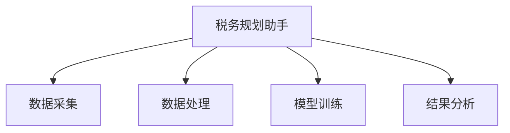
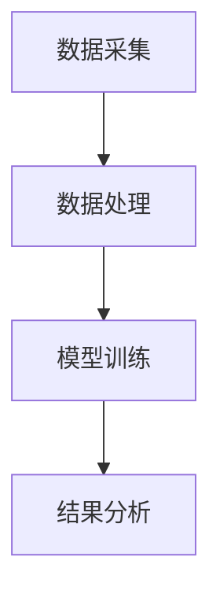
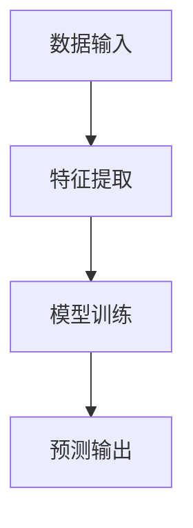
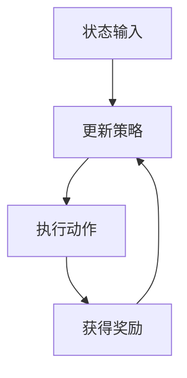
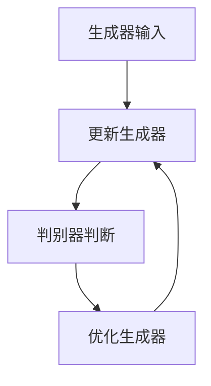
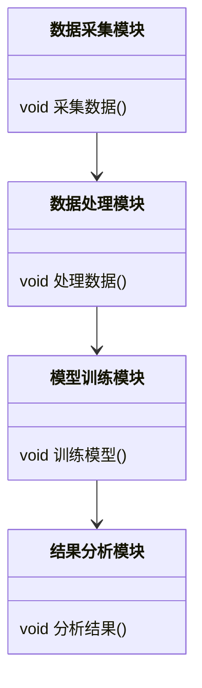
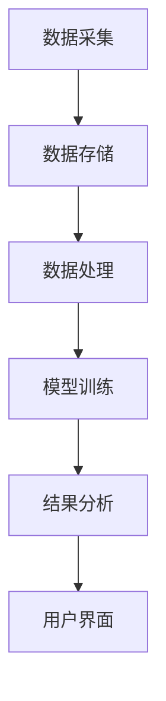
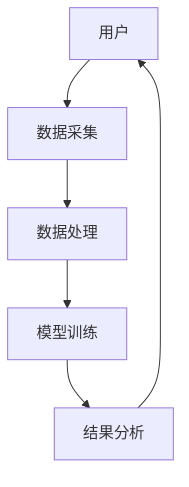

                 


# 开发基于AI的智能税务规划助手

## 关键词：AI，智能税务规划，助手，算法，系统架构

## 摘要：本文详细探讨了开发基于AI的智能税务规划助手的各个方面，从背景介绍到系统架构设计，再到项目实战和最佳实践，为读者提供了一个全面的技术指南。文章通过详细的数学模型和算法原理分析，结合实际案例，展示了如何利用AI技术优化税务规划过程。

---

# 第1章 智能税务规划助手的背景介绍

## 1.1 税务规划的背景与问题背景

### 1.1.1 税务规划的基本概念
税务规划是指通过合法手段优化税负，最大化资产价值的过程。传统的税务规划依赖人工分析，效率低且易出错。

### 1.1.2 当前税务规划的主要问题
- 数据分散：难以整合多来源数据。
- 信息复杂：涉及法律法规、税率变化等复杂因素。
- 人工依赖：依赖经验丰富的财务人员，成本高且效率低。

### 1.1.3 传统税务规划的局限性
- 无法实时更新：法律法规变化快，人工更新滞后。
- 数据处理能力有限：难以处理大规模数据。
- 精准度不足：人工分析容易出错，难以覆盖所有可能性。

## 1.2 智能税务规划助手的定义与问题描述

### 1.2.1 智能税务规划助手的定义
智能税务规划助手是一种基于AI技术的工具，通过分析财务数据和法律法规，提供优化的税务建议。

### 1.2.2 税务规划助手的目标与功能
- 目标：帮助用户优化税负，降低税务风险。
- 功能：数据采集、分析、建议生成、实时监控。

### 1.2.3 税务规划助手的应用场景
- 企业税务优化
- 个人税务规划
- 税务咨询与合规

## 1.3 智能税务规划助手的核心问题解决

### 1.3.1 数据驱动的税务规划
通过AI算法处理大量数据，发现潜在的税务优化机会。

### 1.3.2 AI算法在税务优化中的应用
- 数据清洗与预处理
- 模型训练与优化
- 结果分析与可视化

### 1.3.3 税务规划助手的核心价值
- 提高效率：自动化处理数据，节省时间。
- 降低成本：减少人工干预，降低开支。
- 增强精准度：AI算法提供更精准的建议。

## 1.4 智能税务规划助手的边界与外延

### 1.4.1 边界功能的定义
- 输入：财务数据、法律法规
- 输出：优化建议、风险提示

### 1.4.2 外延功能的扩展
- 数据可视化：直观展示税务状况。
- 报告生成：自动生成税务报告。
- 用户界面：友好的操作界面。

### 1.4.3 边界与外延的平衡
在功能设计中，需明确核心功能与扩展功能的界限，确保系统简洁高效。

## 1.5 核心概念结构与核心要素

### 1.5.1 核心概念结构图
使用Mermaid图展示税务规划助手的核心概念结构：



### 1.5.2 核心要素的对比分析
通过表格对比不同要素的特点：

| 要素 | 描述 | 优缺点 |
|------|------|--------|
| 数据采集 | 获取财务数据 | 数据量大，处理复杂 |
| 数据处理 | 清洗与预处理 | 时间消耗大，但提升准确性 |
| 模型训练 | 训练AI模型 | 计算资源消耗高，但效果好 |

### 1.5.3 核心要素的关联关系
核心要素之间的关系图：



---

# 第2章 智能税务规划助手的核心概念与联系

## 2.1 核心概念的原理分析

### 2.1.1 AI模型的核心原理
AI模型通过学习财务数据和法律法规，生成优化建议。例如，监督学习模型可以分类税务风险。

### 2.1.2 税务规划的数学模型
数学模型用于描述税务优化问题，例如：

$$ \text{目标函数} = \sum_{i=1}^{n} w_i x_i $$
$$ \text{约束条件} = \sum_{j=1}^{m} c_j y_j \leq k $$

### 2.1.3 数据驱动的优化算法
优化算法通过迭代更新参数，找到最优解。

## 2.2 核心概念的属性特征对比

### 2.2.1 不同AI模型的对比分析
通过表格对比监督学习、强化学习和生成模型的优缺点：

| 模型类型 | 监督学习 | 强化学习 | 生成模型 |
|----------|----------|----------|----------|
| 适用场景 | 分类问题 | 优化决策 | 数据生成 |
| 优缺点   | 简单高效 | 需大量数据 | 创造性强 |

### 2.2.2 数据特征的对比分析
数据特征包括收入、支出、资产等，不同特征对模型的影响需详细分析。

### 2.2.3 税务规划目标的对比分析
目标包括最小化税负、合规性优化等，需根据需求选择合适的模型。

## 2.3 ER实体关系图架构

### 2.3.1 实体关系图的定义
ER图展示系统中的实体及其关系。

### 2.3.2 实体关系图的绘制
使用Mermaid绘制：

```mermaid
erd
    客户 ---1--> 税务记录
    税务记录 --> 税务事件
```

### 2.3.3 实体关系图的解释
客户有多条税务记录，每条记录对应多个税务事件。

---

# 第3章 智能税务规划助手的算法原理讲解

## 3.1 算法原理的数学模型与公式

### 3.1.1 监督学习模型的数学公式
线性回归模型：

$$ y = \beta x + \epsilon $$

### 3.1.2 强化学习模型的数学公式
Q-learning算法：

$$ Q(s, a) = Q(s, a) + \alpha [r + \gamma \max Q(s', a') - Q(s, a)] $$

### 3.1.3 生成模型的数学公式
生成对抗网络（GAN）：

$$ \mathcal{L}_\text{G} = \mathbb{E}_{z \sim p_z}[\log D(G(z))] $$

$$ \mathcal{L}_\text{D} = \mathbb{E}_{x \sim p_x}[\log D(x)] + \mathbb{E}_{z \sim p_z}[\log (1 - D(G(z)))] $$

## 3.2 算法原理的详细讲解与举例说明

### 3.2.1 监督学习的详细讲解
监督学习通过标记数据训练模型，例如分类问题。

### 3.2.2 强化学习的详细讲解
强化学习通过奖励机制优化决策，例如在税务事件中选择最优策略。

### 3.2.3 生成模型的详细讲解
生成模型如GAN可以生成新的税务数据，用于测试和优化。

## 3.3 算法原理的 mermaid 流程图

### 3.3.1 监督学习流程图



### 3.3.2 强化学习流程图



### 3.3.3 生成模型流程图



---

# 第4章 智能税务规划助手的系统分析与架构设计方案

## 4.1 系统分析与问题场景介绍

### 4.1.1 系统目标与功能分析
系统目标是优化税负，功能包括数据采集、分析、建议生成。

### 4.1.2 系统的输入与输出分析
输入：财务数据、法律法规；输出：优化建议、风险提示。

### 4.1.3 系统的约束与假设
约束：数据隐私保护；假设：数据完整性。

## 4.2 系统架构设计

### 4.2.1 系统架构的模块划分
模块包括数据采集、数据处理、模型训练、结果分析。

### 4.2.2 系统架构的 mermaid 类图



### 4.2.3 系统架构的 mermaid 架构图



## 4.3 系统接口设计与交互流程

### 4.3.1 系统接口设计
API接口包括数据采集接口、模型训练接口、结果查询接口。

### 4.3.2 系统交互流程



---

# 第5章 智能税务规划助手的项目实战

## 5.1 项目环境搭建

### 5.1.1 环境要求
- Python 3.8+
- TensorFlow或PyTorch
- 数据库：MySQL或MongoDB

## 5.2 系统核心实现源代码

### 5.2.1 数据采集模块

```python
import pandas as pd

def collect_data():
    data = pd.read_csv('tax_data.csv')
    return data
```

### 5.2.2 数据处理模块

```python
def preprocess_data(data):
    # 数据清洗与预处理
    return processed_data
```

### 5.2.3 模型训练模块

```python
import tensorflow as tf

def train_model(processed_data):
    model = tf.keras.Sequential()
    model.add(tf.keras.layers.Dense(64, activation='relu'))
    model.add(tf.keras.layers.Dense(1, activation='sigmoid'))
    model.compile(optimizer='adam', loss='binary_crossentropy')
    model.fit(processed_data, labels, epochs=10)
    return model
```

### 5.2.4 结果分析模块

```python
def analyze_results(model):
    predictions = model.predict(processed_data)
    return predictions
```

## 5.3 代码应用解读与分析
详细解读每一部分代码的功能和作用。

## 5.4 实际案例分析和详细讲解剖析
通过具体案例展示系统如何优化税负。

## 5.5 项目小结
总结项目实现的关键点和经验教训。

---

# 第6章 最佳实践、小结、注意事项和拓展阅读

## 6.1 最佳实践 tips
- 数据预处理是关键
- 模型选择需结合实际需求
- 系统优化需持续迭代

## 6.2 小结
总结全文内容，强调AI在税务规划中的重要性。

## 6.3 注意事项
- 数据隐私保护
- 模型解释性
- 系统可扩展性

## 6.4 拓展阅读
推荐相关书籍和论文，供读者深入学习。

---

# 附录: 项目实战部分的完整代码和工具使用说明

## 附录1: 完整代码示例
提供项目核心代码的完整实现。

## 附录2: 工具使用说明
详细说明工具的安装、配置和使用方法。

---

通过以上思考过程，我们可以系统地开发和实现一个基于AI的智能税务规划助手，结合数学模型、算法原理和系统架构设计，为用户提供高效、精准的税务优化方案。

