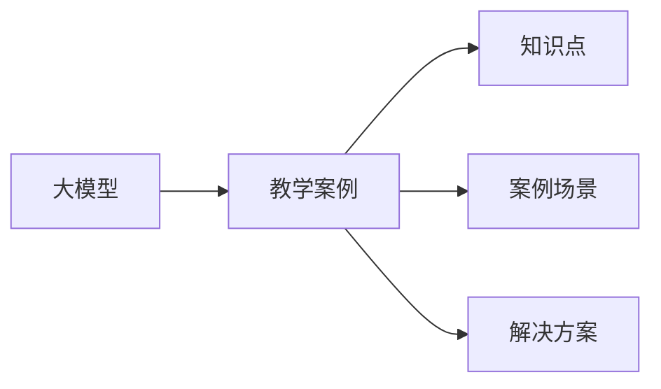
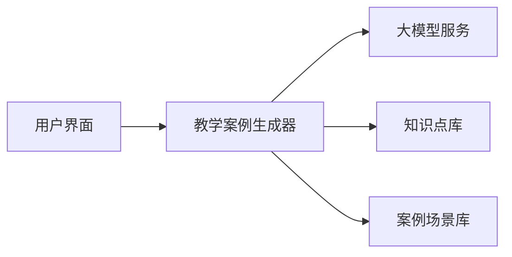
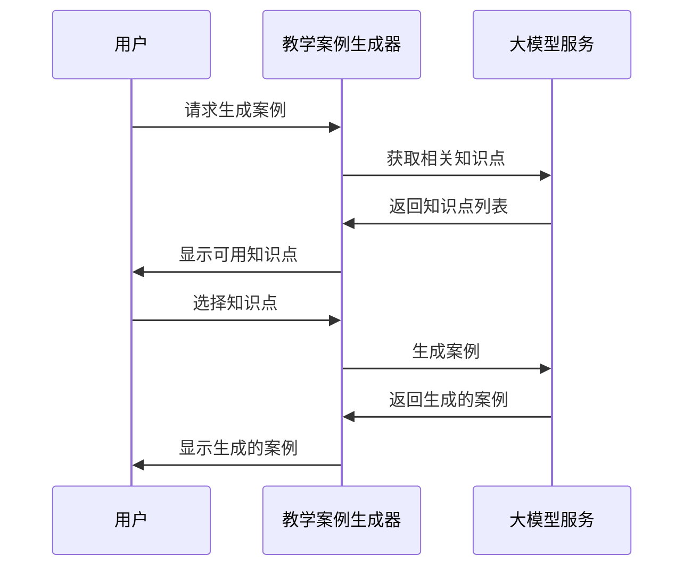

                 


# 开发基于大模型的金融专业教学案例动态生成器

## 关键词：
- 大模型
- 金融教学
- 案例生成
- 人工智能
- 教育科技

## 摘要：
本文详细探讨了如何利用大模型技术开发一个动态生成金融专业教学案例的系统。通过分析大模型的算法原理、系统架构设计以及实际项目实现，文章为教育科技领域提供了新的解决方案。我们从背景介绍、核心概念、算法实现、系统设计到项目实战，全面解析了该生成器的开发过程，并通过案例分析展示了其应用价值。

---

## 目录

### 第一部分: 背景与基础

#### 第1章: 大模型与金融教学案例生成的背景
- 1.1 大模型技术的发展与应用
  - 1.1.1 大模型技术的演进历程
  - 1.1.2 大模型在教育领域的应用潜力
  - 1.1.3 金融专业教学的特殊需求

- 1.2 金融专业教学案例生成的痛点
  - 1.2.1 传统教学案例开发的局限性
  - 1.2.2 金融知识的动态变化与个性化需求
  - 1.2.3 教学资源的高效生成与管理

#### 第2章: 金融专业教学案例动态生成器的核心概念
- 2.1 核心概念的定义与解析
  - 2.1.1 大模型在教学案例生成中的角色
  - 2.1.2 动态生成器的工作原理
  - 2.1.3 金融专业教学案例的核心要素

- 2.2 核心概念的属性特征对比
  - 2.2.1 对比表格展示
  - 2.2.2 ER实体关系图架构



### 第二部分: 核心原理与算法解析

#### 第3章: 大模型的算法原理
- 3.1 Transformer模型的核心结构
  - 3.1.1 编码器-解码器架构
  - 3.1.2 自注意力机制
  - 3.1.3 前馈网络

- 3.2 注意力机制的数学模型
  - 3.2.1 注意力权重计算公式
  $$\text{Attention}(Q, K, V) = \text{softmax}\left(\frac{QK^T}{\sqrt{d_k}}\right)V$$
  - 3.2.2 常见的注意力变体

- 3.3 大模型训练的优化策略
  - 3.3.1 动量法与Adam优化器
  - 3.3.2 梯度截断与损失函数
  - 3.3.3 预训练与微调策略

#### 第4章: 金融案例生成的算法实现
- 4.1 基于大模型的文本生成算法
  - 4.1.1 文本生成的条件设置
  - 4.1.2 基于金融领域的语言模型微调

- 4.2 基于规则的案例结构化处理
  - 4.2.1 金融知识点的抽取与分类
  - 4.2.2 案例场景的动态生成逻辑

- 4.3 混合模型的构建与优化
  - 4.3.1 大模型与领域规则的结合方式
  - 4.3.2 混合模型的训练与评估

### 第三部分: 系统架构与设计

#### 第5章: 问题场景与项目介绍
- 5.1 问题场景的定义与分析
  - 5.1.1 金融知识的动态更新
  - 5.1.2 教学案例的个性化需求
  - 5.1.3 系统的可扩展性要求

- 5.2 项目介绍与目标设定
  - 5.2.1 项目目标
  - 5.2.2 项目范围
  - 5.2.3 项目里程碑

#### 第6章: 系统功能设计
- 6.1 领域模型设计
  - 6.1.1 用例分析
  - 6.1.2 功能模块划分
  - 6.1.3 交互流程设计

```mermaid
classDiagram
    class 教学案例生成器 {
        +知识点库
        +案例场景库
        +解决方案库
        -生成规则
        -评估模块
        #generateCase()
        #evaluateCase()
    }
    class 大模型服务 {
        +语言模型
        +推理引擎
        -模型权重
        #generateText()
        #inference()
    }
    class 用户界面 {
        +输入界面
        +输出界面
        +控制面板
        #submitRequest()
        #receiveResponse()
    }
    教学案例生成器 <--o> 大模型服务
    教学案例生成器 <--o> 用户界面
```

#### 第7章: 系统架构设计
- 7.1 系统架构的分层设计
  - 7.1.1 表现层
  - 7.1.2 数据层
  - 7.1.3 业务逻辑层

- 7.2 系统架构图展示
  - 7.2.1 模块划分
  - 7.2.2 调用关系



#### 第8章: 系统接口设计与交互
- 8.1 系统接口设计
  - 8.1.1 输入接口定义
  - 8.1.2 输出接口定义
  - 8.1.3 API文档

- 8.2 系统交互流程
  - 8.2.1 用户请求处理
  - 8.2.2 系统响应流程
  - 8.2.3 错误处理机制



### 第四部分: 项目实战

#### 第9章: 环境安装与配置
- 9.1 开发环境的选择
  - 9.1.1 操作系统
  - 9.1.2 开发工具
  - 9.1.3 依赖管理

- 9.2 项目依赖安装
  - 9.2.1 Python包管理
  - 9.2.2 三方库安装
  - 9.2.3 模型服务部署

#### 第10章: 核心代码实现
- 10.1 大模型服务的调用
  - 10.1.1 API接口调用
  - 10.1.2 模型推理代码

- 10.2 生成器核心逻辑实现
  - 10.2.1 知识点抽取与匹配
  - 10.2.2 案例生成与优化

```python
# 代码示例：知识点抽取与匹配
def extract知识点(text):
    # 使用NLP模型抽取知识点
    pass

# 代码示例：案例生成与优化
def generate_case(知识点):
    # 调用大模型生成案例
    pass
```

#### 第11章: 项目测试与优化
- 11.1 功能测试
  - 11.1.1 单元测试
  - 11.1.2 集成测试
  - 11.1.3 性能测试

- 11.2 系统优化
  - 11.2.1 响应速度优化
  - 11.2.2 资源使用优化
  - 11.2.3 系统稳定性优化

#### 第12章: 案例分析与实际应用
- 12.1 案例分析
  - 12.1.1 成功案例
  - 12.1.2 问题与改进
  - 12.1.3 经验总结

- 12.2 实际应用展示
  - 12.2.1 教学效果评估
  - 12.2.2 学生反馈
  - 12.2.3 教师反馈

### 第五部分: 总结与展望

#### 第13章: 总结
- 13.1 全文总结
  - 13.1.1 核心技术总结
  - 13.1.2 系统设计总结
  - 13.1.3 项目实施总结

#### 第14章: 未来展望
- 14.1 技术发展展望
  - 14.1.1 大模型的进一步发展
  - 14.1.2 新技术的应用可能性
  - 14.1.3 系统优化的方向

- 14.2 应用场景展望
  - 14.2.1 更多领域的应用
  - 14.2.2 教学模式的变革
  - 14.2.3 教育科技的未来发展

#### 第15章: 最佳实践与注意事项
- 15.1 最佳实践
  - 15.1.1 技术选型建议
  - 15.1.2 开发流程建议
  - 15.1.3 系统维护建议

- 15.2 注意事项
  - 15.2.1 模型选择的注意事项
  - 15.2.2 知识点更新的注意事项
  - 15.2.3 系统安全性的注意事项

---

通过以上目录结构，文章将从理论到实践，全面、系统地介绍如何开发一个基于大模型的金融专业教学案例动态生成器。每个章节都包含丰富的技术细节和实际案例分析，确保读者能够深入理解并掌握相关技术。

