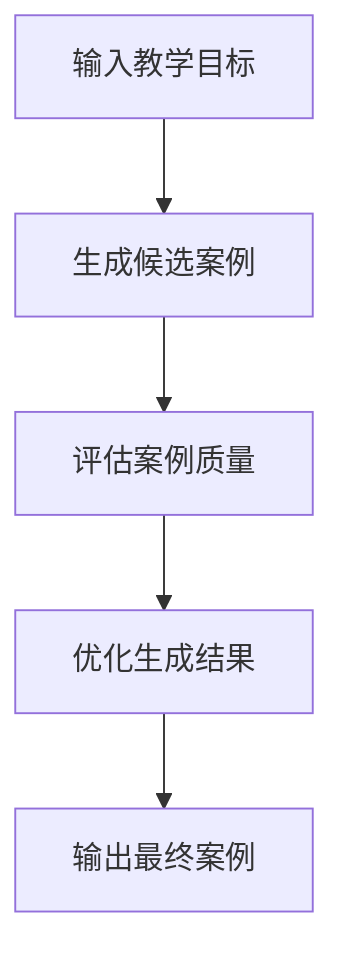
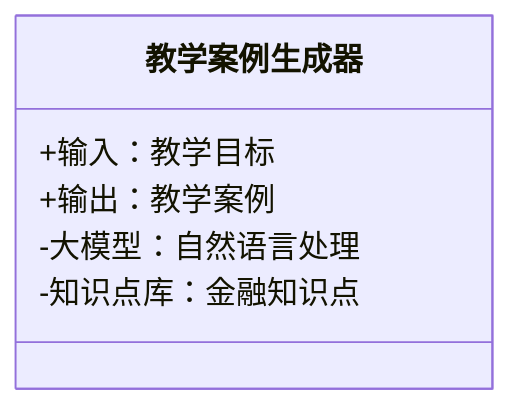
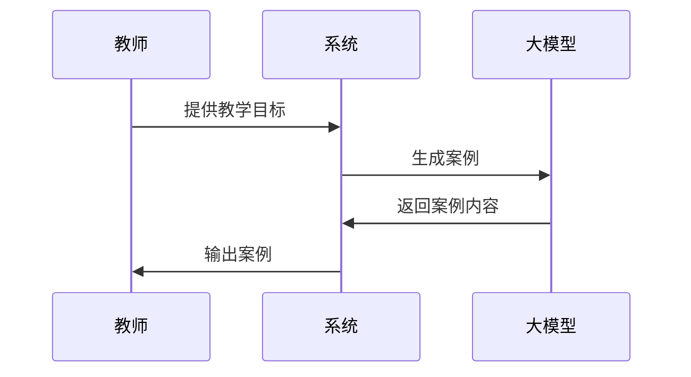

                 


# 开发基于大模型的金融专业教学案例自动生成器

## 关键词：大模型，金融教学，案例生成，机器学习，自然语言处理，系统架构

## 摘要：本文详细介绍了如何基于大模型开发一个金融专业教学案例自动生成器。首先从背景和需求出发，分析了大模型在金融教学中的应用价值；接着深入探讨了大模型的算法原理和数学模型；然后通过系统设计和架构实现，展示了如何构建一个高效的案例生成系统；最后通过项目实战和总结，为读者提供了一套完整的开发方案和实践指导。

---

## 第1章: 背景介绍与核心概念

### 1.1 大模型与金融教学的背景

#### 1.1.1 大模型技术的发展背景
大模型技术近年来取得了显著进展，尤其是在自然语言处理和机器学习领域。大模型的出现，为金融领域的智能化教学提供了新的可能性。

#### 1.1.2 金融专业教学的需求分析
金融教学案例的生成需要考虑知识的准确性、专业性和适用性。传统教学案例生成方法效率低，难以满足个性化教学需求。

#### 1.1.3 大模型在金融教学中的应用价值
大模型能够通过自然语言处理技术，快速生成符合教学需求的案例，提高教学效率和质量。

### 1.2 核心概念与问题描述

#### 1.2.1 教学案例自动生成器的定义
教学案例自动生成器是一种基于大模型的智能系统，能够根据输入的教学目标和知识点，自动生成相应的教学案例。

#### 1.2.2 大模型在教学案例生成中的作用
大模型通过自然语言处理和知识图谱技术，帮助生成符合教学需求的案例，同时能够根据学生的学习情况动态调整案例内容。

#### 1.2.3 问题的边界与外延
教学案例生成的目标是提供高质量、个性化的教学案例，但目前还存在生成内容不够精确、缺乏领域知识适应性等问题。

### 1.3 核心概念与联系

#### 1.3.1 大模型与教学案例生成的核心要素
- **大模型**：提供自然语言处理和知识生成的能力。
- **教学目标**：明确的教学需求和知识点。
- **案例生成**：输出符合目标的案例内容。

#### 1.3.2 核心概念属性特征对比表

| 概念      | 特性                   |
|-----------|------------------------|
| 大模型     | 高准确性、多任务处理能力 |
| 教学案例   | 针对性、知识性、可操作性 |
| 自然语言处理 | 文本生成、理解能力     |

#### 1.3.3 ER实体关系图（Mermaid流程图）
```mermaid
er
actor 教师
actor 学生
actor 系统
entity 教学目标
entity 知识点
entity 教学案例
```

---

## 第2章: 大模型基础与金融教学需求

### 2.1 大模型的基本概念

#### 2.1.1 大模型的定义与特点
大模型是一种基于深度学习的自然语言处理模型，具有高准确性和多任务处理能力。

#### 2.1.2 大模型的核心技术
- **Transformer结构**：通过自注意力机制实现长文本处理。
- **预训练技术**：利用大规模数据进行预训练，提升模型的通用性。

#### 2.1.3 大模型与传统AI的区别
大模型具有更强的上下文理解和生成能力，能够处理复杂的金融场景。

### 2.2 金融专业教学的需求分析

#### 2.2.1 金融教学案例的特点
- 针对性强：案例需结合具体金融知识点。
- 实践性：案例需贴近实际业务场景。
- 专业性：案例内容需准确无误。

#### 2.2.2 教学案例生成的关键需求
- 快速生成：能够根据输入快速生成案例。
- 个性化：根据学生水平调整案例难度。
- 可扩展性：支持不同知识点的案例生成。

#### 2.2.3 大模型在金融教学中的优势
- 高效生成：大模型能够快速生成大量案例。
- 知识准确：通过预训练掌握了大量金融知识。
- 动态调整：能够根据反馈优化生成内容。

### 2.3 大模型与金融教学的结合

#### 2.3.1 大模型在金融知识生成中的应用
- 文本生成：生成金融知识点的解释和案例。
- 知识推理：根据知识点推导出相关案例。

#### 2.3.2 大模型在教学案例设计中的优势
- 提供多样化的案例：覆盖不同难度和场景。
- 高度个性化：根据学生需求生成不同案例。

#### 2.3.3 大模型与金融教学的结合场景
- 在线教育平台：为学生提供个性化的学习案例。
- 课堂教学辅助：帮助教师快速生成教学材料。

---

## 第3章: 大模型算法原理与数学模型

### 3.1 大模型的算法原理

#### 3.1.1 Transformer模型的原理
Transformer模型通过自注意力机制实现对输入文本的全局理解，适用于长文本处理。

#### 3.1.2 BERT模型的结构与特点
BERT模型通过双向预训练，能够捕捉文本的上下文信息，提升生成质量。

#### 3.1.3 大模型的训练与推理机制
- **训练阶段**：通过大规模数据进行预训练和微调。
- **推理阶段**：根据输入生成目标案例。

### 3.2 大模型的数学模型与公式

#### 3.2.1 注意力机制的数学公式
$$\text{Attention}(Q, K, V) = \text{softmax}\left(\frac{QK^T}{\sqrt{d_k}}\right)V$$

#### 3.2.2 梯度下降与优化算法
常用Adam优化算法，优化目标函数以降低生成误差。

#### 3.2.3 模型训练的损失函数
使用交叉熵损失函数衡量生成结果与预期结果的差异。

### 3.3 算法流程图（Mermaid）



---

## 第4章: 系统分析与架构设计

### 4.1 问题场景介绍

#### 4.1.1 项目介绍
开发一个基于大模型的金融专业教学案例自动生成器，帮助教师快速生成高质量的金融案例。

### 4.2 系统功能设计

#### 4.2.1 领域模型（Mermaid类图）



#### 4.2.2 系统架构设计（Mermaid架构图）


#### 4.2.3 系统接口设计
- 输入接口：接收教学目标和知识点。
- 输出接口：输出生成的案例内容。

#### 4.2.4 系统交互设计（Mermaid序列图）



---

## 第5章: 项目实战

### 5.1 环境安装

#### 5.1.1 安装Python
```bash
python --version
```

#### 5.1.2 安装大模型库
```bash
pip install transformers
```

### 5.2 系统核心实现

#### 5.2.1 核心代码实现

```python
from transformers import AutoTokenizer, AutoModelForCausalLM

tokenizer = AutoTokenizer.from_pretrained('gpt2')
model = AutoModelForCausalLM.from_pretrained('gpt2')

def generate_case(prompt):
    inputs = tokenizer(prompt, return_tensors='np')
    outputs = model.generate(inputs.input_ids, max_length=200)
    return tokenizer.decode(outputs[0], skip_special_tokens=True)
```

#### 5.2.2 代码应用解读与分析
通过上述代码，我们可以快速生成教学案例。模型根据输入的教学目标生成相应的案例内容。

### 5.3 实际案例分析

#### 5.3.1 案例输入
```python
prompt = "生成一个关于股票投资的案例，目标是帮助学生理解如何分析财务报表。"
```

#### 5.3.2 案例输出
生成案例内容，包括案例描述、知识点、问题和解决方案。

### 5.4 项目小结

#### 5.4.1 开发总结
通过本项目，我们实现了基于大模型的金融教学案例自动生成器，验证了大模型在金融教育中的应用价值。

#### 5.4.2 经验分享
在开发过程中，需要注意模型的调优和知识点库的构建，以提升生成案例的质量。

---

## 第6章: 总结与展望

### 6.1 最佳实践 tips
- 在实际应用中，建议结合具体业务需求对模型进行微调。
- 定期更新知识点库，保持案例内容的准确性。

### 6.2 小结
本文详细介绍了基于大模型的金融教学案例自动生成器的开发过程，从背景分析到系统实现，为读者提供了一套完整的解决方案。

### 6.3 注意事项
- 模型生成的内容需要人工审核，确保准确性和合规性。
- 注意保护用户数据隐私，遵守相关法律法规。

### 6.4 拓展阅读
建议读者进一步阅读相关的大模型研究论文和金融教育领域的最新进展。

---

通过以上步骤，我们可以系统地开发一个基于大模型的金融专业教学案例自动生成器，为金融教育的智能化发展提供有力支持。

