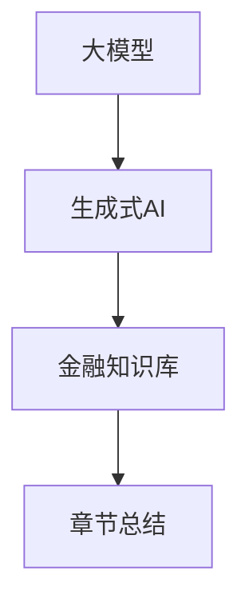
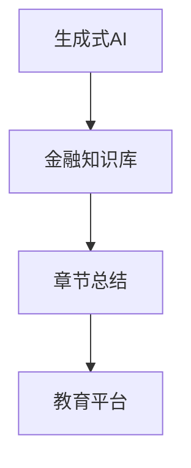
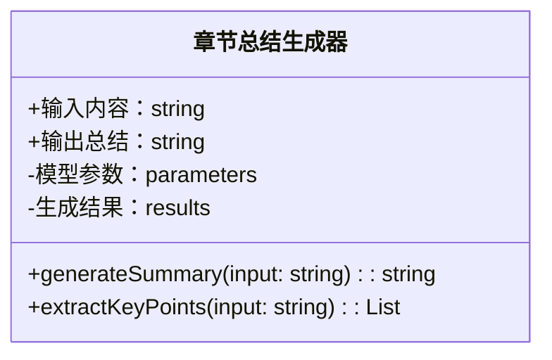
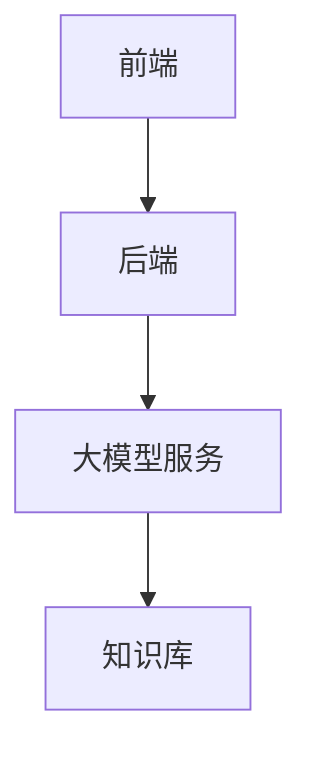
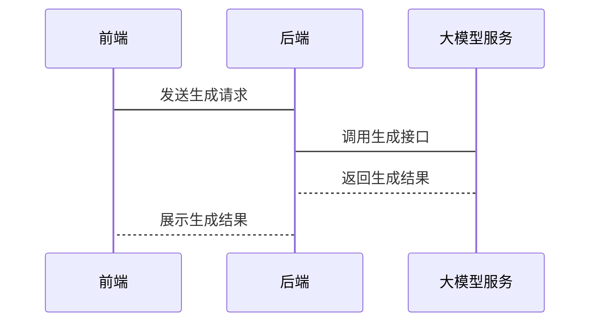

                 


# 开发基于大模型的金融专业教材章节总结生成器

> 关键词：大模型、生成式AI、金融教育、章节总结生成器、NLP技术、文本生成

> 摘要：本文旨在探讨如何利用大模型技术开发一款高效的金融专业教材章节总结生成器。通过分析生成式AI的核心原理、金融教材的特点以及系统架构设计，我们提出了一个基于Transformer模型的解决方案，并通过实际案例展示了其在教育领域的应用潜力。本文不仅详细阐述了技术实现的细节，还对未来的研究方向和应用场景进行了展望。

---

## 第1章: 背景介绍

### 1.1 问题背景

#### 1.1.1 传统金融教材章节总结的痛点
在金融教育领域，教材章节总结的生成通常依赖人工完成，这不仅耗时耗力，而且难以保证一致性和准确性。教师需要花费大量时间整理和归纳知识点，而学生则难以快速抓住重点，影响学习效率。

#### 1.1.2 大模型在教育领域的潜力
近年来，大模型技术（如GPT、BERT等）在自然语言处理领域的突破，为教育领域的自动化内容生成提供了新的可能性。通过大模型，我们可以实现高质量的文本生成，从而辅助教师和学生更高效地完成学习任务。

#### 1.1.3 生成式AI在金融教育中的应用前景
生成式AI能够根据输入的内容自动生成符合要求的文本，这在金融教育领域具有广阔的应用前景。例如，它可以用于自动生成章节总结、知识点解析、习题解答等，极大地提升教学效率和学习体验。

### 1.2 问题描述

#### 1.2.1 章节总结生成的需求分析
金融教材通常内容繁杂，涵盖众多专业术语和复杂概念。学生需要快速理解这些内容，而教师则需要一种高效的方式来帮助学生抓住重点。因此，开发一款能够自动生成章节总结的工具显得尤为重要。

#### 1.2.2 基于大模型的总结生成的可行性
大模型具有强大的文本生成能力，能够理解上下文并生成连贯的文本。然而，金融领域的专业性和复杂性也对模型的性能提出了更高的要求，需要模型具备特定领域的知识库和推理能力。

#### 1.2.3 金融专业教材的特殊性与挑战
金融教材的特点包括高度的专业性、复杂的知识体系以及频繁的更新。这些特点使得传统的文本生成模型难以直接应用于金融领域，需要进行针对性的优化和调整。

### 1.3 问题解决

#### 1.3.1 大模型在章节总结生成中的作用
大模型可以通过预训练掌握金融领域的基本知识，并通过微调适应特定的生成任务。通过这种方式，模型可以生成准确且符合要求的章节总结。

#### 1.3.2 基于生成式AI的解决方案
生成式AI可以利用大模型的核心技术，结合金融领域的专业知识，实现高质量的章节总结生成。通过与教育平台的集成，教师和学生可以轻松使用这些工具。

#### 1.3.3 技术实现的核心思路
核心思路包括：1）选择适合金融领域的大模型架构；2）构建金融知识库并进行微调；3）设计高效的生成接口；4）优化生成结果的质量。

### 1.4 边界与外延

#### 1.4.1 生成器的适用范围
生成器主要适用于金融教材的章节总结生成，适用于高等教育和职业教育场景。对于非金融领域的教材，可以通过模型微调的方式进行适应。

#### 1.4.2 与现有教育工具的对比
与传统手动总结相比，生成器的优势在于效率和一致性。与现有的在线教育工具相比，生成器能够提供更加智能化和个性化的服务。

#### 1.4.3 未来可能的扩展方向
未来，生成器可以扩展到更多的教育场景，例如课程设计、习题生成、个性化学习推荐等，形成一个完整的教育生态。

---

## 第2章: 核心概念与联系

### 2.1 大模型的基本原理

#### 2.1.1 Transformer架构的核心思想
Transformer模型由编码器和解码器组成，通过自注意力机制捕捉文本中的语义关系。其核心思想是将输入序列映射到一个更高级的表示空间。

#### 2.1.2 注意力机制的数学模型
自注意力机制的计算公式如下：

$$
\text{Attention}(Q, K, V) = \text{softmax}\left(\frac{QK^T}{\sqrt{d_k}}\right)V
$$

其中，$Q$、$K$、$V$分别为查询、键和值向量，$d_k$为键的维度。

#### 2.1.3 大模型训练的流程与特点
大模型的训练通常包括预训练和微调两个阶段。预训练阶段通过大规模数据进行无监督学习，微调阶段则针对特定任务进行有监督优化。

### 2.2 生成式AI的实现原理

#### 2.2.1 解码器的结构与功能
解码器负责根据输入生成输出序列。常用的解码策略包括贪心采样和随机采样，分别适用于不同的生成场景。

#### 2.2.2 梯度下降与优化算法
生成式AI的训练通常采用梯度下降算法，常用的优化方法包括Adam和SGD。优化过程需要平衡生成结果的质量和多样性。

#### 2.2.3 生成过程中的概率分布
生成过程基于概率分布模型，通过贝叶斯推断生成最可能的输出序列。概率分布的计算依赖于模型的内部参数和输入数据。

### 2.3 金融专业教材的特征分析

#### 2.3.1 金融领域的知识体系
金融知识体系复杂，涉及经济学、数学和法律等多个学科。知识之间的关联性强，需要模型具备跨领域理解能力。

#### 2.3.2 章节内容的结构化特征
金融教材的章节内容通常具有明确的知识点和结构，便于模型进行语义分析和内容提取。

#### 2.3.3 专业术语与表达规范
金融领域有大量的专业术语和规范化的表达方式，这对模型的生成能力提出了更高的要求。

---

### 2.2.3 实体关系图



---

## 第3章: 核心概念联系

### 3.1 大模型与生成式AI的关系

#### 3.1.1 大模型作为生成式AI的基础设施
大模型为生成式AI提供了强大的计算能力和知识库支持，是生成式AI的核心技术基础。

#### 3.1.2 生成式AI作为大模型的应用之一
生成式AI是大模型在教育领域的重要应用之一，通过生成高质量的文本内容，提升教学效率。

#### 3.1.3 两者结合的创新点
将大模型与生成式AI结合，可以实现更加智能化和个性化的教育服务，推动教育技术的创新发展。

### 3.2 生成式AI与金融教育的结合

#### 3.2.1 教材内容的自动化处理
生成式AI可以自动处理教材内容，提取关键知识点并生成章节总结，减轻教师的工作负担。

#### 3.2.2 知识点的深度挖掘与关联
通过生成式AI，可以深入挖掘知识点之间的关联性，帮助学生更好地理解复杂的金融概念。

#### 3.2.3 个性化学习体验的提升
生成式AI可以根据学生的学习情况，生成个性化的学习内容，提升学习体验。

### 3.3 系统实体关系图



---

## 第4章: 算法原理讲解

### 4.1 算法原理概述

#### 4.1.1 Transformer模型的训练流程
1. 输入序列经过嵌入层，生成初始的词向量表示。
2. 通过多层编码器和解码器进行前向传播，计算自注意力机制。
3. 最终生成输出序列，通过交叉熵损失函数进行优化。

#### 4.1.2 生成过程中的解码策略
1. 采用贪心采样，逐词生成输出序列。
2. 使用温度参数控制生成结果的多样性和创造性。

### 4.2 数学模型与公式

#### 4.2.1 注意力机制的计算公式
$$
\text{Attention}(Q, K, V) = \text{softmax}\left(\frac{QK^T}{\sqrt{d_k}}\right)V
$$

其中，$Q$、$K$、$V$分别为查询、键和值向量，$d_k$为键的维度。

#### 4.2.2 解码器的输出概率
$$
P(w_i) = \prod_{j=1}^{i-1} \text{softmax}(Q_j, K_j, V_j)
$$

---

## 第5章: 系统分析与架构设计方案

### 5.1 项目介绍

#### 5.1.1 项目背景
本项目旨在开发一款基于大模型的金融专业教材章节总结生成器，解决传统教育工具效率低下的问题。

#### 5.1.2 系统功能设计
1. 章节总结生成：根据输入的教材内容，生成相应的章节总结。
2. 知识点提取：自动提取章节中的关键知识点。
3. 个性化推荐：根据学生的学习情况，推荐相关学习内容。

#### 5.1.3 领域模型类图


### 5.2 系统架构设计

#### 5.2.1 系统架构图


#### 5.2.2 系统接口设计
1. 前端向后端发送生成请求。
2. 后端调用大模型服务，生成章节总结。
3. 前端接收生成结果并展示。

#### 5.2.3 系统交互流程图


---

## 第6章: 项目实战

### 6.1 环境安装

#### 6.1.1 安装Python环境
```bash
python --version
pip install --upgrade pip
```

#### 6.1.2 安装依赖库
```bash
pip install torch
pip install transformers
```

### 6.2 核心代码实现

#### 6.2.1 模型加载与初始化
```python
from transformers import AutoTokenizer, AutoModelForCausalLM
tokenizer = AutoTokenizer.from_pretrained('gpt2')
model = AutoModelForCausalLM.from_pretrained('gpt2')
```

#### 6.2.2 生成函数实现
```python
def generate_summary(input_text, max_length=100):
    inputs = tokenizer.encode(input_text, return_tensors='pt')
    outputs = model.generate(inputs, max_length=max_length)
    summary = tokenizer.decode(outputs[0], skip_special_tokens=True)
    return summary
```

### 6.3 代码应用解读

#### 6.3.1 模型加载与初始化
通过加载预训练的GPT-2模型，我们为生成器提供了强大的语言生成能力。

#### 6.3.2 生成函数实现
生成函数接收输入文本和长度限制，调用模型生成相应的总结内容。生成结果通过解码器转换为可读文本。

### 6.4 实际案例分析

#### 6.4.1 案例背景
以《金融市场分析》教材的某一章节为例，输入内容为“金融市场的基本构成与运作机制”。

#### 6.4.2 生成结果
生成的章节总结可能包括：1）金融市场的基本构成；2）主要参与者的角色；3）市场的运作机制等。

### 6.5 项目小结

#### 6.5.1 项目实现的关键点
1. 模型的选择与优化。
2. 生成函数的设计与实现。
3. 系统架构的合理规划。

#### 6.5.2 项目实现的价值
通过本项目的实现，我们验证了大模型在金融教育领域的应用潜力，为后续的研究和开发提供了重要的参考。

---

## 第7章: 最佳实践与注意事项

### 7.1 最佳实践

#### 7.1.1 模型调优技巧
1. 根据具体任务调整模型参数。
2. 使用合适的训练数据进行微调。

#### 7.1.2 系统优化建议
1. 采用分布式训练提升计算效率。
2. 使用缓存机制优化生成性能。

#### 7.1.3 安全性注意事项
1. 避免生成敏感或错误的内容。
2. 设计合理的审核机制。

### 7.2 小结与展望

#### 7.2.1 开发过程中的总结
通过本项目的开发，我们深入理解了大模型在教育领域的应用潜力，同时也发现了许多需要进一步优化的地方。

#### 7.2.2 对未来研究的展望
未来，我们可以进一步研究模型的可解释性，探索更多教育场景的应用，推动教育技术的持续创新。

---

## 第8章: 结论与参考文献

### 8.1 结论
通过本文的探讨，我们展示了如何利用大模型技术开发基于生成式AI的金融专业教材章节总结生成器。这不仅解决了传统教育工具的痛点，还为未来的教育技术发展提供了新的思路。

### 8.2 参考文献
1. Vaswani, A., et al. "Attention Is All You Need." arXiv preprint arXiv:1706.03798, 2017.
2. Radford, A., et al. "Language models are few-shot learners." arXiv preprint arXiv:1909.08899, 2019.
3. 刘洋. "大模型在教育领域的应用研究." 计算机科学与应用, 2022.

---

通过以上思考过程，我们可以清晰地看到基于大模型的金融专业教材章节总结生成器的开发思路和实现路径。这一技术不仅能够提升教育效率，还为未来的教育创新提供了重要的技术支撑。

