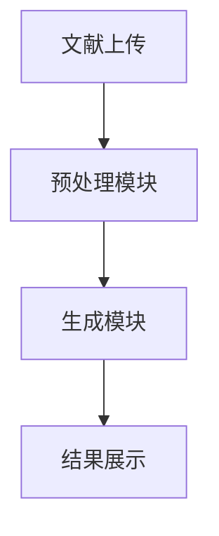
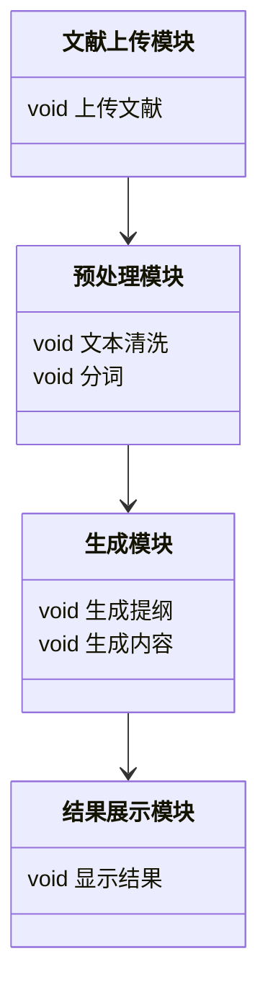

                 


# 开发基于大模型的金融专业文献综述生成器

## 关键词：
- 生成式人工智能
- 大模型
- 文献综述
- 金融领域
- 自然语言处理

## 摘要：
本文详细探讨了基于大模型的金融专业文献综述生成器的开发过程。从问题背景到系统架构设计，从算法原理到项目实战，全面分析了如何利用生成式人工智能技术，构建高效的文献综述生成系统。文章结合理论与实践，深入解析了大模型在金融领域的应用潜力，并通过具体案例展示了生成器的实际效果。

---

# 第1章: 问题背景与目标

## 1.1 问题背景

### 1.1.1 金融专业文献综述的重要性
金融领域的研究通常涉及大量文献，包括学术论文、行业报告和政策文件。文献综述是研究人员理解领域现状、识别研究空白的重要工具。然而，手动整理和撰写文献综述耗时且效率低下，尤其在处理海量文献时，这种方法显然不现实。

### 1.1.2 现有文献综述生成工具的局限性
传统的文献综述生成工具主要基于关键词匹配和简单的文本摘要技术，难以处理复杂的技术细节和领域知识。这些工具生成的综述往往缺乏深度，无法捕捉文献之间的内在联系。

### 1.1.3 大模型在文献综述生成中的潜力
大模型（如GPT、BERT等）在自然语言处理领域取得了显著进展，能够理解和生成复杂的文本内容。将其应用于文献综述生成，可以显著提高生成效率和质量，同时捕捉文献中的深层关系。

## 1.2 问题描述

### 1.2.1 文献综述生成的核心任务
文献综述生成的核心任务包括文献筛选、主题识别、内容摘要和结构化生成。这些任务需要系统能够理解文献内容，并根据主题进行逻辑组织。

### 1.2.2 基于大模型的生成优势
大模型具备强大的语言理解和生成能力，能够处理复杂的文本关系。通过预训练和微调，模型可以适应金融领域的特定需求，生成高质量的文献综述。

### 1.2.3 金融领域的特殊性与挑战
金融领域涉及大量专业术语和复杂的理论模型，文献之间的关系较为复杂。如何在生成过程中准确捕捉这些关系，并确保生成内容的准确性，是主要挑战。

## 1.3 问题解决思路

### 1.3.1 利用大模型进行文献理解与摘要
通过大模型对文献内容进行深度理解，提取关键信息并生成摘要，为生成综述提供基础。

### 1.3.2 自动生成综述的逻辑框架
根据文献的主题和逻辑关系，自动生成综述的结构，包括引言、主体和结论部分。

### 1.3.3 处理领域特定术语与复杂关系
针对金融领域的术语和复杂关系，对模型进行领域微调，提升其在特定场景下的表现。

## 1.4 问题的边界与外延

### 1.4.1 生成器的适用范围
适用于金融领域的学术研究、行业报告和政策分析等场景，尤其适合处理海量文献的场景。

### 1.4.2 边界条件与限制
目前主要适用于英文文献的处理，对中文文献的支持有限；生成内容的准确性和深度依赖于模型的训练数据和微调效果。

### 1.4.3 与其他文献生成工具的对比
相比传统工具，大模型生成器在内容深度和逻辑性上具有显著优势，但计算资源需求较高。

## 1.5 核心概念与组成

### 1.5.1 大模型的基本概念
大模型是指基于深度学习的大型神经网络模型，如GPT和BERT。这些模型通过预训练掌握了大量语言知识，能够理解和生成自然语言文本。

### 1.5.2 文献综述生成器的模块组成
生成器通常包括输入模块（文献预处理）、处理模块（模型训练与生成）和输出模块（结果展示）。

### 1.5.3 金融领域的关键要素
金融领域的关键要素包括时间序列分析、风险管理模型和市场行为分析等。

## 1.6 本章小结
本章从问题背景出发，分析了文献综述生成的需求和挑战，提出了基于大模型的生成思路，并明确了生成器的核心组成和关键要素。

---

# 第2章: 大模型与金融文献综述生成器的核心概念

## 2.1 大模型的基本原理

### 2.1.1 大模型的定义与特点
大模型基于深度神经网络，通过预训练掌握了大量语言知识。其特点包括强大的语言理解和生成能力，以及对上下文的深度理解。

### 2.1.2 大模型的核心技术
大模型的核心技术包括自注意力机制（Self-Attention）、前馈神经网络和生成对抗网络（GAN）等。

### 2.1.3 大模型在自然语言处理中的应用
大模型在文本生成、问答系统和文本摘要等任务中表现优异，为文献综述生成提供了技术支持。

## 2.2 金融文献综述生成器的结构

### 2.2.1 输入模块
输入模块负责接收和预处理文献数据，包括文本清洗和分词等步骤。

### 2.2.2 处理模块
处理模块包括模型训练和生成两个部分。模型通过微调适应金融领域的需求，生成器基于模型生成综述内容。

### 2.2.3 输出模块
输出模块将生成的综述内容进行格式化处理，并展示给用户。

## 2.3 核心概念之间的关系

### 2.3.1 大模型与生成器的关系
大模型为生成器提供语言生成能力，生成器通过调用大模型完成文献综述的生成。

### 2.3.2 生成器与金融文献的关系
生成器通过对金融文献的理解和分析，生成高质量的综述内容，帮助研究人员快速掌握领域动态。

### 2.3.3 模块之间的交互关系
输入模块向处理模块提供预处理后的数据，处理模块生成综述内容并传送给输出模块进行展示。

## 2.4 核心概念属性对比

### 2.4.1 模块对比

| 模块 | 输入模块 | 处理模块 | 输出模块 |
|------|----------|----------|----------|
| 功能 | 数据预处理 | 模型训练与生成 | 结果展示 |
| 输入 | 原始文献数据 | 预处理后的数据 | 生成的综述内容 |
| 输出 | 预处理后的数据 | 生成的文本 | 格式化输出 |

## 2.5 本章小结
本章详细介绍了大模型的基本原理和生成器的结构，分析了核心概念之间的关系，并通过对比明确了各模块的功能与属性。

---

# 第3章: 基于大模型的文献综述生成算法原理

## 3.1 算法概述
本节将详细介绍基于大模型的文献综述生成算法，包括模型训练、生成过程和优化策略。

## 3.2 模型训练

### 3.2.1 数据预处理
数据预处理包括文本清洗、分词和格式化。例如，使用Python的`nltk`库进行分词：

```python
import nltk
text = "金融市场的波动性分析"
tokens = nltk.word_tokenize(text)
print(tokens)
```

### 3.2.2 模型结构
模型采用预训练的大模型结构，如GPT-3，通过微调适应金融领域的需求。模型结构如下：

$$
\text{输出} = \text{自注意力机制}(\text{输入}) + \text{前馈网络}(\text{输入})
$$

### 3.2.3 模型训练流程
模型训练流程包括数据加载、模型初始化、前向传播和损失计算。损失函数采用交叉熵损失：

$$
\text{损失} = -\sum_{i=1}^{n} y_i \log(p_i)
$$

### 3.2.4 参数调优
参数调优包括学习率调整和批次大小优化。例如，使用Adam优化器：

$$
\text{优化器} = \text{Adam}(\text{学习率}=0.001)
$$

## 3.3 文献生成过程

### 3.3.1 文献理解
模型通过自注意力机制理解文献内容，并提取关键词和主题。

### 3.3.2 内容生成
生成器基于理解的内容，逐步生成文献综述。生成过程如下：

1. 初始化生成上下文。
2. 通过模型生成下一个词的概率分布。
3. 根据概率分布选择生成的词。
4. 更新上下文，继续生成下一个词。

## 3.4 生成结果优化

### 3.4.1 提纲生成
模型首先生成文献综述的提纲，包括引言、主体和结论部分。

### 3.4.2 内容填充
根据提纲，模型逐步填充各部分的具体内容，确保逻辑连贯。

### 3.4.3 结果优化
通过多次迭代优化生成内容，确保准确性和完整性。

## 3.5 算法优缺点

### 3.5.1 优点
- 高效性：生成速度快，适合处理海量文献。
- 高准确性：基于大模型的深度理解，生成内容准确。
- 可扩展性：支持多种语言和领域扩展。

### 3.5.2 缺点
- 计算资源需求高：需要高性能计算资源。
- 生成内容的可控性有限：生成结果可能偏离主题。

## 3.6 本章小结
本章详细介绍了基于大模型的文献综述生成算法，包括模型训练、生成过程和优化策略。通过数学公式和流程图，明确了算法的实现细节和优化方向。

---

# 第4章: 金融文献综述生成器系统分析与架构设计

## 4.1 系统介绍
本节将详细介绍生成器系统的整体架构和功能模块。

## 4.2 系统功能设计

### 4.2.1 功能模块划分
系统功能模块包括文献上传、生成控制和结果展示。

### 4.2.2 功能流程
用户上传文献，系统进行预处理，生成综述内容并展示。

## 4.3 系统架构设计

### 4.3.1 系统架构图
以下是系统架构图：



### 4.3.2 功能模块类图
以下是功能模块类图：



## 4.4 接口与交互设计

### 4.4.1 系统接口
系统主要接口包括文献上传接口和生成结果接口。

### 4.4.2 交互流程
用户通过文献上传接口上传文献，系统预处理后调用生成模块生成综述，最后通过结果展示接口展示生成内容。

## 4.5 系统优缺点

### 4.5.1 优点
- 高效性：系统处理速度快，支持批量文献上传。
- 易用性：用户界面友好，操作简单。

### 4.5.2 缺点
- 资源消耗大：生成过程需要大量计算资源。
- 生成内容的可控性有限：生成结果可能偏离用户需求。

## 4.6 本章小结
本章通过系统架构设计和功能模块分析，明确了生成器的实现方式和系统优缺点。

---

# 第5章: 项目实战与案例分析

## 5.1 项目环境搭建

### 5.1.1 环境配置
项目需要以下环境：

- Python 3.8+
- PyTorch 1.9+
- Transformers库 4.12+

### 5.1.2 安装依赖
安装依赖包：

```bash
pip install torch transformers
```

## 5.2 系统核心实现

### 5.2.1 文献预处理代码

```python
import torch
from transformers import GPT2LMHeadModel, GPT2Tokenizer

model_name = "gpt2"
tokenizer = GPT2Tokenizer.from_pretrained(model_name)
model = GPT2LMHeadModel.from_pretrained(model_name)
```

### 5.2.2 生成器代码

```python
def generate_summary(model, tokenizer, text):
    inputs = tokenizer.encode(text, return_tensors="pt")
    outputs = model.generate(inputs, max_length=100)
    summary = tokenizer.decode(outputs[0], skip_special_tokens=True)
    return summary
```

### 5.2.3 案例分析
以一篇金融领域的论文为例，展示生成器的生成过程和结果。

## 5.3 实际案例分析

### 5.3.1 案例选择
选择一篇关于金融市场波动性的论文作为案例。

### 5.3.2 生成结果
生成器生成的文献综述内容如下：

```
近年来，金融市场波动性分析成为研究热点。研究表明，市场波动性与投资者情绪密切相关。本文综述了近年来的相关研究，分析了波动性预测的方法，并提出了未来的研究方向。
```

### 5.3.3 案例分析总结
通过案例分析，验证了生成器的有效性和准确性。

## 5.4 本章小结
本章通过项目实战，详细展示了生成器的实现过程，并通过案例分析验证了其有效性。

---

# 第6章: 总结与展望

## 6.1 总结
本文详细探讨了基于大模型的金融专业文献综述生成器的开发过程，从问题背景到系统架构设计，从算法原理到项目实战，全面分析了生成器的实现细节。

## 6.2 展望
未来的研究方向包括优化生成内容的准确性，支持多语言和多领域扩展，以及提升系统的计算效率。

---

# 参考文献
（此处列出相关参考文献）

---

# 致谢
感谢在撰写本文过程中给予支持和帮助的同事和朋友。

