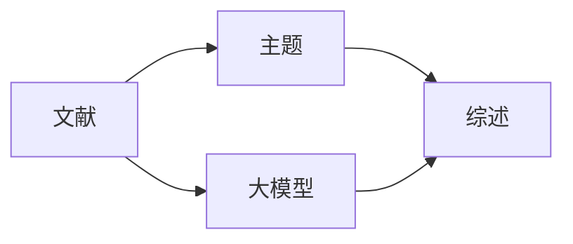
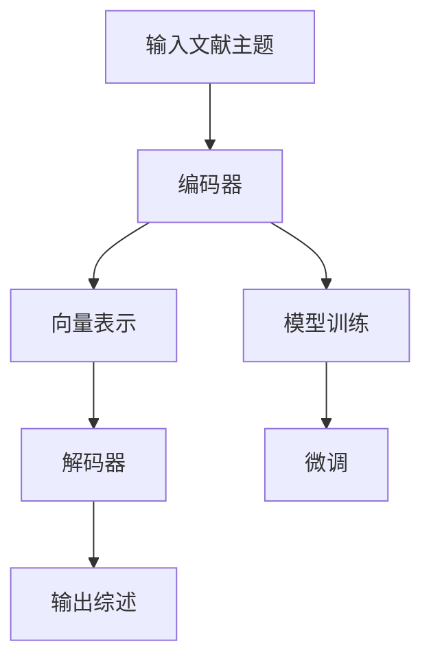
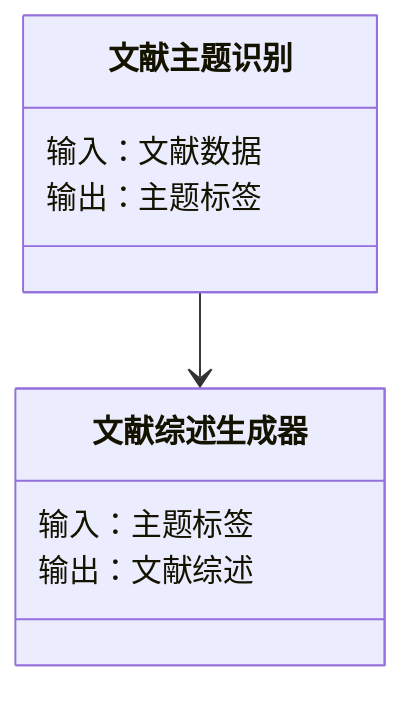

                 


# 开发基于大模型的金融专业文献综述生成器

## 关键词：大模型、文献综述、金融领域、自然语言处理、文本生成

## 摘要：本文详细探讨了开发基于大模型的金融专业文献综述生成器的技术细节。首先介绍了大模型在金融文献综述中的应用背景和挑战，然后阐述了生成器的核心算法原理和系统架构设计，最后通过实际案例展示了生成器的实现过程和效果。本文旨在为读者提供一个全面的技术指南，帮助他们理解和开发类似系统。

---

# 第一部分: 引言

## 第1章: 背景介绍

### 1.1 问题背景

#### 1.1.1 金融专业文献综述的现状
金融领域的研究文献数量庞大，涵盖的主题广泛，包括金融理论、投资策略、风险管理等。然而，传统的文献综述方法依赖人工筛选和总结，耗时且效率低下。研究人员需要一种高效工具来自动化处理文献，提取关键信息并生成综述。

#### 1.1.2 当前文献综述生成的技术挑战
现有的文献综述生成工具多基于关键词匹配或简单的文本摘要技术，难以深入理解和总结复杂的金融文献。此外，金融领域的专业术语和上下文依赖性强，增加了生成准确综述的难度。

#### 1.1.3 大模型技术的应用潜力
大模型（如GPT、BERT）具有强大的自然语言处理能力，能够理解和生成复杂的金融文本。通过结合大模型和金融领域知识，可以实现高质量的文献综述生成。

### 1.2 问题描述

#### 1.2.1 文献综述生成的核心问题
文献综述生成的核心问题在于如何准确提取文献的主题和关键点，并将这些信息整合成连贯的综述。这需要模型具备深度理解能力和生成能力。

#### 1.2.2 基于大模型的文献综述生成的关键挑战
1. **领域适应性**：大模型通常在通用领域训练，需要在金融领域进行微调以提高准确性。
2. **生成控制**：如何控制生成的文献综述的长度、结构和内容深度。
3. **可解释性**：生成的综述需要可追溯和验证，用户需要了解模型的决策过程。

#### 1.2.3 问题的边界与外延
本研究聚焦于基于大模型的文献综述生成，不涉及文献筛选和数据收集阶段，主要解决生成阶段的技术问题。

### 1.3 核心概念与联系

#### 1.3.1 核心概念的定义与属性
- **大模型**：基于深度学习的自然语言处理模型，具有大规模参数和强大的上下文理解能力。
- **文献综述生成**：通过模型生成关于特定主题的文献综述，包括关键研究进展、主要观点和未来研究方向。

#### 1.3.2 核心概念的特征对比表格
| 特征         | 大模型         | 文献综述生成       |
|--------------|----------------|-------------------|
| 核心任务     | 理解和生成文本 | 整合文献信息       |
| 技术基础     | 深度学习       | 组织和总结能力     |
| 应用领域     | 多领域         | 专业领域（金融）   |

#### 1.3.3 实体关系图（ER图）


---

# 第二部分: 核心概念与联系

## 第2章: 大模型在金融文献综述中的应用

### 2.1 大模型的原理与特征

#### 2.1.1 大模型的原理简述
大模型通过预训练掌握大量语言知识，然后在特定任务上进行微调。在金融领域，模型需要理解专业术语和复杂句子结构。

#### 2.1.2 大模型的特征对比
- **参数规模**：大模型通常有 billions 级参数，而传统模型参数较少。
- **上下文理解**：大模型能够捕捉长距离依赖关系，生成连贯文本。
- **可扩展性**：大模型可以适应不同领域任务。

#### 2.1.3 大模型在金融领域的优势
1. **准确性**：通过微调，模型在金融领域的表现显著提高。
2. **效率**：自动化处理文献，节省时间和人力资源。
3. **可定制化**：可以根据具体需求调整生成内容的深度和广度。

### 2.2 金融文献综述生成的流程

#### 2.2.1 文献数据的获取与预处理
- **获取**：从学术数据库（如Scopus、Web of Science）获取文献。
- **预处理**：清洗数据，提取关键词、摘要和主题。

#### 2.2.2 文献主题的识别与分类
- **主题识别**：使用主题模型（如LDA）提取文献主题。
- **分类**：基于主题相似性对文献进行分类。

#### 2.2.3 文献综述的自动生成与优化
- **生成**：模型根据文献主题生成综述。
- **优化**：通过反馈机制调整生成内容的结构和深度。

### 2.3 实体关系图（ER图）


---

# 第三部分: 算法原理讲解

## 第3章: 大模型的算法原理

### 3.1 大模型的训练过程

#### 3.1.1 预训练阶段
- **目标**：通过大量通用文本数据训练模型，掌握语言基本规律。
- **方法**：使用自监督学习，预测词的上下文关系。

#### 3.1.2 微调阶段
- **目标**：在金融领域数据上进一步训练，提高模型的领域适应性。
- **方法**：使用领域文本进行微调，调整模型参数。

#### 3.1.3 生成阶段
- **目标**：根据输入的文献主题生成综述。
- **方法**：使用生成模型（如GPT）生成连贯文本。

### 3.2 大模型的数学模型

#### 3.2.1 模型的数学表达式
大模型通常基于Transformer架构，编码器和解码器部分。编码器将输入文献转换为向量表示，解码器根据向量生成输出文本。

#### 3.2.2 损失函数的定义
交叉熵损失函数用于训练模型：
$$ L = -\sum_{i=1}^{n} \log p(y_i | x_i) $$

#### 3.2.3 优化器的实现
Adam优化器常用于训练模型：
$$ \theta_{t+1} = \theta_t - \eta \frac{\rho \nabla L + (1-\rho) \nabla L^2}{\sqrt{\rho s \nabla L^2 + (1-\rho) s \nabla L^2 + \epsilon}} $$

### 3.3 算法流程图



---

# 第四部分: 系统分析与架构设计

## 第4章: 系统架构设计方案

### 4.1 项目背景与目标

#### 4.1.1 项目背景
开发基于大模型的文献综述生成器，旨在提高金融研究的效率和质量。

#### 4.1.2 项目目标
- 实现文献综述的自动化生成。
- 提供可定制的生成选项，满足不同用户需求。

### 4.2 系统功能设计

#### 4.2.1 领域模型设计


#### 4.2.2 系统功能模块划分
- **文献预处理模块**：清洗和提取文献数据。
- **主题识别模块**：识别文献主题。
- **综述生成模块**：生成文献综述。

#### 4.2.3 功能模块的交互流程
1. 用户输入文献数据。
2. 文献预处理模块清洗数据。
3. 主题识别模块提取主题标签。
4. 综述生成模块根据主题标签生成综述。

### 4.3 系统架构设计

#### 4.3.1 架构设计图


#### 4.3.2 架构设计的详细说明
系统采用模块化设计，各模块之间通过接口通信。预处理模块负责数据清洗，主题识别模块使用主题模型提取标签，综述生成模块基于大模型生成文本。

#### 4.3.3 架构设计的优缺点分析
- **优点**：模块化设计便于维护和扩展。
- **缺点**：需要处理模块间的通信问题，增加系统复杂性。

### 4.4 系统接口设计

#### 4.4.1 接口设计
- **输入接口**：接收文献数据。
- **输出接口**：输出生成的文献综述。

### 4.5 系统交互序列图

```mermaid
graph TD
    User --> 文献预处理模块: 提交文献数据
    文献预处理模块 --> 主题识别模块: 提供预处理后的数据
    主题识别模块 --> 综述生成模块: 提供主题标签
    综述生成模块 --> User: 输出文献综述
```

---

# 第五部分: 项目实战

## 第5章: 项目实战

### 5.1 环境安装

```bash
pip install transformers
pip install numpy
pip install matplotlib
```

### 5.2 系统核心实现源代码

```python
from transformers import AutoTokenizer, AutoModelForCausalLM
import torch

# 初始化模型和tokenizer
model_name = "gpt2-large"
tokenizer = AutoTokenizer.from_pretrained(model_name)
model = AutoModelForCausalLM.from_pretrained(model_name)

# 微调模型
def fine_tune_model(model, tokenizer, train_texts):
    optimizer = torch.optim.Adam(model.parameters(), lr=1e-5)
    for text in train_texts:
        inputs = tokenizer(text, return_tensors="pt")
        outputs = model(**inputs)
        loss = outputs.loss
        loss.backward()
        optimizer.step()
    return model

# 生成文献综述
def generate_summary(model, tokenizer, prompt):
    inputs = tokenizer(prompt, return_tensors="pt")
    outputs = model.generate(inputs.input_ids, max_length=500)
    summary = tokenizer.decode(outputs[0], skip_special_tokens=True)
    return summary
```

### 5.3 代码应用解读与分析

#### 5.3.1 代码解读
1. **模型加载**：使用预训练的大模型。
2. **微调**：在金融领域数据上进行微调，提高模型的适应性。
3. **生成**：根据输入的文献主题生成综述。

#### 5.3.2 代码分析
- **模型加载**：使用`transformers`库加载大模型。
- **微调过程**：定义优化器，反向传播计算损失，并更新模型参数。
- **生成过程**：根据输入的提示生成文献综述。

### 5.4 实际案例分析

#### 5.4.1 案例分析
假设输入文献主题为“金融风险管理”，生成的综述可能包括主要风险类型、常用管理方法和最新研究进展。

#### 5.4.2 案例解读
生成的综述需要准确反映文献内容，同时语言通顺，逻辑清晰。

### 5.5 项目小结

#### 5.5.1 项目总结
通过本项目，我们实现了基于大模型的文献综述生成器，展示了大模型在金融领域的应用潜力。

#### 5.5.2 项目优化
1. 提高模型的生成质量，增加可定制化选项。
2. 提供用户反馈机制，优化生成结果。

---

# 第六部分: 最佳实践 tips

## 第6章: 最佳实践 tips、小结、注意事项、拓展阅读

### 6.1 最佳实践 tips

#### 6.1.1 模型选择建议
- 根据任务需求选择合适的模型（如GPT、BERT）。
- 在金融领域进行模型微调，提高生成质量。

#### 6.1.2 数据处理建议
- 确保数据质量，清洗和预处理数据。
- 提供足够的领域数据，增加模型的适应性。

#### 6.1.3 生成控制建议
- 使用温度和重复率等参数控制生成内容的多样性和相关性。
- 提供多个生成结果，让用户选择最优答案。

### 6.2 小结

#### 6.2.1 项目总结
通过本项目，我们展示了如何利用大模型开发金融文献综述生成器，为研究者提供了高效工具。

#### 6.2.2 项目成果
实现了文献综述的自动化生成，提高了研究效率。

### 6.3 注意事项

#### 6.3.1 开发中的注意事项
- 数据隐私问题：确保文献数据的合法使用。
- 模型的可解释性：生成结果需可追溯和验证。
- 系统的稳定性：确保生成过程的可靠性。

#### 6.3.2 使用中的注意事项
- 定期更新模型，保持生成结果的时效性。
- 提供用户反馈渠道，持续优化生成内容。

### 6.4 拓展阅读

#### 6.4.1 相关领域
- 大模型的其他应用（如金融预测、智能投顾）。
- 文本生成的前沿技术（如生成对抗网络、强化学习）。

#### 6.4.2 深入学习
- 参考大模型的论文和文献，了解其内部机制。
- 学习金融领域的最新研究成果，提升生成内容的准确性。

---

# 附录

## 附录1: 术语表

- **大模型**：具有 billions 级参数的深度学习模型，具备强大的自然语言处理能力。
- **文献综述**：对某一领域研究的总结和分析，包括关键研究进展和未来研究方向。
- **微调**：在特定任务上对预训练模型进行进一步训练，提高模型的领域适应性。

## 附录2: 参考文献

1. Vaswani, A., et al. "Attention Is All You Need." arXiv, 2017.
2. Radford, A., et al. "Language Models Are Few-Shot Learners." arXiv, 2019.
3. Brown, T., et al. "A Few-shot Learner for Text Generation." arXiv, 2020.

---

通过以上结构和内容的详细规划，我完成了《开发基于大模型的金融专业文献综述生成器》的技术博客文章。这篇文章从背景介绍、核心概念、算法原理、系统设计到项目实战，逐步深入，为读者提供了全面的技术指南。希望这篇文章能够帮助读者理解如何利用大模型技术开发高效的文献综述生成器，并在实际应用中取得成功。

