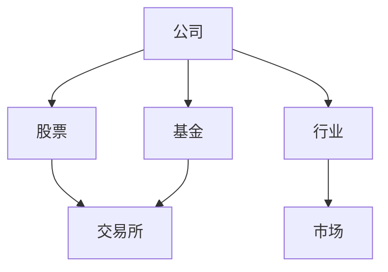

                 


# 开发基于大模型的金融专业知识图谱动态更新系统

> 关键词：知识图谱、大模型、动态更新、金融领域、系统设计

> 摘要：本文详细探讨了基于大模型的金融专业知识图谱动态更新系统的开发过程。从背景与核心概念的介绍，到算法原理的深入分析，再到系统架构的设计与实现，以及项目实战的具体指导，最后结合最佳实践，为读者提供全面的解决方案。通过本文，读者可以掌握如何利用大模型技术实现知识图谱的动态更新，从而提升金融领域的智能化水平。

---

## 第一章: 问题背景与描述

### 1.1 问题背景
#### 1.1.1 金融领域的知识管理挑战
- 金融领域的知识复杂且动态变化，传统知识库难以应对实时更新的需求。
- 数据来源多样，包括新闻、财报、政策等，需要高效整合和管理。
- 知识图谱在金融领域的应用需求日益增长，尤其是在风险控制、智能投顾等场景。

#### 1.1.2 知识图谱在金融领域的应用价值
- 提供结构化知识，便于机器理解和推理。
- 支持智能问答、推荐系统等应用，提升用户体验。
- 通过动态更新，保持知识图谱的实时性和准确性。

#### 1.1.3 大模型在知识图谱中的潜力
- 大模型具有强大的语义理解和生成能力，可以辅助知识图谱的构建和更新。
- 大模型可以通过微调和迁移学习，快速适应金融领域的特定需求。

### 1.2 问题描述
#### 1.2.1 知识图谱动态更新的难点
- 数据来源多样，需要处理结构化和非结构化数据。
- 知识图谱的动态更新需要高效的算法支持，以应对实时变化。
- 需要处理数据冲突和冗余，确保知识图谱的准确性和一致性。

#### 1.2.2 大模型与知识图谱结合的挑战
- 大模型的训练需要大量数据，如何获取高质量的金融数据是一个挑战。
- 知识图谱的构建和更新需要考虑模型的可解释性，尤其是在金融领域。
- 大模型的推理能力需要与知识图谱的结构化数据相结合，以实现高效的推理和问答。

### 1.3 解决方案
#### 1.3.1 采用大模型辅助知识图谱构建
- 利用大模型进行文本理解和语义分析，辅助知识图谱的构建。
- 通过大模型的微调，使其适应金融领域的特定需求。

#### 1.3.2 知识图谱动态更新的实现
- 基于增量学习的动态更新算法，确保知识图谱的实时性。
- 结合大模型的推理能力，实现知识图谱的动态扩展和更新。

#### 1.3.3 系统设计与实现
- 设计高效的系统架构，支持知识图谱的动态更新和大模型的推理。
- 实现数据采集、处理、存储和推理的完整流程。

---

## 第二章: 核心概念与联系

### 2.1 知识图谱的基本概念
#### 2.1.1 实体与关系
- 实体：金融领域的具体对象，如公司、股票、基金等。
- 关系：实体之间的联系，如“持有”、“投资”、“影响”等。

#### 2.1.2 知识图谱的构建流程
1. 数据采集：从多种数据源获取金融数据。
2. 数据清洗：去除噪声数据，确保数据质量。
3. 实体识别：通过自然语言处理技术，识别实体和关系。
4. 知识融合：将结构化和非结构化数据整合到知识图谱中。
5. 知识存储：将知识图谱存储在图数据库中，如Neo4j。

#### 2.1.3 知识图谱的表示方法
- 使用RDF（Resource Description Framework）表示知识。
- 使用属性图模型（Property Graph Model）表示实体和关系。

### 2.2 大模型的基本原理
#### 2.2.1 大模型的定义与特点
- 大模型：基于深度学习的大型神经网络模型，具有强大的语义理解和生成能力。
- 特点：参数量大、训练数据多、计算能力强。

#### 2.2.2 大模型的训练过程
1. 预训练：在大规模通用数据上进行无监督训练。
2. 微调：在特定领域数据上进行有监督训练，使其适应金融领域。
3. 前向推理：基于训练好的模型，进行文本生成或语义分析。

#### 2.2.3 大模型的推理机制
- 基于注意力机制的解码器，生成与输入相关的输出。
- 支持多种任务，如文本生成、问答系统、文本摘要等。

### 2.3 知识图谱与大模型的关系
#### 2.3.1 知识图谱作为大模型的知识库
- 大模型可以利用知识图谱中的结构化知识，进行更准确的推理和问答。
- 知识图谱为大模型提供了外部知识，弥补了大模型内部知识的不足。

#### 2.3.2 大模型辅助知识图谱的构建与更新
- 利用大模型进行文本理解和语义分析，辅助知识图谱的构建和更新。
- 大模型可以通过微调和迁移学习，快速适应知识图谱的特定领域需求。

#### 2.3.3 知识图谱与大模型的结合应用
- 在金融领域的智能问答系统中，结合知识图谱和大模型，提供更准确的答案。
- 在金融风险控制中，利用知识图谱和大模型进行实时监控和预警。

### 2.4 核心概念对比表
| 比较维度       | 知识图谱                 | 大模型                 |
|----------------|--------------------------|--------------------------|
| 核心目标       | 表达领域知识             | 处理自然语言           |
| 数据类型       | 结构化数据               | 文本数据               |
| 应用场景       | 智能问答、推荐系统       | 文本生成、语义分析       |
| 更新机制       | 增量更新                 | 微调训练               |

### 2.5 ER实体关系图


---

## 第三章: 算法原理与数学模型

### 3.1 大模型的算法原理
#### 3.1.1 预训练过程
- 使用大规模通用数据进行无监督训练。
- 采用自注意力机制，捕获文本中的长距离依赖关系。
- 使用交叉熵损失函数，优化模型参数。

#### 3.1.2 微调过程
- 在特定领域数据上进行有监督训练。
- 采用小批量梯度下降，优化模型参数。
- 使用领域相关的评估指标，验证模型性能。

#### 3.1.3 推理机制
- 基于解码器的生成式模型，生成与输入相关的输出。
- 使用贪心算法或束搜索，生成高质量的输出。

### 3.2 知识图谱的构建算法
#### 3.2.1 基于规则的构建算法
- 使用正则表达式提取文本中的实体和关系。
- 通过规则匹配，构建知识图谱的结构。

#### 3.2.2 基于统计的构建算法
- 使用统计方法，计算实体和关系的共现概率。
- 基于概率阈值，构建知识图谱的结构。

#### 3.2.3 基于深度学习的构建算法
- 使用卷积神经网络（CNN）或循环神经网络（RNN）进行文本分析。
- 通过预训练模型，提取文本中的实体和关系。

### 3.3 知识图谱的动态更新算法
#### 3.3.1 基于规则的更新算法
- 通过正则表达式匹配新数据，更新知识图谱中的实体和关系。
- 基于规则的冲突检测和解决机制，确保知识图谱的准确性。

#### 3.3.2 基于增量学习的更新算法
- 在已有知识图谱的基础上，增量训练模型，更新知识图谱。
- 使用增量学习算法，减少计算量和数据存储需求。

#### 3.3.3 基于大模型的更新算法
- 利用大模型的微调技术，更新知识图谱中的实体和关系。
- 通过大模型的推理能力，动态扩展知识图谱。

### 3.4 算法实现代码
```python
import torch
import torch.nn as nn
import torch.optim as optim

class SimpleModel(nn.Module):
    def __init__(self, input_dim, output_dim):
        super(SimpleModel, self).__init__()
        self.fc = nn.Linear(input_dim, output_dim)

    def forward(self, x):
        return self.fc(x)

# 训练过程
model = SimpleModel(input_dim=10, output_dim=5)
criterion = nn.MSELoss()
optimizer = optim.SGD(model.parameters(), lr=0.01)

for epoch in range(100):
    inputs = torch.randn(10, 10)
    labels = torch.randn(10, 5)
    
    outputs = model(inputs)
    loss = criterion(outputs, labels)
    loss.backward()
    optimizer.step()
```

### 3.5 数学模型
#### 3.5.1 交叉熵损失函数
$$ \text{Loss} = -\frac{1}{N}\sum_{i=1}^{N} \sum_{k=1}^{K} y_{ik}\log(p_{ik}) $$
其中，$y_{ik}$ 是真实标签，$p_{ik}$ 是预测概率。

#### 3.5.2 注意力机制
$$ \text{Attention}(Q, K, V) = \text{softmax}\left(\frac{QK^T}{\sqrt{d_k}}\right)V $$
其中，$Q$ 是查询向量，$K$ 是键向量，$V$ 是值向量，$d_k$ 是维度。

---

## 第四章: 系统分析与架构设计

### 4.1 问题场景介绍
- 系统目标：构建一个基于大模型的金融专业知识图谱动态更新系统。
- 业务场景：支持金融领域的知识图谱构建、更新和推理。

### 4.2 项目介绍
#### 4.2.1 项目目标
- 实现知识图谱的动态更新。
- 利用大模型进行知识推理和问答。

#### 4.2.2 项目范围
- 数据采集与处理。
- 知识图谱的构建与更新。
- 大模型的微调与推理。

### 4.3 系统功能设计
#### 4.3.1 功能模块
- 数据采集模块：从多种数据源采集金融数据。
- 数据处理模块：清洗和结构化数据。
- 知识图谱构建模块：构建和更新知识图谱。
- 大模型推理模块：基于知识图谱进行推理和问答。

#### 4.3.2 功能流程
1. 数据采集：从新闻、财报、政策等数据源获取数据。
2. 数据处理：清洗数据，提取实体和关系。
3. 知识图谱构建：基于提取的数据，构建知识图谱。
4. 知识图谱更新：动态更新知识图谱，保持其准确性和实时性。
5. 大模型推理：基于知识图谱和大模型，进行推理和问答。

### 4.4 系统架构设计
#### 4.4.1 系统架构图


#### 4.4.2 接口设计
- 数据接口：与数据源对接，获取金融数据。
- 知识图谱接口：与知识图谱存储系统对接，进行构建和更新。
- 大模型接口：与大模型推理引擎对接，进行推理和问答。

#### 4.4.3 交互流程
1. 用户通过用户界面提交查询请求。
2. 数据采集模块从数据源获取数据。
3. 数据处理模块清洗和结构化数据。
4. 知识图谱构建模块构建或更新知识图谱。
5. 大模型推理模块基于知识图谱进行推理，返回结果。
6. 用户界面展示结果。

### 4.5 接口设计与交互流程
#### 4.5.1 接口设计
- 数据接口：提供REST API，供数据采集模块调用。
- 知识图谱接口：提供GraphQL API，供知识图谱构建模块调用。
- 大模型接口：提供REST API，供大模型推理模块调用。

#### 4.5.2 交互流程
1. 用户提交查询请求。
2. 数据采集模块获取数据。
3. 数据处理模块清洗数据。
4. 知识图谱构建模块构建知识图谱。
5. 大模型推理模块基于知识图谱进行推理。
6. 用户界面展示结果。

---

## 第五章: 项目实战

### 5.1 环境安装
- 安装Python和必要的库：PyTorch、Neo4j、Flask等。
- 安装大模型框架：如Hugging Face的Transformers库。

### 5.2 核心实现
#### 5.2.1 数据采集模块
```python
import requests

def get_financial_data(source):
    response = requests.get(source)
    return response.json()
```

#### 5.2.2 数据处理模块
```python
def process_data(data):
    entities = extract_entities(data)
    relations = extract_relations(data)
    return entities, relations
```

#### 5.2.3 知识图谱构建模块
```python
from neo4j import GraphDatabase

def create_graph(entities, relations):
    driver = GraphDatabase.driver('bolt://localhost:7687')
    session = driver.session()
    for entity in entities:
        session.run("CREATE (n:{ EntityType } {{ id: '{id}' }})", entity)
    for relation in relations:
        session.run("MATCH (a), (b) WHERE a.id = '{a_id}' AND b.id = '{b_id}' CREATE (a)-[r:{ RelationType } {{ type: '{type}' }}]->(b)", relation)
    session.close()
```

#### 5.2.4 大模型推理模块
```python
from transformers import pipeline

model = pipeline('question-answering', model='roberta-base')
def answer_question(question, context):
    return model(question, context)
```

### 5.3 代码解读与分析
- 数据采集模块：通过HTTP请求获取数据，返回结构化的数据。
- 数据处理模块：提取实体和关系，为知识图谱构建提供数据。
- 知识图谱构建模块：使用Neo4j存储实体和关系，构建知识图谱。
- 大模型推理模块：利用预训练的大模型进行推理和问答。

### 5.4 实际案例分析
#### 5.4.1 案例背景
- 数据来源：新闻报道、公司财报。
- 任务目标：构建公司-股票关系的知识图谱，支持智能问答。

#### 5.4.2 知识图谱构建过程
1. 数据采集：获取公司和股票的相关数据。
2. 数据处理：提取公司名称、股票代码、行业等信息。
3. 知识图谱构建：构建公司与股票的关系图谱。
4. 动态更新：实时更新股票价格和公司新闻。

#### 5.4.3 大模型推理过程
1. 用户提问：查询某公司的股价走势。
2. 大模型推理：基于知识图谱中的数据，生成回答。
3. 返回结果：显示股价走势和相关分析。

### 5.5 项目小结
- 项目实现了一个基于大模型的金融专业知识图谱动态更新系统。
- 系统包括数据采集、处理、构建、更新和推理模块。
- 系统支持智能问答和实时更新，提升了金融领域的智能化水平。

---

## 第六章: 最佳实践

### 6.1 小结
- 本文详细探讨了基于大模型的金融专业知识图谱动态更新系统的开发过程。
- 从背景与核心概念的介绍，到算法原理的深入分析，再到系统架构的设计与实现，以及项目实战的具体指导，最后结合最佳实践，为读者提供全面的解决方案。

### 6.2 注意事项
- 数据安全：金融数据涉及敏感信息，需要注意数据安全和隐私保护。
- 模型可解释性：金融领域的决策需要可解释性，需要确保模型的输出可以被理解和验证。
- 系统性能：大规模数据和实时更新需要高效的系统架构和优化的算法。

### 6.3 拓展阅读
- 《Large Language Models in Finance》
- 《Knowledge Graph Construction and Dynamic Update》
- 《Deep Learning for Financial Applications》

---

## 附录: 知识图谱与大模型的结合应用
### 附录A: 知识图谱的存储与查询
- 使用图数据库（如Neo4j）存储知识图谱。
- 使用Cypher查询语言进行复杂查询。

### 附录B: 大模型的微调与迁移学习
- 微调：在特定领域数据上进行有监督训练。
- 迁移学习：将大模型的知识迁移到新的领域。

### 附录C: 系统性能优化
- 使用分布式计算优化系统性能。
- 采用流式处理减少数据存储需求。

---

通过本文，读者可以全面了解基于大模型的金融专业知识图谱动态更新系统的开发过程，掌握核心概念、算法原理和系统架构设计，为实际应用提供有价值的参考。

